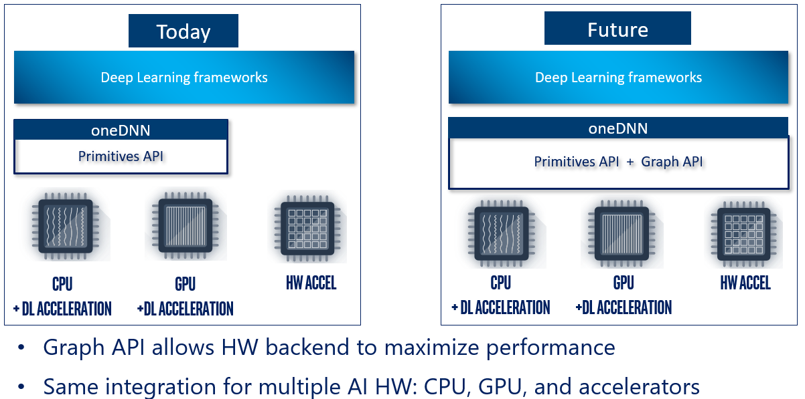
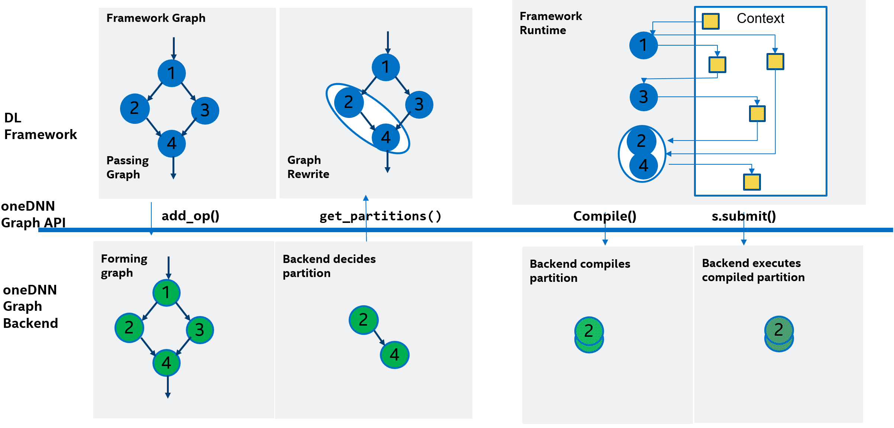

# Introduction to oneDNN Graph for Preview {#onednn_graph_intro}

## Introduction

oneDNN Graph API extends oneDNN with a unified high-level graph API for multiple
AI hardware classes (CPU, GPU, accelerators). With a flexible graph interface,
it maximizes the optimization opportunity for generating efficient code across a
variety of Intel and non-Intel HW and can be closely integrated with ecosystem
framework and inference engines. oneDNN Graph API accepts a deep learning
computation graph as input and performs graph partitioning, where nodes that are
candidates for fusion are grouped. oneDNN Graph compiles and executes a group of
deep learning operations in a graph partition as a fused operation.

With the graph as input, oneDNN Graph implementation can perform target-specific
optimization and code generation on a larger scope, which allows it to map the
operations to hardware resources and improve execution efficiency and data
locality with a global view of the computation graph. With the rapid
introduction of hardware support for dense compute, the deep learning workload
characteristic changed significantly from a few hot spots on compute-intensive
operations to a broad number of operations scattered across the applications.
Accelerating a few compute-intensive operations using primitive API has
diminishing returns and limits the performance potential. It is critical to have
a graph API to better exploit hardware compute capacity.

oneDNN Graph API provides graph partition as a unified graph interface for
different types of AI hardware classes. Users construct a graph with operations
and logical tensors and pass it to oneDNN Graph implementation to get partitions.
oneDNN Graph implementation has a chance to receive a full graph and decides the
best way to partition, with the consideration of maximizing performance and
coordinating with the application’s control of hardware resources. As the
partition size can range from a single op to a full graph, it satisfies the
different needs of graph size for compilation and execution on different AI
hardware.

## Programming model

oneDNN Graph programming model allows users to pass a computation graph and get
partitions. Users then compile partitions, bind tensor data, and execute
compiled partitions. Partitions are decided by oneDNN Graph implementation,
which is the key concept to satisfy the different needs of AI hardware classes
using a unified API.

oneDNN Graph API uses `logical tensor`, `op`, and `graph` to represent a
computation graph. Logical tensor represents tensor’s metadata, like element
data type, shape, and layout. OP represents an operation on a computation graph.
OP has kind, attribute, and input and output logical tensors. OPs are added to
the graph being constructed. As both OP and logical tensor contains a unique ID,
the graph knows how to connect a producer OP to a consumer OP through a logical
tensor. The graph constructed is immutable, and the sole purpose of the graph is
to partition the graph. Once users get partitions, users should not add OP to
the graph.

A `partition` is a connected subgraph within a graph. oneDNN Graph
implementation analyzes a graph and returns a vector of partitions. The returned
partitions must not form a dependence cycle. A partition needs to be compiled
before execution. The compilation lowers down the compute logic to hardware ISA
level and generates binary code. The generated code is specialized for the input
and output tensor’s metadata. Users must specify the shape and layout for each
logical tensor during compilation. Users must create new logical tensors to pass
the enriched metadata with the compilation API. The new logical tensors must
have the same IDs as the logical tensors passed at the graph construction time.

A `compiled partition` represents the generated code specialized for target
hardware and tensor metadata passed with compilation API. To execute a compiled
partition, users must pass input and output tensors. Input tensors must bind
input data buffers to logical tensors. Users may query the compiled partition
for output data buffer sizes. If the sizes are known, users may allocate the
output data buffers and bind to output tensors. If the sizes are unknown, users
must provide an allocator for oneDNN Graph implementation to allocate the output
tensor buffer. The execution API takes a compiled partition, input tensors, and
return output tensors with the data buffer updated.

An `engine` represents a target device and context in the system. It needs to be
passed as a parameter for partition compilation. A `stream` abstracts hardware
execution resources of a target device. It is required to execute a compiled
partition.

oneDNN Graph API provides low precision support including both int8, bf16, and
fp16. For int8, oneDNN Graph API supports quantized model with static
quantization. For bf16 or fp16, oneDNN Graph supports deep learning framework’s
auto mixed precision mechanism. In both cases, oneDNN Graph API expects users to
convert the computation graph to low precision representation and specify the
data’s precision and quantization parameters. oneDNN Graph API implementation
should strictly respect the numeric precision of the computation. More details
can be found at [specification](https://spec.oneapi.io/onednn-graph/latest/programming_model.html#low-precision-support).

## Relation to oneDNN primitives programming model

The Graph API is an addition to oneDNN’s current primitives programming model.
It aims to works with the framework graph and identifies graph partitions to
offload. The API allows the framework to pass the deep learning graph to oneDNN,
which analyzes the graph and returns the partitions. The partition will be
further compiled and executed as a fused operation in the framework graph.

The Graph API extends the current oneDNN’s post-ops attributes API to enable
general mechanism of fusing DNN operations in the framework graph. oneDNN’s
post-ops attributes API requires framework integration to perform explicit
pattern match on the framework graph, so each new fusion capability requires
framework modification.  The Graph API performs the pattern match inside oneDNN,
so new fusion capability can be enabled by just upgrading oneDNN library without
requiring framework modification.

## Framework Integration

Deep learning framework provides a rich set of deep neural network (DNN)
operations to developers to describe the deep learning computation graph. It
typically has two modes of execution: imperative mode and graph mode. Imperative
mode executes the DNN operation directly, and graph mode builds an internal
representation (IR) for the computation graph, optimizes it, and then submits it
to device runtime for execution.

oneDNN Graph API is to accelerate the graph mode. It is integrated into the
graph optimizer after all the target-independent pass is done.  It iterates the
framework graph, converts framework OP to oneDNN Graph OP, and calls `add_op()`
to pass the oneDNN Graph OP and its parameter tensors to oneDNN Graph. After
passing all framework OP, it calls `get_partitions()` to return the partitions,
and then replaces the partitions with fused ops.

When the framework executing a fused op, the fused op’s implementation is to
call `compile()` which compiles its associated partition. Then it queries the
compiled partition to get the sizes of output tensors, allocates memory for them,
and calls `execute()` to execute the compiled partition.

## oneDNN Graph Compiler

oneDNN Graph Compiler is an experimental low-level deep learning compiler
focusing on code generation, which inputs a DNN compute graph and generates
binary code or instruction level representation (like LLVM and SPIR-V). It
automates the kernel code generation for matrix multiplication, convolution, and
other DNN operations with the same level of computing efficiency as hand-tuned
implementation. It further explores advanced code-gen optimization to achieve
**better than Ninja** computing efficiency for a subgraph, such as optimizing a
sequence of matrix multiplication operations.

oneDNN Graph compiler offers unique optimization to achieve the best-generated
code efficiency. It combines the wisdom of hand-tuned kernel and compiler. The
hand-tuned heuristics gives oneDNN Graph compiler a foundation to automatically
synthesize the best-known kernel, and the compiler techniques allow the
development effort to scale to larger and new fusion patterns.  The fusion
pattern in the roadmap includes multi-head attention (MHA), multi-layer
perceptron (MLP), convolution block, supporting typical data types for both
inference and training.

Together with oneDNN Graph API, oneDNN Graph compiler is designed to complement
deep learning framework optimization. The high-level graph optimization in the
framework transforms the DNN compute graph and calls a low-level performance
library for efficient code generation. Through focusing on code generation for
graph partition and interoperating with framework operation implementation,
oneDNN graph compiler provides an acceleration code path on top of framework
graph execution.
