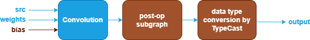

Convolution Fusions {#dev_guide_graph_convolution_fusions}
===========================================================

## Overview

oneDNN supports various Convolution fusion patterns to optimize performance and
reduce memory bandwidth requirements. This document describes the supported
fusion patterns for Convolution.

## Convolution patterns

oneDNN supports Convolution and its optimization through Graph API [1] by
defining the graph, getting partition from the graph, and optimizing the kernels
underneath. In general, a Convolution pattern is defined as a directional acyclic
graph (DAG) using oneDNN Graph API.

### Floating-point Convolution patterns

oneDNN defines floating-point (f32, bf16, or f16) Convolution patterns as follows.
The blue parts are required when defining a Convolution pattern while the brown
parts are optional.

1. The first Convolution performs Convolution between src and weights tensor.
   The bias tensor and its corresponding data type conversion is optional. See [Convolution](@ref dev_guide_op_convolution)
   operation in Graph API.
2. The post-op subgraph is optional and can be constructed with the following operations:
   1. [BiasAdd](@ref dev_guide_op_biasadd) operation.
   2. [BatchNormInference](@ref dev_guide_op_batchnorminference) operation.
   3. [Convolution](@ref dev_guide_op_convolution) operation.
   4. Binary operations: [Add](@ref dev_guide_op_add),
      [Subtract](@ref dev_guide_op_subtract), [Maximum](@ref dev_guide_op_maximum),
      [Minimum](@ref dev_guide_op_minimum), [Multiply](@ref dev_guide_op_multiply),
      [Divide](@ref dev_guide_op_divide).
   5. Unary operations: [Abs](@ref dev_guide_op_abs),
      [Clamp](@ref dev_guide_op_clamp), [Elu](@ref dev_guide_op_elu),
      [Exp](@ref dev_guide_op_exp), [GELU](@ref dev_guide_op_gelu),
      [HardSigmoid](@ref dev_guide_op_hardsigmoid), [HardSwish](@ref dev_guide_op_hardswish),
      [LeakyReLU](@ref dev_guide_op_leakyrelu), [Log](@ref dev_guide_op_log),
      [Mish](@ref dev_guide_op_mish), [Sigmoid](@ref dev_guide_op_sigmoid),
      [SoftPlus](@ref dev_guide_op_softplus), [ReLU](@ref dev_guide_op_relu),
      [Round](@ref dev_guide_op_round), [Sqrt](@ref dev_guide_op_sqrt),
      [Square](@ref dev_guide_op_square), [Tanh](@ref dev_guide_op_tanh).

   Combination rules:

   6. [BiasAdd](@ref dev_guide_op_biasadd), if present, must be the first post-op
      and can only appear once.
   7. [BatchNormInference](@ref dev_guide_op_batchnorminference) must precede
      binary/unary operations and can only appear once.
   8. [Convolution](@ref dev_guide_op_convolution) operation as a post op is a Depthwise
      Convolution, which can only be fused with 1x1 Convolution and can only appear
      once.
   9. 1 to 4 binary/unary operations are supported.

3. The data type conversion subgraph is optional and is used to convert between
   floating-point data types. Currently only bf16 to fp32 conversion is supported
   using [TypeCast](@ref dev_guide_op_typecast) operation.

## Data Types

oneDNN supports the floating-point Convolution pattern with data types f32,
bf16, and f16. You can specify the data type via the input and output logical
tensors' data type fields for each operation. oneDNN supports limited mix-precision
in a floating-point Convolution pattern.

The definition of the data types and support status on different CPU and GPU
platforms follow the general description in @ref dev_guide_data_types.

## Implementation limitations

1. GPU
   - Convolution as a post op (Depthwise Convolution) is not supported.

## Example

oneDNN provides an [Convolution
example](https://github.com/oneapi-src/oneDNN/tree/main/examples/graph/cpu_getting_started.cpp)
demonstrating how to construct a typical floating-point Convolution pattern with oneDNN
Graph API on CPU.

## References

[1] oneDNN Graph API documentation, https://oneapi-src.github.io/oneDNN/graph_extension.html
