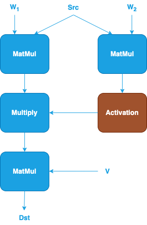
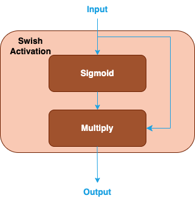

Gated Multi-Layer Perceptron (Gated-MLP) {#dev_guide_graph_gated_mlp}
=====================================================================

## Overview

Gated Multi-Layer Perceptron (Gated-MLP) is a variant of MLP which is widely
used as the Feed Forward Network (FFN) in many Transformer-based Large Language
Models (LLMs).

Typically, the FFN in Transformer architecture [1] is defined as a two layer MLP
with a ReLU activation in between which can be replaced with other activations.

\f[

    FFN(src,W,V) = ReLU(src \cdot W) \cdot V

\f]

Gated Linear Unit (GLU) is adopted to replace the first linear layer to
improve the quality of Transformer-based models [2]:

\f[

    GLU(src,W_1,W_2) = (src \cdot W_1) \otimes Sigmoid(src \cdot W_2) \\

    FFN(src,W_1,W_2,V) = GLU(src,W_1,W_2) \cdot V

\f]

Where the \f$ src \cdot W_1 \f$ is usually called "FC (fully-connected) up",
\f$ src \cdot W_2 \f$ is called "FC gate", and the last linear is called
"FC down".

Swish activation is further adopted to replace Sigmoid in the GLU to form
swiGLU.

\f[

    Swish(x) = x \otimes Sigmoid(x) \\

    swiGLU(src,W_1,W_2) = (src \cdot W_1) \otimes Swish(src \cdot W_2) \\

    FFN(src,W_1,W_2,V) = swiGLU(src,W_1,W_2) \cdot V

\f]

The Gated-MLP based on swiGLU is also adopted in LLMs like LLaMA [3], Qwen [4],
etc.

## Gated-MLP patterns

oneDNN supports Gated-MLP and its optimization through Graph API [5] by defining
the graph, getting partition from the graph, and optimizing the kernels
underneath. In general, a Gated-MLP pattern is defined as a directional acyclic
graph (DAG) using oneDNN Graph API.

### Floating-point Gated-MLP

oneDNN defines floating-point (f32, bf16, and f16) Gated-MLP as follows. The blue
nodes are required when defining a Gated-MLP pattern while the brown nodes are
optional.

1. The first MatMul on the top left calculates "FC up": \f$ src \cdot W_1 \f$.
   See [MatMul](@ref dev_guide_op_matmul) operation in Graph API.
2. The second MatMul on the top right calculates "FC gate": \f$ src \cdot W_2 \f$.
3. The Activation node is optional. If required, it can be constructed with the
   activation operations in Graph API, for example, [ReLU](@ref dev_guide_op_relu),
   [GELU](@ref dev_guide_op_gelu), [Sigmoid](@ref dev_guide_op_sigmoid), and so on.
   For Swish activation, the node can be constructed with the [Sigmoid](@ref dev_guide_op_sigmoid)
   and [Multiply](@ref dev_guide_op_multiply) as below. You can also refer the
   [Gated-MLP example](https://github.com/oneapi-src/oneDNN/tree/main/examples/graph/gated_mlp.cpp)
   for Swish definition.

   

4. The last MatMul on the bottom performs the "FC down" operation between the
   GLU output and \f$V\f$.

## Data Types

oneDNN supports the floating-point Gated-MLP pattern with data types f32, bf16,
and f16. You can specify the data type via the input and output data type fields
of logical tensors for each operation. oneDNN does not support mixing different
floating data types in a floating-point Gated-MLP pattern.

The definition of the data types and support status on different CPU and GPU
platforms follow the general description in @ref dev_guide_data_types.

## Implementation limitations

1. oneDNN primitive-based Gated-MLP is implemented as the reference
   implementation on both Intel Architecture Processors and Intel Graphics
   Products. In this case, floating-point Gated-MLP patterns are usually
   implemented with three f32, bf16, or f16 matmul (with binary or eltwise
   post-ops) primitives.
2. The Gated-MLP patterns functionally supports all input shapes meeting the
   shape requirements of each operation in the graph. For example, the `MatMul`
   operation requires shape consistency for `k` dimension. The `Multiply`
   operation requires the input tensors to have the same shape or the shapes can
   be properly broadcasted based on the operation attribute.

## Examples

oneDNN provides a [Gated-MLP
example](https://github.com/oneapi-src/oneDNN/tree/main/examples/graph/gated_mlp.cpp)
demonstrating how to construct a typical floating-point Gated-MLP pattern with
oneDNN Graph API on CPU and GPU with different runtimes.

For applications where the weights of FC up and FC gate are combined as a single
tensor, oneDNN also provides an
[example](https://github.com/oneapi-src/oneDNN/tree/main/examples/graph/gated_mlp_wei_combined.cpp)
demonstrating how to create the weight tensors for the pattern with the offsets
and strides from the combined weight tensor.

## References

1. Attention is all you need, https://arxiv.org/abs/1706.03762v7
2. GLU Variants Improve Transformer, https://arxiv.org/abs/2002.05202
3. LLaMA: Open and Efficient Foundation Language Models, https://arxiv.org/abs/2302.13971
4. Qwen Technical Report, https://arxiv.org/abs/2309.16609
5. oneDNN Graph API documentation, https://oneapi-src.github.io/oneDNN/graph_extension.html
