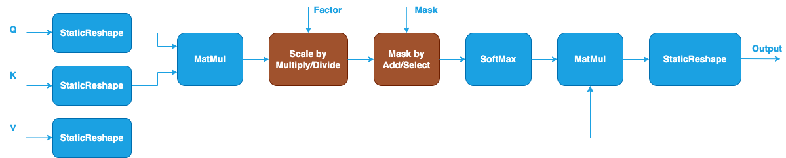

Grouped Query Attention (GQA) {#dev_guide_graph_gqa}
====================================================

## Overview

In a typical Scaled Dot-Product Attention (SDPA) [1], the input Query, Key, and
Value tensors have the same head number. It becomes a performance bottleneck to
load the Key and Value tensors in each generation step, especially when the
sentence length gets longer.

To reduce the memory bandwidth overhead of loading the Key and Value tensors,
Multi-Query Attention (MQA) [2] is created by reducing the head number of Key
and Value tensors to one which means multiple Queries will map to the same
single Key and Value tensor. However, MQA may lead to model quality degradation
and training instability. Therefore, Grouped-Query Attention (GQA) [3], an
interpolation between the typical SDPA and MQA, is proposed with single Key and
Value head per a subgroup of Query heads. The head number of Key and Value
equals to the group number of Query heads.

The notations used in the document:

- N: the mini-batch size.
- H_q: the head number of Query.
- H_kv: the head number of Key or Value.
- N_rep: H_q / H_kv, indicates how many Query heads are mapped to one Key head.
- S: the sequence length.
- D: the size of each head.

## GQA Pattern

Similar to how SDPA is supported, the GQA pattern is also defined as a
directional acyclic graph (DAG) using oneDNN Graph API. oneDNN extends the
[SDPA pattern](@ref dev_guide_graph_sdpa) to support floating-point (f32, bf16,
and f16) GQA as follows. The blue nodes are required when defining a GQA pattern
while the brown nodes are optional.

Compared to a typical SDPA pattern, there are a few differences in the GQA
pattern:

1. The input Query has shape (N, H_q, S, D). It will be reshaped to (N, H_kv,
   N_rep, S, D) by splitting H_q dimension into H_kv and N_rep. The reshaping
   can be constructed using the [StaticReshape](@ref dev_guide_op_staticreshape)
   operation in Graph API.
2. Similarly, the input Key and Value have shape (N, H_kv, S, D). They will be
   reshaped to (N, H_kv, 1, S, D) to meet the input shape requirement of
   [MatMul](@ref dev_guide_op_matmul) operation.
3. The second MatMul calculates the dot products between the probabilities after
   SoftMax and Value nodes and generates output with shape (N, H_kv, N_rep, S, D).
4. Another StaticReshape operation is applied to the output of the second MatMul
   to convert the shape into (N, H_q, S, D) by combining H_kv and N_rep
   dimensions.
5. The input scale factor and mask in the pattern also need to meet the
   operations' shape requirement which can be achieved through StaticReshape
   similarly. Besides that, they have the same definition as described in the
   typical SDPA pattern.

## Data Types

oneDNN supports the floating-point GQA pattern with data types f32, bf16, and
f16. You can specify the data type via the input and output data type fields of
logical tensors for each operation. oneDNN does not support mixing different
floating data types in a floating-point GQA pattern.

The definition of the data types and support status on different CPU and GPU
platforms follow the general description in @ref dev_guide_data_types.

## Implementation Limitations

1. oneDNN primitive-based GQA is implemented as the reference implementation on
   both Intel Architecture Processors and Intel Graphics Products. The reference
   implementation requires memory to store the intermediate results of the dot
   products between Query and Key which takes \f$O(S^2)\f$ memory. It may lead
   to Out-of-Memory error when computing long sequence length input on platforms with
   limited memory.
2. The GQA patterns functionally support all input shapes meeting the shape
   requirements of each operation in the graph.
3. CPU
   - Optimized implementation is available for 4D Q/K/V tensors with shape
     defined as (N, H_q, S, D) for Query and (N, H_kv, S, D) for Key and Value.
   - Optimized implementation is available for OpenMP runtime and Threadpool
     runtime on Intel Architecture Processors.
   - Specifically for OpenMP runtime, the optimized implementation requires `N *
     H_q > 2 * thread number` to get enough parallelism.
4. GPU
   - Optimized implementation is available for 4D Q/K/V tensors with shape
     defined as (N, H_q, S, D) for Query and (N, H_kv, S, D) for Key and Value.
   - Optimized implementation is available for floating-point GQA with `f16`
     data type and `D <= 256` on Intel Graphics Products with Intel(R) Xe Matrix
     Extensions (Intel(R) XMX) support.

## Example

oneDNN provides a [GQA
example](https://github.com/oneapi-src/oneDNN/tree/main/examples/graph/gqa.cpp)
demonstrating how to construct a floating-point GQA pattern with oneDNN Graph
API on CPU and GPU with different runtimes.

## References

[1] Attention is all you need, https://arxiv.org/abs/1706.03762v7

[2] Fast Transformer Decoding: One Write-Head is All You Need, https://arxiv.org/abs/1911.02150

[3] GQA: Training Generalized Multi-Query Transformer Models from Multi-Head Checkpoints, https://arxiv.org/abs/2305.13245
