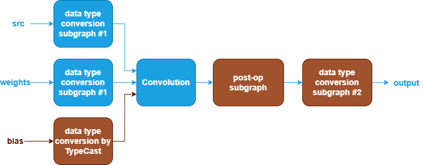
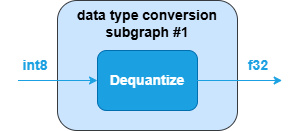
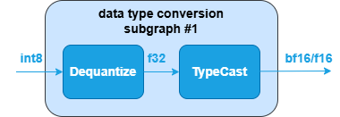
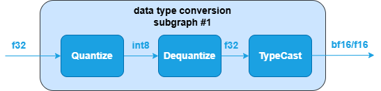
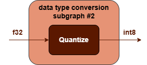
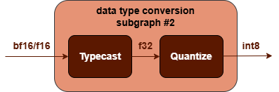

Quantized Convolution Fusions {#dev_guide_graph_quantized_convolution_fusions}
===========================================================

## Overview

oneDNN supports various quantized Convolution fusion patterns to optimize
performance and reduce memory bandwidth requirements. This document describes
the supported fusion patterns for quantized Convolution.

## Convolution patterns

oneDNN supports quantized Convolution and its optimization through Graph API [1]
by defining the graph, getting partition from the graph, and optimizing the kernels
underneath. In general, a quantized Convolution pattern is defined as a directional
acyclic graph (DAG) using oneDNN Graph API.

### Quantized Convolution patterns

oneDNN defines quantized Convolution patterns as follows.
The blue parts are required when defining a quantized Convolution pattern while the
brown parts are optional.

1. The data type conversion subgraph #1 is used to convert src and weights tensor
   from quantized data type to floating-point. It can be one of the following
   subgraphs, while the third subgraph is only available for weights tensor.
   See [Dequantize](@ref dev_guide_op_dequantize) and [TypeCast](@ref dev_guide_op_typecast)
   operations in Graph API.

     

2. The Convolution performs Convolution between src and weights tensor.
   The bias tensor and its corresponding data type conversion is optional.
   See [Convolution](@ref dev_guide_op_convolution) operation in Graph API.
3. The post-op subgraph is optional and can be constructed with the following operations:
   1. [BiasAdd](@ref dev_guide_op_biasadd) operation.
   2. Binary operations: [Add](@ref dev_guide_op_add),
      [Subtract](@ref dev_guide_op_subtract), [Maximum](@ref dev_guide_op_maximum),
      [Minimum](@ref dev_guide_op_minimum), [Multiply](@ref dev_guide_op_multiply),
      [Divide](@ref dev_guide_op_divide).
   3. Unary operations: [Abs](@ref dev_guide_op_abs),
      [Clamp](@ref dev_guide_op_clamp), [Elu](@ref dev_guide_op_elu),
      [Exp](@ref dev_guide_op_exp), [GELU](@ref dev_guide_op_gelu),
      [HardSigmoid](@ref dev_guide_op_hardsigmoid), [HardSwish](@ref dev_guide_op_hardswish),
      [LeakyReLU](@ref dev_guide_op_leakyrelu), [Log](@ref dev_guide_op_log),
      [Mish](@ref dev_guide_op_mish), [Sigmoid](@ref dev_guide_op_sigmoid),
      [SoftPlus](@ref dev_guide_op_softplus), [ReLU](@ref dev_guide_op_relu),
      [Round](@ref dev_guide_op_round), [Sqrt](@ref dev_guide_op_sqrt),
      [Square](@ref dev_guide_op_square), [Tanh](@ref dev_guide_op_tanh).

   Combination rules:

   1. [BiasAdd](@ref dev_guide_op_biasadd), if present, must be the first post-op
      and can only appear once.
   2. 1 to 4 binary/unary operations are supported.

4. The data type conversion subgraph #2 is optional and is used to convert output
   tensor from floating-point to quantized data type. It can be regarded as an
   opposite operation of data type conversion subgraph #1. It can be one of the
   following subgraphs. See [Quantize](@ref dev_guide_op_dequantize) and
   [TypeCast](@ref dev_guide_op_typecast) operations in Graph API.

    

## Data Types

oneDNN supports the following combinations of data types for src, weights, bias
and output:

| src   | weights | bias         | Output             |
| :---- | :------ | :----------- | :----------------- |
| u8,s8 | s8,f32  | f32,bf16,f16 | u8,s8,bf16,f16,f32 |

The definition of the data types and support status on different CPU and GPU
platforms follow the general description in @ref dev_guide_data_types.

## Implementation limitations

N/A

## Example

oneDNN provides an [quantized Convolution
example](https://github.com/oneapi-src/oneDNN/tree/main/examples/graph/cpu_inference_int8.cpp)
demonstrating how to construct a typical quantized Convolution pattern with oneDNN
Graph API on CPU.

## References

[1] oneDNN Graph API documentation, https://oneapi-src.github.io/oneDNN/graph_extension.html
