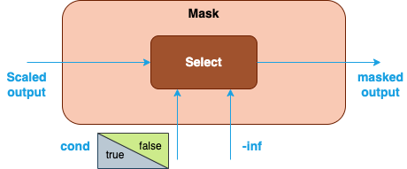

Scaled Dot-Product Attention (SDPA) {#dev_guide_graph_sdpa}
===========================================================

## Overview

Scaled Dot-Product Attention (SDPA) is introduced in [1] as the core operation
of Transformer block which now becomes the backbone of many language models and
generative models (BERT, Stable Diffusion, GPT, etc.).

The input of SDPA consists of query (Q), key (K), and value (V). The attention
output is computed as:

\f[

    attention(Q,K,V) = V \cdot softmax(\frac{QK^T}{\sqrt{d_k}})

\f]

\f$d_k\f$ is the dimension size of K. Other notations used in the document:

- N: the mini-batch size.
- H: the number of multi-head.
- S: the sequence length.
- D: the size of each head.

## SDPA patterns

oneDNN supports SDPA and its optimization through Graph API [2] by defining the
SDPA graph, getting partition from the graph, and optimizing the kernels
underneath. In general, an SDPA pattern is defined as a directional acyclic
graph (DAG) using oneDNN Graph API.

### Floating-point SDPA

oneDNN defines floating-point (f32, bf16, or f16) SDPA as follows. The blue
nodes are required when defining an SDPA pattern while the brown parts are
optional.

1. The first MatMul calculates the dot products between Query and Key. See
   [MatMul](@ref dev_guide_op_matmul) operation in Graph API.
2. The Scale node is optional and is used to scale the output of the first
   MatMul with a scaling factor. It can be constructed by [Multiply](@ref dev_guide_op_multiply)
   or [Divide](@ref dev_guide_op_divide) operation in Graph API. The scaling
   factor is given by users as an input of SDPA. \f$\sqrt{d_k}\f$ in the formula
   is not considered as a part of the SDPA pattern because it is a constant.
3. The Mask node is optional and is used to apply an attention mask to the
   output of the previous Scale node. There are two types of masks that can
   be applied:

   1. Explicit user-generated mask: You can explicitly create a mask tensor
   and pass it to the library for the computation of SDPA. In this case, mask
   can be constructed by [Add](@ref dev_guide_op_add)
   or [Select](@ref dev_guide_op_select) operation in Graph API for different
   mask policies (for example, causal mask or padding mask). When the
   Add operation is used to apply the mask, the input mask is usually an upper
   triangular matrix with all the elements above the diagonal filled with
   `-inf` and zeroes elsewhere. The `-inf` entries will become zero probability
   after Softmax is applied in the next step.
   Alternatively, a Select operation may be used. In this case, the
   input is a boolean tensor (for example, with the boolean value set to `true`
   on and below the diagonal, and `false` above the diagonal).
   A `false` element in the mask forces the corresponding element of the scaled
   output to `-inf`, while a `true` element leaves it unchanged.

    

   2. Implicit library-generated mask: You can use the operations in the library
   to generate a mask by constructing a subgraph. Currently, Graph API supports
   generating an implicit causal mask (top-left aligned) using operations of
   [GenIndex](@ref dev_guide_op_genindex), [GreaterEqual](@ref dev_guide_op_greaterequal)
   and [Select](@ref dev_guide_op_select).

   

4. The SoftMax operation takes the masked output and transforms it into
   probabilities between 0 and 1. See [SoftMax](@ref dev_guide_op_softmax)
   operation in Graph API.
5. The second MatMul calculates the dot products between the probabilities after
   SoftMax and Value.
6. The Reorder node is optional and used to reshape or transpose the attention
   output for cases where the attention output is transformed from shape (N, H,
   S, D) to (N, S, H, D) or (N, S, H * D). The node can be constructed by the
   combinations of [StaticTranspose](@ref dev_guide_op_statictranspose) and
   [StaticReshape](@ref dev_guide_op_staticreshape) operation in Graph API.

   

## Data Types

oneDNN supports the floating-point SDPA pattern with data types f32, bf16, and
f16. You can specify the data type via the input and output logical tensors'
data type fields for each operation. oneDNN does not support mixing different
floating data types in a floating-point SDPA pattern.

oneDNN supports the quantized SDPA pattern with int8-f32 mixed precision,
int8-bf16 mixed precision, and int8-f16 mixed precision data types.

The definition of the data types and support status on different CPU and GPU
platforms follow the general description in @ref dev_guide_data_types.

## Implementation limitations

1. oneDNN primitive-based SDPA is implemented as the reference implementation on
   both Intel Architecture Processors and Intel Graphics Products. In this case,
   floating-point SDPA patterns are usually implemented with f32, bf16, or f16
   matmul (with post-ops) and softmax primitives, while quantized SDPA patterns
   are implemented with int8 matmul (with post-ops) and f32, bf16, or f16
   softmax primitives. The reference implementation requires memory to store the
   intermediate results of the dot products between Query and Key which takes
   \f$O(S^2)\f$ memory. It may lead to out-of-memory error when computing long
   sequence length input on platforms with limited memory. For an implicit
   causal mask, the reference implementation is only available on CPU.
2. The SDPA patterns functionally supports all input shapes meeting the shape
   requirements of each operation in the graph. For example, Add, Multiply,
   Divide, and Select operations require the input tensors to have the same
   shape or the shapes can be properly broadcasted based on the operation
   attribute.
3. CPU
   - Optimized implementation is available for 4D Q/K/V tensors with shape
     defined as (N, H, S, D).
   - Optimized implementation is available for OpenMP runtime and Threadpool
     runtime on Intel Architecture Processors.
   - Specifically for OpenMP runtime, the optimized implementation requires `N *
     H > 2 * thread number` to get enough parallelism.
4. GPU
   - Optimized implementation is available for 4D Q/K/V tensors with shape
     defined as (N, H, S, D).
   - Optimized implementation is available for floating-point SDPA with `f16`
     data type and `D <= 256` on Intel Graphics Products with Intel(R) Xe Matrix
     Extensions (Intel(R) XMX) support.

## Example

oneDNN provides an [SDPA
example](https://github.com/oneapi-src/oneDNN/tree/main/examples/graph/sdpa.cpp)
demonstrating how to construct a typical floating-point SDPA pattern with oneDNN
Graph API on CPU and GPU with different runtimes.

oneDNN also provides a [MQA (Multi-Query Attention)
example](https://github.com/oneapi-src/oneDNN/tree/main/examples/graph/mqa.cpp) [3]
demonstrating how to construct a floating-point MQA pattern with the same
pattern structure as in the SDPA example but different head number in Key and
Value tensors. In MQA, the head number of Key and Value is always one.

## References

[1] Attention is all you need, https://arxiv.org/abs/1706.03762v7

[2] oneDNN Graph API documentation, https://oneapi-src.github.io/oneDNN/graph_extension.html

[3] Fast Transformer Decoding: One Write-Head is All You Need, https://arxiv.org/abs/1911.02150
