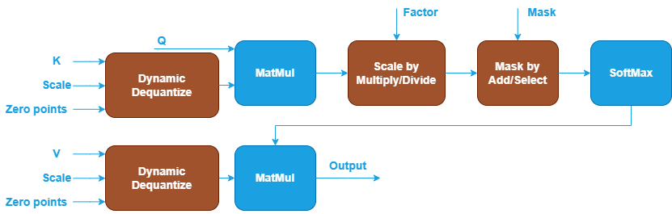

SDPA with Compressed Key and Value {#dev_guide_graph_compressed_sdpa}
===========================================================

## Overview

The KV Cache mechanism was developed to improve the efficiency of models by
reducing computational redundancy when processing long sequences of data. It
stores previously computed hidden states of Key and Value, to enable faster
retrieval and speed up inference processes. However, with the growing popularity
of KV Cache, the memory required for caching has become a significant bottleneck
affecting model performance.

To address this, Scaled Dot-Product Attention (SDPA)[1] with compressed Keys and
Values is implemented to minimize the memory footprint during generative
inference in large language models. Specifically, Key and Value tensors are
stored using lower precision data types like int4 and int8 to reduce memory
usage, and are subsequently de-quantized to wider floating point types such as
f16 and bf16 for computation.

It's worth noting that grouped quantization is required to improve model
accurarcy, especially for int4 data types. In this case, group size is needed
as an attribute for quantization, which indicates the number of elements that
share the same scaling factor and zero points in each quantization group.

The notations used in the document:

- N: the mini-batch size.
- H: the head number.
- S: the sequence length.
- D: the size of each head.
- G: the group size

## Pattern

The SDPA with compressed Key and Value is defined as a directional acyclic graph
(DAG) using oneDNN Graph API. oneDNN extends
[SDPA pattern](@ref dev_guide_graph_sdpa) to support the following three kinds
of compressed SDPA patterns:

1. SDPA with compressed Key and Value.
2. SDPA with floating-point Key and compressed Value.
3. SDPA with compressed Key and floating-point Value.

The floating-point data types includes f32, f16 and bf16, and the compressed
data type refers to low-precision integral data types, including int4( u4/s4 )
and int8( u8/s8 ) data types.

In oneDNN Graph API, we support quantization through pattern with quantization
operations such as `DynamicDequantize` and `DynamicQuantize`. The supported
pattern is as follows. The blue nodes are required while the brown nodes are
optional.

Compared to a typical SDPA pattern, there are a few differences:

1. Two additional DynamicDequantize oeprations are applied to the input Key and
Value to convert the integral cache to floating-point values. 
2. Apart from the Query, Key and Value inputs, the pattern requires additional
quantization information such as scale and zero points for the dequantization of
Key and Value caches. Currently, oneDNN only supports grouped quantization
on one dimenstion; specifically, the shapes of scale and zero points for Key and
Value de-quantization should be ( N, H, S, D/G).
3. Additionally, the `group_shape` attribute of the quantization operations must
be specified as (1, 1, 1, G) for Key and Value dequantizaiton.

## Data Types

oneDNN supports the following combinations of data types for Query, Key, Value,
output, scale for Key( scale_K ), zero points for Key( zp_K ), scale for
Value( scale_V ) and zero points for Value( zp_V ):

| Query   |  Key    | Scale_K | Zp_K            |  Value | Scale_V | Zp_V            | Output |
|:--------|:--------|:--------|:----------------|:-------|:--------|:----------------|:-------|
| dt_fp   | dt_int  | dt_fp   | u4,s4,u8,s8,s32 | dt_int | dt_fp   | u4,s4,u8,s8,s32 | dt_fp  |
| dt_fp   | dt_int  | dt_fp   | u4,s4,u8,s8,s32 | dt_fp  | N/A     | N/A             | dt_fp  |
| dt_fp   | dt_fp   | N/A     | N/A             | dt_int | dt_fp   | u4,s4,u8,s8,s32 | dt_fp  |

Notes:
- dt_fp can be either: f16, bf16 and f32.
- dt_int can be either: u8, s8, u4, s4.
- Zero points inputs are optional.

You can specify the data type via the input and output data type fields of
logical tensors for each operation. The definition of the data types and support
status on different CPU and GPU platforms follow the general description in
@ref dev_guide_data_types.

### Floating-point Math Mode

It's important to set the floating-point math mode
(@ref dev_guide_attributes_fpmath_mode) when using SDPA with compressed Key and
Value. Generally, the math mode should align the data type of the Query, which
indicates the computation data type. Additionally, the second boolean flag, 
`apply_to_int`, should be set to true. You can configure these attribute values
using the `set_fpmath_mode` API on the graph object.

## Implementation Limitations

1. oneDNN primitive-based SDPA with compressed Key and Value is implemented as
the reference implementation on both Intel Architecture Processors and Intel
Graphics Products. The reference implementation requires memory to store the
intermediate results of the dot products between Query and Key which takes
\f$O(S^2)\f$ memory. It may lead to Out-of-Memory error when computing long
sequence length input on platforms with limited memory.
2. The compressed SDPA patterns functionally support all input shapes meeting
the shape requirements of each operation in the graph.
3. CPU
    - oneDNN does not provide optimized implementation on CPU currently. All
    executions will be implemented with the primitive-based reference
    computation.
4. GPU
    - Optimized implementation is available for 4D Q/K/V tensors with the shape
    defined as (N, H, S, D) for Query, Key and Value, and (N, H, S, D/G) for
    scales and zero points( if available ).
    - Optimized implementation is avaiable for compressed SDPA with `f16`
    computation data type on Intel Graphics Products with Intel(R) Xe Matrix
    Extensions (Intel(R) XMX) support.
    - If int4 zero points are specified, optimized implementation will be only
    avaibable when group size equals to 16.

## References

[1] Attention is all you need, https://arxiv.org/abs/1706.03762v7
