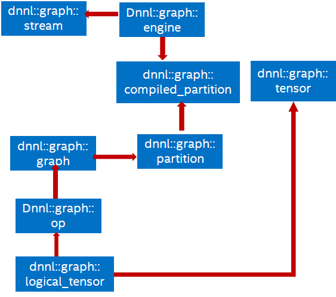

# Basic Concepts {#dev_guide_basic_concepts}

## Introduction

oneDNN Graph programming model allows users to pass a computation graph and get
partitions. Users then compile partitions, bind tensor data, and execute
compiled partitions. Partitions are decided by oneDNN Graph implementation,
which is the key concept to satisfy the different needs of AI hardware classes
using a unified API. The key concepts includes logical tensor, op, graph,
partition, compiled partition and tensor. Here is the relationship between these
entities.

## Logical Tensor

Logical tensor describes the metadata of the input or output tensor, like
element data type, number of dimensions, size for each dimension, layout. Each
logical tensor has a unique ID and immutable.

## Op

Op represents an operation on a computation graph. OP has kind, attribute, and
input and output logical tensors. OPs are added to the graph being constructed.
As both OP and logical tensor contains a unique ID, the graph knows how to
connect a producer OP to a consumer OP through a logical tensor.

## Graph

Graph contains a set of OPs. The graph constructed is immutable, and the sole
purpose of the graph is to partition the graph. Once users get partitions, users
should not add OP to the graph.

## Partition

Partition represents a collection of OPs identified by oneDNN Graph
implementation as the basic unit for compilation and execution. A partition is a
connected subgraph within a graph. oneDNN Graph implementation analyzes a graph
and returns a vector of partitions. The returned partitions must not form a
dependence cycle.

A partition needs to be compiled before execution. The compilation lowers down
the compute logic to hardware ISA level and generates binary code. The generated
code is specialized for the input and output tensor’s metadata.

## Compiled Partition

Compiled partition represents the generated code specialized for target hardware
and tensor metadata passed by compilation API. A compiled partition contains a
partition and a handle representing the target specific compiled object. To
execute a compiled partition, users must pass input and output tensors. Input
tensors must bind input data buffers to logical tensors.

## Tensor

Tensor is an abstraction for multidimensional input and output data needed in
the execution of a compiled partition. A tensor contains a logical tensor，an
engine and a data handle. Users are responsible for managing the tensor’s
lifecycle, e.g. free the resource allocated, when it is not used anymore.
