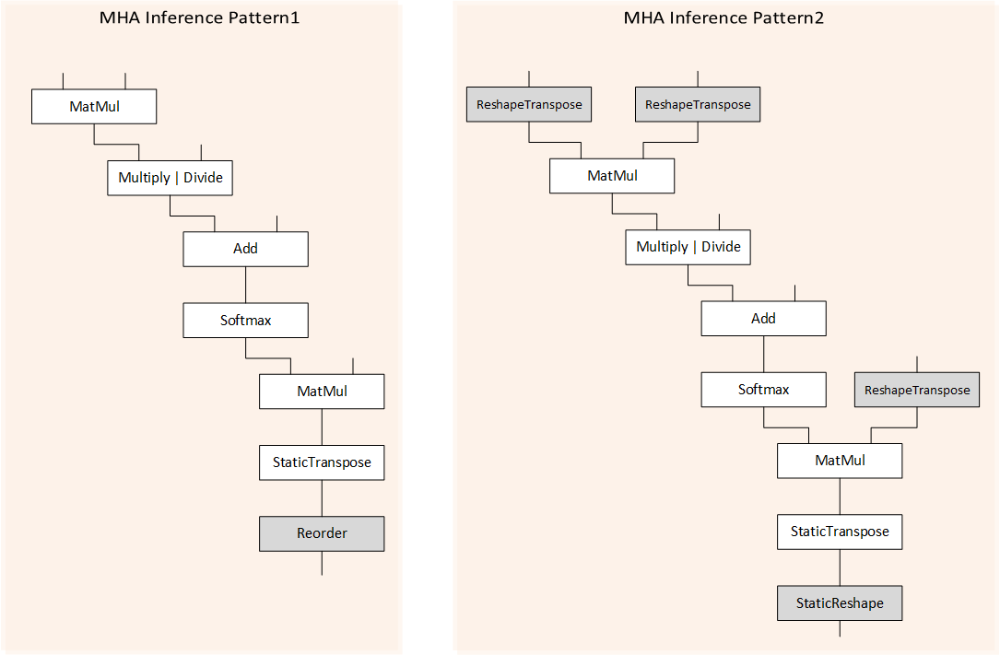
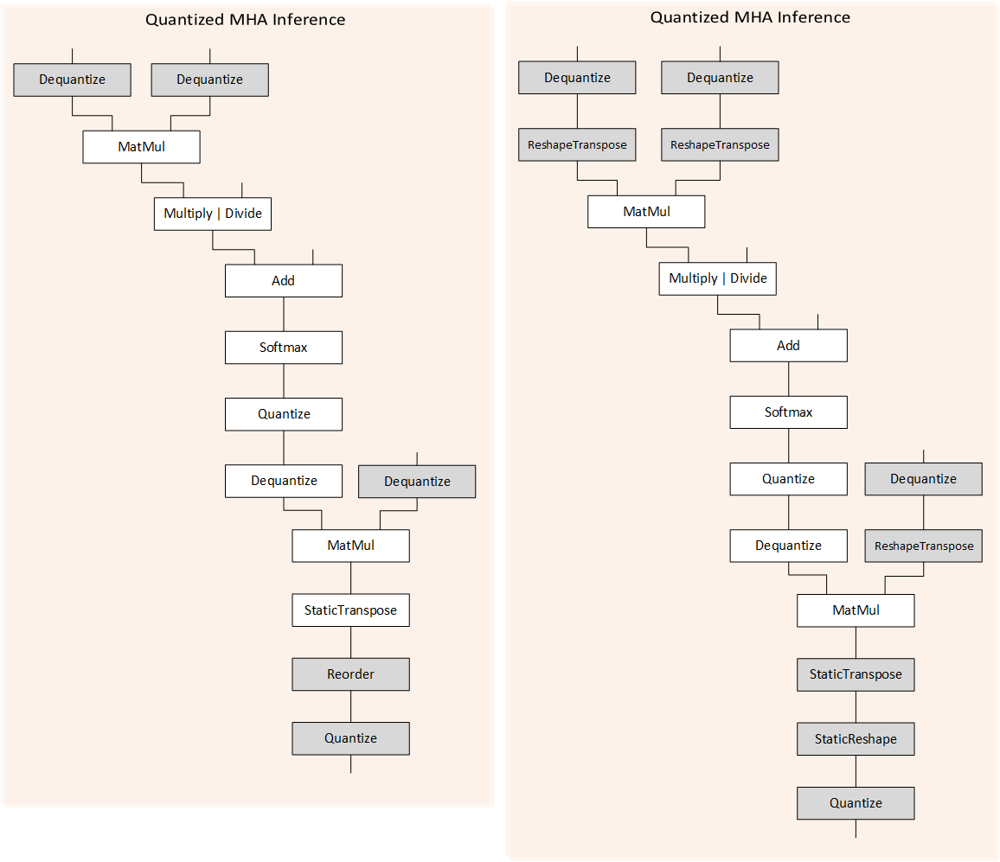
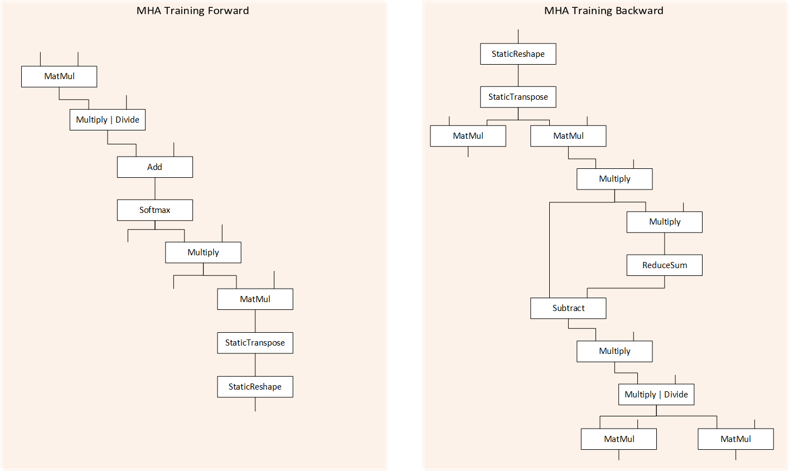
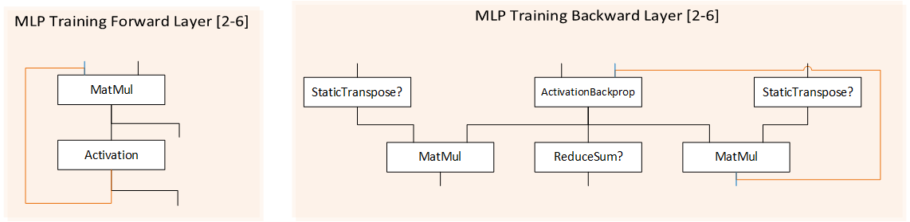

# Operators and Fusion Patterns {#dev_guide_ops_and_patterns}

## Operators

Supported operation refers to operation which can be converted to oneDNN Graph
OP and thus can be part of oneDNN Graph partition. The alpha release supports the
following operations as part of Opset defined in oneDNN Graph Spec. It supports
FP32/FP16/BF16/S8/U8 data type.  For complete OP definition, please refer to
[documentation](../operations/).

- Abs
- Add
- AvgPool
- AvgPoolBackprop
- BatchNormForwardTraining
- BatchNormInference
- BatchNormTrainingBackprop
- BiasAdd
- BiasAddBackprop
- Clamp
- ClampBackprop
- Concat
- Convolution
- ConvolutionBackpropData
- ConvolutionBackpropFilters
- ConvTranspose
- ConvTransposeBackpropData
- ConvTransposeBackpropFilters
- Dequantize
- DynamicDequantize
- DynamicQuantize
- DynamicReshape
- DynamicTranspose
- Divide
- Elu
- EluBackprop
- End
- Erf
- Exp
- GELU
- GELUBackprop
- HardSwish
- HardSwishBackprop
- Index
- Interpolate
- InterpolateBackprop
- LayerNorm
- LayerNormBackprop
- Log
- LogSoftmax
- LogSoftmaxBackprop
- MatMul
- MaxPool
- MaxPoolBackprop
- Maximum
- Minimum
- Multiply
- Negative
- Pow
- PowBackprop
- PowBackpropExponent
- PReLU
- PReLUBackprop
- Quantize
- Reciprocal
- ReduceL1
- ReduceL2
- ReduceMax
- ReduceMean
- ReduceMin
- ReduceProd
- ReduceSum
- ReLU
- ReLUBackprop
- Reorder
- Round
- Sigmoid
- SigmoidBackprop
- Sign
- SoftMax
- SoftMaxBackprop
- SoftPlus
- SoftPlusBackprop
- Sqrt
- SqrtBackprop
- StaticReshape
- StaticTranspose
- Square
- SquaredDifference
- Subtract
- Tanh
- TanhBackprop
- TypeCast
- Wildcard

## Fusion Patterns

### 1. Describing fusion pattern

Fusion pattern describes a graph partition which oneDNN Graph takes as input
and generates optimized code. The pattern is described using oneDNN Graph
OP names with the following convention.

`"+"` describes a chain of two OPs. The preceeding OP produces an output tensor,
which is consumed by the following OP as its first operand.

`"[]"` describes a component of the overall pattern description. For example,
it could include a subgraph or all the OP choices within the bracket.

`"|"` describes choices of multiple operations, say A+[B|C] means the graph partition
contains A followed by B or C.

`","` describes a graph composed of multiple subgraphs, each subgraph marks its output
tensor explicitly, which is consumed by other subgraphs.

`Superscript` denotes the numbers of repetition pattern. For example, A+[B|C]3
means the graph partition contains A followed by 3 OPs, each of them is either
B or C. The superscript could be a range of number meaning allowing a range of
repetition. If the range is between 0 and 1, we use superscript `"?"`.

`Subscript` denotes the input and output tensors which need to explicitly mark the
producer and consumer relation within one graph partition. For example,
A>t1+B+C<t1 refers
to the pattern started with A followed by B and C, and C takes an implicit input
tensor from B and an extra tensor t1 output from A. `">"` refers to the output tensor,
and `"<"` for input tensor.  Input and output tensor between neighbor ops are not
explicitly marked, for example, B consumes t1 implicitly in the example above.

Subscript `"out"` marks the output tensor of a certain OP to be the output of
a graph partition. For example, in A>t1+B>out+C<t1,>out
B’s output and C’s output are marked as output tensors.

Subscript `"in"` marks the input tensor of a certain OP to be the input of a graph
partition. For example, in A<in1+B<in1 A’s input and B's
second input are graph partition input, and they share the same input tensor in1.
Most input tensors of a graph partition are not explicitly marked.
For example, the input tensors of the first OP are implicitly regarded as graph
partition inputs. Besides, for input tensors of other OPs, if they are not produced
by any proceeding OPs, they are regarded as implicit graph partition inputs.
In the example A>t1+B+C<t1, A’s inputs are regarded as implicit
graph partition inputs, and if B is a binary operation, the second input tensor
is an implicit graph partition input.

### 2. Post-ops fusion pattern

The following categories will be used in describing post-ops fusion pattern.

Unary = [Abs | Clamp | Elu | Exp | GELU | HardSwish | LeakyReLU |
Log | Sigmoid | SoftPlus | Pow | ReLU | Round | Sqrt | Square | Tanh]

Binary = [Add | Divide | Maximum | Minimum | Multiply | Subtract]

Reduction = [ReduceL1 | ReduceL2 | ReduceMax | ReduceMean | ReduceMin |
ReduceProd | ReduceSum]

#### 2.1 Inference

##### 2.1.1 Floating Point Patterns

- Convolution Post-ops
  - Pattern: Convolution + BiasAdd? +
    BatchNormInference? + [Unary | Binary]0-3>out
  - Description: this pattern is widely used in Convolution Neural Networks,
    i.e. ResNet, ResNext, SSD, etc.
- ConvTranspose Post-ops
  - Pattern: ConvTranspose + BiasAdd? +
    [Unary | Binary]0-3>out
  - Description: this pattern is widely used in Generative
    Adversarial Networks.
- Interpolate Post-ops
  - Pattern: Interpolate + [Unary | Binary]0-3>out
  - Description: this pattern is widely used for image processing.
- MatMul Post-ops
  - Pattern: MatMul + BiasAdd? + [Unary | Binary]0-3>out
  - Description: this pattern is widely used in language models and
    recommendation models, i.e. BERT, DLRM, etc.
- Reduction Post-ops
  - Pattern: Reduction + [Unary | Binary]0-3>out
  - Description: this pattern is widely used for data processing, i.e.
    loss reduction.
- Unary Post-ops
  - Pattern: Unary + Binary0-3>out
  - Description: this pattern is widely used in Convolution Neural Networks.
- Binary Post-ops
  - Pattern: Binary + [Unary | Binary]0-3>out
  - Description: this pattern is widely used in Generative Adversarial Networks,
    i.e. ParallelWaveGAN.
- Pooling Post-ops
  - Pattern: [AvgPool | MaxPool] + Binary0-3>out
  - Description: this pattern is widely used in Convolution Neurual Networks.
- Batch Normalization Post-ops
  - Pattern: BatchNormInference + ReLU>out
  - Description: this pattern is widely used in Convolution Neurual Networks,
    i.e. DenseNet.
- Misc Post-ops
  - Pattern: Reciprocal + Multiply>out
  - Pattern: Reorder + Add>out

##### 2.1.2 Quantized Patterns

- Quantized Convolution Post-ops
  - Pattern: Quantize? + Dequantize>t1,
    Dequantize>t20-3, Dequantize +
    Convolution<t1 +
    BiasAdd? + [Unary | Binary<t2]0-3 + Quantize?>out
- Quantized ConvTranspose Post-ops
  - Pattern: Quantize? + Dequantize>t1,
    Dequantize>t20-3, Dequantize +
    ConvTranspose<t1 +
    BiasAdd? + [Unary | Binary<t2]0-3 + Quantize?>out
- Quantized MatMul Post-ops
  - Pattern: Quantize? + Dequantize>t1,
    Dequantize>t20-3, Dequantize + MatMul<t1 +
    BiasAdd? + [Unary | Binary<t2]0-3 + Quantize?>out
- Quantized Unary Post-ops
  - Pattern: Dequantize + ReLU + Quantize>out
- Quantized Pooling Post-ops
  - Pattern: Dequantize + [AvgPool | MaxPool] + Quantize>out
  - Pattern: Dequantize>t1, Dequantize + [AvgPool | MaxPool] +
    Add<t1 + Quantize>out
- Misc Quantized Post-ops
  - Pattern: Dequantize + Reorder + Quantize>out
  - Pattern: Dequantize>t1, Dequantize + Reorder +
    Add<t1 + Quantize>out

#### 2.2 Training

- ConvolutionBackpropFilters Post-ops
  - Pattern: ConvolutionBackpropFilters + BiasAddBackprop>out
- Misc Post-ops
  - Pattern: ReLUBackprop + BatchNormTrainingBackprop>out

All the post-ops fusion patterns are supported by default.

### 3. Aggressive fusion pattern

The following category will be used to describe aggressive fusion pattern.

- ReshapeTranspose = [StaticReshape + StaticTranspose1-2]

- Activation = [ReLU | Sigmoid | GELU]

- ActivationBackprop = [ReLUBackprop | SigmoidBackprop | GELUBackprop]

#### 3.1 Inference

##### 3.1.1 Floating Point Patterns

- MHA (Multi-head Attention)
  - Pattern1: MatMul + [Multiply | Divide] + Add + Softmax + MatMul +
    StaticTranspose + Reorder>out
  - Pattern2: ReshapeTranspose>t1, ReshapeTranspose>t2,
    ReshapeTranspose + MatMul<t1 + [Multiply | Divide] + Add +
    Softmax + MatMul<t2 + StaticTranspose +
    StaticReshape>out

    

  - Description: these patterns are used in various BERT models. The `Reorder`
    op in Pattern1 could change the physical layout of the input tensor.
    It could be translated from `torch.contiguous`.
- MLP (Multi-layer Perceptron)
  - Pattern: MatMul + Activation>t1, [MatMul<t1 +
    Activation>t1]0-4, MatMul<t1 +
    Activation>out
  - Description: this pattern is composed of multiple layers of MatMul +
    post-ops. It is used in recommendation model, e.g. DLRM.

##### 3.1.2 Quantized Patterns

- Quantized MHA
  - Pattern1: Dequantize\>t1, Dequantize\>t2,
    Dequantize + MatMul\<t1 + [Multiply | Divide] + Add + Softmax +
    Quantize + Dequantize + MatMul\<t2 + StaticTranspose + Reorder +
    Quantize>out
  - Pattern2: Dequantize + ReshapeTranspose\>t1,
    Dequantize + ReshapeTranspose\>t2, Dequantize +
    MatMul\<t1 + [Multiply | Divide] + Add + Softmax + Quantize +
    Dequantize + MatMul\<t2 + StaticTranspose + StaticReshape +
    Quantize>out

    

  - Descriptions: this pattern is used in quantized BERT models. The `Reorder`
    op in Pattern1 could change the physical layout of the input tensor.
    It could be translated from `torch.contiguous`.

- Quantized MLP
  - Pattern:

    Dequantize>t1, Dequantize + MatMul<t1 +
    Activation + Quantize>t2,

    [Dequantize>t3,
    Dequantize<t2 + MatMul<t3 + Activation +
    Quantize>t2]0-4,

    Dequantize>t4,
    Dequantize<t2 + MatMul<t4 + Activation +
    Quantize>out
  - Description: this pattern is used in quantized recommendation models,
    e.g. int8 DLRM.

#### 3.2 Training

- MHA
  - Forward Pattern: MatMul + [Multiply | Divide] + Add + Softmax
    >out1 + Multiply>out2 + MatMul + StaticTranspose +
    StaticReshape>out3
  - Backward Pattern: StaticReshape + StaticTranspose>t1 + MatMul +
    Multiply>t2 + Subtract<t3 + Multiply? +
    [Multiply | Divide]>t4 + MatMul>out1,
    Multiply<t2 + ReduceSum>t3,
    MatMul<t1,>out2, MatMul<t4,>out3

    

  - Description: this pattern is used in BERT training cases. The pattern is
    similar to MHA inference, except for an extra Multiply op after Softmax.

- MLP
  - Forward Pattern:
    MatMul>out1 + Activation>t1,>out2,
    [MatMul<t1,>out3 + Activation>t1,>out4]0-4,
    MatMul<t1,>out5 + Activation>out6
  - Backward Pattern:

    StaticTranspose?>t0,
    ActivationBackprop>t2 + MatMul<t0,>t1,
    ReduceSum?<t2,>out1,
    StaticTranspose? + MatMul<t2,>out2,

    [StaticTranspose?>t3,
    ActivationBackprop>t4,<t1 + MatMul<t3,>t1,
    ReduceSum?<t4,>out3,
    StaticTranspose? + MatMul<t4,>out4]0-4,

    StaticTranspose?>t5,
    ActivationBackprop>t6,<t1 + MatMul<t5,>out5,
    ReduceSum?<t6,>out6,
    StaticTranspose? + MatMul<t6,>out7

    

    MLP Training Patterns: MLP Forward Pattern (left); MLP Backward Pattern
    (right). Solid orange lines denote the connection between successive
    repetition layers. Inputs/outputs denoted with black solid lines are
    required in each layer of repetition. Inputs denoted with blue solid lines
    are required only in the first repetition layer, and outputs in blue
    exist only in the last repetition layer.

  - Description: this pattern is used in recommendation models, e.g. DLRM.

Aggressive patterns are supported by [oneDNN Graph Compiler](https://github.com/oneapi-src/oneDNN/tree/dev-graph/doc#onednn-graph-compiler).
