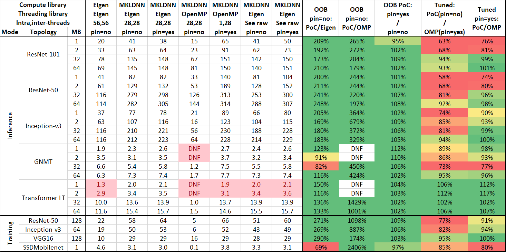

# Proposal for TensorFlow-native threading in DNNL

## Introduction

### Motivation

- TensorFlow uses Eigen threading natively. It is hard to make Eigen threading
  to compose with OpenMP well. Out-of-the-box performance is especially
  challenging. See the performance data section for more information.

### History

This has been worked off and on for about a year. The work to support Eigen
threadpool was done by Evarist. Roma worked mostly on the MKL-DNN 0.x <->
TensorFlow bridge and on understanding the performance limitations of the
approach.

The proof-of-concept bridge implementation introduces a single new function,
~~~c++
mkldnn_status_t mkldnn_set_tensorflow_thread_pool(void *tp);
~~~
that is called from the TensorFlow once the intraop threadpool is created.
This function sets the global threadpool pointer inside MKL-DNN to the value
of `tp`.

Then the MKL-DNN threading layer uses the threadpool each time the library
calls `parallel()` or asks for the number of threads available.

### Performance data

The performance data below was obtained with f32 and
[TensorFlow fork](https://github.com/rsdubtso/tensorflow) which roughly
corresponds to TensorFlow 1.14-1.15, and that uses the PoC MKL-DNN version described
above that roughly corresponds to MKL-DNN 0.20.1.

### Known issues

The PoC implementation does not support multiple intraop threadpools (can be
used when running multiple TensorFlow sessions).

It was also found that work estimation approach on the MKL-DNN side is
[subpar](#work-estimation).

## Proposal

The proposal is to introduce a special 'threadpool' CPU runtime. This runtime
will have to be enabled at [build time](#build-system-interface).

There are several options on the table. The common part across all the options
is an abstract threadpool interface that frameworks implement on their side.
Then frameworks pass a pointer to a threadpool object to DNNL that uses this
object to schedule computations.

The abstract threadpool interface is discussed in
the [later part](#abstract-threadpool-interface) of the RFC.

### Option 1: add threadpool parameter to the engine constructor

* Option 1a: add an explicit threadpool argument:

    

    
C API

    ~~~c
    // The existing constructor.
    dnnl_status_t dnnl_engine_create(dnnl_engine_t *engine,
            dnnl_engine_kind_t kind, size_t index);

    // A new constructor that takes a threadpool parameter. Returns an error
    // status if the kind is not CPU.
    dnnl_status_t dnnl_engine_create_cpu_with_threadpool(dnnl_engine_t *engine,
            void *threadpool);

    // Returns the threadpool associated with the stream. For CPU engine
    // returns NULL if there is no associated threadpool. Returns an error
    // status if the engine is not CPU.
    // Note: there is no setter.
    dnnl_status_t dnnl_engine_get_threadpool(dnnl_engine_t engine,
            void **threadpool);
    ~~~

    

    

    
C++ API

    ~~~c++
    struct engine {
        // The existing constructor.
        engine(kind kind, size_t index);

        // A new constructor that takes a threadpool parameter. Throws if kind
        // is not CPU.
        engine(kind kind, threadpool_iface *threadpool);

        // Returns the associated threadpool. For CPU engine returns NULL if
        // there is no associated threadpool.  Throws if the engine is not
        // CPU.
        // Note: there is no setter
        threadpool_iface *get_threadpool() const;
    };
    ~~~

    

* Option 1b: introduce engine attributes:

    

    
C API

    ~~~c
    // Creates engine attributes for an engine of a particular kind.
    dnnl_status_t dnnl_engine_attr_create(dnnl_engine_attr_t *attr,
            dnnl_engine_kind_t kind);

    // Destroys engine attributes.
    dnnl_status_t dnnl_engine_attr_destroy(dnnl_engine_attr_t attr);

    // Sets the threadpool attribute. Returns an error status in case of
    // non-CPU engine attributes.
    dnnl_status_t dnnl_engine_attr_set_threadpool(
            dnnl_engine_attr_t attr, void *threadpool);

    // Returns the value of the threadpool attribute. For CPU engine
    // attributes returns NULL if the attribute is unset. Returns an error
    // status in case of non-CPU engine attributes.
    dnnl_status_t dnnl_engine_attr_get_threadpool(
            const_dnnl_engine_attr_t attr, void **threadpool);

    // New constructor for the engine (attr can be NULL)
    dnnl_status_t dnnl_engine_create_v2(
            dnnl_engine_t *engine, dnnl_engine_kind_t kind,
            const_dnnl_engine_attr_t attr);

    // Returns engine attributes. Required to be able to retrieve threadpool
    dnnl_status_t dnnl_engine_get_attributes(dnnl_engine_t engine,
            const_dnnl_engine_attr_t *attr);
    ~~~

    

    

    
C++ API

    ~~~c++
    // New type: engine attributes
    struct engine_attr {
        // No default constructor. Need kind to be able to catch errors.
        explicit engine_attr(kind kind);

        // Returns the underlying engine kind.
        kind get_kind();

        // Sets the threadpool attribute. Throws in case of non-CPU engine
        // attributes.
        void set_threadpool(threadpool_iface *threadpool);

        // Returns the value of the threadpool attribute. For CPU engine
        // attributes returns NULL if the attribute is unset. Throws in case
        // of non-CPU engine attributes.
        threadpool_iface *get_threadpool() const;
    };

    struct engine {
        // The existing constructor.
        engine(kind kind, size_t index);

        // A new constructor that takes engine attributes.
        engine(kind kind, size_t index, const engine_attr &attr);

        // Returns engine attributes. Required to be able to retrieve
        // associated threadpool.
        const engine_attr &get_attr() const;
    };
    ~~~

    

This proposal has substantial implications to the compute parts of the
library as every single call to `parallel()` will have to be modified to take
an engine (or threadpool) parameter.

For standalone functions, this option's proposal is add a new version with an
`_tp` suffix in the name and an extra `tp` argument having `void *` type in
the C API and `threadpool_iface *` type in the C++ API. When `tp` is NULL, or
when the non-`_tp` function is called,  the execution is supposed to be
sequential. This is done to make it possible for TensorFlow to continue using
DNNL contraction kernels in Eigen even when DNNL threadpool is enabled. This
may reduce the number of performance regressions.

API

~~~c++
dnnl_status_t dnnl_gemm_u8s8s32_tp(/* usual parameters */, void *threadpool);

namespace dnnl {
status gemm_u8s8s32_tp(/* usual parameters */, threadpool_iface *threadpool);
}
~~~

The reason to prefer passing a threadpool versus an engine is that passing an
engine requires having one at the call site which may not always be the case.
On the other hand, if an engine object is present one could query for a
threadpool provided a proper API is available.

For other operations like `dnnl_memory_set_data_handle()` it is assumed that
they will be able to use the engine's thread pool for execution.

### Option 2: introduce an implicit thread-local threadpool

This approach is similar to what has already been done in the PoC. The
proposal is to provide the following function:

~~~c++
// Sets global threadpool if global is not zero, and thread-local threadpool
// otherwise. The caller is responsible for handling any race
// conditions.
dnnl_status_t dnnl_set_threadpool(void *threadpool, int global);
~~~

The library then would be able to retrieve the value and use it whenever it
needs to perform a `parallel()` call or read the number of threads available.
The retrieval will be two-stage: first check thread-local and then check
thread-global.

DNNL will assume sequential execution if both thread-local and global
threadpools are NULL.

For standalone functions, this option allows either having an extra argument
like in option 1 (option 2a), or use the implicit threadpool (option 2b).

### Option 3: make threadpool a stream parameter

This approach decouples threadpools from engines. Instead the proposal is to
create streams with a threadpool parameter so that user has more flexibility.

> The first version of this RFC called for providing the *number of threads*
> when creating engines. This was proven to be not very useful. This may be
> added later if only to provide a default number of threads.

* Option 3a: explicit threadpool and number of threads arguments

    

    
C API

    ~~~c
    // New stream constructor that takes a threadpool parameter. Returns an
    // error status if the engine is not CPU.
    dnnl_status_t dnnl_stream_create_with_threadpool(dnnl_stream_t *stream,
            dnnl_engine_t engine, dnnl_stream_flags_t flags,
            void *threadpool);

    // Returns the threadpool associated with the stream. Returns NULL if
    // threadpool was not set for a stream for a CPU engine. Returns an error
    // status if the engine is not CPU.
    // Note: there is no setter.
    dnnl_status_t dnnl_stream_get_threadpool(dnnl_stream_t stream,
            void **threadpool);
    ~~~

    

    

    
C++ API

    ~~~c++
    struct stream {
        // The existing constructor
        stream(const engine &engine, flags flags);

        // New constructor that takes a threadpool parameter. Throws if the
        // engine is not CPU.
        stream(const engine &engine, threadpool_iface *threadpool);

        // Returns the associated threadpool. Returns NULL if no threadpool
        // was set.  Throws if the underlying engine is not CPU.
        // Note: there is no setter.
        threadpool_iface *get_threadpool();
    };
    ~~~

    

* Option 3b: introduce engine and stream attributes

    

    
C API

    ~~~c
    // Creates stream attributes for a stream running on an engine of a
    // particular kind.
    dnnl_status_t dnnl_stream_attr_create(dnnl_stream_attr_t *attr,
            dnnl_engine_kind_t kind);

    // Destroys stream attributes.
    dnnl_status_t dnnl_stream_attr_destroy(dnnl_stream_attr_t attr);

    // Sets the threadpool stream attribute. Returns an error status in case
    // of non-CPU engine attributes.
    dnnl_status_t dnnl_stream_attr_set_threadpool(
            dnnl_stream_attr_t attr, void *threadpool);

    // Sets the threadpool attribute. Returns an error status in case of
    // non-CPU stream attributes.
    dnnl_status_t dnnl_stream_attr_get_threadpool(
            dnnl_stream_attr_t attr, void **threadpool);

    // A new constructor for streams. Attr can be NULL.
    dnnl_status_t dnnl_stream_create_v2(dnnl_stream_t *stream,
            dnnl_engine_t engine, dnnl_stream_flags_t flags,
            stream_attr *attr);
    ~~~

    

    

    
C++ API

    ~~~c++
    // New type: stream attributes
    struct stream_attr {
        // No default constructor. Need the kind to be able to catch errors.
        explicit stream_attr(engine::kind kind);

        // Returns the underlying engine kind.
        kind get_kind();

        // Sets the threadpool attribute. Throws in case of non-CPU stream
        // attributes.
        void set_threadpool(threadpool_iface *threadpool);

        // Returns the threadpool attribute. For CPU stream attributes returns
        // NULL if the attribute is unset. Throws in case of non-CPU stream
        // attributes.
        threadpool_iface *get_threadpool() const;
    };

    struct stream {
        // The existing constructor.
        stream(const engine &engine, flags flags);

        // A new constructor that takes attributes argument.
        stream(const engine &engine, flags flags, const stream_attr &attr);

        // Returns stream attributes. Required to be able to retrieve thread
        // pool.
        const stream_attr &get_attr() const;
    };
    ~~~

    

Standalone functions are treated the same way as in Option 1.

This option implies that `dnnl_memory_create()` constructor and
`dnnl_memory_set_data_handle()` function would also be extended with a stream
argument. See [this sub-RFC](memory.md) for more details on why this approach
was chosen.

### Comparison of the options

Comparison between options 1, 2, and 3:

| Comparison category                                                                                        | Option 1         | Option 2      | Option 3      |
|------------------------------------------------------------------------------------------------------------|------------------|---------------|---------------|
| Amount of changes to the CPU source code and tests                                                         | Moderate-to-High | Low           | High          |
| Alignment with asymmetric ISA                                                                              | Moderate         | Low           | High          |
| Alignment with the how CPU primitives require knowing the number   of threads during primitive creation | Yes              | No (!)        | No (!!)       |
| Mode of handling multiple threadpools                                                                      | Multiple engines | Single engine | Single engine |
| Primitive caching works with multiple threadpools                                                          | Maybe            | Yes           | Yes           |

It seems safe to not consider option 2 in further discussions. Comparison between options 1a, 1b, 3a, and 3b.

| Comparison category                        | 1a: no attrs | 1b: attrs | 3a: no attrs | 3b: attrs |
|--------------------------------------------|--------------|-----------|--------------|-----------|
| Boilerplate code on user side              | No           | Yes (+)   | No           | Yes (+)   |
| Addition of a potentially unused feature   | No           | Yes       | No           | Yes       |
| Future extensibility                       | No           | Yes       | No           | Yes       |
| Extra testing requirements                 | Low          | Moderate  | Low          | High      |
| Requires changes in other parts if the API | No           | No        | Yes          | Yes       |

- (+) Only for code that uses threadpools.

### Recommendation

* The recommendation to pursue one of the variants of Option 1 or 3 because
  they are better aligned with the library behavior and lead to fewer
  surprises on the user side.

* The choice between Options 1 and 3 can be made based on the trade-off
  between ease of handling handling multiple threadpools with a single engine
  (Option 3 wins) vs availability of threadpool to most operations (Option 1
  wins).

  The recommendation is to pursue Option 3 because as discussions with
  TensorFlow team show that it is often the case when an DNNL engine is
  created at the moment when a threadpool is not available.
  - The ability to handle multiple threadpools may make it easier to modify
    the existing integration code where there is only a single CPU engine.
  - This will somewhat simplify the primitive cache implementation.

* The choice between Options 3a, and 3b can only be made based on the
  expected usage of the attributes. **Option 3b is recommended** as it
  - Does not actually affect the existing code.
  - Does not seem introduce potential roadblocks for further library
    development.
  - OpenCL extensions should have used attributes too :)

### Abstract threadpool interface

The current proposal is to have a C++-only threadpool interface. This is in
line with what TensorFlow needs, but leaves C-only users in the dust. However,
it is possible to have a C-friendly threadpool as a different kind of
`DNNL_CPU_RUNTIME` and this would not change the gist of this proposal.

Alternatively, with Option 3b it should be possible to have two stream
attributes: one for C++-based and another one for C-based threadpools.

~~~c++
namespace dnnl {
// Threadpool interface.
struct threadpool_iface {
    /// Returns the number of worker threads. This number must remain constant
    /// for the life time of the threadpool.
    virtual int get_num_threads() const = 0;

    // Returns true if the calling thread belongs to this threadpool.
    // (Redundant?)
    virtual bool get_in_parallel() const = 0;

    /// Submits n instances of a closure for execution in parallel:
    ///
    /// for (int i = 0; i < n; i++) fn(i, n);
    ///
    virtual void parallel_for(int n, const std::function<void(int, int)> &fn)
            = 0;

    /// Returns threadpool behavior flags bit mask (see below).
    virtual uint64_t get_flags() const = 0;

    /// If set, parallel_for() returns immediately and DNNL needs implement
    /// waiting for the submitted closures to finish execution on its own.
    static constexpr uint64_t ASYNCHRONOUS = 1;

    // If set, the threadpool is tuned for processing multiple small-sized
    // jobs (TBB/Eigen threadpool-style) vs processing num_workers()
    // large-sized jobs (OpenMP-style).
    static constexpr uint64_t AUTO_BALANCING = 2;

    // Virtual destructor is required.
    virtual ~threadpool_iface() {};
};
}
~~~

Rationale for this interface:

- On one hand, the `parallel_for()` interface is high-level enough to allow
  for optimizing for a case of bulk work submission.

- On the other hand this interface is low-level enough to allow DNNL to
  implement features (like improved work cost estimation) that span multiple
  threading runtimes.

- The rationale behind having threadpool flags as a method rather than a
  compile-time define is to (potentially) a allow single binary distribution
  to work with multiple threadpool implementations. This will also allow
  extending the interface without having to change all the integrations.

  - The `ASYNCHRONOUS` flag will be the only one to be implemented for now
    (even that is not mandatory, strictly speaking, since we know how Eigen
    threadpool behaves).

  - The `AUTO_BALANCING` flag is a future extension (see below for a
    discussion of the work estimation issues).

#### Interpretation of the `num_threads` parameter

It may seem that threadpool approach may completely isolate CPU primitives
from the notion of OS threads and thus the `num_threads` parameters may be
unnecessary.

This may be true in general. But, currently CPU primitives use maximal number
of threads to decompose work and, more importantly, to calculate the size of a
temporary storage. Each chunk of the temporary storage is accessed by an
individual thread. This allows having the size of the temporary storage to be
proportional to the number of threads rather than the total number of work
items.

This justifies the requirement to have `get_thread_num()` and
`get_num_threads()` in the threadpool interface.

#### Resolving (part of current) limitations

CPU primitives use information about threads in multiple ways. They generally
fall into two categories: `*_create()`-time and `execute()`-time. The latter
case is benign, but the first one introduces a hard requirement for threading
environment to be the same during primitive (descriptor) creation and
execution.

We either need to enforce consistency via e.g. a primitive attribute, or
remove the chance of inconsistency. The original proposal was to follow the
first path, but the feedback from the Intel TensorFlow team was that this
won't work, so the proposal is to follow the second path (also initially
proposed by Evarist).

The solution is for each CPU primitive implementation to read (or guess, in
the case of the threadpool), the number of threads during primitive creation
time and use this number during the execution time.

#### Work estimation

Recently, the frameworks team found a problem with how the PoC submits work to
Eigen threadpool because the PoC follows the traditional DNNL scheme with
OpenMP threading: it always submits as many jobs as there are threads in the
threadpool. Each job in turn determines how much work it needs to do and, if
there's none, exits. This results in substantial overhead because job
submission is an expensive operation with Eigen threadpool.

The solution for this problem is to move work estimation outside of parallel
region into the sequential one. However, there is no universal cost model that
could work within DNNL; even more so there is no universal cost model that
could be baked into a threadpool.

However, it is still important to know whether a threadpool actually is tuned
for multiple small tasks or not. Hence, the potential future extension via the
`AUTO_BALANCING` flag.

#### Example usage

Here's a sketch of how implementation inside DNNL could look
like.

~~~c++
void parallel_for(std::function<void(int, int)> &fn) {
    int nthr = tp->num_workers();

    if (nthr == 1) {
        // This is debatable, but we can run computations in the calling
        // thread
        fn(0, 1);
        return;
    }

    if (tp->is_synchronous()) {
        tp->parallel_for(nthr, f);
    } else {
        barrier b(); // E.g. Eigen::Barrier
        tp->parallel_for(nthr, [b, &f](int ithr, int nthr) {
            f(ithr, nthr);
            b.notify();
        });
        b.wait();
    }
}
~~~

### Open questions

- It is unclear how this design co-exist with oneDNN. Most likely it will
  disable the DPC++ for CPU, but this needs to be tested.

- This design seems to allow to building a library without 'internal'
  threading that can be used with use-provided threading.

    - Do we need to provide a 'reference' threadpool implementation? This will
      be required anyways for testing purposes.

- Threadpools open up a possibility to have asynchronous execution on the CPU.

    - However, the current design does not support it, and it is unclear if it
      allows retro-fitting asynchonous execution at a later point.

### Build system interface

The proposal is to use the existing controls to enable this feature via
`DNNL_CPU_RUNTIME=EXT_THREADPOOL` (or, `DNNL_CPU_RUNTIME=EXT_THREADPOOL_CPP`
if we want to reserve the ability to support C-based threadpools later).

### Testing

Additional tests will need be added to test stream attributes and to test
support for synchronous and asynchronous threadpools.

## Next steps

1. Implement a version that does not affect the current work estimation
   approach. Write tests, etc.

   - Update all CPU primitives to read # of threads at primitive creation time

   - Update `parallel_nd()` to take the number of threads to use.

   - Update test threadpool to support the asynchronous mode that is the one
     that TF is going to use.

   - Implement optimized barrier similar to one used in Eigen. This barrier is
     going to be used for every `parallel()` call, which makes it an important
     component.

   - Decide on the default number of jobs for the threadpool runtime.

2. Follow-up on a feedback that the `get_thread_num()` and `get_num_threads()`
   are not actually needed.

   - This will require more changes to `parallel()` and `parallel_nd()`.

3. Optimize work estimation and decomposition.

4. Decide whether frameworks need a mechanism for passing the default number
   of jobs to primitives (global setting / primitive attribute / adaptive
   guessing on DNNL side).
