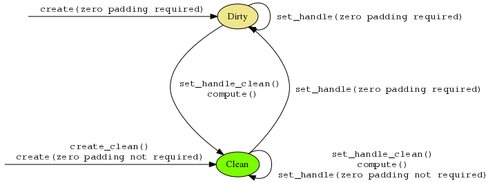

# Proposal for changing `dnnl_memory_set_data_handle()` behavior

## Motivation

DNNL relies on the 'tails' area of memory buffers to be zeroes. Currently this
is done in `dnnl_memory_create()` and in `dnnl_memory_set_data_handle()` (or
respective C++ APIs).

The main problem with this approach is that it requires an execution device
when one may be not available. The GPU team solves this by introducing a
'service stream' that is always available for computations on a device.

There is no way to apply a similar approach to the CPU if the threading
runtime is based on user-provided threadpools and threadpools are associated
with streams rather than engines (see the
[respective RFC](README.md#option-3-make-threadpool-a-stream-parameter);
).

## Proposals

### Option A: Do nothing

In this case, DNNL will require engines to always have access to execution
resources. In case of threadpool-based runtime, this will imply that each
engine will hold a reference to a threadpool.

### Option B: Add a stream arguments to functions that potentially zero-pad

Without much further ado:

```c++
dnnl_status_t dnnl_memory_create(dnnl_memory_t *memory,
        const dnnl_memory_desc_t *memory_desc, dnnl_engine_t engine,
        dnnl_stream_t *stream, void *handle);

dnnl_status_t DNNL_API dnnl_memory_set_data_handle(
        dnnl_memory_t memory, dnnl_stream_t stream, void *handle);
```

The `stream` argument is allowed to be `NULL` in which case the zero-padding
is run by the calling thread only.

Initially, the extra arguments will only appear when threadpool-based CPU
runtime is enabled. Later, it may be promoted to the standard API.

### Option C: Move zero-padding to `execute()` time

The proposal is to introduce an additional flag to memory objects that would
indicate whether a memory object is clean (has all the zeroes in the right
place) or dirty (does not).

The following diagram shows transitions between these states.



Memory objects with plain layouts are always considered clean because they
don't have any area to be zeroed-out.

All primitives (including reorders) will check the 'clean' flag for the
sources and zero-pad them if they inputs are 'dirty' and they rely on
zero-padded memory buffers. The primitives will also write zeroes to
destination if it is 'dirty' and set the 'clean' flag afterwards.

The checks may be tricky for cases when the destination is also a source, but
in reality such cases do not break the consistency of the approach.

The second part of the proposal is to add two extra new functions (denoted as
`create_clean()` and `set_handle_clean()` above:

```c
#define DNNL_MEMORY_CLEAN 1

dnnl_status_t dnnl_memory_create_v2(dnnl_memory_t *memory,
    const dnnl_memory_desc_t *memory_desc, dnnl_engine_t engine,
    void *handle, uint64_t flags);

dnnl_status_t dnnl_memory_set_data_handle_v2(
    dnnl_memory_t memory, void *handle, uint64_t flags);
```

In C++ it is possible to just add new overloads:

```c++
struct memory {
    enum class flags {
        none = 0,
        clean = 1,
    };

    memory(memory::desc &desc, const engine &engine, void *handle,
            flags flags);

    void set_data_handle(void *handle, flags flags);
}
```

Unfortunately, the flags will have to be documented which would expose DNNL
implementation details. The oneDNN specification may say that `none` is the
only specified flag and that portable code should not rely on the presence of
any other flags.

## Discussion

The main drawback of Option A is that it makes integration into TensorFlow
hard. DNNL integration creates multiple CPU engines and then stores them and
the threadpool an Op should be executed on can vary.

The main problem with the Option B is that the API change that may bleed
eventually into oneDNN.

There are multiple drawbacks of Option C:
- It does not compose well with submemory objects because there is no way to
  describe their 'cleanness' state with a single bit.
- At least initially, primitives performance will degrade in cases when they
  have to zero-pad their inputs. It is a lot of effort to optimize primitives
  to not rely on zero-padded data.
- It is not clear how well will this approach work when 'nesting' primitives
  one within another.

## Recommendation

The recommendation is to proceed with option B since it seems to satisfy the
integration requirements and carries the least amount of risk.

