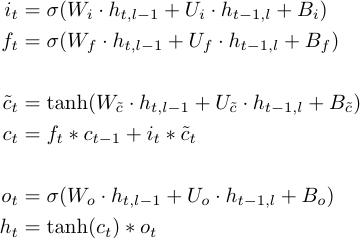
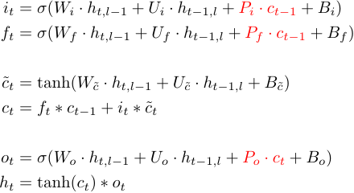

Proposal for Peephole LSTM in DNNL
==================================

## 1. Introduction

In addition to the regular LSTM there is a notion of Peephole LSTM that
can help learn certain sequences and has slightly adjusted math. Please refer
to links [[#1]][1] and [[#2]][2] in the [References section](#3-references).

### 1.1. LSTM

LSTM is defined by the following formula:



The gates have the following names:
- $`i`$ -- input gate,
- $`f`$ -- forget gate,
- $`\tilde{c}`$ -- candidate gate (usually this gate is not named explicitly),
- $`o`$ -- output gate.

### 1.2. Peephole LSTM

Peephole LSTM is defined by the following formula (the difference from the
regular LSTM is highlighted in red):



Here $`P_i`$, $`P_f`$, and $`P_o`$ are `OC x OC`-diagonal matrices, hereafter
called *peephole weights*.

It is also worth mentioning that due to output gate dependency on the cell
state $`c_t`$ the order of computations might be slightly different than for
the regular LSTM, where all gates could be computed simultaneously.

## 2. API Changes

### 2.1. New Types

Peephole LSTM will **not** be a separate algorithm kind, so whether the user
wants LSTM with or without peephole the algorithm kind will be
`dnnl_vanilla_lstm`. To distinguish between these two versions, one should check
whether the peephole weights memory descriptor is zero. This mechanism is
similar to convolution with and without bias.

To store peephole weights, the following two placeholders in the RNN operation
descriptor will be renamed:

``` cpp
typedef struct {
    ...
    dnnl_memory_desc_t peephole_weights_desc;      // previously: placeholder_desc
    ...
    dnnl_memory_desc_t diff_peephole_weights_desc; // previously: diff_placeholder_desc
    ...
} rnn_desc_t;
```

> WARNING
>
> The comments `previously: {diff_,}placeholder_desc` won't go in the public
> header file. They are here for illustration purposes only.

This is somewhat unfortunate, as the shape and format of these weights are
strictly defined (`ldgo`) and the data type for `f32`, `bf16`, and `int8` will
always be `f32`, while for `f16` it might be either `f16` or `f32` (the latter
might be required for training). Hence, out of the whole memory descriptor for
peephole weights the only useful information is the data type. However, using
data type fields only (say `peephole_weights_data_type` and
`diff_peephole_weights_data_type` instead of the descriptors) would be much
different from the approaches taken elsewhere in the library.

For the Peephole LSTM, the peephole weights will have index `3` in the
`weights_md` and `diff_weights_md` queries, shifting bias to position `4`. This
is also quite unfortunate because the bias index will be different for LSTM and
peephole LSTM. This might be inconvenient for both developers and users.
However, making the peephole weights index greater than the bias one seems even
less appealing because it goes against the convention used in the library. A
query with index by execution-argument (`dnnl_query_exec_arg_md`) also
alleviates the problem with drifted indices.

To enable passing the peephole weights, new argument indices are added:

``` cpp
#define DNNL_ARG_WEIGHTS_2 35
#define DNNL_ARG_WEIGHTS_PEEPHOLE DNNL_ARG_WEIGHTS_2            // an alias

#define DNNL_ARG_DIFF_WEIGHTS_2 163
#define DNNL_ARG_DIFF_WEIGHTS_PEEPHOLE DNNL_ARG_DIFF_WEIGHTS_2  // an alias
```

### 2.2. C API

New (more general than current lstm) initialization functions appear:

``` cpp
dnnl_status_t dnnl_lstm_forward_desc_init_v2(dnnl_rnn_desc_t *rnn_desc,
        dnnl_prop_kind_t prop_kind, dnnl_rnn_direction_t direction,
        const dnnl_memory_desc_t *src_layer_desc,
        const dnnl_memory_desc_t *src_iter_desc,
        const dnnl_memory_desc_t *src_iter_c_desc,
        const dnnl_memory_desc_t *weights_layer_desc,
        const dnnl_memory_desc_t *weights_iter_desc,
        const dnnl_memory_desc_t *weights_peephole_desc,  // !!!
        const dnnl_memory_desc_t *bias_desc,
        const dnnl_memory_desc_t *dst_layer_desc,
        const dnnl_memory_desc_t *dst_iter_desc,
        const dnnl_memory_desc_t *dst_iter_c_desc,
        unsigned flags);

dnnl_status_t dnnl_lstm_backward_desc_init_v2(dnnl_rnn_desc_t *rnn_desc,
        dnnl_prop_kind_t prop_kind, dnnl_rnn_direction_t direction,
        const dnnl_memory_desc_t *src_layer_desc,
        const dnnl_memory_desc_t *src_iter_desc,
        const dnnl_memory_desc_t *src_iter_c_desc,
        const dnnl_memory_desc_t *weights_layer_desc,
        const dnnl_memory_desc_t *weights_iter_desc,
        const dnnl_memory_desc_t *weights_peephole_desc,  // !!!
        const dnnl_memory_desc_t *bias_desc,
        const dnnl_memory_desc_t *dst_layer_desc,
        const dnnl_memory_desc_t *dst_iter_desc,
        const dnnl_memory_desc_t *dst_iter_c_desc,
        const dnnl_memory_desc_t *diff_src_layer_desc,
        const dnnl_memory_desc_t *diff_src_iter_desc,
        const dnnl_memory_desc_t *diff_src_iter_c_desc,
        const dnnl_memory_desc_t *diff_weights_layer_desc,
        const dnnl_memory_desc_t *diff_weights_iter_desc,
        const dnnl_memory_desc_t *diff_weights_peephole_desc,  // !!!
        const dnnl_memory_desc_t *diff_bias_desc,
        const dnnl_memory_desc_t *diff_dst_layer_desc,
        const dnnl_memory_desc_t *diff_dst_iter_desc,
        const dnnl_memory_desc_t *diff_dst_iter_c_desc, unsigned flags);
```

If the user passes `NULL` or a pointer to a zero memory descriptor for
`weights_peephole_desc` and `diff_weights_peephole_desc`, the LSTM primitive is
configured without peephole; that is, the functions do the same as their `_v1`
counterparts.

As mentioned above, for Peephole LSTM the peephole weights memory descriptor
will always be `(dims={L, D, 3, OC}, data_type={f32,f16}, fmt=ldgo)`.

The format `any` will be supported but will result in `ldgo` format anyway.
The behavior will be documented to reduce the code verbosity on the user's side.

### 2.3. C++ API

The C++ API is changed similarly to the C API: new constructor overloads for
`lstm_forward::desc` and `lstm_backward::desc` are added. If in the future the
library were to support LSTMP (which also requires one more type of weights),
new constructors would include both peephole and projection weights, and there
wouldn't be a dedicated constructor for LSTMP (only because the signature
would be indistinguishable from that of the Peephole LSTM constructor).


## 3. References

1. [Long Short-Term Memory Based Recurrent Neural Network Architectures For Large Vocabulary Speech Recognition][1]
2. [Long Short-Term Memory Recurrent Neural Network Architectures for Large Scale Acoustic Modeling][2]
3. [PaddlePaddle documentation for LSTM](https://www.paddlepaddle.org.cn/documentation/api/en/0.14.0/layers.html#dynamic-lstm)

[1]: https://arxiv.org/pdf/1402.1128.pdf
[2]: https://static.googleusercontent.com/media/research.google.com/en//pubs/archive/43905.pdf

## 4. Appendices

### 4.1. Alternative API: Adding the `peephole_lstm` Algorithm Kind

Originally, it was planned to enable Peephole LSTM by extending the algorithm
kinds with `peephole_lstm`:

``` cpp
typedef enum {
    ...
    /// LSTM cell
    dnnl_vanilla_lstm,
    /// Peephole LSTM cell
    dnnl_peephole_lstm,
    ...
} dnnl_alg_kind_t;
```

Then the C API would have separate initialization functions, and the C++ API
would have separate classes `peephole_lstm_forward` and
`peephole_lstm_backward`.

While this makes the API a little clearer and less error-prone, it brings a
lot of code duplication into the integration code, which will have to support
both kinds of LSTM (because `lstm_forward` and `peephole_lstm_forward` are
completely incompatible classes).

Hence, the suggestion is to use a single primitive that has different behavior
depending on the way it is configured (peephole weights memory descriptors are
zero or non-zero).

The original approach also suffered from potential future extensions. Projected
LSTM (LSTMP) is an example: if it used the same approach taken for Peephole
LSTM, the library would have to introduce two new classes, `lstmp_forward` and
`peephole_lstmp_forward`. Any new algorithm kind would require doubling the
number of classes, which is not sustainable.

---

EOD
