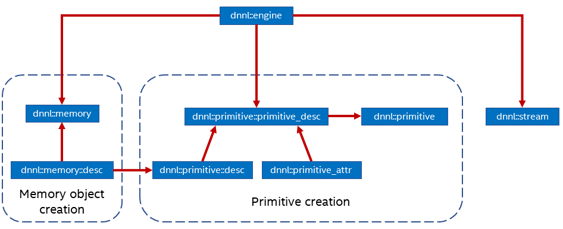

Proposal for Introduction to Primitives in DNNL
==========================================

## 1. Introduction

---

**NOTE** Throughout this document, the notion `user` implies a person who uses
DNNL directly, as opposed to using it via a framework.

---

Currently, the [Basic
Concepts](https://intel.github.io/mkl-dnn/dev_guide_basic_concepts.html)
documentation defines key concepts that are part of the DNNL programming model,
such as memory object, primitive descriptor, etc. While this page provides all
the necessary details to the user, there is no quick way for the user to (i) see
a summary of these concepts and (ii) know the interaction between them without
going into the detailed description. The semantics of these concepts is pretty
self-explanatory, therefore a visual summary of the DNNL programming model is
expected to be very beneficial for the user's understanding of the library.

In its current form, DNNL contains a limited number of primitive examples. While
a large number of simple primitive examples may appear boilerplate, these can
serve a few useful purposes. Firstly, these should enable the DNNL users to
focus on the DNNL programming model in the context of a specific primitive in
C++ form. Secondly, these will work as a starting point for tinkering with the
DNNL API.

Consequently, the goals of this proposal are the following:

1. Include a diagram on the [Basic
   Concepts](https://intel.github.io/mkl-dnn/dev_guide_basic_concepts.html) page
   with a high level overview of the key concepts within DNNL programming model, and

2. Develop a set of simple examples for all primitives currently supported by DNNL (c.f.
   [DNNL dev guide](https://intel.github.io/mkl-dnn/index.html)).

---

**NOTE** This RFC is not intended to demonstrate important details of primitive
specific workflow, and serves mostly as a guide to DNNL concepts and API. This
RFC may be extended at some later stage, where important aspects of primitive
specific workflow will be discussed.

---

## 2. DNNL Documentation

The [Basic
Concepts](https://intel.github.io/mkl-dnn/dev_guide_basic_concepts.html) page
will be updated with a diagram of the DNNL programming model. This will provide
a high level overview of the key concepts in DNNL to the user and the
interaction between them. Below is an example of such diagram:

The diagram is focused on the key concepts of DNNL programming model, such as:
(i) memory object, (ii) primitive, (iii) stream, and (iv) engine. The purpose of
the diagram is to emphasize the interaction between these concepts. Although it
may be looking similar to a workflow, the diagram is not intended to demonstrate
the workflow of a specific primitive, primarily because (i) it is not practical
to generalize primitive specific aspects in one simple diagram, and (ii) the
diagram fits within the context of the [Basic
Concepts](https://intel.github.io/mkl-dnn/dev_guide_basic_concepts.html) page,
where no primitive specific aspects are discussed.

## 3. Primitive examples

The structure of these examples will be similar to
`mkl-dnn/examples/getting_started.cpp`, thereby making them simple.

~~~cpp

// {primitive} here denotes an arbitrary primitive name

// [START Memory object creation]

engine eng(engine_kind, index);

auto src_md = memory::desc(   {N, C, H, W}, 
                              memory::data_type::f32,
                              memory::data_format::nhwc);

auto src_mem = memory(src_md, eng, src_ptr);
auto dst_mem = memory(src_md, eng, dst_ptr);

// [END Memory object creation]

// [START Primitive creation]

auto primitive_d = {primitive}_forward::desc(   prop_kind::forward_inference,
                                                algorithm::algorithm,
                                                memory::desc,
                                                /* other args */);

auto primitive_pd = {primitive}_forward::primitive_desc(primitive_d, attr, eng);

auto primitive = {primitive}_forward(primitive_pd);

// [END Primitive creation]

// [START Primitive execution]

stream eng_stream(eng);

{primitive}_forward.execute(eng_stream);

// [END Primitive execution]

~~~

As can be seen from above pseudo-code, the example will cover simple primitive
execution for forward inference mode only. The examples will be schematically
divided into the three sections discussed in [DNNL
Documentation](#2.-DNNL-Documentation) above.

The filenames will be `{primitive}_forward.cpp`. The examples will be located in
`mkl-dnn/examples/primitives` primarily to separate these from existing codes
inside `mkl-dnn/examples`. The new primitive examples will also be written in
C++ only at first, and additional C files may be provided at some later stage.
The primitive-specific documentation page will provide a link to the
corresponding example file, under `API Reference`.
