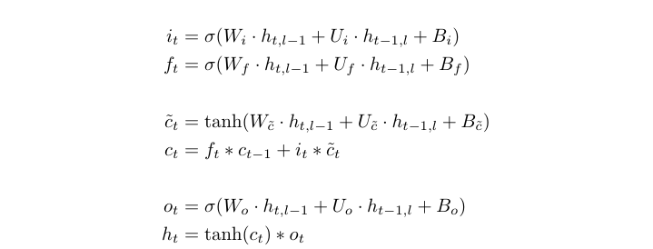
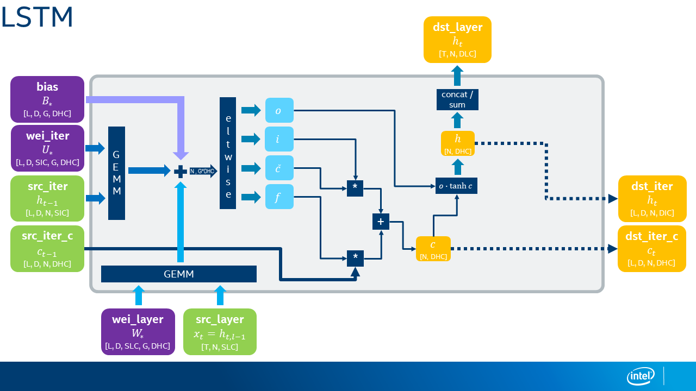
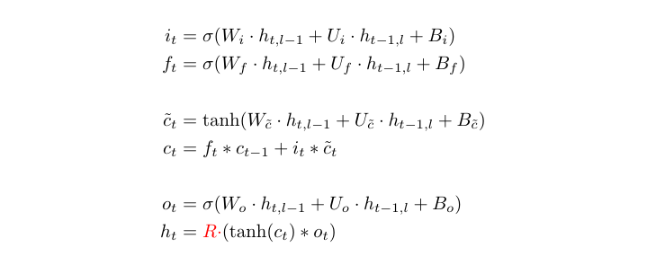
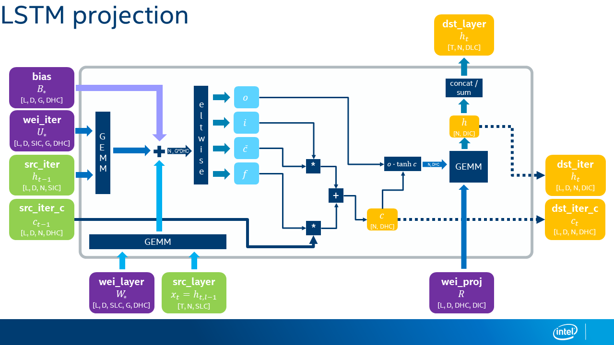

Proposal for Projection LSTM in DNNL
====================================

## 1. Introduction

In addition to the regular LSTM and [Peephole LSTM][1] there is a notion of
Projection LSTM (or LSTM with Recurrent Projection Layer), sometimes shorten
to LSTM**P**.

Please refer to the links [[#2]][2] and [[#3]][3] in the
[References Section](#3-references) for the Google's paper describing the LSTMP
and MxNet API and formulas respectively.

### 1.1. LSTM

LSTM is defined by the following formula:



The gates have the following names:
- $`i`$ -- input gate,
- $`f`$ -- forget gate,
- $`\tilde{c}`$ -- candidate gate (usually this gate is not named explicitly),
- $`o`$ -- output gate.

Schematically, this looks as follows (with the tensor sizes):

> **NOTE**
>
> There is a change in nomenclature: in most of the places **DIC** is
> replaced with **DHC** which stands for *Hidden Channels*. The **DIC**
> designates the number of channels in `dst_iter` (even if it is not used as
> one of the outputs).




### 1.2. Projection LSTM

Projection LSTM is defined by the following formula (the difference from the
regular LSTM is highlighted in red):



Here $`R`$ is `DHC x DIC` matrix, hereafter called the *projection weights*.
It is used to project the output of the LSTM cell.

The diagram for Projection LSTM with the tensor shapes is:



## 2. API Changes

### 2.1. New Types

Projection LSTM will **not** be a separate algorithm kind, so whether the user
wants LSTM with or without projection the algorithm kind will be
`dnnl_vanilla_lstm`. To distinguish between these two versions, one should check
whether the projection weights memory descriptor is zero. This mechanism is
similar to convolution with and without bias, and peephole vs non-peephole LSTM.

To store projection weights, the following two placeholders in the RNN operation
descriptor will be renamed:

``` cpp
typedef struct {
    ...
    dnnl_memory_desc_t projection_weights_desc;      // previously: placeholder_desc
    ...
    dnnl_memory_desc_t diff_projection_weights_desc; // previously: diff_placeholder_desc
    ...
} rnn_desc_t;
```

> WARNING
>
> The comments `previously: {diff_,}placeholder_desc` won't go in the public
> header file. They are here for illustration purposes only.

In theory, the data type of the projection weights could be arbitrary. However,
the suggestion is that for the time being only `f32` will be supported.

For the Projection LSTM, the projection weights will have index `3` or `4` in
the `weights_md` and `diff_weights_md` queries depending on whether there is or
there is no peephole weights, shifting bias to position `4` or `5`. This
is also quite unfortunate because the bias index will be different for LSTM and
Peephole LSTM and Projection Peephole LSTM. This might be inconvenient for both
developers and users. A query with index by execution-argument
(`dnnl_query_exec_arg_md`) also alleviates the problem with drifted indices.

To enable passing the projection weights, new argument indices are added:

``` cpp
// already present

#define DNNL_ARG_WEIGHTS_2 35
#define DNNL_ARG_WEIGHTS_PEEPHOLE DNNL_ARG_WEIGHTS_2             // an alias

#define DNNL_ARG_DIFF_WEIGHTS_2 163
#define DNNL_ARG_DIFF_WEIGHTS_PEEPHOLE DNNL_ARG_DIFF_WEIGHTS_2   // an alias

// newly added

#define DNNL_ARG_WEIGHTS_3 36
#define DNNL_ARG_WEIGHTS_PROJECTION DNNL_ARG_WEIGHTS_3           // an alias

#define DNNL_ARG_DIFF_WEIGHTS_3 163
#define DNNL_ARG_DIFF_WEIGHTS_PROJECTION DNNL_ARG_DIFF_WEIGHTS_3 // an alias
```

### 2.2. C API

New (more general than current lstm) initialization functions appear:

``` cpp
dnnl_status_t dnnl_lstm_forward_desc_init_v3(dnnl_rnn_desc_t *rnn_desc,
        dnnl_prop_kind_t prop_kind, dnnl_rnn_direction_t direction,
        const dnnl_memory_desc_t *src_layer_desc,
        const dnnl_memory_desc_t *src_iter_desc,
        const dnnl_memory_desc_t *src_iter_c_desc,
        const dnnl_memory_desc_t *weights_layer_desc,
        const dnnl_memory_desc_t *weights_iter_desc,
        const dnnl_memory_desc_t *weights_peephole_desc,
        const dnnl_memory_desc_t *weights_projection_desc,  // !!!
        const dnnl_memory_desc_t *bias_desc,
        const dnnl_memory_desc_t *dst_layer_desc,
        const dnnl_memory_desc_t *dst_iter_desc,
        const dnnl_memory_desc_t *dst_iter_c_desc,
        unsigned flags);

dnnl_status_t dnnl_lstm_backward_desc_init_v3(dnnl_rnn_desc_t *rnn_desc,
        dnnl_prop_kind_t prop_kind, dnnl_rnn_direction_t direction,
        const dnnl_memory_desc_t *src_layer_desc,
        const dnnl_memory_desc_t *src_iter_desc,
        const dnnl_memory_desc_t *src_iter_c_desc,
        const dnnl_memory_desc_t *weights_layer_desc,
        const dnnl_memory_desc_t *weights_iter_desc,
        const dnnl_memory_desc_t *weights_peephole_desc,
        const dnnl_memory_desc_t *weights_projection_desc,  // !!!
        const dnnl_memory_desc_t *bias_desc,
        const dnnl_memory_desc_t *dst_layer_desc,
        const dnnl_memory_desc_t *dst_iter_desc,
        const dnnl_memory_desc_t *dst_iter_c_desc,
        const dnnl_memory_desc_t *diff_src_layer_desc,
        const dnnl_memory_desc_t *diff_src_iter_desc,
        const dnnl_memory_desc_t *diff_src_iter_c_desc,
        const dnnl_memory_desc_t *diff_weights_layer_desc,
        const dnnl_memory_desc_t *diff_weights_iter_desc,
        const dnnl_memory_desc_t *diff_weights_peephole_desc,
        const dnnl_memory_desc_t *diff_weights_projection_desc,  // !!!
        const dnnl_memory_desc_t *diff_bias_desc,
        const dnnl_memory_desc_t *diff_dst_layer_desc,
        const dnnl_memory_desc_t *diff_dst_iter_desc,
        const dnnl_memory_desc_t *diff_dst_iter_c_desc, unsigned flags);
```

If the user passes `NULL` or a pointer to a zero memory descriptor for
`weights_projection_desc` and `diff_weights_projection_desc`, the LSTM
primitive is configured without projection; that is, the functions do the same
as their `_v2` counterparts.

As mentioned above, for Projection LSTM the projection weights memory
descriptor will always be
`(dims={L, D, DHC, DIC}, data_type=f32, fmt=ldio)`. Note, that the new format
required `ldio = ldgo = abcd`.

The format `any` will be supported but will result in `ldio` format anyways.
The behavior will be documented to reduce the code verbosity on the user's side.

**NOTE** Given that we haven't released DNNL v1.3 yet, we could extend the
`_v2` initialization function with the projection weights right now (even if
the feature goes to v1.4 only, we will reduce the amount of functions). I think
it is worth doing.


### 2.3. C++ API

The C++ API is changed similarly to the C API: new constructor overloads for
`lstm_forward::desc` and `lstm_backward::desc` are added.


## 3. References

1. [Peephole LSTM RFC][1]
2. [Long Short-Term Memory Based Recurrent Neural Network Architectures for Large Vocabulary Speech Recognition][2]
3. [MxNet documentation for LSTMP][3]

[1]: ../20200127-lstm-peephole/README.md
[2]: https://arxiv.org/pdf/1402.1128.pdf
[3]: https://mxnet.apache.org/api/python/docs/api/gluon/contrib/index.html?highlight=lstmpcell#mxnet.gluon.contrib.rnn.LSTMPCell


---

EOD
