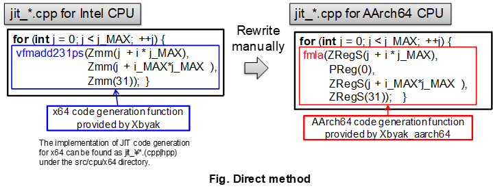
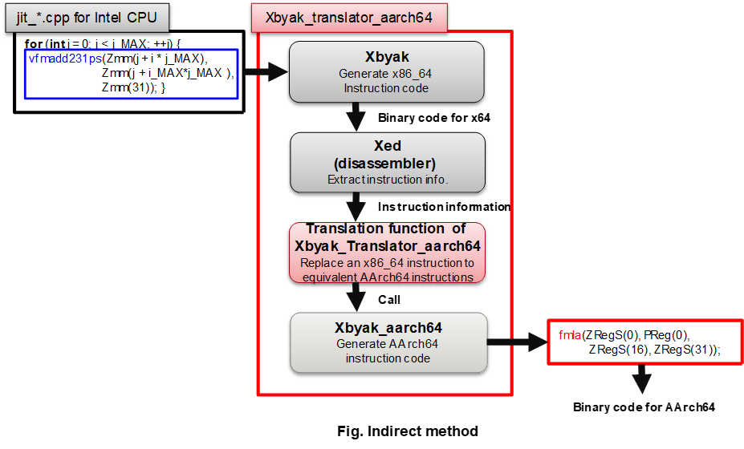
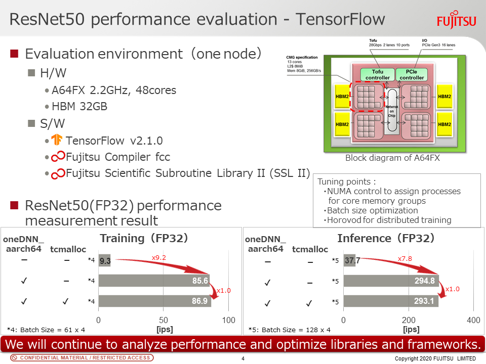

# Proposal to Introduce JIT code generation for AArch64

## Introduction

In the x64 implementation of oneDNN, the execution code is generated at runtime 
considering the available instruction set, such as AVX512/AVX2/AVX/SSE, 
and runtime parameters. oneDNN uses JIT assembler (Xbyak) to generate execution 
code. For AArch64 architecture, we has developed 
[Xbyak_aarch64](https://github.com/fujitsu/xbyak_aarch64), 
a port of Xbyak for AArch64. Xbyak_aarch64 provides the same functionality 
for Aarch64 as Xbyak provides for x64. Therefore, the same functionality that 
oneDNN achieves for x64 using Xbyak can be achieved for AArch64 from scratch 
using Xbyak_aarch64.
**This RFC introduces Xbyak_aarch64 into oneDNN and enables JIT code generation 
for AArch64.**

Ideally, all implementations written for x64 should be rewritten for AArch64 
using Xbyak_aarch64 (Fig. Direct method) to obtain maximum performance of 
AArch64.



However, this process takes a lot of man-hours. To solve this problem, 
we have developed 
[Xbyak_translator_aarch64](https://github.com/fujitsu/xbyak_translator_aarch64). 
By using Xbyak_translator_aarch64 instead of Xbyak in JIT code generation 
for x64, we can generate JIT code for AArch64 instead of JIT code for x64 
(Fig. Indirect method). Since we can reuse jit_\*.(cpp|hpp) for x64 with just 
a few changes for AArch64, and we can reduce our development effort for 
AArch64 to a great extent. We call this as "Indirect method". So **this RFC 
also introduces Xbyak_translator_aarch64 and 
[xed](https://github.com/fujitsu/xed "xed") for AArch64.**




As a third method, it is also possible that we use x64's jit_\*.(cpp|hpp) 
files and their translation to AArch64 as a baseline, and partially rewrite 
them from Xbyak functions to Xbyak_aarch64 ones to achieve better performance 
for AArch64. We call this method as "Mixed-method".

In summary, this RFC allows us to generate JIT code for AArch64 in the 
following three ways.
- Direct method:Implement JIT code generation from scratch using Xbyak_aarch64
- Indirect method:Generate JIT code for AArch64 from jit_\*.(cpp|hpp) 
for x64 by Xbyak_translator_aarch64
- Mixed method:Use jit_\*.(cpp|hpp) files for x64 as a baseline, tune them 
partially with Xbyak_aarch64

We applied these three methods to oneDNN code in v0.21 and confirms that 
the JIT code is generated on AArch64, it passes tests/gtests/test_\*, 
and it accelerates oneDNN processing as shows in the slide below.
The source code is disclosed as 
[https://github.com/fujitsu/dnnl_aarch64](https://github.com/fujitsu/dnnl_aarch64).





## Related RFCs and Issues

- [https://github.com/oneapi-src/oneDNN/tree/rfcs/rfcs/20200401-cpu-dir-structure](https://github.com/oneapi-src/oneDNN/tree/rfcs/rfcs/20200401-cpu-dir-structure)
- [https://github.com/oneapi-src/oneDNN/pull/795](https://github.com/oneapi-src/oneDNN/pull/795)
- [https://github.com/oneapi-src/oneDNN/issues/804](https://github.com/oneapi-src/oneDNN/issues/804)


## Proposal

- Adding xbyak_translator_aarch64 directories to src/cpu/aarch64
- Adding a dependency on xed at the build stage
- Adding primitive entry to src/cpu/cpu_\*_list.cpp

### Adding xbyak_translator_aarch64 directories to src/cpu/aarch64

The following tree shows the directory structure of xbyak_translator_aarch64. 
Some subdirectories are abbreviated from the tree. Xbyak_translator_aarch64 
contains Xbyak and Xbyak_aarch64. Xbyak_translator_aarch64 is built by forking 
[Xbyak](https://github.com/herumi/xbyak), and the directory structure follows 
that of xbyak. The difference between the original `Xbyak` and 
`Xbyak_translator_aarch64` can be seen by comparing 
https://github.com/fujitsu/xbyak_translator_aarch64/tree/master and 
https://github.com/fujitsu/xbyak_translator_aarch64/tree/fjdev. 

Comparing to the original `Xbyak`, call of `decodeAndTransToAArch64` function 
is added to each function of `xbyak_mnemonic.h`. `decodeAndTransToAArch64` 
disassembles x64 instruction, which is generated by xbyak, by `xed`, and call 
`Xbyak_aarch64` functions correspond to the translation result of x64 
instruction. 

```
xbyak_translator_aarch64
|-- gen
|-- sample
|-- test
|-- xbyak
|-- translator
    |-- include
    |   `-- xbyak_translator_for_aarch64
    |       |-- instructions
    |-- tests
    |-- third_party
    |   |-- xbyak_aarch64
    `-- tools
```

Xbyak_translator_aarch64 has additional 'translator' directory, which contains 
the files for the translator functions. 
`translator/indluce/xbyak_translator_for_aarch64` directory contains files 
that implement the main functions of the translation, such as 
`decodeAndTransToAArch64` and functions called by `decodeAndTransToAArch64`. 
The rules for translating x64 instructions to AArch64 ones are implemented 
in files in `translator/indluce/xbyak_translator_for_aarch64/instructions` 
directory. At the moment, `Xbyak_translator_aarch64` supports 200 
instructions that are used when running oneDNN on a CPU which can execute 
AVX512/AVX2/AVX/SSE4.1 instructions.

### Adding a dependency on xed at the build stage:

To build oneDNN with Xbyak_translator_aarch64, it must be assumed that 
a pre-build xed library is available, built from the xed sources. 
Additional CMake modules will be needed, such as `FindXED.cmake` and 
`XED.cmake` which will only impact AArch64 builds. 
[We modified just a few lines](https://github.com/fujitsu/xed/commit/92ee2830ca48fed76baa0a36e7d6ef8a3afe5741) 
of the original xed sources and disclosed as 
[fujitsu/xed](https://github.com/fujitsu/xed/tree/fjdev "fujitsu/xed"). 

### Adding primitive entry to src/cpu/cpu_\*_list.cpp

As JIT code for AArch64 is ready to be generated at this point, primitives are 
added to `src/cpu/cpu_*_list.cpp` as follows not only for convolution but also 
eltwise, batch_normalization, pooling, etc. This proposal is the same as the 
proposal in 
[#795](https://github.com/oneapi-src/oneDNN/pull/795) and the implementation 
for x64.

```
static const std::map<conv_impl_key_t, std::vector<pd_create_f>> impl_list_map {
    // FWD fp
    {{forward, f32, f32, f32}, {
        CPU_INSTANCE_X64(jit_avx512_common_dw_convolution_fwd_t)
        CPU_INSTANCE_X64(jit_avx512_common_1x1_convolution_fwd_f32_t)
        CPU_INSTANCE_X64(jit_avx512_core_f32_wino_conv_2x3_fwd_t)
        CPU_INSTANCE_X64(jit_avx512_core_f32_wino_conv_4x3_fwd_t)
        CPU_INSTANCE_X64(jit_avx512_common_convolution_winograd_fwd_t)
        CPU_INSTANCE_X64(jit_avx512_common_convolution_fwd_t<f32>)
        CPU_INSTANCE_X64(jit_avx2_dw_convolution_fwd_t)
        CPU_INSTANCE_X64(jit_avx2_1x1_convolution_fwd_t)
        CPU_INSTANCE_X64(jit_sse41_dw_convolution_fwd_t)
        CPU_INSTANCE_X64(jit_sse41_1x1_convolution_fwd_t)
        CPU_INSTANCE_X64(jit_avx2_convolution_fwd_t)
        CPU_INSTANCE_X64(jit_sse41_convolution_fwd_t)
        CPU_INSTANCE_AARCH64(jit_aarch64_sve_512_common_dw_convolution_fwd_t)         <- Added
        CPU_INSTANCE_AARCH64(jit_aarch64_sve_512_common_1x1_convolution_fwd_f32_t)    <- Added
        CPU_INSTANCE_AARCH64(jit_aarch64_sve_512_core_f32_wino_conv_2x3_fwd_t)        <- Added
        CPU_INSTANCE_AARCH64(jit_aarch64_sve_512_core_f32_wino_conv_4x3_fwd_t)        <- Added
        CPU_INSTANCE_AARCH64(jit_aarch64_sve_512_common_convolution_winograd_fwd_t)   <- Added
        CPU_INSTANCE_AARCH64(jit_aarch64_sve_512_common_convolution_fwd_t<f32>)       <- Added
        CPU_INSTANCE(gemm_convolution_fwd_t)
        CPU_INSTANCE(ref_convolution_fwd_t<f32>)
        CPU_INSTANCE(ref_fused_convolution_fwd_t)
        nullptr,
    }},
```

The figure below shows the types of SIMD instructions of AArch64. 
AArch64 has SIMD & FP(Floating point) instructions as 128-bit long SIMD 
instructions, and SVE instructions as more than or equal to 128-bit SIMD 
instructions.SVE and SIMD & FP instructions have relationship where SVE 
extends SIMD & FP instructions. Bit width of SVE instructions is implementation 
dependent. AArch64 specification allows for 128 *N* (*N* = 1, 2, ..., 16).


A primitive that uses only SIMD & FP instructions includes `aarch64_simdfp` in 
its name.

  ~~~c++
    CPU_INSTANCE_AARCH64(jit_aarch64_simdfp_*)
  ~~~

A primitive that uses SVE and SIMD &FP instructions includes `aarch64_sve_B` in 
its name, where *B* is the assumed SVE bit-width. The underscore between SVE 
and *B* is for the next instruction extension, namely SVE2.

  ~~~c++
    CPU_INSTANCE_AARCH64(jit_aarch64_sve_B_*)
  ~~~

## Test & CI

JIT code for AArch64 can be tested in the same way as for JIT code for x64 by 
`tests/gtest`.

CI for AArch64 can be done using [QEMU](https://www.qemu.org/ "QEMU"). However, 
QEMU takes long time for CI, we plans to provide an AArch64 architecture server 
for CI on Internet. I'd like to make another issue or RFC to discuss this.

## Limitation

- We are currently developing for an AArch64 CPU with 512-bit SVE.
	- For a CPU with AArch64 architecture that does not support any SVE 
instructions or only supports SVE instructions smaller than 512 bits, our 
implementation, for example `CPU_INSTANCE_AARCH64(jit_aarch64_sve_512_*)`, 
returns `status::unimplemented` as shown in C++ code below and continues 
processing by the next entry in impl_list_map, such as 
`CPU_INSTANCE(gemm_convolution_fwd_t)`, 
`CPU_INSTANCE(ref_convolution_fwd_t<f32>)` or 
`CPU_INSTANCE(ref_fused_convolution_fwd_t)`. 
		- If your CPU with AArch64 architecture supports 256-bit SVE, 
you can easily implement JIT code generation for your CPU using the indirect 
method based on the x64 implementation for AVX2, 256-bit SIMD instructions.
		- If your CPU only supports SIMD & FP instructions, you can 
also easily implement JIT code generation using the indirect method base on 
the x64 implementation for SSE4.1, 128-bit SIMD instructions.
		- Of course, in both cases, you can use the direct method or 
the mixed method for further optimization.
	- For a CPU with AArch64 architecture that suport SVE instructions for 
more than 512 bits, our implementation sets SVE length to 512 bits*2 and 
generates and execute JIT code. 
		- Of course, you can directly implement optimized code, for 
example `CPU_INSTANCE_AARCH64(jit_aarch64_sve_2048_*)`, with Xbyak_aarch64.

```c++
status_t jit_aarch64_sve_512_common_1x1_conv_kernel::init_conf(jit_1x1_conv_conf_t &jcp,
        const convolution_desc_t &cd, const memory_desc_wrapper &src_d,
        const memory_desc_wrapper &weights_d, const memory_desc_wrapper &dst_d,
        const primitive_attr_t &attr, int nthreads, bool reduce_src) {
    if (!mayiuse(sve_512)) return status::unimplemented;
```

*1:
> The Scalable Vector Extension (SVE) is an optional extension to the Armv8-A 
architecture, with a base requirement of Armv8.2-A [1].

The SVE instruction implements a masked SIMD instruction, like the x64 AVX512 
instructions.

*2:
> SVE requires that an implementation must allow the vector length to be 
constrained to any power of two that is less than the maximum implemented 
vector length, but also permits an implementation to allow the vector length to 
be constrained to multiples of 128 that are not a power of two. It is 
IMPLEMENTATION DEFINED which of the permitted multiples of 128 are supported. 
[1]

The SVE for Armv8-A allows for vector lengths, 128 *N* (*N*=1, 2, ..., 16) [1]. 

## Acknowledgment
We thank S. Mitsunari (Cybozu Labs, Inc.), the developer of the original Xbyak. 
He contributed helpful advice to 
Xbyak_aarch64/Xbyak_translator_aarch64/dnnl_aarch64 and brushed up the source 
code.

## Reference
[1] ARM DDI 0584A.g (ID022020), Arm Architecture Reference Manual Supplement 
The Scalable Vector Extension (SVE), for Armv8-A. 
