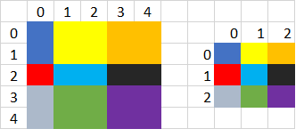

# Proposal for Fractional Pooling in DNNL

## Introduction
Fractional max-pooling is introduced by Benjamin Graham and described in
[his paper](https://arxiv.org/pdf/1412.6071.pdf).
Fractional pooling is slightly different than regular pooling. In regular
pooling, you downsize an input set by processing N x N subsections of the set
(often 2x2), and try to reduce the set by a factor of N, where N is an integer.
Fractional max pooling, as you might expect from the word "fractional", means
that the overall reduction ratio N does not have to be an integer.



### Motivation
Increase op coverage on PyTorch.

## Overview
Shapes of pooling regions can be created in two ways:
- random sequence - using random number generator
- pseudo-random sequence - using 'α' (depends on tensor shape) and random value 'u'

Moreover pooling regions can be defined as disjoint sets or overlaping with
it's neighbours.

Implementation of fractional pooling in frameworks is slightly different:
- pytorch:
```math
α = (input\_length – kernel\_length) / (output\_length – 1)
```
- tensorflow:
```math
    α = input\_length / output\_length
```

Pytorch allows to pass random 'u' while for tensorflow we can initialize RNG seed.

### Support in key frameworks
|        TensorFlow         |           PyTorch            |    MxNet    | PaddlePaddle |
|---------------------------|------------------------------|-------------|--------------|
| tf.nn.fractional_max_pool | torch.nn.FractionalMaxPool2d | Unsupported | Unsupported  |
| tf.nn.fractional_avg_pool | torch.nn.FractionalMaxPool3d |             |              |

## Proposal
The proposal is to create new primitive for fractional pooling.

### Option 1
Primitive that create internally pooling regions and allow to user to configure
all knobs.

Pros:
- looks good from user perspective view
- free user from resposibility to generate shapes

Cons:
- primitive need to support existing (and future) formulas for α
- RNG in primitve introduce level of nondeterminism

### Option 2
Primitive that gets vectors of indices (that define all pooling regions) from user.

Pros:
- very simple primitive

Cons:
- not very convenient from user

This option further can be divided by way of passing those data.

#### Option 2a
Pass indices at runtime, memories passed as primitive arguments.

Pros:
- easy to support

Cons:
- indices should not change over time so it is even more desirable to find a way
  to not pass them at run-time

#### Option 2b
Pass indices at create time via attributes. With that we can try to use existing
pooling primitive or create new one.

Cons:
- this is ugly as attributes are meant to extend primitive behavior, and here
  they define it