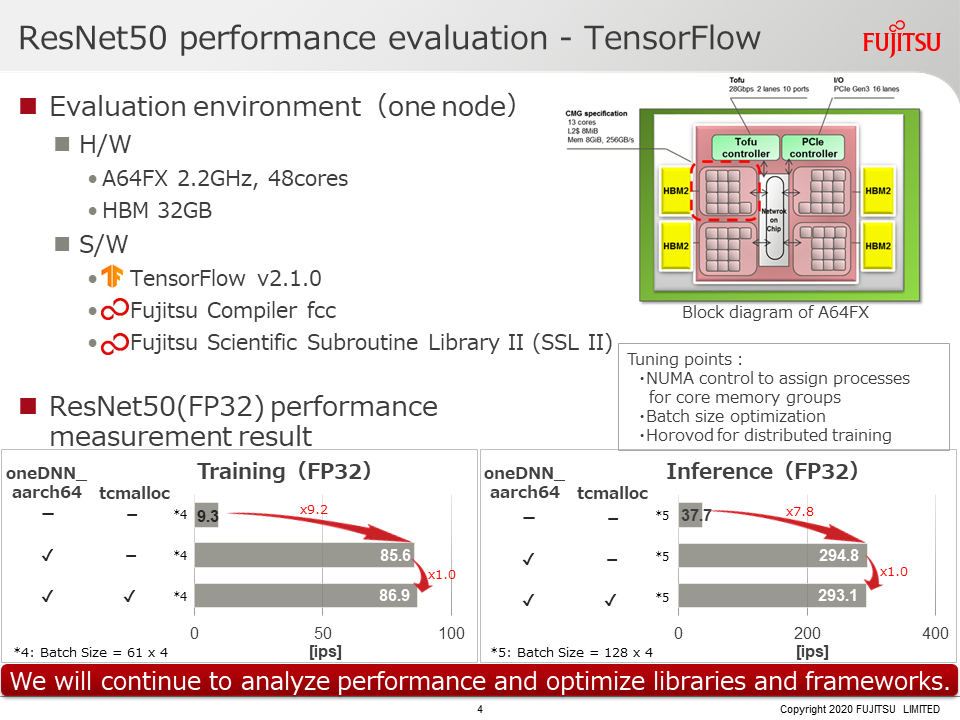
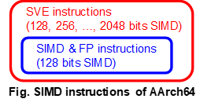

# Proposal to Introduce JIT code generation for aarch64

## Introduction

In the x64 implementation of oneDNN, the execution code is generated at runtime 
considering the available instruction set, such as AVX512/AVX2/AVX/SSE, 
and runtime parameters. oneDNN uses JIT assembler (Xbyak) to generate execution 
code. For aarch64 architecture, we has developed 
[Xbyak_aarch64](https://github.com/fujitsu/xbyak_aarch64), 
a port of Xbyak for aarch64. Xbyak_aarch64 provides the same functionality 
for aarch64 as Xbyak provides for x64. Therefore, the same functionality that 
oneDNN achieves for x64 using Xbyak can be achieved for aarch64 by Xbyak_aarch64.
**This RFC introduces Xbyak_aarch64 into oneDNN and enables JIT code generation 
for aarch64.**

We applied this methods to oneDNN v0.21 and confirms that 
the JIT code is generated on aarch64, it passes tests/gtests/test_\*, 
and it accelerates oneDNN processing as shows in the slide below.
The source code is disclosed as 
[https://github.com/fujitsu/dnnl_aarch64](https://github.com/fujitsu/dnnl_aarch64).





## Related RFCs and Issues

- [https://github.com/oneapi-src/oneDNN/tree/rfcs/rfcs/20200401-cpu-dir-structure](https://github.com/oneapi-src/oneDNN/tree/rfcs/rfcs/20200401-cpu-dir-structure)
- [https://github.com/oneapi-src/oneDNN/pull/795](https://github.com/oneapi-src/oneDNN/pull/795)
- [https://github.com/oneapi-src/oneDNN/issues/804](https://github.com/oneapi-src/oneDNN/issues/804)
- [https://github.com/oneapi-src/oneDNN/pull/811](https://github.com/oneapi-src/oneDNN/pull/811)


## Proposal

- Adding `xbyak_aarch64` to `src/cpu/aarch64`
- Adding primitive entry to `src/cpu/cpu_\*_list.cpp`
- Adding JIT implementation for aarch64 to `src/cpu/aarch64/jit_\*.\(cpp|hpp\)`

### Adding `xbyak_aarch64`  to `src/cpu/aarch64`

`Xbyak_aarch64` is available on [https://github.com/fujitsu/xbyak_aarch64/](https://github.com/fujitsu/xbyak_aarch64/).
Although `Xbyak_aarch64` can be imported to oneDNN as a git submodule, 
we prefer that the necessary files for functioning xbyak_aarch64 are directly 
included into oneDNN as same as xbyak. It means the following files are put in 
`src/cpu/aarch64/xbyak_aarch64` directory. The total file size is about 1MB.

```
src/cpu/aarch64/xbyak_aarch64
                |-- xbyak_aarch64.h
                |-- xbyak_aarch64_adr.h
                |-- xbyak_aarch64_code_array.h
                |-- xbyak_aarch64_err.h
                |-- xbyak_aarch64_gen.h
                |-- xbyak_aarch64_inner.h
                |-- xbyak_aarch64_label.h
                |-- xbyak_aarch64_meta_mnemonic.h
                |-- xbyak_aarch64_mnemonic.h
                |-- xbyak_aarch64_reg.h
```

### Adding primitive entry to `src/cpu/cpu_\*_list.cpp`

As JIT code for aarch64 is ready to be generated at this point, primitives are 
added to `src/cpu/cpu_*_list.cpp` as follows not only for convolution but also 
eltwise, batch_normalization, pooling, etc. This proposal is the same as the 
proposal in 
[#795](https://github.com/oneapi-src/oneDNN/pull/795) and the implementation 
for x64.

```
static const std::map<conv_impl_key_t, std::vector<pd_create_f>> impl_list_map {
    // FWD fp
    {{forward, f32, f32, f32}, {
        CPU_INSTANCE_X64(jit_avx512_common_dw_convolution_fwd_t)
        CPU_INSTANCE_X64(jit_avx512_common_1x1_convolution_fwd_f32_t)
        CPU_INSTANCE_X64(jit_avx512_core_f32_wino_conv_2x3_fwd_t)
        CPU_INSTANCE_X64(jit_avx512_core_f32_wino_conv_4x3_fwd_t)
        CPU_INSTANCE_X64(jit_avx512_common_convolution_winograd_fwd_t)
        CPU_INSTANCE_X64(jit_avx512_common_convolution_fwd_t<f32>)
        CPU_INSTANCE_X64(jit_avx2_dw_convolution_fwd_t)
        CPU_INSTANCE_X64(jit_avx2_1x1_convolution_fwd_t)
        CPU_INSTANCE_X64(jit_sse41_dw_convolution_fwd_t)
        CPU_INSTANCE_X64(jit_sse41_1x1_convolution_fwd_t)
        CPU_INSTANCE_X64(jit_avx2_convolution_fwd_t)
        CPU_INSTANCE_X64(jit_sse41_convolution_fwd_t)
        CPU_INSTANCE_AARCH64(jit_sve_512_common_dw_convolution_fwd_t)         <- Added
        CPU_INSTANCE_AARCH64(jit_sve_512_common_1x1_convolution_fwd_f32_t)    <- Added
        CPU_INSTANCE_AARCH64(jit_sve_512_core_f32_wino_conv_2x3_fwd_t)        <- Added
        CPU_INSTANCE_AARCH64(jit_sve_512_core_f32_wino_conv_4x3_fwd_t)        <- Added
        CPU_INSTANCE_AARCH64(jit_sve_512_common_convolution_winograd_fwd_t)   <- Added
        CPU_INSTANCE_AARCH64(jit_sve_512_common_convolution_fwd_t<f32>)       <- Added
        CPU_INSTANCE(gemm_convolution_fwd_t)
        CPU_INSTANCE(ref_convolution_fwd_t<f32>)
        CPU_INSTANCE(ref_fused_convolution_fwd_t)
        nullptr,
    }},
```

The figure below shows the types of SIMD instructions of aarch64. 
aarch64 has SIMD & FP(Floating point) instructions as 128-bit long SIMD 
instructions, and SVE instructions as more than or equal to 128-bit SIMD 
instructions.SVE and SIMD & FP instructions have relationship where SVE 
extends SIMD & FP instructions. Bit width of SVE instructions is implementation 
dependent. AArch64 specification allows for 128 *N* (*N* = 1, 2, ..., 16).



A primitive that uses only SIMD & FP instructions includes `simdfp` in 
its name.

  ~~~c++
    CPU_INSTANCE_aarch64(jit_simdfp_*)
  ~~~

A primitive that uses SVE and SIMD &FP instructions includes `aarch64_sve_B` in 
its name, where *B* is the assumed SVE bit-width. The underscore between SVE 
and *B* is for the next instruction extension, namely SVE2.

  ~~~c++
    CPU_INSTANCE_aarch64(jit_sve_B_*)
  ~~~

## Test & CI

JIT code for aarch64 can be tested in the same way as for JIT code for x64 by 
`make test` command in a build directory.

CI for aarch64 can be done using [QEMU](https://www.qemu.org/ "QEMU"). However, 
QEMU takes long time for CI, we plans to provide an aarch64 architecture server 
for CI on Internet. I'd like to make another issue or RFC to discuss this.

## Limitation

- We are currently developing for an aarch64 CPU with 512-bit SVE.
- For a CPU with aarch64 architecture that does not support any SVE 
instructions or only supports SVE instructions smaller than 512 bits, our 
implementation, for example `CPU_INSTANCE_aarch64(jit_aarch64_sve_512_*)`, 
returns `status::unimplemented` as shown in C++ code below and continues 
processing by the next entry in impl_list_map, such as 
`CPU_INSTANCE(gemm_convolution_fwd_t)`, 
`CPU_INSTANCE(ref_convolution_fwd_t<f32>)` or 
`CPU_INSTANCE(ref_fused_convolution_fwd_t)`. 
- For a CPU with aarch64 architecture that suport SVE instructions for 
more than 512 bits, our implementation sets SVE length to 512 bits*2 and 
generates and execute JIT code. 

```c++
status_t jit_aarch64_sve_512_common_1x1_conv_kernel::init_conf(jit_1x1_conv_conf_t &jcp,
        const convolution_desc_t &cd, const memory_desc_wrapper &src_d,
        const memory_desc_wrapper &weights_d, const memory_desc_wrapper &dst_d,
        const primitive_attr_t &attr, int nthreads, bool reduce_src) {
    if (!mayiuse(sve_512)) return status::unimplemented;
```

*1:
> The Scalable Vector Extension (SVE) is an optional extension to the Armv8-A 
architecture, with a base requirement of Armv8.2-A [1].

*2:
> SVE requires that an implementation must allow the vector length to be 
constrained to any power of two that is less than the maximum implemented 
vector length, but also permits an implementation to allow the vector length to 
be constrained to multiples of 128 that are not a power of two. It is 
IMPLEMENTATION DEFINED which of the permitted multiples of 128 are supported. 

The SVE for Armv8-A allows for vector lengths, 128 *N* (*N*=1, 2, ..., 16) [1]. 

## Acknowledgment
We thank S. Mitsunari (Cybozu Labs, Inc.), the developer of the original Xbyak. 
He contributed helpful advice to 
Xbyak_aarch64/dnnl_aarch64 and brushed up the source 
code.

## Reference
[1] ARM DDI 0584A.g (ID022020), Arm Architecture Reference Manual Supplement 
The Scalable Vector Extension (SVE), for Armv8-A. 
