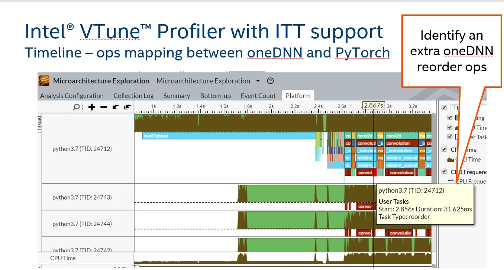
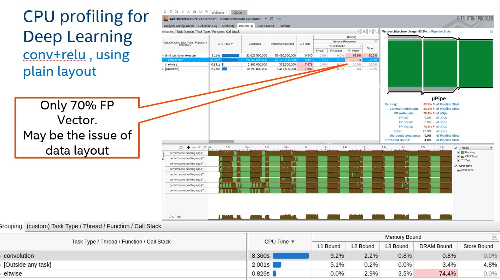
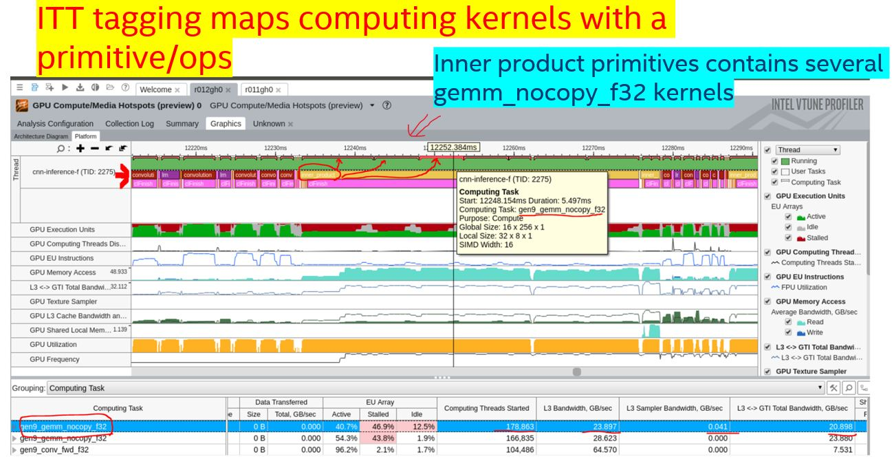

# Introducing VTune ITT tagging for primitive execution 

## Introduction

For deep learning programmers, function hotspots might not help a lot for 
analyzing their deep learning workloads. Primitives level or deep learning 
operations level hotspots mean more to deep learning developers.  
In order to provide primitives level or DL operations level information to
DL developers, we introduce ITT tagging for oneDNN primitive execution, and the feature supports both CPU and GPU.

With this ITT tagging for oneDNN primitive execution, DL developers can understand
more information from VTune for below items.

### 1. get the primitives timeline chart from VTune, and identify any protential performance issue.  
For below diagrams, you can see both convolution and reorder primitives are tagged among 
master thread and worker threads in the timeline chart.  
We also tagged the PyTorch operations, so users can easily map one PyTorch convolution ops to one 
convolution primitive and one reorder primitive.   
For optimizing performance further, users can try to avoid the extra reorder primitive identified via VTune timeline.  

### 2. get platform information such as L1/L2 cache miss or level of FP vectorization on primitive level   
For below diagram, users can group profiling results by Task Types, and then VTune will group information by
oneDNN primitives tagged as different Task Types.   
Therefore, users can see platform level detail information like FP vectorization on primitives level.  
Users can understand performance issues among each oneDNN primitives.  

### 3. map primitive with related computation kernels.  
By tagging primitives, users can also map primitive with computation kernels.  
For example, users can understand one inner primitive contains several GPU gen9_gemm_nocopy_f32 kernels.  

## Proposal

Add VTune ITT tasks for all primitives.
Users can see profiling results grouped by primitives. 
primitive grouping is more useful than function grouping to DL developers.
### Implementation
To enable VTune ITT tagging, we includes ittnotify related source files in projects https://github.com/intel/ittapi under src/common/ittnoify folder.
We also create ittnotify.cpp and ittnotify.hpp under /src/common folder to use ITT functions from copied ITT source files.
We introduce a new namespace itt under dnnl namespace.
In the same namespace we use 4 functions listed below for tagging primitives execution.

| functions  | Note |
|---------------------|---------------------|  
| void primitive_task_start(primitive_kind_t kind) |  use this function to tag start of a ITT task with primitive kind info  |
| void primitive_task_end()  |    use this function to tag end of a ITT task    |
| primitive_kind_t primitive_task_get_current_kind() |   get the primitive kind for current ITT task       |
| bool get_itt(__itt_task_level level) |    get ITT level.  enable different ITT tagging by using this level variable  |

We also define a enum type with different itt task level.  
Here is a table for meaning of all itt task levels.  

| __itt_task_level  | Note |
|---------------------|---------------------|  
| __itt_task_level_none |   no ITT event will be triggered  | 
| __itt_task_level_low  |    ITT events are only triggered in master thread     | 
| __itt_task_level_high |    ITT events are triggered in all OMP/TBB threads      |   

There is a new struct itt_task_level_t with only one int variable in it.  
~~~cpp
struct itt_task_level_t {
    int level;
};
~~~

#### Implementation details :  tag primitive execution with ITT
---
Here are pesudo codes for how we define primitive execution on master thread as a ITT task.
~~~cpp
status_t primitive_execute(
    ....
    if (itt::get_itt(itt::__itt_task_level_low))
        itt::primitive_task_start(
            primitive_iface->pd()->impl()->kind());

    .... // Primitive Execution

    if (itt::get_itt(itt::__itt_task_level_low))
        itt::primitive_task_end();
    return status;
}

~~~

### Feature Enablement
---
**Compilation Time**  

We enable this feature on compilation time by default.  
User can disable the feature by following CMake declaration at compiling time.    
DNNL_ENABLE_ITT_TASKS=False 

**Runtime**  

Users can use a environment variable to control ITT level at runtime.  

| DNNL_ITT_TASK_LEVEL   | __itt_task_level  | Note |  
|---------------|---------------------|---------------------|  
| 0   | __itt_task_level_none |   no ITT event will be triggered  | 
| 1 | __itt_task_level_low  |    ITT events are only triggered in master thread     | 
| 2 | __itt_task_level_high |    ITT events are triggered in all OMP/TBB threads (Default value)     | 

### Testing aspects
---
**Performance Number**  

We average 20 runs for each number.
For the last two tests, we made the tests without/with VTune running.
Due to profiling size limitation, VTune profiling ended very early, so we regarded the number is not applicable.

| Primitive     | Benchdnn input file                            | Baseline (no patch) | Patch + no VTune + DNNL_ITT_TASK_LEVEL=2| Patch + Vtune + DNNL_ITT_TASK_LEVEL=2 |
|---------------|------------------------------------------------|---------------------|------------------|---------------|
| Convolution   | tests/benchdnn/inputs/conv/set_perf_cpu_all_mb | 2858.6515 (stddev : 88.3)    | 2785.1985 ( stddev: 83.13)      | NA (excess 1G data size very quickly)   |
| Inner Product | tests/benchdnn/inputs/ip/perf_ip_inference_sb  | 349.4827 (stddev : 41.64)         | 349.16535 (stddev : 49.15)   | NA (excess 1G data size very quickly) |

For performance numbers with VTune running, we used much smaller tests to get VTune profiling results from start to end.

| Primitive     | Benchdnn input file                            | Baseline (no patch) | Patch + no VTune + DNNL_ITT_TASK_LEVEL=0| Patch + no VTune + DNNL_ITT_TASK_LEVEL=2| Patch + Vtune + ITT_TASK_LEVEL=2 |  
|---------------|------------------------------------------------|---------------------|------------------|------------------|---------------|
| convolution | tests/benchdnn/inputs/conv/shapes_alexnet        | 79.93 ms | 80.76 ms| 79.34 ms | 88.25 ms | 
| ip | tests/benchdnn/inputs/ip/shapes_alexnet        | 4.45 ms | 4.598 ms |4.57 ms |  6.002 ms |
| bnorm | tests/benchdnn/inputs/bnrom/shapes_resnet_50       | 51.22 ms | 51.25 ms|50.82 ms |  68.19 ms |
| matmul | tests/benchdnn/inputs/matmul/shapes_3d       | 74.7 ms | 81 ms |77.1 ms |  81.17 ms |
| softmax | tests/benchdnn/inputs/softmax/shapes_2d       | 125.29 ms | 127.9 ms|126.48 ms |  145.96 ms |
  
We indeed saw overhead when we have VTune running, and the slow down is around 75% - 90%.  
However, the performance with/without this feature is almost the same when we don't have VTune running.  
**In short, we don't see overhead to enable the feature by default without VTune running.**  

## Open Questions  

1. Should we rename environent variable DNNL_ITT? Yes. renamed it to DNNL_ITT_TASK_LEVEL. 
2. Should we set DNNL_ITT_TASK_LEVEL as __itt_task_level_high by default? Yes. 
