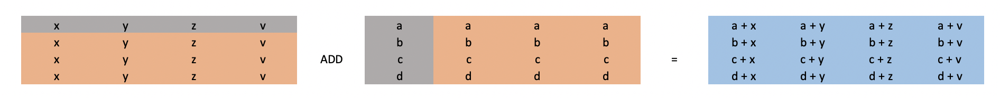

# Proposal for enable broadcast source 0 in binary

## Problem and motivation
Currently in OneDNN library binary primitive supports implicit broadcast 
semantics for source 1. It means that if some dimension has value of one, 
this value will be used to compute an operation with each point of 
source 0 for this dimension. There is also a need for enabling this functionality
for source 1 to handle binary operation on sources like `1xN` and `Mx1`. This 
will improve oneDNN integration in TensorFlow library. At this point, was 
reported, that performance (jit kernel) is not the main concern.

## Overview

### Current implementations
*  Reference implementation allows broadcast with following syntax:
   `NxCxDxHxW:N/1xC/1xD/1xH/1xW/1 -> NxCxDxHxW`
*  JIT implementation allows broadcast with following syntax:
   `NxCxDxHxW:{NxCx1x1x1,1xCx1x1x1,1x1x1x1x1} -> NxCxDxHxW`
### New implementations
*  Reference implementation allows broadcast with following syntax:
   `N/1xC/1xD/1xH/1xW/1:N/1xC/1xD/1xH/1xW/1 -> NxCxDxHxW`
### Possible future implementations (if the need is reported)
*  JIT implementation allows broadcast with following syntax:
   `{NxCxDxHxW,NxCx1x1x1,1xCx1x1x1,1x1x1x1x1}:
    {NxCxDxHxW,NxCx1x1x1,1xCx1x1x1,1x1x1x1x1} -> NxCxDxHxW`

Similarly for other formats.

## Proposal
The proposal is to extend binary primitive by removing a restriction 
on src0 broadcasting. The reference implementation will be the only 
implementation supporting this broadcasting until we have an additional 
request. The dimensions of the destination should be defined as: 
`dst_dims[d] = max(src0_dims[d], src1_dims[d])` and 
`src0_dims[d] == src1_dims[d] || one_of(1, src0_dims[d], src1_dims[d])`. Thanks 
to this, we will get backward compatibility. If user doesnt use broadcast on 
source0, source0 dimensions are the same as dst. The post-ops operations also 
remain unchanged. Optimized version of broadcast for src0 will be added upon request.

### Post-ops handle

We currently have two options on how to handle post-ops with this change:

1. Restrict binary post-op src1 md (input) to have dimension values greater 
then dst_md of original operation. This means that broadcast operation for 
src0 in case of binary post-op is prohibited, but broadcast for src1 will 
still be supported as is. (preferred)
    - Pros:
        - Very simple solution.
    - Cons:
         - Complicates integration into an application. Before this change 
         an application could match any combination of some primitive and a 
         binary primitive and fuse them together without looking into shapes. 
         After this change an application should track binary sizes and create 
         a fusion only when src0_dims are equal to dst_dims.
2. Extend binary post operation to support src0 broadcast.
    - Pros:
        - Ease of use (see cons of the first option).
    - Cons:
        - It should be supported as jit version which is supported in most 
        primitives. The absence of this would introduce a lot of complications 
        in the documentation. (Generally, with current optimized version, this 
        is not a problem.)
        - complicates post operations a lot:
            - post operation changes destination sizes of a primitive it is 
            a part of.
            - I believe implementation will be very complicated due to 
            broadcast of src0 and will require additional buffers which will 
            limit performance benefit from binary post operation.

### Any format handle

Right now dst_md is allowed to have format_kind::any which further is 
converted into src0 memory format.

1. (Recommended). Use the format of "bigger" tensor in a single broadcast case (currently, it's always src0, but it may be src1 since this feature lands). In case of double broadcasting, create a plain layout as of now, until requested something else.
2. Disable format_kind::any for dst_md in case when src0 is broadcasted.

            
