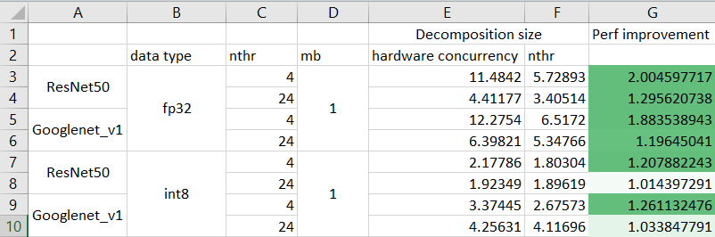

# Proposal to improve problem decomposition for Threadpool runtime.

## Background

The `Threadpool` threading in oneDNN consists in inclusion of a global object in
the library:

Global object

~~~cpp
namespace dnnl {
namespace {
    static thread_local threadpool_iface *active_threadpool = nullptr;
} // namespace 
} // namespace dnnl
~~~

A user-defined implementation of `Threadpool` (c.f. `dnnl_threadpool_impl.hpp`)
is passed to the library via stream attributes:

Stream attributes

~~~cpp
namespace dnnl {
struct stream_attr {
    void set_threadpool(threadpool_iface *threadpool);
};
} // namespace dnnl
~~~

These attributes are then passed to the stream constructor:

Stream constructor:

~~~cpp
namespace dnnl {
struct stream {
    ...

    stream(const engine &aengine, flags aflags, const stream_attr &attr);

    ...
};
} // namespace dnnl
~~~

By default, the library object points to `nullptr`. In the current programming
model in oneDNN, this object will point to a non-`nullptr` *only* in the
following cases:
1. within primitive execution whereby the user has passed a stream that contains
   a Threadpool implementation, or
2. the user has invoked `dnnl_sgemm_tp()` API by passing a pointer to a
   Threadpool implementation.

Similarly, in the current programming model in oneDNN, this object will point to
`nullptr`
1. Inside a parallel region,
2. When the user invokes the `dnnl_sgemm()` API or `dnnl_sgemm_tp()` API
   (without providing a Threadpool implementation) in the Threadpool build, and
3. During primitive execution if the user passed a stream without a Threadpool
   implementation.

## Problem statement

In the context of the Threadpool runtime, this RFC discusses two issues in the
current programming model in oneDNN.

### Primitive decomposition

Because `active_threadpool` may or may not point to `nullptr` at a given point
in time, certain *internal* functions in oneDNN will behave differently. For
instance, `dnnl_get_max_threads()` will return
`std::thread::hardware_concurrency()` if `active_threadpool == nullptr` when it
is invoked. This function can be invoked at, e.g., primitive (descriptor)
creation, primitive execution or in GEMM.

In the programming model of an application that uses oneDNN, e.g. Tensorflow, a
stream can be created (and, consequently, a Threadpool implementation is passed
to the library) *after* primitive (descriptor) creation. This means that, at
primitive (descriptor) creation, the library is unaware of a Threadpool
implementation *yet*. Therefore, any decomposition logic in oneDNN primitives
that relies on `dnnl_get_max_threads()` will be optimized for
`std::thread::hardware_concurrency()` number of threads.

However, during primitive execution the actual number of threads in the
Threadpool may (and most likely will) be different than
`std::thread::hardware_concurrency()`, meaning that the primitive may no longer
be optimized for the actual number of threads
`dnnl::threadpool_iface::get_num_threads()`. Testing indicates that this
behavior may affect primitive execution during inference, i.e. with `mb = 1` on
high throughput systems, such as AVX-512.

As an experiment, limiting the return value of `dnnl_get_max_threads()` to the
number of threads in the Threadpool yields noticeable performance improvements
(in the order of 20-30%). Below is performance comparison data for ResNet50 and
Googlenet_v1 convolutions on AVX-512, where either
`std::thread()::hardware_concurrency()` or
`dnnl::threadpool_iface::get_num_threads()` is used for primitive decomposition,
and using `dnnl::threadpool_iface::get_num_threads()` at execution.

### Thread distribution

In oneDNN, run-time thread distribution is performed using call to `parallel(0,
...);` in which case all threads in the Threadpool will be used for computation.

Depending on the implementation of the Threadpool interface in oneDNN,
additional performance issues can be observed for certain problem sizes. For
instance, Eigen threadpool [2] (if used for implementing the oneDNN threadpool
interface) has certain overhead (specifically for work scheduling), which is
very noticeable when computing small problem sizes. oneDNN makes minimal
assumptions with respect to the Threadpool implementation the user provides.
Therefore, limiting the number of threads used for `parallel(0, ...);` call in
the library using some generic cost model seems unrealistic.

## Possible solution(s)

This document proposes several solution to address the issues described above.

The options below are listed in the order of potentially higher changes in the
library to support the option.

Additional options are welcome to the list.

### Option 1: new API in `dnnl::threadpool_interop` namespace

This option proposes to introduce new API that limits the number of threads used
for problem decomposition.

C API

~~~cpp
dnnl_status_t DNNL_API dnnl_threadpool_interop_primitive_attr_create(dnnl_primitive_attr_t *attr, uint32_t max_num_threads);
~~~

C++ API

~~~cpp
namespace dnnl {
namespace threadpool_interop {

inline dnnl::primitive_attr make_primitive_attr(uint32_t max_num_threads = DNNL_MAX_THREADS) {
    dnnl_primitive_attr_t c_attr;
    dnnl::error::wrap_c_api(dnnl_threadpool_interop_primitive_attr_create(&c_attr, max_num_threads));
}

} // namespace threadpool_interop
} // namespace dnnl
~~~

The `max_num_threads` value in the primitive attributes will indicate the upper
limit for the number of threads used for decomposition in the primitive
(descriptor). The default wildcard value `DNNL_MAX_THREADS` indicates that
`dnnl_get_max_threads()` will be used internally as an upper limit.

By assigning `0` in the API, the user will instruct the library that no
threadpool will be used to execute the corresponding primitive, therefore no
decomposition will be performed and the execution will be performed by the
calling thread.

By assigning `1` or higher value in the API, the user will instruct the library
the upper limit for the number of threads for decomposition, and, during
execution, the parallel sections will be executed by the threads in the
threadpool.

In the context of primitive cache, the number of threads passed by primitive
attributes will be used to construct the cache key. In means that two primitives
created using different `max_num_threads` will both be stored in the cache as
separate implementations.

Since the implementation of this RFC can target oneDNN v2.1 at the least, it is
proposed to introduce the new API into `dnnl_threadpool.hpp`, where
Threadpool-specific API is introduced.

Pros:
- Ability to have different problem decompositions for different primitives;
- Flexibility with respect to user cost model and Threadpool implementation;
- Minimal changes required in the library;

Cons:
- Upper limit for number of threads not applicable to other threading runtimes,
  may cause some inconsistencies in the library code.

### Option 2: new primitive attributes for all CPU threading runtimes

In order to maintain consistency between threading runtimes, this option
proposes to introduce a generic primitive attribute, that instructs the library
the upper limit for thread count during primitive (descriptor) creation.

C API

~~~cpp
dnnl_primitive_attr_get_max_num_threads(const_dnnl_primitive_attr_t attr, uint32_t *max_num_threads);

dnnl_primitive_attr_set_max_num_threads(dnnl_primitive_attr_t attr, uint32_t max_num_threads);
~~~

C++ API

~~~cpp
struct primitive_attr : public handle<dnnl_primitive_attr_t> {
    ...

    uint32_t get_max_num_threads() const {}

    void set_max_num_threads(uint32_t nthr) {}

    ...
};
~~~

The value provided for the primitive attribute will be used as an upper limit
for number of threads for problem decomposition at primitive (descriptor)
creation.

The behavior of the primitive attribute will be identical to what is described
in [Option 1](#option-1-new-api-in-dnnl::threadpool_interop-namespace), however,
as mentioned above, it will be applicable for all threading runtimes.

Pros:
- Ability to have different problem decompositions for different primitives;
- Flexibility with respect to user cost model and Threadpool implementation;
- Minimal changes required in the library;
- Consistency in the code for all threading runtimes;

Cons:
- Adjusting the number of threads for OMP and TBB may not yield any performance
  benefits, making the API potentially redundant.

### Option 3: thread decomposition at execution time

For this option, use of `dnnl_get_max_threads()` inside primitive (descriptor)
constructors will be restricted for some or all primitives, thereby performing
the primitive decomposition at execution stage.

Pros:
- Dynamic thread distribution at execution time;
- No changes required on user-side;

Cons:
- It is challenging to adjust all primitives for generic decomposition, while
  maintaining high performance;
- It is not possible to adjust thread usage for `parallel(0, ...);` calls;
- Identical primitives will have the same decomposition;

EOD
