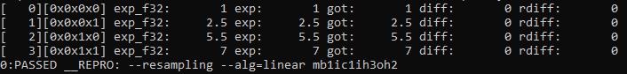
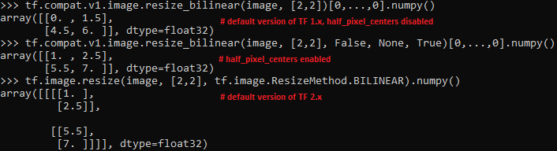

# RFC: Default ResizeBilinear behavior from TF 1.x in resampling primitive

## Introduction

Default linear algorithm in TF 1.x behaves differently than in version 2.x.
oneDNN currently supports a version compatible with TF 2.x. Some oneDNN users
learned their models based on the old and inaccurate version of the linear
algorithm from TF 1.x. Therefore, they want to use their already learned networks
based on the old algorithm. However, users which use the old TF 1.x linear algorithm
and block format are forced to run the reorder primitive every time they want to
resize an image. This causes a significant slowdown in the performance
of the entire model if resampling occurs repeatedly.

The difference between the oneDNN results and the default resizeBilinear version is
based on the assumption of where the pixel center is. oneDNN and TF 2.x assume that
the center of the pixel is halfway between the pixels. This means that e.g. the top
left pixel is at the point (0.5; 0.5). This approach produces more accurate results
than the default ResizeBilinear version. However, this did not mean that there was
no such option in TensorFlow 1.x. In TF 1.14, the `half_pixel_centers` attribute was
provided for the ResizeBilinear function. By default, it is set to false. However,
when set to true, the algorithm produces values according to the version of the
algorithm available for oneDNN and TF 2.x. Here is a link to the patch that introduced this option:
https://github.com/tensorflow/tensorflow/commit/3ae2c6691b7c6e0986d97b150c9283e5cc52c15f
Unfortunately, despite this option, some users still used the old inaccurate version,
which remained the default version up to TF version 2.x.

The results of the linear algorithm for oneDNN and the different versions of this algorithm 
in TF are presented below. The following results are based on downsampling the image from
3x3 to 2x2, where the original image was filled with the values: [[0,1,2], [3,4,5], [6,7,8]]





## Proposal

### Option 1 Adding the resampling flags in the descriptor constructor:

``` cpp
/// Flags for resampling primitive.
typedef enum {
    dnnl_resampling_flags_none = 0x0U,
    dnnl_half_pixel_centers = 0x1U,
} dnnl_resampling_flags_t;
```

``` cpp
/// Flags for resampling primitive.
enum class resampling_flags : unsigned {
    none = dnnl_resampling_flags_none,
    half_pixel_centers = dnnl_half_pixel_centers
};
```

``` cpp
...
desc(prop_kind aprop_kind, algorithm aalgorithm, unsigned flags,
        const memory::desc &src_desc, const memory::desc &dst_desc)
...
desc(prop_kind aprop_kind, algorithm aalgorithm, unsigned flags, 
        const std::vector<float> &factors, const memory::desc &src_desc)
...
desc(prop_kind aprop_kind, algorithm aalgorithm, unsigned flags,
        const std::vector<float> &factors, const memory::desc &src_desc, const memory::desc &dst_desc)
...
```

To maintain backward compatibility, instead of adding the resampling flags
to existing constructors it would be needed to increase the number
of constructors available for the resampling primitive descriptor. For
existing constructors, a flag would have half_pixel_centers as the default value.

Pros:
- Consistency attribute with TensorFlow 1.x.
- The possibility of using this information for each algorithm we support.
- Possibility to add additional flags for the resampling primitive in the future.

Cons:
- API change for resampling primitive.
- More complicated in implementation than option 2.
- In case of using C API to avoid ABI break we need to add another version of 
init function(similar to pooling primitive - version v1 and v2).

### Option 2 Adding a new algorithm for resampling, linear_no_shift:

``` cpp
typedef enum {
    ...
    dnnl_resampling_linear_no_shift = number;
    ...
} dnnl_alg_kind_t;
```

Pros:
- Change relied on increasing the number of available algorithms. This approach does
not require so many changes in API as it is done in Option 1.
- Separation of an implementation that is considered inaccurate.

Cons:
- In case of a request to add support for another algorithm with that behavior,
we would have to add another algorithm to the list(example: algorithm nearest neighbour without
half_pixel_centers behavior).

### Recommendation
I would recommend Option 2. The flag approach seems to be better since it makes
the  API more stable, but potentially we can reach a point with combinations we
don't support. It can confuse users because the combination of some flags and
algorithms will not work and the user will not know why.

## Open questions

1. I'm not sure if name dnnl_resampling_linear_no_shift is the best one.
