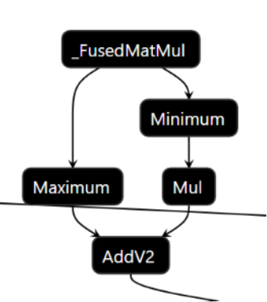

# Introducing PReLU post operation support in oneDNN

## Motivation

This paper https://arxiv.org/abs/1502.01852 introduced PReLU activation
function. The DIEN model uses PReLu as matmul activation.
This gets expanded in TF graph.


It becomes a bottleneck for the Attention layer in DIEN. Currently oneDNN
supports PReLu only as
[standalone primitive](https://oneapi-src.github.io/oneDNN/dev_guide_prelu.html).

## Proposal

Extend [supported postops list](https://oneapi-src.github.io/oneDNN/dev_guide_attributes_post_ops.html)
by adding PReLU forward inference postop.


``` cpp
    /// Appends a prelu forward post-op.
    ///
    /// The kind of this post-op is #dnnl::primitive::kind::prelu.
    ///
    /// The post-op can be defined as:
    ///
    ///      dst[:] <- prelu(dst[:], weights[:])
    ///      prelu:
    ///      dst[:] <- dst[:] if dst[:] > 0
    ///      dst[:] <- dst[:] * weights[:] if dst[:] <= 0
    ///
    ///
    /// Example usage:
    /// @code
    ///     int mb = 32, oc = 32,
    ///         oh = 14, ow = 14; // convolution output params
    ///     // unique weights per output channel
    ///     vector<float> weights = { ... };
    ///     int oc_dim = 1; // mb_dim = 0, channel_dim = 1, height_dim = 2, ...
    ///
    ///     // construct a convolution descriptor
    ///     dnnl::convolution::desc conv_d;
    ///
    ///     dnnl::primitive_attr attr;
    ///     attr.append_prelu(attr, oc, 1 << oc_dim);
    ///
    ///     dnnl::primitive_desc conv_pd(conv_d, attr, engine);
    ///     memory prelu_weights({{1}, dt::f32, {1}}, eng, weights.data());
    ///
    ///     std::unordered_map<int, memory> conv_args;
    ///
    ///     conv_args.insert(
    ///      {DNNL_ARG_ATTR_MULTIPLE_POST_OP(0) | DNNL_ARG_WEIGHTS, prelu_weights})

    /// @note
    ///     The order of dimensions does not depend on how elements are laid
    ///     out in memory. For example:
    ///     - for a 2D CNN activations tensor the order is always (n, c)
    ///     - for a 4D CNN activations tensor the order is always (n, c, h, w)
    ///     - for a 5D CNN weights tensor the order is always
    ///        (g, oc, ic, kh, kw)
    ///
    ///    Prelu weights tensor is passed in runtime execution phase. Prelu
    ///    weights tensor data type is implicitly assumed as f32 using plain
    ///    layout (a, ab, acb, acdb, acdeb)

    /// @param weights_mask Defines the correspondence between the output tensor
    ///     dimensions and the prelu weights tensor. The set i-th bit indicates
    ///     that a dedicated weights value is used for each index along that
    ///     dimension. Set the mask to 0 to use a common weights valuee
    ///     for the whole output tensor.
    void append_prelu(int weights_mask) {
        error::wrap_c_api(dnnl_post_ops_append_prelu(get(), weights_mask),
                "could not append an prelu forward post-op");
    }

    /// Returns the parameters of a prelu forward post-op.
    ///
    /// @param weights_desc Output memory descriptor of a second operand.
    void get_params_prelu(int index, int &weights_mask) const {
        const dnnl_memory_desc_t c_mask;
        error::wrap_c_api(
                dnnl_post_ops_get_params_prelu(get(), index, &c_mask),
                "could not get parameters of a prelu post-op");
        weights_mask = c_mask;
    }
```

Assumptions:
- Reuse existing mechanism to pass weights DNNL_ARG_ATTR_MULTIPLE_POST_OP(index)
| DNNL_ARG_WEIGHTS.
- Use mask mechanism (the same approach as in case output scales). At
the beginning passing memory descriptor was considered (the same
approach as in case binary post-ops). The use of the mask won because of its
simplicity. From the [paper](https://arxiv.org/pdf/1502.01852.pdf) , the
[pytorch definition](https://pytorch.org/docs/stable/generated/torch.nn.PReLU.html)
the dominant prelu weights use case is to have 1 negative slope per channel
(so layout is 1d and C). Mask approach will allow oneDNN user to avoid extra
reorders.
- Prelu weights will be passed only in the runtime phase. Possibility of passing
weights in compile-time was analyzed. No strong arguments or use cases have
been found at the moment to introduce such a possibility.
-Prelu weights tensor data type will be implicitly assumed as f32 using plain
layout (a, ab, acb, acdb, acdeb).
