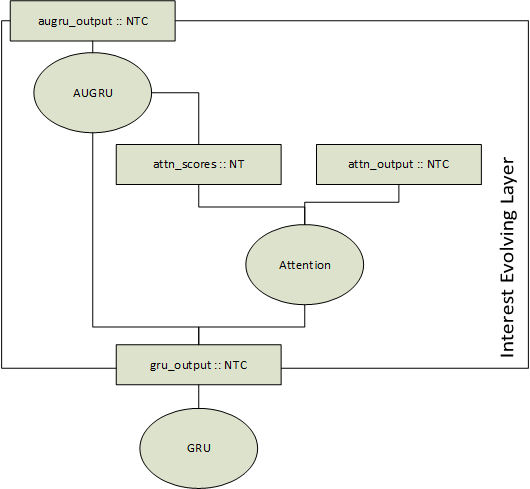
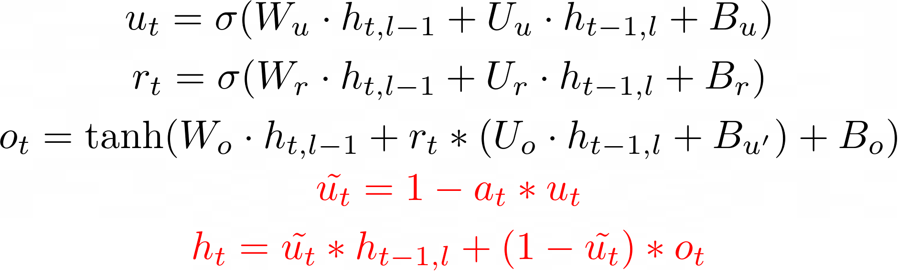

Proposal for GRU with Attentional Update in DNNL
================================================

## 1. Introduction

In addition to the regular GRU there is a notion of GRU with attentional update
gate (AUGRU) that can help to model interest evolving in Click-Through Rate
Prediction [[#1]][1].

### 1.1. DIEN model

DIEN model is a novel model used for Click-Through Rate Prediction [[#1]][1].
It consists of Behavior Layer, Interest Extractor Layer and
Interest Evolving Layer. In this proposal only Interest Evolving Layer is
covered, because this is a new part which is not covered by oneDNN.
Interest Evolving Layer consists of an attention mechanism and AUGRU:




Attention mechanism is implemented as a fully-connected network (sequence of
Matmul operations and a Softmax), hence this part is already covered by oneDNN.

### 1.2. AUGRU

AUGRU is defined by the following formula (the difference from the
regular GRU is highlighted in red):




> Warning
>
> Attention is passed not as part of source layer as it is done in Neural Machine
> Translation (NMT) models [[#3]][3], but as a separate memory which is
> applied to intermediate results (to gate U). This difference makes it impossible
> to apply attention on application side and pass the result to oneDNN RNN
> primitive.


## 2. Proposal

AUGRU can't be implemented by existing oneDNN RNN primitives and it takes a big
part of time of overall model execution, so adding it to the library will bring
performance speed-up to the models which use AUGRU.

There are at least 2 options on how we can add AUGRU support into oneDNN:
 - a. Keeping API as is, reuse `weights_peephole_desc` for `attention_desc`;
 - b. Introducing `rnn_desc_v2_t` with all necessary fields for AUGRU;
 - c. Introducing `rnn_desc_v2_t` reusing the same md for multiple purposes to save space.

__Option a is a preferred option, because it requires minimal amount of changes,
but doesnt't have any limitations.__

Attention score memory is a 2D memory with dimensions [N, T]. oneDNN AUGRU
needs to support a broadcast across the last dimension to avoid unnecessary
overhead on frameworks side. In the implementation [[#2]][2] attention score is
extended to 3D memory with dimensions [N, T, 1] before it is passed to AUGRU.

## 2.1 Common new types

```c
/// Source argument #3.
#define DNNL_ARG_SRC_3 4
/// A special mnemonic for RNN input recurrent cell attention vector. An alias for
/// #DNNL_ARG_SRC_3.
#define DNNL_ARG_AUGRU_ATTENTION DNNL_ARG_SRC_3

/// Diff Source argument #3.
#define DNNL_ARG_DIFF_SRC_3 132
/// A special mnemonic for gradient (diff) of RNN input recurrent cell attention
/// vector. An alias for #DNNL_ARG_DIFF_SRC_3.
#define DNNL_ARG_DIFF_AUGRU_ATTENTION DNNL_ARG_DIFF_SRC_3


typedef enum {
    ...,
    /// AUGRU cell
    dnnl_vanilla_augru = 0x5fff,
    /// AUGRU cell with linear before reset
    dnnl_lbr_augru = 0x6fff,
    ...,
} dnnl_alg_kind_t;
```

## 2.a.1 API Changes

Attention memory descriptor can be built from existing `rnn_desc_t` fields (memory
descriptors, cell kind, direction, propagation kind, etc.). Taking into account
this fact and to avoid breaking changes an attention memory descriptor will
reuse `weights_peephole_desc`.
 * Pros:
   - Minimal API changes
 * Cons:
   - Introduces an ambiguity in `rnn_desc_t`, because `weights_peephole_desc` is
     used as a placeholder for `attention_desc`, which is an internal knowledge

### 2.a.2. New types

N/A

### 2.a.3. C API

```c
/// Initializes a descriptor for AUGRU forward propagation primitive.
///
/// The following arguments may either be @c NULL or point to a zero memory
/// descriptor:
/// - @p src_iter_desc,
/// - @p bias_desc,
/// - @p dst_iter_desc.
///
/// This would then indicate that the AUGRU forward propagation primitive should
/// not use them and should default to zero values instead.
///
/// @note
///     All memory descriptors can be initialized with
///     #dnnl_format_tag_any or with format_kind set to #dnnl_format_kind_any.
///
/// @param rnn_desc Output descriptor for AUGRU primitive.
/// @param prop_kind Propagation kind. Possible values are
///     #dnnl_forward_training and #dnnl_forward_inference.
/// @param direction RNN direction. See @ref dnnl_rnn_direction_t for more
///     info.
/// @param src_layer_desc Memory descriptor for the input vector.
/// @param src_iter_desc Memory descriptor for the input recurrent hidden
///     state vector.
/// @param attention_desc Memory descriptor for the attention vector.
/// @param weights_layer_desc Memory descriptor for the weights applied to the
///     layer input.
/// @param weights_iter_desc Memory descriptor for the weights applied to the
///     recurrent input.
/// @param bias_desc Bias memory descriptor.
/// @param dst_layer_desc Memory descriptor for the output vector.
/// @param dst_iter_desc Memory descriptor for the output recurrent hidden
///     state vector.
/// @param flags Unused.
/// @returns #dnnl_success on success and a status describing the error
///     otherwise.
dnnl_status_t DNNL_API dnnl_augru_forward_desc_init(dnnl_rnn_desc_t *rnn_desc,
        dnnl_prop_kind_t prop_kind, dnnl_rnn_direction_t direction,
        const dnnl_memory_desc_t *src_layer_desc,
        const dnnl_memory_desc_t *src_iter_desc,
        const dnnl_memory_desc_t *attention_desc,
        const dnnl_memory_desc_t *weights_layer_desc,
        const dnnl_memory_desc_t *weights_iter_desc,
        const dnnl_memory_desc_t *bias_desc,
        const dnnl_memory_desc_t *dst_layer_desc,
        const dnnl_memory_desc_t *dst_iter_desc, unsigned flags);

/// Initializes a descriptor for AUGRU backward propagation primitive.
///
/// The following arguments may either be @c NULL or point to a zero memory
/// descriptor:
/// - @p src_iter_desc together with @p diff_src_iter_desc,
/// - @p bias_desc together with @p diff_bias_desc,
/// - @p dst_iter_desc together with @p diff_dst_iter_desc.
///
/// This would then indicate that the AUGRU backward propagation primitive
/// should not use them and should default to zero values instead.
///
/// @note
///     All memory descriptors can be initialized with
///     #dnnl_format_tag_any or with format_kind set to #dnnl_format_kind_any.
///
/// @param rnn_desc Output descriptor for AUGRU primitive.
/// @param prop_kind Propagation kind. Must be #dnnl_backward.
/// @param direction RNN direction. See @ref dnnl_rnn_direction_t for more
///     info.
/// @param src_layer_desc Memory descriptor for the input vector.
/// @param src_iter_desc Memory descriptor for the input recurrent hidden
///     state vector.
/// @param attention_desc Memory descriptor for the attention vector.
/// @param weights_layer_desc Memory descriptor for the weights applied to the
///     layer input.
/// @param weights_iter_desc Memory descriptor for the weights applied to the
///     recurrent input.
/// @param bias_desc Bias memory descriptor.
/// @param dst_layer_desc Memory descriptor for the output vector.
/// @param dst_iter_desc Memory descriptor for the output recurrent hidden
///     state vector.
/// @param diff_src_layer_desc Memory descriptor for the diff of input vector.
/// @param diff_src_iter_desc Memory descriptor for the diff of input recurrent
///     hidden state vector.
/// @param diff_attention_desc Memory descriptor for the diff of attention vector.
/// @param diff_weights_layer_desc Memory descriptor for the diff of weights
///     applied to the layer input.
/// @param diff_weights_iter_desc Memory descriptor for the diff of weights
///     applied to the recurrent input.
/// @param diff_bias_desc Diff bias memory descriptor.
/// @param diff_dst_layer_desc Memory descriptor for the diff of output
///     vector.
/// @param diff_dst_iter_desc Memory descriptor for the diff of output
///     recurrent hidden state vector.
/// @param flags Unused.
/// @returns #dnnl_success on success and a status describing the error
///     otherwise.
dnnl_status_t DNNL_API dnnl_augru_backward_desc_init(dnnl_rnn_desc_t *rnn_desc,
        dnnl_prop_kind_t prop_kind, dnnl_rnn_direction_t direction,
        const dnnl_memory_desc_t *src_layer_desc,
        const dnnl_memory_desc_t *src_iter_desc,
        const dnnl_memory_desc_t *attention_desc,
        const dnnl_memory_desc_t *weights_layer_desc,
        const dnnl_memory_desc_t *weights_iter_desc,
        const dnnl_memory_desc_t *bias_desc,
        const dnnl_memory_desc_t *dst_layer_desc,
        const dnnl_memory_desc_t *dst_iter_desc,
        const dnnl_memory_desc_t *diff_src_layer_desc,
        const dnnl_memory_desc_t *diff_src_iter_desc,
        const dnnl_memory_desc_t *diff_attention_desc,
        const dnnl_memory_desc_t *diff_weights_layer_desc,
        const dnnl_memory_desc_t *diff_weights_iter_desc,
        const dnnl_memory_desc_t *diff_bias_desc,
        const dnnl_memory_desc_t *diff_dst_layer_desc,
        const dnnl_memory_desc_t *diff_dst_iter_desc, unsigned flags);

/// Initializes a descriptor for LBR AUGRU forward propagation primitive.
///
/// The following arguments may either be @c NULL or point to a zero memory
/// descriptor:
/// - @p src_iter_desc,
/// - @p bias_desc,
/// - @p dst_iter_desc.
///
/// This would then indicate that the LBR AUGRU forward propagation primitive
/// should not use them and should default to zero values instead.
///
/// @param rnn_desc Output descriptor for LBR AUGRU primitive.
/// @param prop_kind Propagation kind. Possible values are
///     #dnnl_forward_training and #dnnl_forward_inference.
/// @param direction RNN direction. See @ref dnnl_rnn_direction_t for more
///     info.
/// @param src_layer_desc Memory descriptor for the input vector.
/// @param src_iter_desc Memory descriptor for the input recurrent hidden
///     state vector.
/// @param attention_desc Memory descriptor for the attention vector.
/// @param weights_layer_desc Memory descriptor for the weights applied to the
///     layer input.
/// @param weights_iter_desc Memory descriptor for the weights applied to the
///     recurrent input.
/// @param bias_desc Bias memory descriptor.
/// @param dst_layer_desc Memory descriptor for the output vector.
/// @param dst_iter_desc Memory descriptor for the output recurrent hidden
///     state vector.
/// @param flags Unused.
/// @returns #dnnl_success on success and a status describing the error
///     otherwise.
dnnl_status_t DNNL_API dnnl_lbr_augru_forward_desc_init(
        dnnl_rnn_desc_t *rnn_desc, dnnl_prop_kind_t prop_kind,
        dnnl_rnn_direction_t direction,
        const dnnl_memory_desc_t *src_layer_desc,
        const dnnl_memory_desc_t *src_iter_desc,
        const dnnl_memory_desc_t *attention_desc,
        const dnnl_memory_desc_t *weights_layer_desc,
        const dnnl_memory_desc_t *weights_iter_desc,
        const dnnl_memory_desc_t *bias_desc,
        const dnnl_memory_desc_t *dst_layer_desc,
        const dnnl_memory_desc_t *dst_iter_desc, unsigned flags);

/// Initializes a descriptor for LBR AUGRU backward propagation primitive.
///
/// The following arguments may either be @c NULL or point to a zero memory
/// descriptor:
/// - @p src_iter_desc together with @p diff_src_iter_desc,
/// - @p bias_desc together with @p diff_bias_desc,
/// - @p dst_iter_desc together with @p diff_dst_iter_desc.
///
/// This would then indicate that the LBR AUGRU backward propagation primitive
/// should not use them and should default to zero values instead.
///
/// @note
///     All memory descriptors can be initialized with
///     #dnnl_format_tag_any or with format_kind set to #dnnl_format_kind_any.
///
/// @param rnn_desc Output descriptor for LBR AUGRU primitive.
/// @param prop_kind Propagation kind. Must be #dnnl_backward.
/// @param direction RNN direction. See @ref dnnl_rnn_direction_t for more
///     info.
/// @param src_layer_desc Memory descriptor for the input vector.
/// @param src_iter_desc Memory descriptor for the input recurrent hidden
///     state vector.
/// @param attention_desc Memory descriptor for the attention vector.
/// @param weights_layer_desc Memory descriptor for the weights applied to the
///     layer input.
/// @param weights_iter_desc Memory descriptor for the weights applied to the
///     recurrent input.
/// @param bias_desc Bias memory descriptor.
/// @param dst_layer_desc Memory descriptor for the output vector.
/// @param dst_iter_desc Memory descriptor for the output recurrent hidden
///     state vector.
/// @param diff_src_layer_desc Memory descriptor for the diff of input vector.
/// @param diff_src_iter_desc Memory descriptor for the diff of input recurrent
///     hidden state vector.
/// @param diff_attention_desc Memory descriptor for the diff of attention vector.
/// @param diff_weights_layer_desc Memory descriptor for the diff of weights
///     applied to the layer input.
/// @param diff_weights_iter_desc Memory descriptor for the diff of weights
///     applied to the recurrent input.
/// @param diff_bias_desc Diff bias memory descriptor.
/// @param diff_dst_layer_desc Memory descriptor for the diff of output
///     vector.
/// @param diff_dst_iter_desc Memory descriptor for the diff of output
///     recurrent hidden state vector.
/// @param flags Unused.
/// @returns #dnnl_success on success and a status describing the error
///     otherwise.
dnnl_status_t DNNL_API dnnl_lbr_augru_backward_desc_init(
        dnnl_rnn_desc_t *rnn_desc, dnnl_prop_kind_t prop_kind,
        dnnl_rnn_direction_t direction,
        const dnnl_memory_desc_t *src_layer_desc,
        const dnnl_memory_desc_t *src_iter_desc,
        const dnnl_memory_desc_t *attention_desc,
        const dnnl_memory_desc_t *weights_layer_desc,
        const dnnl_memory_desc_t *weights_iter_desc,
        const dnnl_memory_desc_t *bias_desc,
        const dnnl_memory_desc_t *dst_layer_desc,
        const dnnl_memory_desc_t *dst_iter_desc,
        const dnnl_memory_desc_t *diff_src_layer_desc,
        const dnnl_memory_desc_t *diff_src_iter_desc,
        const dnnl_memory_desc_t *diff_attention_desc,
        const dnnl_memory_desc_t *diff_weights_layer_desc,
        const dnnl_memory_desc_t *diff_weights_iter_desc,
        const dnnl_memory_desc_t *diff_bias_desc,
        const dnnl_memory_desc_t *diff_dst_layer_desc,
        const dnnl_memory_desc_t *diff_dst_iter_desc, unsigned flags);
```


### 2.a.4. C++ API

<details>
<summary> dnnl.hpp </summary>
<p>

```cpp
/// AUGRU forward propagation primitive.
struct augru_forward : public primitive {
    /// Descriptor for a AUGRU forward propagation primitive.
    struct desc {
        dnnl_rnn_desc_t data;

        /// Constructs a descriptor for a AUGRU forward propagation primitive.
        ///
        /// The following arguments may point to a zero memory descriptor:
        /// - @p src_iter_desc,
        /// - @p bias_desc,
        /// - @p dst_iter_desc.
        ///
        /// This would then indicate that the AUGRU forward propagation
        /// primitive should not use them and should default to zero values
        /// instead.
        ///
        /// @note
        ///     All memory descriptors except @p src_iter_desc may be
        ///     initialized with an #dnnl::memory::format_tag::any value of @p
        ///     format_tag.
        ///
        /// @param aprop_kind Propagation kind. Possible values are
        ///     #dnnl::prop_kind::forward_training, and
        ///     #dnnl::prop_kind::forward_inference.
        /// @param direction RNN direction. See @ref dnnl::rnn_direction for
        ///     more info.
        /// @param src_layer_desc Memory descriptor for the input vector.
        /// @param src_iter_desc Memory descriptor for the input recurrent
        ///     hidden state vector.
        /// @param attention_desc Memory descriptor for the attention vector.
        /// @param weights_layer_desc Memory descriptor for the weights
        ///     applied to the layer input.
        /// @param weights_iter_desc Memory descriptor for the weights applied
        ///     to the recurrent input.
        /// @param bias_desc Bias memory descriptor.
        /// @param dst_layer_desc Memory descriptor for the output vector.
        /// @param dst_iter_desc Memory descriptor for the output recurrent
        ///     hidden state vector.
        /// @param flags Unused.
        desc(prop_kind aprop_kind, rnn_direction direction,
                const memory::desc &src_layer_desc,
                const memory::desc &src_iter_desc,
                const memory::desc &attention_desc,
                const memory::desc &weights_layer_desc,
                const memory::desc &weights_iter_desc,
                const memory::desc &bias_desc,
                const memory::desc &dst_layer_desc,
                const memory::desc &dst_iter_desc,
                rnn_flags flags = rnn_flags::undef) {
            error::wrap_c_api(
                    dnnl_augru_forward_desc_init(&data,
                            dnnl::convert_to_c(aprop_kind),
                            dnnl::convert_to_c(direction), &src_layer_desc.data,
                            &attention_desc.data, &src_iter_desc.data,
                            &weights_layer_desc.data, &weights_iter_desc.data,
                            &bias_desc.data, &dst_layer_desc.data,
                            &dst_iter_desc.data, dnnl::convert_to_c(flags)),
                    "could not create a descriptor for a AUGRU forward "
                    "propagation primitive");
        }
    };

    /// Primitive descriptor for a AUGRU forward propagation primitive.
    struct primitive_desc : public rnn_primitive_desc_base {
        /// Default constructor. Produces an empty object.
        primitive_desc() = default;

        /// Constructs a primitive descriptor for a AUGRU forward propagation
        /// primitive.
        ///
        /// @param adesc Descriptor for a AUGRU forward propagation primitive.
        /// @param aengine Engine to use.
        /// @param allow_empty A flag signifying whether construction is
        ///     allowed to fail without throwing an exception. In this case an
        ///     empty object will be produced. This flag is optional and
        ///     defaults to false.
        primitive_desc(const desc &adesc, const engine &aengine,
                bool allow_empty = false)
            : rnn_primitive_desc_base(
                    &adesc.data, nullptr, aengine, nullptr, allow_empty) {}

        /// Constructs a primitive descriptor for a AUGRU forward propagation
        /// primitive.
        ///
        /// @param adesc Descriptor for a AUGRU forward propagation primitive.
        /// @param attr Primitive attributes to use.
        /// @param aengine Engine to use.
        /// @param allow_empty A flag signifying whether construction is
        ///     allowed to fail without throwing an exception. In this case an
        ///     empty object will be produced. This flag is optional and
        ///     defaults to false.
        primitive_desc(const desc &adesc, const primitive_attr &attr,
                const engine &aengine, bool allow_empty = false)
            : rnn_primitive_desc_base(
                    &adesc.data, &attr, aengine, nullptr, allow_empty) {}

        /// Constructs a primitive descriptor for a AUGRU forward propagation
        /// primitive from a C API primitive descriptor that must have a
        /// matching kind.
        ///
        /// @param pd C API primitive descriptor for a AUGRU forward
        ///     propagation primitive.
        primitive_desc(dnnl_primitive_desc_t pd)
            : rnn_primitive_desc_base(pd, dnnl::prop_kind::forward_training,
                    dnnl::prop_kind::forward_inference,
                    dnnl::algorithm::vanilla_augru) {}

        /// @copydoc dnnl::rnn_primitive_desc_base::src_layer_desc()const
        memory::desc src_layer_desc() const {
            return rnn_base::src_layer_desc();
        }

        /// @copydoc dnnl::rnn_primitive_desc_base::src_iter_desc()const
        memory::desc src_iter_desc() const { return rnn_base::src_iter_desc(); }

        /// @copydoc dnnl::rnn_primitive_desc_base::attention_desc()const
        memory::desc attention_desc() const {
            return rnn_base::attention_desc();
        }

        /// @copydoc dnnl::rnn_primitive_desc_base::weights_layer_desc()const
        memory::desc weights_layer_desc() const {
            return rnn_base::weights_layer_desc();
        }

        /// @copydoc dnnl::rnn_primitive_desc_base::weights_iter_desc()const
        memory::desc weights_iter_desc() const {
            return rnn_base::weights_iter_desc();
        }

        /// @copydoc dnnl::rnn_primitive_desc_base::bias_desc()const
        memory::desc bias_desc() const { return rnn_base::bias_desc(); }

        /// @copydoc dnnl::rnn_primitive_desc_base::dst_layer_desc()const
        memory::desc dst_layer_desc() const {
            return rnn_base::dst_layer_desc();
        }

        /// @copydoc dnnl::rnn_primitive_desc_base::dst_iter_desc()const
        memory::desc dst_iter_desc() const { return rnn_base::dst_iter_desc(); }

        /// @copydoc dnnl::rnn_primitive_desc_base::workspace_desc()const
        memory::desc workspace_desc() const {
            return rnn_base::workspace_desc();
        }
    };

    /// Default constructor. Produces an empty object.
    augru_forward() = default;

    /// Constructs a AUGRU forward propagation primitive.
    /// @param pd Primitive descriptor for a AUGRU forward propagation
    ///     primitive.
    augru_forward(const primitive_desc &pd) : primitive(pd) {}
};

/// AUGRU backward propagation primitive.
struct augru_backward : public primitive {
    /// Descriptor for a AUGRU backward propagation primitive.
    struct desc {
        dnnl_rnn_desc_t data;

        /// Constructs a descriptor for a AUGRU backward propagation primitive.
        ///
        /// The following arguments may point to a zero memory descriptor:
        /// - @p src_iter_desc together with @p diff_src_iter_desc,
        /// - @p bias_desc together with @p diff_bias_desc,
        /// - @p dst_iter_desc together with @p diff_dst_iter_desc.
        ///
        /// This would then indicate that the AUGRU backward propagation
        /// primitive should not use them and should default to zero values
        /// instead.
        ///
        /// @note
        ///     All memory descriptors may be initialized with
        ///     #dnnl::memory::format_tag::any value of @p format_tag.
        ///
        /// @param aprop_kind Propagation kind. Must be
        ///     #dnnl::prop_kind::backward.
        /// @param direction RNN direction. See @ref dnnl::rnn_direction for
        ///     more info.
        /// @param src_layer_desc Memory descriptor for the input vector.
        /// @param src_iter_desc Memory descriptor for the input recurrent
        ///     hidden state vector.
        /// @param attention_desc Memory descriptor for the attention vector.
        /// @param weights_layer_desc Memory descriptor for the weights
        ///     applied to the layer input.
        /// @param weights_iter_desc Memory descriptor for the weights applied
        ///     to the recurrent input.
        /// @param bias_desc Bias memory descriptor.
        /// @param dst_layer_desc Memory descriptor for the output vector.
        /// @param dst_iter_desc Memory descriptor for the output recurrent
        ///     hidden state vector.
        /// @param diff_src_layer_desc Memory descriptor for the diff of input
        ///     vector.
        /// @param diff_src_iter_desc Memory descriptor for the diff of input
        ///     recurrent hidden state vector.
        /// @param diff_attention_desc Memory descriptor for the diff of
        ///     attention vector.
        /// @param diff_weights_layer_desc Memory descriptor for the diff of
        ///     weights applied to the layer input.
        /// @param diff_weights_iter_desc Memory descriptor for the diff of
        ///     weights applied to the recurrent input.
        /// @param diff_bias_desc Diff bias memory descriptor.
        /// @param diff_dst_layer_desc Memory descriptor for the diff of
        ///     output vector.
        /// @param diff_dst_iter_desc Memory descriptor for the diff of output
        ///     recurrent hidden state vector.
        /// @param flags Unused.
        desc(prop_kind aprop_kind, rnn_direction direction,
                const memory::desc &src_layer_desc,
                const memory::desc &src_iter_desc,
                const memory::desc &attention_desc,
                const memory::desc &weights_layer_desc,
                const memory::desc &weights_iter_desc,
                const memory::desc &bias_desc,
                const memory::desc &dst_layer_desc,
                const memory::desc &dst_iter_desc,
                const memory::desc &diff_src_layer_desc,
                const memory::desc &diff_src_iter_desc,
                const memory::desc &diff_attention_desc,
                const memory::desc &diff_weights_layer_desc,
                const memory::desc &diff_weights_iter_desc,
                const memory::desc &diff_bias_desc,
                const memory::desc &diff_dst_layer_desc,
                const memory::desc &diff_dst_iter_desc,
                rnn_flags flags = rnn_flags::undef) {
            error::wrap_c_api(
                    dnnl_augru_backward_desc_init(&data,
                            dnnl::convert_to_c(aprop_kind),
                            dnnl::convert_to_c(direction), &src_layer_desc.data,
                            &src_iter_desc.data, &attention_desc.data,
                            &weights_layer_desc.data, &weights_iter_desc.data,
                            &bias_desc.data, &dst_layer_desc.data,
                            &dst_iter_desc.data, &diff_src_layer_desc.data,
                            &diff_src_iter_desc.data, &diff_attention_desc.data,
                            &diff_weights_layer_desc.data,
                            &diff_weights_iter_desc.data, &diff_bias_desc.data,
                            &diff_dst_layer_desc.data, &diff_dst_iter_desc.data,
                            dnnl::convert_to_c(flags)),
                    "could not create a descriptor for a AUGRU backward "
                    "propagation primitive");
        }
    };

    /// Primitive descriptor for a AUGRU backward propagation primitive.
    struct primitive_desc : public rnn_primitive_desc_base {
        /// Default constructor. Produces an empty object.
        primitive_desc() = default;

        /// Constructs a primitive descriptor for a AUGRU backward propagation
        /// primitive.
        ///
        /// @param adesc Descriptor for a AUGRU backward propagation primitive.
        /// @param aengine Engine to use.
        /// @param hint_fwd_pd Primitive descriptor for a AUGRU
        ///     forward propagation primitive. It is used as a hint for
        ///     deciding which memory format to use.
        /// @param allow_empty A flag signifying whether construction is
        ///     allowed to fail without throwing an exception. In this case an
        ///     empty object will be produced. This flag is optional and
        ///     defaults to false.
        primitive_desc(const desc &adesc, const engine &aengine,
                const augru_forward::primitive_desc &hint_fwd_pd,
                bool allow_empty = false)
            : rnn_primitive_desc_base(&adesc.data, nullptr, aengine,
                    hint_fwd_pd.get(), allow_empty) {}

        /// Constructs a primitive descriptor for a AUGRU backward propagation
        /// primitive.
        ///
        /// @param adesc Descriptor for a AUGRU backward propagation primitive.
        /// @param attr Primitive attributes to use.
        /// @param aengine Engine to use.
        /// @param hint_fwd_pd Primitive descriptor for a AUGRU
        ///     forward propagation primitive. It is used as a hint for
        ///     deciding which memory format to use.
        /// @param allow_empty A flag signifying whether construction is
        ///     allowed to fail without throwing an exception. In this case an
        ///     empty object will be produced. This flag is optional and
        ///     defaults to false.
        primitive_desc(const desc &adesc, const primitive_attr &attr,
                const engine &aengine,
                const augru_forward::primitive_desc &hint_fwd_pd,
                bool allow_empty = false)
            : rnn_primitive_desc_base(&adesc.data, &attr, aengine,
                    hint_fwd_pd.get(), allow_empty) {}

        /// Constructs a primitive descriptor for a AUGRU backward propagation
        /// primitive from a C API primitive descriptor that must have a
        /// matching kind.
        ///
        /// @param pd C API primitive descriptor for a AUGRU backward
        ///     propagation primitive.
        primitive_desc(dnnl_primitive_desc_t pd)
            : rnn_primitive_desc_base(pd, dnnl::prop_kind::backward,
                    dnnl::algorithm::vanilla_augru) {}

        /// @copydoc dnnl::rnn_primitive_desc_base::src_layer_desc()const
        memory::desc src_layer_desc() const {
            return rnn_base::src_layer_desc();
        }

        /// @copydoc dnnl::rnn_primitive_desc_base::src_iter_desc()const
        memory::desc src_iter_desc() const { return rnn_base::src_iter_desc(); }

        /// @copydoc dnnl::rnn_primitive_desc_base::attention_desc()const
        memory::desc attention_desc() const {
            return rnn_base::attention_desc();
        }

        /// @copydoc dnnl::rnn_primitive_desc_base::weights_layer_desc()const
        memory::desc weights_layer_desc() const {
            return rnn_base::weights_layer_desc();
        }

        /// @copydoc dnnl::rnn_primitive_desc_base::weights_iter_desc()const
        memory::desc weights_iter_desc() const {
            return rnn_base::weights_iter_desc();
        }

        /// @copydoc dnnl::rnn_primitive_desc_base::bias_desc()const
        memory::desc bias_desc() const { return rnn_base::bias_desc(); }

        /// @copydoc dnnl::rnn_primitive_desc_base::dst_layer_desc()const
        memory::desc dst_layer_desc() const {
            return rnn_base::dst_layer_desc();
        }

        /// @copydoc dnnl::rnn_primitive_desc_base::dst_iter_desc()const
        memory::desc dst_iter_desc() const { return rnn_base::dst_iter_desc(); }

        /// @copydoc dnnl::rnn_primitive_desc_base::workspace_desc()const
        memory::desc workspace_desc() const {
            return rnn_base::workspace_desc();
        }

        /// @copydoc dnnl::rnn_primitive_desc_base::diff_src_layer_desc()const
        memory::desc diff_src_layer_desc() const {
            return rnn_base::diff_src_layer_desc();
        }

        /// @copydoc dnnl::rnn_primitive_desc_base::diff_src_iter_desc()const
        memory::desc diff_src_iter_desc() const {
            return rnn_base::diff_src_iter_desc();
        }

        /// @copydoc dnnl::rnn_primitive_desc_base::diff_attention_desc()const
        memory::desc diff_attention_desc() const {
            return rnn_base::diff_attention_desc();
        }

        /// @copydoc dnnl::rnn_primitive_desc_base::diff_weights_layer_desc()const
        memory::desc diff_weights_layer_desc() const {
            return rnn_base::diff_weights_layer_desc();
        }

        /// @copydoc dnnl::rnn_primitive_desc_base::diff_weights_iter_desc()const
        memory::desc diff_weights_iter_desc() const {
            return rnn_base::diff_weights_iter_desc();
        }

        /// @copydoc dnnl::rnn_primitive_desc_base::diff_bias_desc()const
        memory::desc diff_bias_desc() const {
            return rnn_base::diff_bias_desc();
        }

        /// @copydoc dnnl::rnn_primitive_desc_base::diff_dst_layer_desc()const
        memory::desc diff_dst_layer_desc() const {
            return rnn_base::diff_dst_layer_desc();
        }

        /// @copydoc dnnl::rnn_primitive_desc_base::diff_dst_iter_desc()const
        memory::desc diff_dst_iter_desc() const {
            return rnn_base::diff_dst_iter_desc();
        }
    };

    /// Default constructor. Produces an empty object.
    augru_backward() = default;

    /// Constructs a AUGRU backward propagation primitive.
    /// @param pd Primitive descriptor for a AUGRU backward propagation
    ///     primitive.
    augru_backward(const primitive_desc &pd) : primitive(pd) {}
};

/// LBR AUGRU forward propagation primitive.
struct lbr_augru_forward : public primitive {
    /// Descriptor for an LBR AUGRU forward propagation primitive.
    struct desc {
        dnnl_rnn_desc_t data;

        /// Constructs a descriptor for LBR AUGRU forward propagation primitive.
        ///
        /// The following arguments may point to a zero memory descriptor:
        /// - @p src_iter_desc,
        /// - @p bias_desc,
        /// - @p dst_iter_desc.
        ///
        /// This would then indicate that the LBR AUGRU forward propagation
        /// primitive should not use them and should default to zero values
        /// instead.
        ///
        /// @note
        ///     All memory descriptors except @p src_iter_desc may be
        ///     initialized with an #dnnl::memory::format_tag::any value of @p
        ///     format_tag.
        ///
        /// @param aprop_kind Propagation kind. Possible values are
        ///     #dnnl::prop_kind::forward_training, and
        ///     #dnnl::prop_kind::forward_inference.
        /// @param direction RNN direction. See @ref dnnl::rnn_direction for
        ///     more info.
        /// @param src_layer_desc Memory descriptor for the input vector.
        /// @param src_iter_desc Memory descriptor for the input recurrent
        ///     hidden state vector.
        /// @param attention_desc Memory descriptor for the attention vector.
        /// @param weights_layer_desc Memory descriptor for the weights
        ///     applied to the layer input.
        /// @param weights_iter_desc Memory descriptor for the weights applied
        ///     to the recurrent input.
        /// @param bias_desc Bias memory descriptor.
        /// @param dst_layer_desc Memory descriptor for the output vector.
        /// @param dst_iter_desc Memory descriptor for the output recurrent
        ///     hidden state vector.
        /// @param flags Unused.
        desc(prop_kind aprop_kind, rnn_direction direction,
                const memory::desc &src_layer_desc,
                const memory::desc &src_iter_desc,
                const memory::desc &attention_desc,
                const memory::desc &weights_layer_desc,
                const memory::desc &weights_iter_desc,
                const memory::desc &bias_desc,
                const memory::desc &dst_layer_desc,
                const memory::desc &dst_iter_desc,
                rnn_flags flags = rnn_flags::undef) {
            error::wrap_c_api(
                    dnnl_lbr_augru_forward_desc_init(&data,
                            dnnl::convert_to_c(aprop_kind),
                            dnnl::convert_to_c(direction), &src_layer_desc.data,
                            &src_iter_desc.data, &attention_desc.data,
                            &weights_layer_desc.data, &weights_iter_desc.data,
                            &bias_desc.data, &dst_layer_desc.data,
                            &dst_iter_desc.data, dnnl::convert_to_c(flags)),
                    "could not create a descriptor for an LBR AUGRU forward "
                    "propagation primitive");
        }
    };

    /// Primitive descriptor for an LBR AUGRU forward propagation primitive.
    struct primitive_desc : public rnn_primitive_desc_base {
        /// Default constructor. Produces an empty object.
        primitive_desc() = default;

        /// Constructs a primitive descriptor for a LBR AUGRU forward
        /// propagation primitive.
        ///
        /// @param adesc Descriptor for a LBR AUGRU forward propagation
        ///     primitive.
        /// @param aengine Engine to use.
        /// @param allow_empty A flag signifying whether construction is
        ///     allowed to fail without throwing an exception. In this case an
        ///     empty object will be produced. This flag is optional and
        ///     defaults to false.
        primitive_desc(const desc &adesc, const engine &aengine,
                bool allow_empty = false)
            : rnn_primitive_desc_base(
                    &adesc.data, nullptr, aengine, nullptr, allow_empty) {}

        /// Constructs a primitive descriptor for a LBR AUGRU forward
        /// propagation primitive.
        ///
        /// @param adesc Descriptor for a LBR AUGRU forward propagation
        ///     primitive.
        /// @param attr Primitive attributes to use.
        /// @param aengine Engine to use.
        /// @param allow_empty A flag signifying whether construction is
        ///     allowed to fail without throwing an exception. In this case an
        ///     empty object will be produced. This flag is optional and
        ///     defaults to false.
        primitive_desc(const desc &adesc, const primitive_attr &attr,
                const engine &aengine, bool allow_empty = false)
            : rnn_primitive_desc_base(
                    &adesc.data, &attr, aengine, nullptr, allow_empty) {}

        /// Constructs a primitive descriptor for a LBR AUGRU forward propagation
        /// primitive from a C API primitive descriptor that must have a
        /// matching kind.
        ///
        /// @param pd C API primitive descriptor for a LBR AUGRU forward
        ///     propagation primitive.
        primitive_desc(dnnl_primitive_desc_t pd)
            : rnn_primitive_desc_base(pd, dnnl::prop_kind::forward_training,
                    dnnl::prop_kind::forward_inference,
                    dnnl::algorithm::lbr_augru) {}

        /// @copydoc dnnl::rnn_primitive_desc_base::src_layer_desc()const
        memory::desc src_layer_desc() const {
            return rnn_base::src_layer_desc();
        }

        /// @copydoc dnnl::rnn_primitive_desc_base::src_iter_desc()const
        memory::desc src_iter_desc() const { return rnn_base::src_iter_desc(); }

        /// @copydoc dnnl::rnn_primitive_desc_base::attention_desc()const
        memory::desc attention_desc() const {
             return rnn_base::attention_desc();
        }

        /// @copydoc dnnl::rnn_primitive_desc_base::weights_layer_desc()const
        memory::desc weights_layer_desc() const {
            return rnn_base::weights_layer_desc();
        }

        /// @copydoc dnnl::rnn_primitive_desc_base::weights_iter_desc()const
        memory::desc weights_iter_desc() const {
            return rnn_base::weights_iter_desc();
        }

        /// @copydoc dnnl::rnn_primitive_desc_base::bias_desc()const
        memory::desc bias_desc() const { return rnn_base::bias_desc(); }

        /// @copydoc dnnl::rnn_primitive_desc_base::dst_layer_desc()const
        memory::desc dst_layer_desc() const {
            return rnn_base::dst_layer_desc();
        }

        /// @copydoc dnnl::rnn_primitive_desc_base::dst_iter_desc()const
        memory::desc dst_iter_desc() const { return rnn_base::dst_iter_desc(); }

        /// @copydoc dnnl::rnn_primitive_desc_base::workspace_desc()const
        memory::desc workspace_desc() const {
            return rnn_base::workspace_desc();
        }
    };

    /// Default constructor. Produces an empty object.
    lbr_augru_forward() = default;

    /// Constructs an LBR AUGRU forward propagation primitive.
    /// @param pd Primitive descriptor for an LBR AUGRU forward propagation
    ///     primitive.
    lbr_augru_forward(const primitive_desc &pd) : primitive(pd) {}
};

/// LBR AUGRU backward propagation primitive.
struct lbr_augru_backward : public primitive {
    /// Descriptor for a LBR AUGRU backward propagation primitive.
    struct desc {
        dnnl_rnn_desc_t data;

        /// Constructs a descriptor for LBR AUGRU backward propagation
        /// primitive.
        ///
        /// The following arguments may point to a zero memory descriptor:
        /// - @p src_iter_desc together with @p diff_src_iter_desc,
        /// - @p bias_desc together with @p diff_bias_desc,
        /// - @p dst_iter_desc together with @p diff_dst_iter_desc.
        ///
        /// This would then indicate that the LBR AUGRU backward propagation
        /// primitive should not use them and should default to zero values
        /// instead.
        ///
        /// @note
        ///     All memory descriptors may be initialized with
        ///     #dnnl::memory::format_tag::any value of @p format_tag.
        ///
        /// @param aprop_kind Propagation kind. Must be
        ///     #dnnl::prop_kind::backward.
        /// @param direction RNN direction. See @ref dnnl::rnn_direction for
        ///     more info.
        /// @param src_layer_desc Memory descriptor for the input vector.
        /// @param src_iter_desc Memory descriptor for the input recurrent
        ///     hidden state vector.
        /// @param attention_desc Memory descriptor for the attention vector.
        /// @param weights_layer_desc Memory descriptor for the weights
        ///     applied to the layer input.
        /// @param weights_iter_desc Memory descriptor for the weights applied
        ///     to the recurrent input.
        /// @param bias_desc Bias memory descriptor.
        /// @param dst_layer_desc Memory descriptor for the output vector.
        /// @param dst_iter_desc Memory descriptor for the output recurrent
        ///     hidden state vector.
        /// @param diff_src_layer_desc Memory descriptor for the diff of input
        ///     vector.
        /// @param diff_src_iter_desc Memory descriptor for the diff of input
        ///     recurrent hidden state vector.
        /// @param diff_attention_desc Memory descriptor for the diff of
        ///     attention vector.
        /// @param diff_weights_layer_desc Memory descriptor for the diff of
        ///     weights applied to the layer input.
        /// @param diff_weights_iter_desc Memory descriptor for the diff of
        ///     weights applied to the recurrent input.
        /// @param diff_bias_desc Diff bias memory descriptor.
        /// @param diff_dst_layer_desc Memory descriptor for the diff of
        ///     output vector.
        /// @param diff_dst_iter_desc Memory descriptor for the diff of output
        ///     recurrent hidden state vector.
        /// @param flags Unused.
        desc(prop_kind aprop_kind, rnn_direction direction,
                const memory::desc &src_layer_desc,
                const memory::desc &src_iter_desc,
                const memory::desc &attention_desc,
                const memory::desc &weights_layer_desc,
                const memory::desc &weights_iter_desc,
                const memory::desc &bias_desc,
                const memory::desc &dst_layer_desc,
                const memory::desc &dst_iter_desc,
                const memory::desc &diff_src_layer_desc,
                const memory::desc &diff_src_iter_desc,
                const memory::desc &diff_attention_desc,
                const memory::desc &diff_weights_layer_desc,
                const memory::desc &diff_weights_iter_desc,
                const memory::desc &diff_bias_desc,
                const memory::desc &diff_dst_layer_desc,
                const memory::desc &diff_dst_iter_desc,
                rnn_flags flags = rnn_flags::undef) {
            error::wrap_c_api(
                    dnnl_lbr_augru_backward_desc_init(&data,
                            dnnl::convert_to_c(aprop_kind),
                            dnnl::convert_to_c(direction), &src_layer_desc.data,
                            &src_iter_desc.data, &attention_desc.data,
                            &weights_layer_desc.data, &weights_iter_desc.data,
                            &bias_desc.data, &dst_layer_desc.data,
                            &dst_iter_desc.data, &diff_src_layer_desc.data,
                            &diff_src_iter_desc.data, &diff_attention_desc.data,
                            &diff_weights_layer_desc.data,
                            &diff_weights_iter_desc.data, &diff_bias_desc.data,
                            &diff_dst_layer_desc.data, &diff_dst_iter_desc.data,
                            dnnl::convert_to_c(flags)),
                    "could not create a descriptor for an LBR AUGRU backward "
                    "propagation primitive");
        }
    };

    /// Primitive descriptor for an LBR AUGRU backward propagation primitive.
    struct primitive_desc : public rnn_primitive_desc_base {
        /// Default constructor. Produces an empty object.
        primitive_desc() = default;

        /// Constructs a primitive descriptor for an LBR AUGRU backward
        /// propagation primitive.
        ///
        /// @param adesc Descriptor for an LBR AUGRU backward propagation
        ///     primitive.
        /// @param aengine Engine to use.
        /// @param hint_fwd_pd Primitive descriptor for an LBR AUGRU
        ///     forward propagation primitive. It is used as a hint for
        ///     deciding which memory format to use.
        /// @param allow_empty A flag signifying whether construction is
        ///     allowed to fail without throwing an exception. In this case an
        ///     empty object will be produced. This flag is optional and
        ///     defaults to false.
        primitive_desc(const desc &adesc, const engine &aengine,
                const lbr_augru_forward::primitive_desc &hint_fwd_pd,
                bool allow_empty = false)
            : rnn_primitive_desc_base(&adesc.data, nullptr, aengine,
                    hint_fwd_pd.get(), allow_empty) {}

        /// Constructs a primitive descriptor for an LBR AUGRU backward
        /// propagation primitive.
        ///
        /// @param adesc Descriptor for an LBR AUGRU backward propagation
        ///     primitive.
        /// @param attr Primitive attributes to use.
        /// @param aengine Engine to use.
        /// @param hint_fwd_pd Primitive descriptor for an LBR AUGRU
        ///     forward propagation primitive. It is used as a hint for
        ///     deciding which memory format to use.
        /// @param allow_empty A flag signifying whether construction is
        ///     allowed to fail without throwing an exception. In this case an
        ///     empty object will be produced. This flag is optional and
        ///     defaults to false.
        primitive_desc(const desc &adesc, const primitive_attr &attr,
                const engine &aengine,
                const lbr_augru_forward::primitive_desc &hint_fwd_pd,
                bool allow_empty = false)
            : rnn_primitive_desc_base(&adesc.data, &attr, aengine,
                    hint_fwd_pd.get(), allow_empty) {}

        /// Constructs a primitive descriptor for a LBR AUGRU backward
        /// propagation primitive from a C API primitive descriptor that must
        /// have a matching kind.
        ///
        /// @param pd C API primitive descriptor for a LBR AUGRU backward
        ///     propagation primitive.
        primitive_desc(dnnl_primitive_desc_t pd)
            : rnn_primitive_desc_base(pd, dnnl::prop_kind::backward,
                    dnnl::algorithm::lbr_augru) {}

        /// @copydoc dnnl::rnn_primitive_desc_base::src_layer_desc()const
        memory::desc src_layer_desc() const {
            return rnn_base::src_layer_desc();
        }

        /// @copydoc dnnl::rnn_primitive_desc_base::src_iter_desc()const
        memory::desc src_iter_desc() const { return rnn_base::src_iter_desc(); }

        /// @copydoc dnnl::rnn_primitive_desc_base::attention_desc()const
        memory::desc attention_desc() const {
            return rnn_base::attention_desc();
        }

        /// @copydoc dnnl::rnn_primitive_desc_base::weights_layer_desc()const
        memory::desc weights_layer_desc() const {
            return rnn_base::weights_layer_desc();
        }

        /// @copydoc dnnl::rnn_primitive_desc_base::weights_iter_desc()const
        memory::desc weights_iter_desc() const {
            return rnn_base::weights_iter_desc();
        }

        /// @copydoc dnnl::rnn_primitive_desc_base::bias_desc()const
        memory::desc bias_desc() const { return rnn_base::bias_desc(); }

        /// @copydoc dnnl::rnn_primitive_desc_base::dst_layer_desc()const
        memory::desc dst_layer_desc() const {
            return rnn_base::dst_layer_desc();
        }

        /// @copydoc dnnl::rnn_primitive_desc_base::dst_iter_desc()const
        memory::desc dst_iter_desc() const { return rnn_base::dst_iter_desc(); }

        /// @copydoc dnnl::rnn_primitive_desc_base::workspace_desc()const
        memory::desc workspace_desc() const {
            return rnn_base::workspace_desc();
        }

        /// @copydoc dnnl::rnn_primitive_desc_base::diff_src_layer_desc()const
        memory::desc diff_src_layer_desc() const {
            return rnn_base::diff_src_layer_desc();
        }

        /// @copydoc dnnl::rnn_primitive_desc_base::diff_src_iter_desc()const
        memory::desc diff_src_iter_desc() const {
            return rnn_base::diff_src_iter_desc();
        }

        /// @copydoc dnnl::rnn_primitive_desc_base::diff_attention_desc()const
        memory::desc diff_attention_desc() const {
            return rnn_base::diff_attention_desc();
        }

        /// @copydoc dnnl::rnn_primitive_desc_base::diff_weights_layer_desc()const
        memory::desc diff_weights_layer_desc() const {
            return rnn_base::diff_weights_layer_desc();
        }

        /// @copydoc dnnl::rnn_primitive_desc_base::diff_weights_iter_desc()const
        memory::desc diff_weights_iter_desc() const {
            return rnn_base::diff_weights_iter_desc();
        }

        /// @copydoc dnnl::rnn_primitive_desc_base::diff_bias_desc()const
        memory::desc diff_bias_desc() const {
            return rnn_base::diff_bias_desc();
        }

        /// @copydoc dnnl::rnn_primitive_desc_base::diff_dst_layer_desc()const
        memory::desc diff_dst_layer_desc() const {
            return rnn_base::diff_dst_layer_desc();
        }

        /// @copydoc dnnl::rnn_primitive_desc_base::diff_dst_iter_desc()const
        memory::desc diff_dst_iter_desc() const {
            return rnn_base::diff_dst_iter_desc();
        }
    };

    /// Default constructor. Produces an empty object.
    lbr_augru_backward() = default;

    /// Constructs an LBR AUGRU backward propagation primitive.
    /// @param pd Primitive descriptor for an LBR AUGRU backward propagation
    ///     primitive.
    lbr_augru_backward(const primitive_desc &pd) : primitive(pd) {}
};
```

</p>
</details>

## 2.b.1 API Changes

An attention argument requires an additional memory descriptor in `rnn_desc_t`.
As a result new `rnn_desc_v2_t` should be introduced.

 * Pros:
   - No ambiguity, separate memory desc for attention
 * Cons:
   - `rnn_desc_v2_t`
   - An additional md increases size of the structure, which is already huge

## 2.b.2 New types

```c
/// A descriptor for an RNN operation.
typedef struct {
    /// The kind of primitive. Used for self-identifying the primitive
    /// descriptor. Must be #dnnl_rnn.
    dnnl_primitive_kind_t primitive_kind;
    /// The kind of propagation. Possible values: #dnnl_forward_training,
    /// #dnnl_forward_inference, and #dnnl_backward.
    dnnl_prop_kind_t prop_kind;
    /// RNN cell kind. Must be one of #dnnl_vanilla_rnn,
    /// #dnnl_vanilla_lstm, #dnnl_vanilla_gru, or #dnnl_lbr_gru.
    dnnl_alg_kind_t cell_kind;
    /// The direction of RNN primitive execution.
    dnnl_rnn_direction_t direction;
    /// Source layer memory descriptor.
    dnnl_memory_desc_t src_layer_desc;
    /// Source layer attention memory descriptor.
    dnnl_memory_desc_t src_layer_attention_desc;
    /// Source iteration memory descriptor for hidden state.
    dnnl_memory_desc_t src_iter_desc;
    /// Source iteration memory descriptor for cell state.
    dnnl_memory_desc_t src_iter_c_desc;
    /// Weights layer memory descriptor.
    dnnl_memory_desc_t weights_layer_desc;
    /// Weights iteration memory descriptor.
    dnnl_memory_desc_t weights_iter_desc;
    /// Bias memory descriptor.
    dnnl_memory_desc_t bias_desc;
    /// Destination layer memory descriptor.
    dnnl_memory_desc_t dst_layer_desc;
    /// Destination iter memory descriptor for hidden state.
    dnnl_memory_desc_t dst_iter_desc;
    /// Destination iter memory descriptor for cell state.
    dnnl_memory_desc_t dst_iter_c_desc;
    /// Weights peephole memory descriptor.
    /// This memory descriptor is equal to zero memory descriptor in case of
    /// non-peephole LSTMs and other non-LSTM RNNs.
    dnnl_memory_desc_t weights_peephole_desc;
    /// Weights projection memory descriptor.
    /// This memory descriptor is equal to zero memory descriptor in case of
    /// non-projection LSTMs and other non-LSTM RNNs.
    dnnl_memory_desc_t weights_projection_desc;

    /// Source gradient layer memory descriptor.
    dnnl_memory_desc_t diff_src_layer_desc;
    /// Source gradient layer attention memory descriptor.
    dnnl_memory_desc_t diff_src_layer_attention_desc;
    /// Source gradient iter memory descriptor for hidden state.
    dnnl_memory_desc_t diff_src_iter_desc;
    /// Source gradient iter memory descriptor for cell state.
    dnnl_memory_desc_t diff_src_iter_c_desc;
    /// Weights gradient layer memory descriptor.
    dnnl_memory_desc_t diff_weights_layer_desc;
    /// Weights gradient iter memory descriptor.
    dnnl_memory_desc_t diff_weights_iter_desc;
    /// Bias gradient memory descriptor.
    dnnl_memory_desc_t diff_bias_desc;
    /// Destination gradient layer memory descriptor.
    dnnl_memory_desc_t diff_dst_layer_desc;
    /// Destination gradient iteration memory descriptor for hidden state.
    dnnl_memory_desc_t diff_dst_iter_desc;
    /// Destination gradient iteration memory descriptor for cell state.
    dnnl_memory_desc_t diff_dst_iter_c_desc;
    /// Weights gradient peephole memory descriptor.
    /// This memory descriptor is equal to zero memory descriptor in case of
    /// non-peephole LSTMs and other non-LSTM RNNs.
    dnnl_memory_desc_t diff_weights_peephole_desc;
    /// Weights gradient projection memory descriptor.
    /// This memory descriptor is equal to zero memory descriptor in case of
    /// non-projection LSTMs and other non-LSTM RNNs.
    dnnl_memory_desc_t diff_weights_projection_desc;

    /// RNN cell flags
    unsigned int flags;
    /// Activation function used for vanilla_rnn cell kind.
    /// Must be either #dnnl_eltwise_relu or #dnnl_eltwise_tanh.
    dnnl_alg_kind_t activation_kind;
    float alpha;
    float beta;

} dnnl_rnn_desc_v2_t;
```

## 2.b.3 C API

```c
/// Initializes a descriptor for AUGRU forward propagation primitive.
///
/// The following arguments may either be @c NULL or point to a zero memory
/// descriptor:
/// - @p src_iter_desc,
/// - @p bias_desc,
/// - @p dst_iter_desc.
///
/// This would then indicate that the AUGRU forward propagation primitive should
/// not use them and should default to zero values instead.
///
/// @note
///     All memory descriptors can be initialized with
///     #dnnl_format_tag_any or with format_kind set to #dnnl_format_kind_any.
///
/// @param rnn_desc Output descriptor for AUGRU primitive.
/// @param prop_kind Propagation kind. Possible values are
///     #dnnl_forward_training and #dnnl_forward_inference.
/// @param direction RNN direction. See @ref dnnl_rnn_direction_t for more
///     info.
/// @param src_layer_desc Memory descriptor for the input vector.
/// @param src_iter_desc Memory descriptor for the input recurrent hidden
///     state vector.
/// @param weights_layer_desc Memory descriptor for the weights applied to the
///     layer input.
/// @param weights_iter_desc Memory descriptor for the weights applied to the
///     recurrent input.
/// @param bias_desc Bias memory descriptor.
/// @param dst_layer_desc Memory descriptor for the output vector.
/// @param dst_iter_desc Memory descriptor for the output recurrent hidden
///     state vector.
/// @param flags Unused.
/// @returns #dnnl_success on success and a status describing the error
///     otherwise.
dnnl_status_t DNNL_API dnnl_augru_forward_desc_init(dnnl_rnn_desc_v2_t *rnn_desc,
        dnnl_prop_kind_t prop_kind, dnnl_rnn_direction_t direction,
        const dnnl_memory_desc_t *src_layer_desc,
        const dnnl_memory_desc_t *src_layer_attention_desc,
        const dnnl_memory_desc_t *src_iter_desc,
        const dnnl_memory_desc_t *weights_layer_desc,
        const dnnl_memory_desc_t *weights_iter_desc,
        const dnnl_memory_desc_t *bias_desc,
        const dnnl_memory_desc_t *dst_layer_desc,
        const dnnl_memory_desc_t *dst_iter_desc, unsigned flags);

/// Initializes a descriptor for AUGRU backward propagation primitive.
///
/// The following arguments may either be @c NULL or point to a zero memory
/// descriptor:
/// - @p src_iter_desc together with @p diff_src_iter_desc,
/// - @p bias_desc together with @p diff_bias_desc,
/// - @p dst_iter_desc together with @p diff_dst_iter_desc.
///
/// This would then indicate that the AUGRU backward propagation primitive
/// should not use them and should default to zero values instead.
///
/// @note
///     All memory descriptors can be initialized with
///     #dnnl_format_tag_any or with format_kind set to #dnnl_format_kind_any.
///
/// @param rnn_desc Output descriptor for AUGRU primitive.
/// @param prop_kind Propagation kind. Must be #dnnl_backward.
/// @param direction RNN direction. See @ref dnnl_rnn_direction_t for more
///     info.
/// @param src_layer_desc Memory descriptor for the input vector.
/// @param src_iter_desc Memory descriptor for the input recurrent hidden
///     state vector.
/// @param weights_layer_desc Memory descriptor for the weights applied to the
///     layer input.
/// @param weights_iter_desc Memory descriptor for the weights applied to the
///     recurrent input.
/// @param bias_desc Bias memory descriptor.
/// @param dst_layer_desc Memory descriptor for the output vector.
/// @param dst_iter_desc Memory descriptor for the output recurrent hidden
///     state vector.
/// @param diff_src_layer_desc Memory descriptor for the diff of input vector.
/// @param diff_src_iter_desc Memory descriptor for the diff of input recurrent
///     hidden state vector.
/// @param diff_weights_layer_desc Memory descriptor for the diff of weights
///     applied to the layer input.
/// @param diff_weights_iter_desc Memory descriptor for the diff of weights
///     applied to the recurrent input.
/// @param diff_bias_desc Diff bias memory descriptor.
/// @param diff_dst_layer_desc Memory descriptor for the diff of output
///     vector.
/// @param diff_dst_iter_desc Memory descriptor for the diff of output
///     recurrent hidden state vector.
/// @param flags Unused.
/// @returns #dnnl_success on success and a status describing the error
///     otherwise.
dnnl_status_t DNNL_API dnnl_augru_backward_desc_init(dnnl_rnn_desc_v2_t *rnn_desc,
        dnnl_prop_kind_t prop_kind, dnnl_rnn_direction_t direction,
        const dnnl_memory_desc_t *src_layer_desc,
        const dnnl_memory_desc_t *src_layer_attention_desc,
        const dnnl_memory_desc_t *src_iter_desc,
        const dnnl_memory_desc_t *weights_layer_desc,
        const dnnl_memory_desc_t *weights_iter_desc,
        const dnnl_memory_desc_t *bias_desc,
        const dnnl_memory_desc_t *dst_layer_desc,
        const dnnl_memory_desc_t *dst_iter_desc,
        const dnnl_memory_desc_t *diff_src_layer_desc,
        const dnnl_memory_desc_t *diff_src_layer_attention_desc,
        const dnnl_memory_desc_t *diff_src_iter_desc,
        const dnnl_memory_desc_t *diff_weights_layer_desc,
        const dnnl_memory_desc_t *diff_weights_iter_desc,
        const dnnl_memory_desc_t *diff_bias_desc,
        const dnnl_memory_desc_t *diff_dst_layer_desc,
        const dnnl_memory_desc_t *diff_dst_iter_desc, unsigned flags);

/// Initializes a descriptor for LBR AUGRU forward propagation primitive.
///
/// The following arguments may either be @c NULL or point to a zero memory
/// descriptor:
/// - @p src_iter_desc,
/// - @p bias_desc,
/// - @p dst_iter_desc.
///
/// This would then indicate that the LBR AUGRU forward propagation primitive
/// should not use them and should default to zero values instead.
///
/// @param rnn_desc Output descriptor for LBR AUGRU primitive.
/// @param prop_kind Propagation kind. Possible values are
///     #dnnl_forward_training and #dnnl_forward_inference.
/// @param direction RNN direction. See @ref dnnl_rnn_direction_t for more
///     info.
/// @param src_layer_desc Memory descriptor for the input vector.
/// @param src_layer_attention_desc Memory descriptor for the input attention
///     vector.
/// @param src_iter_desc Memory descriptor for the input recurrent hidden
///     state vector.
/// @param weights_layer_desc Memory descriptor for the weights applied to the
///     layer input.
/// @param weights_iter_desc Memory descriptor for the weights applied to the
///     recurrent input.
/// @param bias_desc Bias memory descriptor.
/// @param dst_layer_desc Memory descriptor for the output vector.
/// @param dst_iter_desc Memory descriptor for the output recurrent hidden
///     state vector.
/// @param flags Unused.
/// @returns #dnnl_success on success and a status describing the error
///     otherwise.
dnnl_status_t DNNL_API dnnl_lbr_augru_forward_desc_init(
        dnnl_rnn_desc_v2_t *rnn_desc, dnnl_prop_kind_t prop_kind,
        dnnl_rnn_direction_t direction,
        const dnnl_memory_desc_t *src_layer_desc,
        const dnnl_memory_desc_t *src_layer_attention_desc,
        const dnnl_memory_desc_t *src_iter_desc,
        const dnnl_memory_desc_t *weights_layer_desc,
        const dnnl_memory_desc_t *weights_iter_desc,
        const dnnl_memory_desc_t *bias_desc,
        const dnnl_memory_desc_t *dst_layer_desc,
        const dnnl_memory_desc_t *dst_iter_desc, unsigned flags);

/// Initializes a descriptor for LBR AUGRU backward propagation primitive.
///
/// The following arguments may either be @c NULL or point to a zero memory
/// descriptor:
/// - @p src_iter_desc together with @p diff_src_iter_desc,
/// - @p bias_desc together with @p diff_bias_desc,
/// - @p dst_iter_desc together with @p diff_dst_iter_desc.
///
/// This would then indicate that the LBR AUGRU backward propagation primitive
/// should not use them and should default to zero values instead.
///
/// @note
///     All memory descriptors can be initialized with
///     #dnnl_format_tag_any or with format_kind set to #dnnl_format_kind_any.
///
/// @param rnn_desc Output descriptor for LBR AUGRU primitive.
/// @param prop_kind Propagation kind. Must be #dnnl_backward.
/// @param direction RNN direction. See @ref dnnl_rnn_direction_t for more
///     info.
/// @param src_layer_desc Memory descriptor for the input vector.
/// @param src_layer_attention_desc Memory descriptor for the input attention
///     vector.
/// @param src_iter_desc Memory descriptor for the input recurrent hidden
///     state vector.
/// @param weights_layer_desc Memory descriptor for the weights applied to the
///     layer input.
/// @param weights_iter_desc Memory descriptor for the weights applied to the
///     recurrent input.
/// @param bias_desc Bias memory descriptor.
/// @param dst_layer_desc Memory descriptor for the output vector.
/// @param dst_iter_desc Memory descriptor for the output recurrent hidden
///     state vector.
/// @param diff_src_layer_desc Memory descriptor for the diff of input vector.
/// @param diff_src_layerattention_desc Memory descriptor for the diff of input
///     attention vector.
/// @param diff_src_iter_desc Memory descriptor for the diff of input recurrent
///     hidden state vector.
/// @param diff_weights_layer_desc Memory descriptor for the diff of weights
///     applied to the layer input.
/// @param diff_weights_iter_desc Memory descriptor for the diff of weights
///     applied to the recurrent input.
/// @param diff_bias_desc Diff bias memory descriptor.
/// @param diff_dst_layer_desc Memory descriptor for the diff of output
///     vector.
/// @param diff_dst_iter_desc Memory descriptor for the diff of output
///     recurrent hidden state vector.
/// @param flags Unused.
/// @returns #dnnl_success on success and a status describing the error
///     otherwise.
dnnl_status_t DNNL_API dnnl_lbr_augru_backward_desc_init(
        dnnl_rnn_desc_v2_t *rnn_desc, dnnl_prop_kind_t prop_kind,
        dnnl_rnn_direction_t direction,
        const dnnl_memory_desc_t *src_layer_desc,
        const dnnl_memory_desc_t *src_layer_attention_desc,
        const dnnl_memory_desc_t *src_iter_desc,
        const dnnl_memory_desc_t *weights_layer_desc,
        const dnnl_memory_desc_t *weights_iter_desc,
        const dnnl_memory_desc_t *bias_desc,
        const dnnl_memory_desc_t *dst_layer_desc,
        const dnnl_memory_desc_t *dst_iter_desc,
        const dnnl_memory_desc_t *diff_src_layer_desc,
        const dnnl_memory_desc_t *diff_src_layer_attention_desc,
        const dnnl_memory_desc_t *diff_src_iter_desc,
        const dnnl_memory_desc_t *diff_weights_layer_desc,
        const dnnl_memory_desc_t *diff_weights_iter_desc,
        const dnnl_memory_desc_t *diff_bias_desc,
        const dnnl_memory_desc_t *diff_dst_layer_desc,
        const dnnl_memory_desc_t *diff_dst_iter_desc, unsigned flags);
```

### 2.b.4. C++ API

Skipped for simplicity

## 2.c.1 API Changes

An attention argument requires an additional memory descriptor in `rnn_desc_t`.
As a result new `rnn_desc_v2_t` should be introduced.

 * Pros:
   - No ambiguity, a separate memory desc for attention
 * Cons:
   - `rnn_desc_v2_t`

## 2.c.2 New types

```c
/// A descriptor for an RNN operation.
typedef struct {
    /// The kind of primitive. Used for self-identifying the primitive
    /// descriptor. Must be #dnnl_rnn.
    dnnl_primitive_kind_t primitive_kind;
    /// The kind of propagation. Possible values: #dnnl_forward_training,
    /// #dnnl_forward_inference, and #dnnl_backward.
    dnnl_prop_kind_t prop_kind;
    /// RNN cell kind. Must be one of #dnnl_vanilla_rnn,
    /// #dnnl_vanilla_lstm, #dnnl_vanilla_gru, or #dnnl_lbr_gru.
    dnnl_alg_kind_t cell_kind;
    /// The direction of RNN primitive execution.
    dnnl_rnn_direction_t direction;
    /// Source layer memory descriptor.
    dnnl_memory_desc_t src_layer_desc;
    union {
        dnnl_memory_desc_t attention_desc;
        dnnl_memory_desc_t weights_peephole_desc;
    } rnn_extension_memory_desc;
    /// Source iteration memory descriptor for hidden state.
    dnnl_memory_desc_t src_iter_desc;
    /// Source iteration memory descriptor for cell state.
    dnnl_memory_desc_t src_iter_c_desc;
    /// Weights layer memory descriptor.
    dnnl_memory_desc_t weights_layer_desc;
    /// Weights iteration memory descriptor.
    dnnl_memory_desc_t weights_iter_desc;
    /// Bias memory descriptor.
    dnnl_memory_desc_t bias_desc;
    /// Destination layer memory descriptor.
    dnnl_memory_desc_t dst_layer_desc;
    /// Destination iter memory descriptor for hidden state.
    dnnl_memory_desc_t dst_iter_desc;
    /// Destination iter memory descriptor for cell state.
    dnnl_memory_desc_t dst_iter_c_desc;
    /// Weights projection memory descriptor.
    /// This memory descriptor is equal to zero memory descriptor in case of
    /// non-projection LSTMs and other non-LSTM RNNs.
    dnnl_memory_desc_t weights_projection_desc;

    /// Source gradient layer memory descriptor.
    dnnl_memory_desc_t diff_src_layer_desc;
    /// Source gradient iter memory descriptor for hidden state.
    dnnl_memory_desc_t diff_src_iter_desc;
    /// Source gradient iter memory descriptor for cell state.
    dnnl_memory_desc_t diff_src_iter_c_desc;
    union {
        dnnl_memory_desc_t attention_desc;
        dnnl_memory_desc_t weights_peephole_desc;
    } rnn_extension_diff_memory_desc;
    /// Weights gradient layer memory descriptor.
    dnnl_memory_desc_t diff_weights_layer_desc;
    /// Weights gradient iter memory descriptor.
    dnnl_memory_desc_t diff_weights_iter_desc;
    /// Bias gradient memory descriptor.
    dnnl_memory_desc_t diff_bias_desc;
    /// Destination gradient layer memory descriptor.
    dnnl_memory_desc_t diff_dst_layer_desc;
    /// Destination gradient iteration memory descriptor for hidden state.
    dnnl_memory_desc_t diff_dst_iter_desc;
    /// Destination gradient iteration memory descriptor for cell state.
    dnnl_memory_desc_t diff_dst_iter_c_desc;
    /// Weights gradient projection memory descriptor.
    /// This memory descriptor is equal to zero memory descriptor in case of
    /// non-projection LSTMs and other non-LSTM RNNs.
    dnnl_memory_desc_t diff_weights_projection_desc;

    /// RNN cell flags
    unsigned int flags;
    /// Activation function used for vanilla_rnn cell kind.
    /// Must be either #dnnl_eltwise_relu or #dnnl_eltwise_tanh.
    dnnl_alg_kind_t activation_kind;
    float alpha;
    float beta;

} dnnl_rnn_desc_v2_t;
```

### 2.c.3. C API

Skipped for simplicity

### 2.c.4. C++ API

Skipped for simplicity

## 3. Limitations

### 3.1. Multi-layer support
In the original paper [[#1]][1] AUGRU is defined as a single-layer RNN, so
multi-layer support is out of scope for now. In language translation task in
case of multi-layer RNN attention is applied only to the first layer of RNN. In
future we could extend AUGRU support to multi-layer RNN.
For oneDNN it means if `cell_kind` is one of `dnnl_vanilla_augru` or
`dnnl_lbr_augru` then number of layers must be 1.

### 3.2. Bi-directional support
In the original paper [[#1]][1] AUGRU is defined as a uni-directional RNN, so
bi-directional support is out of scope for now. Number of directions might
affect attentional memory sizes.
For oneDNN it means if `cell_kind` is one of `dnnl_vanilla_augru` or
`dnnl_lbr_augru` then `direction` must be one of `dnnl_unidirectional_*`.


## 4. References

1. [Deep Interest Evolution Network for Click-Through Rate Prediction][1]
2. [DIEN implementation based on TensorFlow 2][2]
3. [NEURAL MACHINE TRANSLATION BY JOINTLY LEARNING TO ALIGN AND TRANSLATE][3]

[1]: https://arxiv.org/pdf/1809.03672.pdf
[2]: https://github.com/alibaba/ai-matrix/tree/master/macro_benchmark/DIEN_TF2
[3]: https://arxiv.org/pdf/1409.0473.pdf

---

EOD
