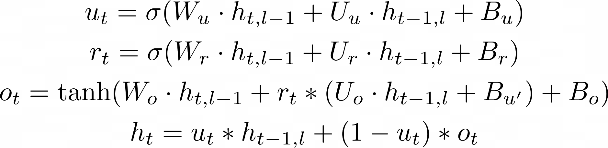

Proposal for GRU with Attentional Update in DNNL
================================================

## 1. Introduction

In addition to the regular GRU there is a notion of GRU with attentional update
gate (AUGRU) that can help to model interest evolving in Click-Through Rate
Prediction [[#1]][1].


### 1.1. GRU

GRU is defined by the following formula:




### 1.2. AUGRU

AUGRU is defined by the following formula (the difference from the
regular GRU is highlighted in red):


> Warning
>
> Attention is passed not as part of source layer as it is done in Neural Machine
> Translation (NMT) models [[#3]][3], but as a separate memory which is
> applied to intermediate results (to gate U). This difference makes it impossible
> to apply attention on application side and pass the result to oneDNN RNN
> primitive.

## 2. API Changes

Attention memory descriptor can be built from existing `rnn_desc_t` fields (memory
descriptors, cell kind, direction, propagation kind, etc.). Taking into account
this fact and to avoid breaking changes an attention memory descriptor will not
be part of `dnnl_rnn_desc_t`. Instead a user should use query API to get
attention shapes.

 * Pros:
   - RNN primitive descriptor can request the best layout for an attention memory
   - RNN primitive descriptor can request the data type compatible with RNN cell
 * Cons:
   - User has to reorder/quantize their attention data to align with the one
   requested by RNN
 * Alternative:
   - Introduce `rnn_desc_v2_t` with a memory descriptor for an attention.


### 2.1. New Types

```c
/// Source argument #3.
#define DNNL_ARG_SRC_3 4
/// A special mnemonic for RNN input recurrent cell attention vector. An alias for
/// #DNNL_ARG_SRC_3.
#define DNNL_ARG_SRC_LAYER_ATTENTION DNNL_ARG_SRC_3

/// Diff Source argument #3.
#define DNNL_ARG_DIFF_SRC_3 132
/// A special mnemonic for gradient (diff) of RNN input recurrent cell attention
/// vector. An alias for #DNNL_ARG_DIFF_SRC_3.
#define DNNL_ARG_DIFF_SRC_LAYER_ATTENTION DNNL_ARG_DIFF_SRC_3


typedef enum {
    ...,
    /// AUGRU cell
    dnnl_vanilla_augru = 0x5fff,
    /// AUGRU cell with linear before reset
    dnnl_lbr_augru = 0x6fff,
    ...,
} dnnl_alg_kind_t;
```


### 2.2. C API

N/A


### 2.3. C++ API

N/A


## 3. Limitations

### 3.1. Multi-layer support
In the original paper [[#1]][1] AUGRU is defined as a single-layer RNN, so
multi-layer support is out of scope for now. In language translation task in
case of multi-layer RNN attention is applied only to the first layer of RNN. In
future we could extend AUGRU support to multi-layer RNN.
For oneDNN it means if `cell_kind` is one of `dnnl_vanilla_augru` or
`dnnl_lbr_augru` then number of layers must be 1.

### 3.2. Bi-directional support
In the original paper [[#1]][1] AUGRU is defined as a uni-directional RNN, so
bi-directional support is out of scope for now. Number of directions might
affect attentional memory sizes.
For oneDNN it means if `cell_kind` is one of `dnnl_vanilla_augru` or
`dnnl_lbr_augru` then `direction` must be one of `dnnl_unidirectional_*`.

## 4. References

1. [Deep Interest Evolution Network for Click-Through Rate Prediction][1]
2. [DIEN implemenation based on TensorFlow 2][2]
3. [NEURAL MACHINE TRANSLATION BY JOINTLY LEARNING TO ALIGN AND TRANSLATE][3]

[1]: https://arxiv.org/pdf/1809.03672.pdf
[2]: https://github.com/alibaba/ai-matrix/tree/master/macro_benchmark/DIEN_TF2
[3]: https://arxiv.org/pdf/1409.0473.pdf

---

EOD
