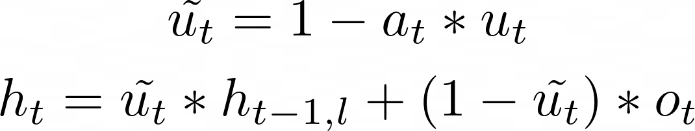
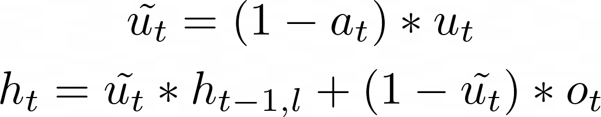

Proposal for GRU with Attentional Update V2 in DNNL
===================================================

## 1. Introduction

[Original AUGRU RFC](README.md)

OpenVino tnd TensorFlow teams reported that their AUGRU is different from the
one defined in the original paper[[#1]][1]. The difference comes from attention
update gate: 

Original algorithm:

OpenVino and TensorFlow algorithm:

oneDNN implements the first version which prevents OpenVino and TensorFlow from
utilizing oneDNN optimizations.

## 2. Proposal

### Option 1: Introduce new algorithm "augru_v2" which is aligned with OpenVino and TensorFlow

Pros:
- Support both original and modified definitions.
- Algorithm fully defines cell behavior.

Cons:
- New RNN algorithm requires separate API (forward/backward, vanilla/LBR, C/C++):
  - `dnnl_status_t dnnl_augru_v2_forward_desc_init()`
  - `dnnl_status_t dnnl_augru_v2_backward_desc_init()`
  - `dnnl_status_t dnnl_lbr_augru_v2_forward_desc_init()`
  - `dnnl_status_t dnnl_lbr_augru_v2_backward_desc_init()`
  - `struct dnnl::augru_v2_forward;`
  - `struct dnnl::augru_v2_backward;`
  - `struct dnnl::lbr_augru_v2_forward;`
  - `struct dnnl::lbr_augru_v2_backward;`

### Option 2: Utilize flags to dispatch between new and original definition of AUGRU

Pros:
- Support for both original and modified definitions.
- No new API.

Cons:
- Algorithm does not fully defines cell behavior. Implementations should inspect flags as well.

### Option 3: Update oneDNN definition to be aligned with OpenVino and TensorFlow

Pros:
- No new API.
- Algorithm fully defines cell behavior.

Cons:
- Original definition is not supported.

## 3. Recommendation

Implement Option 3

## 4. References

1. [Deep Interest Evolution Network for Click-Through Rate Prediction][1]
2. [DIEN implementation based on TensorFlow 2][2]

[1]: https://arxiv.org/pdf/1809.03672.pdf
[2]: https://github.com/alibaba/ai-matrix/tree/master/macro_benchmark/DIEN_TF2

---

EOD
