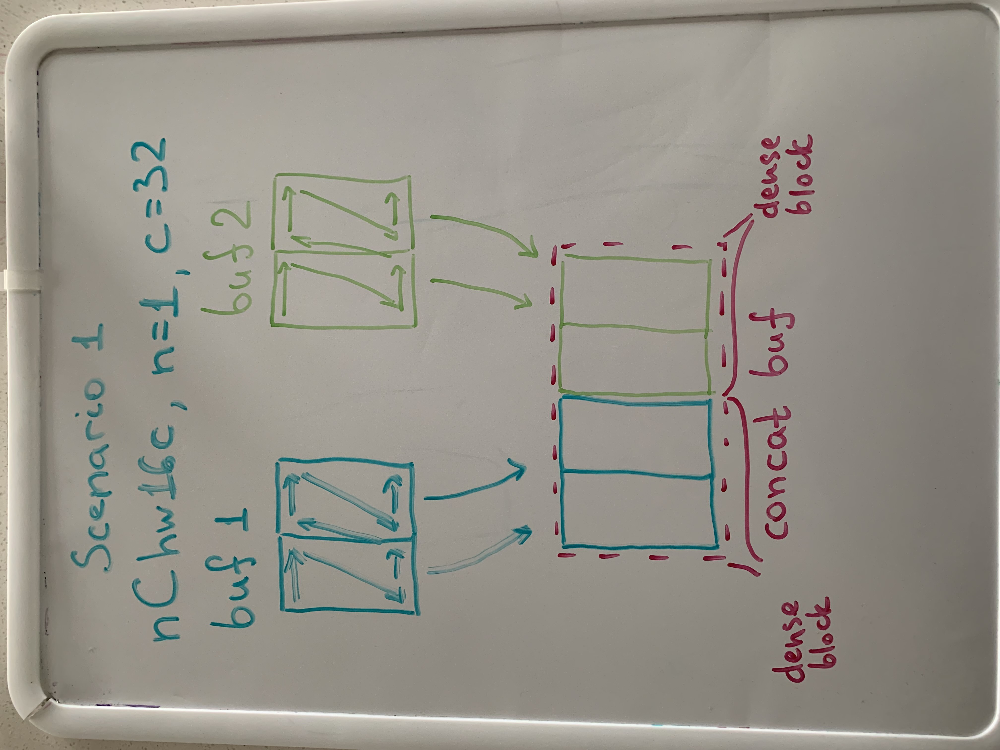
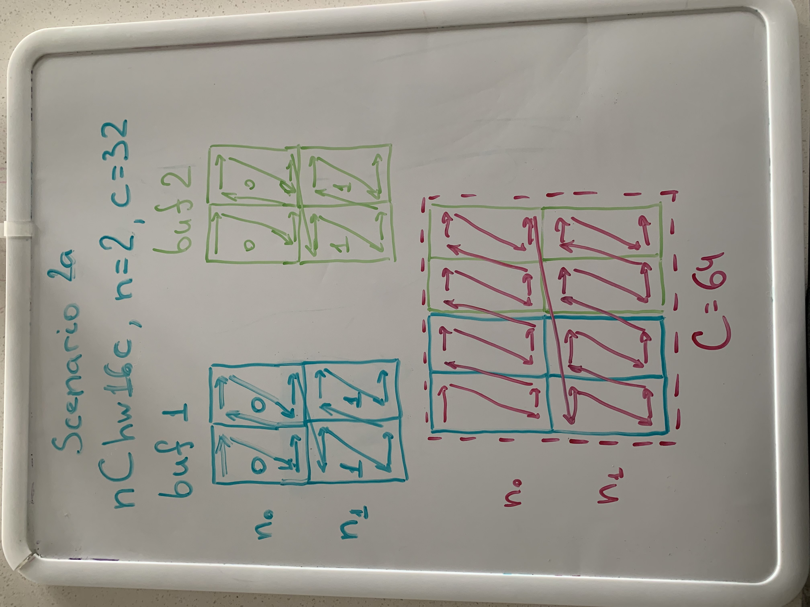
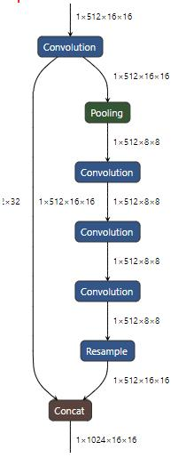
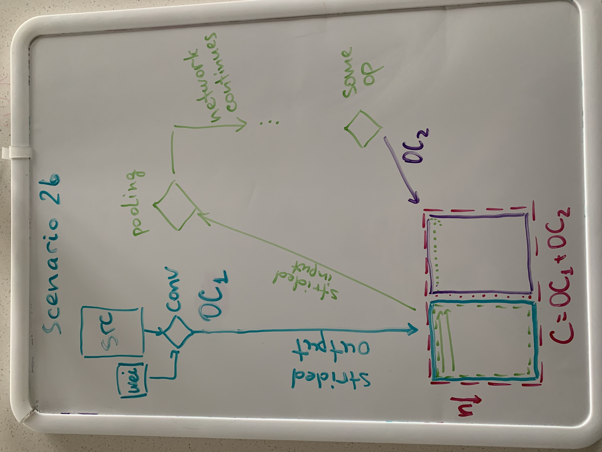

# RFC: Support of implicit concat

## Introduction

This document explores a way of supporting implicit concat. Implicit concat is a
concat primitive which is done without any additional copies just by storing
correspondent parts in the right locations of the final tensor. Such approach
saves at least one memory pass over the final output. Sometimes it may be two or
more.

### Motivation

Because compute power tends to increase more quickly than the memory bandwidth
needed to support it, most optimizations target saving work with memory and move
more in a compute field. Same desire here. We want to use intelligence to save
on putting smaller memories into a bigger one just with right format.

## Proposal

Let's start with the fact that such optimization cannot be provided by oneDNN
on API level - it must be enabled on user side manually due to several reasons,
primarily because of memory management.

Let's consider them on an example in which two tensors are merged to create a
bigger one:
* It may happen that two inputs, being an output from other primitives, may have
  incompatible memory layouts, e.g., `aBx32b` and `ABx16a32b`. In this case
  reorder would be needed no matter what, thus, doesn't make sense to avoid
  explicit concat which would execute such reorder as a part of operation. It
  means that user oversees that formats are same or compatible for implicit
  merging. Note that this holds for each architecture and even if input memory
  formats are same for one architecture, it does not necessarily mean that the
  other one would have exact format or match would happen.
* But even if formats are same, it may happen that implicit concat is still
  impossible, e.g., first input has padding. Despite in theory implicit concat
  is still possible, in the reality it may bring only troubles since second
  input would highly likely be unaligned in memory and may lead to various
  "interesting" performance effects, or even crashes, so that using explicit
  concat would be safer, and potentially offer better performance.

Let's consider two scenarios that may happen when considering implicit concat:

* Scenario 1, when concatenation should happen over the axis which is the
  outermost dimension in memory. E.g., `aBcd16b` inputs and output with `n = 1`
  and concatenating over channels `C`. In this simplified scenario, two inputs
  are separate dense pieces, and primitives may be configured as usual in this
  case. The only thing required is to provide a proper memory handle for a
  second piece. In this case, everything can be enabled on user side as of
  current oneDNN state, if using CPU raw pointers or GPU USM memory kind. For
  OpenCL buffers this trick won't work, unfortunately.
  
* Scenario 2a, when concatenation should happen over the axis which is not the
  outermost dimension in memory. This is a generic scenario. Same example but
  for `n > 1` works here. Let's for simplicity take `n = 2`. In this case each
  primitive which contributes to the final output would have non-trivial strides
  between `n` points. oneDNN does not provide any API which would allow the user
  to initialize a memory descriptor with both blocking descriptor and strides
  representing not dense case. But `submemory` API may be used to create such
  with two stages: initialize original memory descriptor with tags coming from
  compute primitive or passed from previous layer, and then perform `submemory`
  of this descriptor from the `concat` destination. This would achieve the
  desired effect. This general scenario will utilize `offset0` and `strides` in
  implementations internally but it requires support from the library and it's
  not fully under user's control now. But such usage is independent from memory
  kind.
  
* Scenario 2b, identical to 2a, but also with strided input requirement for
  certain primitives. It may happen in case of branching when output of
  convolution should be put into extended memory and this output would be
  further used as input in a second branch as entry point.
  
  

### Implementation

For scenario 2a, a simplified algorithm of actions to implement implicit concat
performance optimization would be the following:

1. Set up primitive descriptors of primitives which would contribute to concat
   primitive.
   a. If any of those are compute-intense primitives, querying of destination
      memory descriptor would be required to get a proper memory format.
   b. If all of those are memory-bound primitives, query is not required,
      formats should already be defined and coincide or be compatible.
2. Set up concat primitive descriptor with destination descriptors from previous
   step. Omit concat destination to let the library deduce it.
   a. If everything is good to go, destination would have same blocked format.
   b. If not, concat would return `abcd`-like format.
3. Verify that destination was created properly. This can be achieved by
   creating a memory descriptor with concat destination dims and plain
   `abcd`-like layout. If they match with queried, concat failed to prepare an
   implicit setup. Consider using an explicit one.
4. Create `submemory` descriptors from concat destination memory descriptor.
   a. If both memory descriptors were created properly, it means that implicit
      concat is good to go.
   b. It may happen that a suboptimal implementation is chosen, but such
      situations should be treated as library problems and reported.
5. Re-create primitive descriptors of contributing primitives.
   a. Ideally, implementations with dense and submemoried destination
      descriptors should coincide. They may be additionally validated with
      `impl_info_str()` call.
6. Create new memory objects for implicit concat destination and for
   contributing primitives. Last one should utilize a handle from the first one.
   Pass updated memory objects for execution.

Strided output only case is demonstrated at
[this example](implicit_concat_extended_output.cpp). Both strided input and
output case is demonstrated at another
[example here](implicit_concat_extended_input_and_output.cpp). They have
coverage for both scenarios depending on values provided for `IC`, `OC`, and
`N`.

### Coverage

Since this feature is complex enough to maintain, support and validate,
primitive support will be extended upon request. The initial implementation
would support convolution and pooling with strided input and output.

## Testing

Testing is likely to be extended on benchdnn side with an additional flag which
would define a bigger tensor over specified dimension(s). Then, primitive
descriptor would be created as the leftmost or rightmost part of it (validating
`offset0` application correctness).

Preliminary interface is like this:
```bash
benchdnn --conv --submemory=src:2x128x3x3:0x0x0x0+dst:2x256x3x3:0x192x0x0
                mb2_ic32oc64_ih3oh3kh3ph1sh1
```

At the example above, interface is breaking down in three components:
* argument to apply submemory descriptor.
* greater memory dimensions to create submemory for a problem.
* offsets.

Each argument will be able to get a submemory separated by `+`. We expect
users to focus on case where channels would be a primary axis of submemory but
interface is not limited to this case, though some implementations may.
