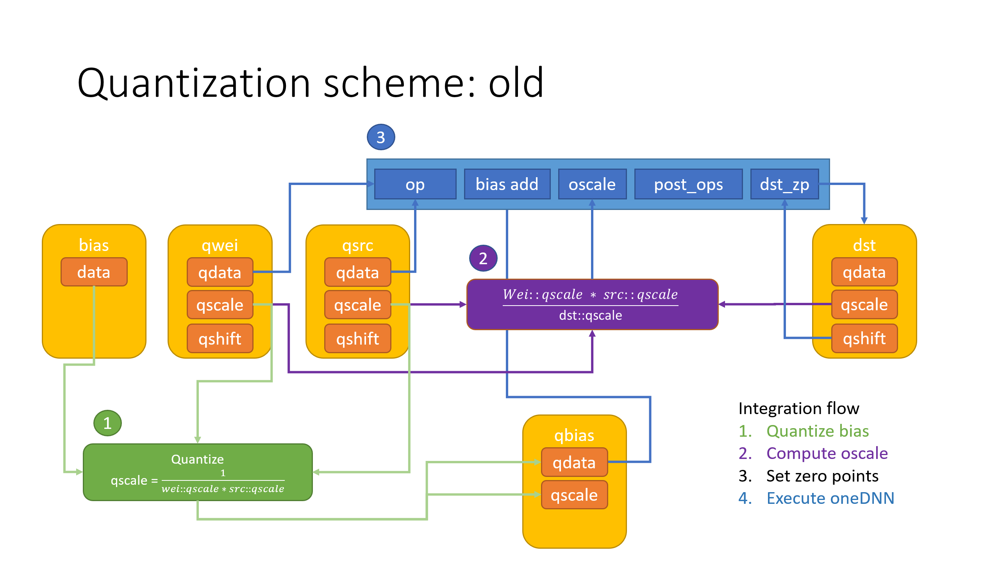
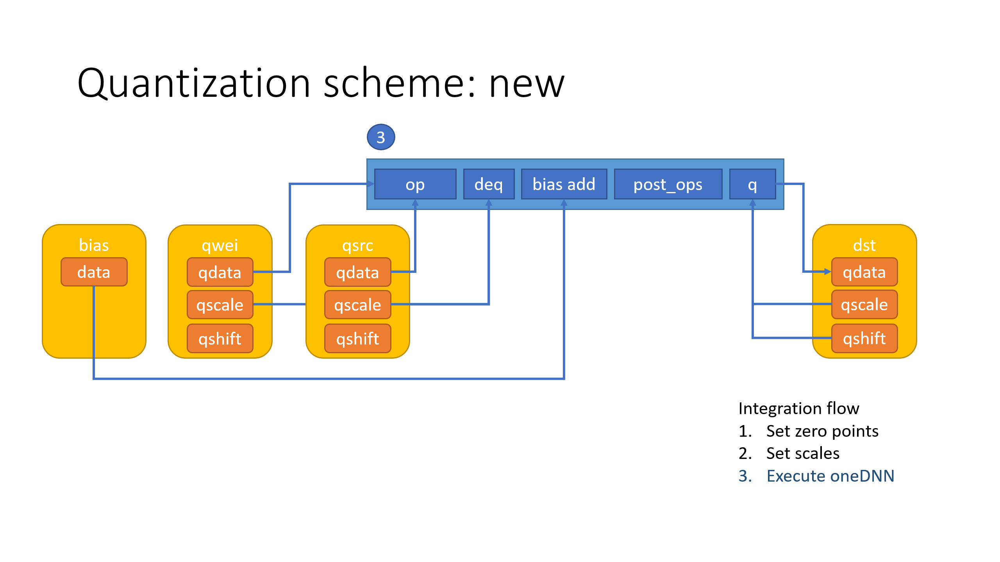

Proposal for updating quantization scale functionality in oneDNN
================================================================

## 0. Motivation

There are multiple requests for extending scaling support in oneDNN primitives:
- run-time scaling in Eltwise post-op;
- scaling for src1 in Binary post-op;
- scaling for inputs in Concat.

All of these requests can be addressed separately, but taking into account
already existing oneDNN mechanisms can help to avoid duplications and to unify
scaling in the future.


## 1. Introduction

This chapter provides a comprehensive overview of scaling support in oneDNN.


### 1.1. Quantization

8-bit Inference development covers more and more deep learning models, which
means more oneDNN primitives are required to support 8-bit data type. As
explained before [[#1]][1] quantization requires scale and shift. This RFC only
covers scale.


### 1.2. Scaling

Scaling is required in the following situations:
 - Output scaling. An intermediate result of an operation should be re-quantized
 to fit into a destination data type. For example:
 ```
 dst_f32 = conv(src_f32, wei_f32)

 src_f32 = src_s8 * src_scale_f32
 wei_f32 = wei_s8 * wei_scale_f32
 dst_f32 = dst_s8 * dst_scale_f32

 output_scale_f32 = src_scale_f32 * wei_scale_f32 / dst_scale_f32
 acc_s32 = conv(src_s8, wei_s8)
 dst_s8 = acc_s32 * output_scale_f32
 ```
 - Argument scaling. Operation's inputs have different scales and they should
 be taken into account while computing the operation. For example:
 ```
 dst_f32 = src0_f32 + src1_f32

 src0_f32 = src0_s8 * src0_scale_f32
 src1_f32 = src1_s8 * src1_scale_f32
 dst_f32 = dst_s8 * dst_scale_f32

 # scales src0_scale_f32 and src1_scale_f32 are required to compute operation
 correctly.
 acc_s32 = src0_s8 + src1_s8 # doesn't work if scales are different
 dst_s8 = acc_s32 * scale_f32
 ```

The following features make scaling more flexible:
- runtime support. Allows model to set scale at runtime;
- broadcasting/mask. Allows model to use multiple scales.


### 1.3. Quantization scaling in oneDNN

oneDNN has multiple mechanisms to support output and argument scaling:

| mechanism                      | argument  | compile-time | run-time | mask |
|--------------------------------|-----------|--------------|----------|------|
| attr::output_scale             | dst       | yes          | yes      | yes  |
| attr::scales                   | all       | yes          | yes      | yes  |
| attr::p_op::binary_mul         | dst       | no           | yes      | yes  |
| attr::rnn_data_qparams         | src & dst | yes          | no       | no   |
| attr::rnn_weights_qparams      | wei       | yes          | no       | no   |
| attr::p_op::built-in parameter | dst       | yes          | no       | no   |


The following table shows scaling mechanisms support by primitives API:

| primitive                 | mechanism                   |
|---------------------------|-----------------------------|
| Conv/IP/Matmul            | attr::output_scale          |
|                           | attr::p_op::binary_mul      |
| RNN                       | attr::rnn_data_qparams      |
|                           | attr::rnn_weights_qparams   |
| Batch/Layer normalization |                             |
| Binary                    | attr::scales                |
| attr::p_op::binary        |                             |
| attr::p_op::dw_conv       | built-in parameter          |
| Concat                    |                             |
| Eltwise                   |                             |
| attr::p_op::eltwise       | built-in parameter          |
| LRN                       |                             |
| (Log)Softmax              | attr::output_scale[[#2]][2] |
| Pooling                   | attr::p_op::binary_mul      |
| PRelu                     |                             |
| Resampling                | attr::p_op::binary_mul      |
| Shuffle                   |                             |
| Sum                       | built-in parameter          |
| attr::p_op::sum           | built-in parameter          |
| Reorder                   | attr::output_scale          |
| Reduction                 | attr::p_op::binary_mul      |


## 2. Addressing short-term requests

### 2.1. Run-time scaling in Eltwise

This feature doesn't require API extensions, because scaling can be implemented
as a separate Binary post-op.


### 2.2. Scaling for src1 in Binary post-op

#### 2.2.1 Option 1

New API is required to support the requested feature. New API extends binary
post-op with a `scale` parameter (scaling mechanism `built-in parameter`). This
mechanism is aligned with scaling for other post-operations and shares the same
limitations:
- only single-value scaling;
- no run-time support.

API:

```c
dnnl_status_t DNNL_API dnnl_post_ops_append_binary_v2(dnnl_post_ops_t post_ops,
        float scale, dnnl_alg_kind_t alg_kind,
        const dnnl_memory_desc_t *src1_desc);

dnnl_status_t DNNL_API dnnl_post_ops_get_params_binary_v2(
        const_dnnl_post_ops_t post_ops, int index, float *scale,
        dnnl_alg_kind_t *alg_kind, const dnnl_memory_desc_t **src1_desc);
```

An example:

```cpp
    post_ops p_ops;
    p_ops.append_binary(scale, algorithm::binary_add, summand_md);

    primitive_attr attr;
    attr.set_post_ops(p_ops);
```

#### 2.2.2 Option 2

An alternative solution would be to extend mechanism `attr::scales`. This
solution doesn't require new API, but extends the existing one.

An example:

```cpp
    post_ops p_ops;
    p_ops.append_binary(algorithm::binary_add, summand_md);

    primitive_attr attr;
    attr.set_post_ops(p_ops);
    attr.set_scales(DNNL_ARG_ATTR_MULTIPLE_POST_OP(0) | DNNL_ARG_SRC_1,
            /* mask */ 0, {DNNL_RUNTIME_F32_VAL});
```

While the alternative solution allows to avoid new API, it introduces one more
way to set scale which complicates both implementation and integration.
Please review section
[Unifying scaling in long-term](#3-unifying-scaling-in-long-term) for more
details.


### 2.3. Scales for inputs in Concat

The mechanism `attr:set_scales` will be introduced to Concat primitive. This
mechanism is used in Binary primitive, so API is already there.

The following limitations are in place for an initial implementation:
 - no-runtime support;
 - mask is 0.

An example:

```cpp
    primitive_attr attr;
    for (int n = 0; n < num_src; ++n)
        attr.set_scales(DNNL_ARG_MULTIPLE_SRC + n, /* mask */ 0, src_scales[n]);
```

## 3. Unifying scaling in long-term

The motivation behind unifying scaling:
- Remove duplications;
- Provide an aligned support across all use cases.

There are a few issues with the current scaling support:
 - Output scale, scales and binary_mul overlap each other;
 - RNN quantization is specific to RNN, but can be replaced by other
 scaling mechanisms:
   ```
   # Scaling semantics of set_scales and set_zero_points
   x_f32 = scale * (x_i8 - zero_point)

   # Scaling semantics of RNN quantization
   x_i8 = scale * x_f32 + zero_point
   x_f32 = 1 / scale * (x_i8 - zero_point)
   ```
   This will affect application side code as user should pass `1 / scale` to
   oneDNN comparing to the current `scale`;
 - Built-in parameter provides very limited flexibility (no mask, no runtime).

### The changes:

#### New quantization scheme

Formula:
```
dst = post_ops(OP(...))/scale_dst + zp_dst
```

The list of changes:
- quantization parameters for each input/output are passed separately and not
  merged into output_scale. This allows to remove associated overheads in
  integration, and also to remove "implicit" quantization requirements
  (see next item).
- bias is now applied after de-quantization. This removes the need to quantize
  it on the user side.
- dst scale/zero_point now both refer to the same tensor, which is the output
  of the primitive - it is applied after post-operations.
- the RNN scale semantic is changed from `x_f32 = 1/scale * (x_i8 - zp)` to
  `x_f32 = scale*(x_i8 - zp)`. This aligns the scale semantic with the rest
  of the library.
- quantization parameters will all be passed at execution time only. This allows
  to keep quantization parameters on the proper device and avoid spurious
  copies. It also allows to improve primitive cache hit rate for dynamic
  quantization scenarios.

The following images show differences between existing quantization and new
quantization.






#### Creation-time scaling support will be dropped.

New scaling API:
``` c
// dnnl_types.h

dnnl_status_t DNNL_API dnnl_primitive_attr_set_scales(
        dnnl_primitive_attr_t attr, int arg, int mask);
```

```cpp
// dnnl.hpp

void primitive_attr::set_scales(int arg, int mask) const;
```


#### A unified scaling API using mechanism `attr::set_scales`

- The encoding of `DNNL_ARG_SCALE` is changed to `512` to avoid overlapping with other arguments.
  - DNNL_ARG_OUTPUT_SCALE will be removed.
- Mapping of existing scaling to `attr::set_scales`:
  - `attr::output_scales`
    ``` cpp
    primitive_attr attr;
    attr.set_scales(DNNL_ARG_SRC, mask);
    attr.set_scales(DNNL_ARG_WEIGHTS, mask);
    attr.set_scales(DNNL_ARG_DST, mask);
    ```
  - `attr::rnn_data_qparams`
    ``` cpp
    primitive_attr attr;
    attr.set_scales(DNNL_ARG_SRC, mask);
    attr.set_scales(DNNL_ARG_DST, mask);
    ```
  - `attr::rnn_weights_qparams`
    ``` cpp
    primitive_attr attr;
    attr.set_scales(DNNL_ARG_WEIGHTS, mask);
    ```
  - `attr::p_op::built-in parameter`
    ``` cpp
    post_ops p_ops;
    p_ops.append_binary(algorithm::binary_add, summand_md);
    // eltwise does not need scale parameter, because it is applied to f32 data
    p_ops.append_eltwise(algorithm::eltwise_relu, alpha, beta);

    primitive_attr attr;
    attr.set_post_ops(p_ops);
    attr.set_scales(DNNL_ARG_ATTR_MULTIPLE_POST_OP(0) | DNNL_ARG_SRC_1,
            /* mask */ 0);
    ...
    std::unordered_map<int, memory> args;
    ...
    args.insert({DNNL_ARG_ATTR_MULTIPLE_POST_OP(0) | DNNL_ARG_SCALE | DNNL_ARG_SRC_1, p_op_0_src_1_scale_mem});
    p.execute(s, args);
    ```
  - `built-in parameter` in Sum
    ``` cpp
    primitive_attr attr;
    attr.set_scales(DNNL_ARG_MULTIPLE_SRC + 0, /* mask */ 0);
    attr.set_scales(DNNL_ARG_MULTIPLE_SRC + 1, /* mask */ 0);

    ...
    std::unordered_map<int, memory> args;
    ...
    args.insert({DNNL_ARG_MULTIPLE_SRC + 0, scale_0_mem});
    args.insert({DNNL_ARG_MULTIPLE_SRC + 1, scale_1_mem});
    p.execute(s, args);
    ```
  - `attr::p_op::dw_conv`
    ``` cpp
    post_ops p_ops;
    p_ops.append_dw(...);
    attr.set_post_ops(p_ops);
    attr.set_scales(DNNL_ARG_ATTR_POST_OP_DW | DNNL_ARG_WEIGHTS, /* mask */ 0);
    attr.set_scales(DNNL_ARG_ATTR_POST_OP_DW | DNNL_ARG_DST, /* mask */ 0);
    ...
    std::unordered_map<int, memory> args;
    ...
    args.insert({DNNL_ARG_SCALE | DNNL_ARG_ATTR_POST_OP_DW | DNNL_ARG_WEIGHTS, p_op_dw_wei_scale_mem});
    args.insert({DNNL_ARG_SCALE | DNNL_ARG_ATTR_POST_OP_DW | DNNL_ARG_DST, p_op_dw_dst_scale_mem});
    p.execute(s, args);
    ```


#### Simplifying scales configuration

Currently correspondence mask defines the correspondence between the tensor
dimensions and the scales vector. The set i-th bit indicates that a dedicated
scaling factor is used for each index along that dimension. The mask value of 0
implies a common scaling factor for the whole tensor.

The are a few problems:
1. Setting a mask is complicated. For example, to set per channels scales, mask
   should be set to `2` (`1 << 1`) for a tensor where channels is a second
   dimension.
2. The same scale configuration should be set differently for tensor with
   different semantics. For example, per channel scales:
     - rnn data: `1 << 2`, because in rnn dimension order is is `tnc`, so
       channels is 2nd dimension.
     - conv data: `1 << 1`, because in conv dimension order is `nchw`, so
       channels is 1st dimension.

##### Improvement 1

* This option doesn't break API, but simplifies mask usage.
* oneDNN provides set of pre-defined correspondence masks:
  ```c
  // include/oneapi/dnnl/dnnl_types.h

  #define DNNL_MASK_COMMON 0
  #define DNNL_MASK_PER_DIM_0 1 << 0
  #define DNNL_MASK_PER_DIM_1 1 << 1
  #define DNNL_MASK_PER_DIM_2 1 << 2
  ```
  ```cpp
  primitive_attr attr;
  attr.set_scales(DNNL_ARG_DST, DNNL_MASK_COMMON);
  ```

##### Improvement 2

* This option extends mask values to express dimensions based on dimension order
  semantic.
* oneDNN provides set of pre-defined correspondence masks:
  ```c
  // include/oneapi/dnnl/dnnl_types.h

  #define DNNL_MASK_PER_CHANNEL_NCHW 1 << 12
  #define DNNL_MASK_PER_CHANNEL_TNC 1 << 13
  #define DNNL_MASK_PER_CHANNEL_OIHW 1 << 14
  ```
  ```cpp
  // conv dim order in nchw
  primitive_attr attr;
  attr.set_scales(DNNL_ARG_WEIGHTS, DNNL_PER_CHANNEL_OIHW);
  auto conv_pd = convolution_forward::primitive_desc(op_desc, attr, eng);
  ```
* Some primitives don't have semantics of dimension order, so they will return
  `invalid_arguments`.


## Discussion
1. Keep creation-time scales?
   - to avoid memory creation for each built-in parameter
   - to avoid creating GPU memory for a single value
2. Apply dst quantization before or after post-operations?
3. Do we need default mask value to identify that scales were not set using
   `get_scales()`?
   - The decision is to remove `get_scales()` method, because
     integration/application should have knowledge about set scales/zero points,
     hence `get_scales()` is not needed.

## References

1. [OpenVino int8 support][1]
2. [Softmax v2][2]

[1]: https://github.com/oneapi-src/oneDNN/tree/rfcs/rfcs/20200428-openvino-int8-support
[2]: https://github.com/oneapi-src/oneDNN/tree/rfcs/rfcs/20211207-softmax-v2

---

EOD
