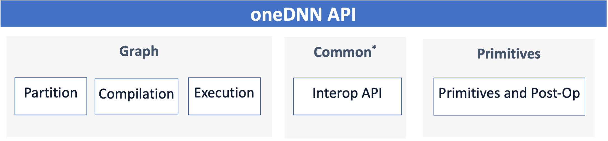
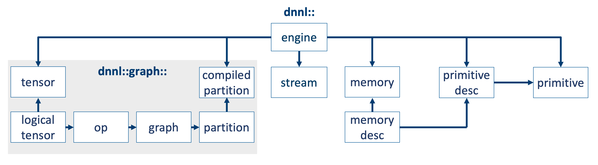

# Introduce Graph API in oneDNN v3.0

## Introduction

With the rapid introduction of new hardware supporting for dense computation,
the deep learning workload characteristics changed significantly from a few hot
spots on compute-intensive operations to a broad set of operations scattered
across the application. Accelerating a few compute-intensive operations using
only optimized library primitives has diminishing return and limits the
performance potential. oneDNN primitive’s post-ops API partially addresses the
issues by allowing a chain of operations attached to leading operation like
Convolution or Matmul. However, the post-ops API has limitations as the
operation chain can’t express an arbitrary operation graph. The primitive
post-ops have made oneDNN API complicated to use. Users will have to understand
what post-ops are supported by what primitive and program for them explicitly.
Once a new post-op is supported, they will have to change the code to leverage
the new optimization.

We propose oneDNN v3.0 to include graph API, also known as oneDNN graph API,
which accepts operations, constructs computational graph, and provides optimized
code with a global view of computation. oneDNN graph API is designed to
interoperate with framework’s kernel implementation, runtime, and low-level
compiler. The oneDNN graph implementation focuses on low-level target-specific
optimization and compliment with framework components, with a goal to be
integrated as a default performance library to framework.

Below is a scheme that shows high-level picture of oneDNN v3.0, which is
extended to include both graph API and primitive API.



Graph API focuses on generating optimized code and kernels for a broad set of
fusion patterns and providing the unified API for multiple AI hardwares.
Primitive API focuses on a narrow set of the most performance critical and
common primitives and post-ops fusions. There are a set of common APIs
supporting interoperability, debug-ability, and compute mode configuration.

Same as oneDNN's existing API, the proposed graph API contains both C++ API and
C API. C++ API is a wrapper layer on top of C API for better usability. C API
amis to provide simple API and stable ABI to the library. In C++ API, the graph
API contains concepts of `graph`, `logical_tensor`, and `op`. A graph can be
partitioned into different `partition`s. A `partition` usually can be compiled
into a `compiled_partition` according to the information of engine and
input/output. A `compiled_partition` can be executed on a `stream` with given
input and output `tensor`s.

The diagram below describes the major classes used to define graph API.



The common API between primitive API and graph API includes `engine`, `stream`,
`allocator`, `thread_pool`, and `error`, etc. These common APIs provide XPU
runtime interoperability (device, queues, memory) for tight integration with
applications and to give the maximum flexibility to users, directly map
application’s tensor’s data buffer to oneDNN memory and tensor objects with
zero-copy, and provide usability and debug-ability features: verbose execution
(parameters, time), and integrate with profiling tools (VTune, Linux Perf).

The introduction of graph API will not change the usage of existing primitives
and post-ops API. Users can access these capabilities using the current
primitives API as is. Instead, the graph API provides a new way to access
primitive capabilities. For example, users can use graph API to build single-op
partition, then compile and execute it. Or, instead of using post-ops API, users
can use the graph partition API to automatically propose ops to be in one
partition, which can be then compiled and executed as one fused op. Once users
upgrade their application to a new library version with new fusion capabilities,
new partition will be proposed automatically without changing the integration
code.

Because the graph API is implemented as an API extension on top of the existing
primitives and post-ops implementation, it also works on other hardware
architectures like Aarch64 which already supported by oneDNN. The graph API also
introduces aggressive fusions backed by oneDNN graph compiler, which currently
works on Intel CPU with AVX-512 only. Extending oneDNN graph compiler to work on
other hardware architectures and ISAs are out of scope for the current RFC.

oneDNN graph API and implementation have been developed for more than one year
on [dev-graph branch](https://github.com/oneapi-src/oneDNN/tree/dev-graph) in
oneDNN repository. During the period, five technical preview versions were
released internally or externally to demonstrate the API concepts and usage. Th
alpha release of
[graph-v0.5](https://github.com/oneapi-src/oneDNN/releases/tag/graph-v0.5) was
integrated into stock PyTorch successfully and released since [PyTorch
v1.12](https://github.com/pytorch/pytorch/releases/tag/v1.12.0). oneDNN graph
API preview has been also integrated in [Intel Extension for
TensorFlow](https://github.com/intel/intel-extension-for-tensorflow) and [Intel
Extension for PyTorch](https://github.com/intel/intel-extension-for-pytorch)
respectively.

## Programming model

Graph API introduces `graph`, `logical_tensor`, and `op` to represent a
computation graph. A graph object contains a set of `op` and `logical_tensor`.
`op` represents an operation in a computation graph. `logical_tensor` represents
`tensor`’s metadata, like elements data type, shape, and memory layout. `op` has
kind, attributes, and input and output logical tensors. oneDNN graph API
supports both forward and backward operations used in typical deep learning
models. These classes are introduced to map the corresponding concepts from
framework graph.

```cpp
using namespace dnnl::graph;

graph g(engine::kind::cpu);

std::vector<int64_t> input_dims {8, 3, 227, 227};
std::vector<int64_t> weight_dims {96, 3, 11, 11};
std::vector<int64_t> dst_dims {8, 96, 55, 55};

logical_tensor conv0_src {0, logical_tensor::data_type::f32, input_dims, logical_tensor::layout_type::strided};
logical_tensor conv0_weight {1, logical_tensor::data_type::f32, weight_dims, logical_tensor::layout_type::strided};
logical_tensor conv0_dst {2, logical_tensor::data_type::f32, dst_dims, logical_tensor::layout_type::strided};

op conv0(0, op::kind::Convolution, "conv0");
conv0.set_attr<std::string>(op::attr::data_format, "NCX");
conv0.set_attr<std::string>(op::attr::weights_format, "OIX");
// set other attributes
conv0.add_inputs({conv0_src, conv0_weight});
conv0.add_outputs({conv0_dst});

g.add_op(conv0);
    
logical_tensor relu0_dst {3, logical_tensor::data_type::f32, dst_dims, logical_tensor::layout_type::strided};
op relu0(1, op::kind::ReLU, {conv0_dst}, {relu0_dst}, "relu0");

g.add_op(relu0); // the order of adding ops does not matter.
```

Graph API introduces `partition` API. The library analyzes a `graph` and returns
a list of partitions. Each `partition` may contain one `op` or multiple `op`s.
It's possible that on operation in the graph cannot be supported or fused by the
library. For this case, the operations will be returned as a `unsupported`
partition. Users can check if a partition is supported or not via APi
`partition::is_supported()`. For a supported partition which contains multiple
`op`s (as known as fused), it means the library can generate better code or
kernel if these operations are compiled and executed as one compilation unit.
With partitioning API, the user program has a generic way to handle any type of
fusions. The user program doesn’t have to write code specifically for each
fusion capability, like matching the pattern for fusion and using post-ops API
according to chain the fused ops. When library develops a new fusion capability
for an existing graph, the user program can get the benefit without any code
modification.

```cpp
// graph partitioning
g.finalize();
std::vector<partition> partitions = g.get_partitions();
```

Graph API also introduces `compiled_partition`, `tensor` and reuses oneDNN
`engine` and `stream` for runtime execution. A `partition` needs to be compiled
into a `compiled_partition`. An `engine` contains the target device type, which
is necessary for the compilation API. The `compiled_partition` is then executed
with input and output tensors. Each `tensor` contains `logical_tensor` and the
data handle. The `stream` manages hardware resources at runtime which is passed
to the execution API.

```cpp
engine eng {engine::kind::cpu, 0}; // oneDNN's existing engine API.
compiled_partition cp0 = partitions[0].compile({conv0_src, conv0_weight}, {relu0_dst}, eng);

stream strm {eng}; // oneDNN's existing stream API.

// conv0_src_data, conv0_weight_data, and relu0_dst_data are data from
// frameworks or user application.
tensor conv0_src_ts(conv0_src, eng, conv0_src_data.data());
tensor conv0_weight_ts(conv0_weight, eng, conv0_weight_data.data());
tensor relu0_dst_ts(relu0_dst, eng, relu0_dst_data.data());

cp0.execute(strm, {conv0_src_ts, conv0_weight_ts}, {relu0_dst_ts});
```

A full example demonstrating the programming model and API usage can be found at
[cpu_get_start.cpp](examples/cpu_get_started.cpp).

## API details

Proposed API types, structures, and enumeration values can be found in
[dnnl_graph_types.h](headers/dnnl_graph_types.h).

Proposed C APIs can be found in [dnnl_graph.h](headers/dnnl_graph.h).

Proposed C++ APIs can be found in [dnnl_graph.hpp](headers/dnnl_graph.hpp).

## Framework integration

oneDNN graph API is designed to support the framework integration with both
performance and simplicity. The goal is to enable framework integration to
achieve high performance without writing extra code to make it performant.

In the graph mode, framework firstly constructs the computation graph and then
executes the graph within framework runtime. There are two major integration
points, one at the graph optimization time, and the other at the execution time.

First, the framework graph optimization needs to add a dedicated optimization
pass which establishes the mapping between framework subgraph and oneDNN graph
partition and replaces the framework subgraphs with custom ops representing
oneDNN graph partitions. This is typically done by registering the oneDNN graph
optimization pass to the framework graph optimization pass manager. The oneDNN
graph optimization walks the framework graph and passes the computation graph
through oneDNN graph API by converting the framework ops to oneDNN graph ops and
framework tensors to oneDNN graph logical tensors. Then it calls oneDNN graph
partition API to get partitions, decides which partitions to be accelerated by
libraries, and replaces the partitions to be custom ops.  

The integration layer also registers both the custom op and its kernel
implementation. At the execution time, the framework graph is carried out by
executing each individual op within the framework runtime, which in turn calls
the kernel implementation associated with the device where the op is assigned.
For the custom op representing a subgraph (or oneDNN graph partition), the
custom kernel is called with framework tensors and partition as parameters. The
custom kernel first compiles the partition, prepares oneDNN graph tensors using
the framework tensors, and then call the compiled partition with the oneDNN
graph tensors.

The chart below depicts the overview of framework integration.


## Performance implication

The [PyTorch integration PR](https://github.com/pytorch/pytorch/pull/76622)
demonstrated the ease of use of graph API and the performance benefit users can
get from it. Graph API enables fusion which can bring up to 2x performance gain
depending on different workloads and configuration. Performance gain varies with
workload performance characteristics, hardware system, and the configurations.

In addition to primitive's post-ops fusion for a chain of operations, graph API
offers aggressive fusion capabilities. MHA (multi-head attention) fusion
released in preview4 boosts BERT inference performance by 1.6x. The roadmap
includes MHA, MLP (multi-layer perceptron), and Convolution block for both
inference and training with support for all popular data types.

## Ease of use

Graph API is designed to be readily used by the deep learning framework, and
most design considerations aim to simplify the integration to framework graph.
This leads to a few design choices for the graph API.

* Avoid the `format_tag` concept and order of dimensions from logical tensor
  definition. The logical tensor describes the dimension size, strides, and
  element data type. The logical tensor doesn’t tell which dimension is
  semantically associated with batch size, channel, or spatial dimensions.
  Instead, the op contains attributes which can be used by users to specify the
  semantic for each dimension of tensors. For example, the `data_format` of
  convolution in the code example above is specified as `NCX`, which means the
  convolution expects the first dimension as batch size, the second dimension as
  channel size, and the last few dimensions as spatial dimensions. This is
  consistent with framework graph, op, and tensor definition.
* Not require users to provide the output tensor shape for compilation. Users
  can simply provide `DNNL_GRAPH_UNKNOWN_DIM` as the shape for the output tensor
  for compilation. Library will deduce the output shapes during compilation.
  User can query the logical tensor from the compiled partition and know the
  dimensions for the output tensors.
* Not require users to query and convert the layout for the activation tensor
  before the execution of compiled partition. The compiled partition takes
  public layout tensors or opaque layout tensors and converts it internally if
  necessary.
* Automatically caches the compiled partitions and the reordered constant
  weights.
* Allows the library implementation to cache compiled partition, so framework
  integration layer can just use the partition compilation API without worrying
  about the compilation overhead.
* For power users who would optimize the execution flow by themselves, oneDNN
  graph API also supports them to explicitly cache compiled partition, reorder
  weight, cache reordered weight, and reorder the activation tensors.

## Operator definition

Graph API tries to match up the operator definition with existing oneDNN
primitives as much as possible. When there is a semantic difference between
framework operator and oneDNN primitive, graph API chooses to follow framework
operator semantics for ease of integration. Below is a summary of different
operator and primitive definitions between graph and primitive API.

* Primitives become obsolete over the time, eg. `LRN`.
* Primitives don’t have exactly framework operator to map to, eg.
  `eltwise-linear` primitive.
* oneDNN provides both `matmul` and `inner_product` primitives while the graph API
  only supports `MatMul` operator.
* Framework has different operator semantics, hence oneDNN graph operator covers
  a superset while oneDNN primitive covers a subset. For example, oneDNN graph
  `Convolution` op supports `auto_pad` attribute, but `convolution` primitive
  doesn’t support it.
* oneDNN supports pure INT8 data type for some primitives while in graph API,
  INT8 is quantization data type and used along with quantization scales and
  zero points.
* Primitives not used by some frameworks, and its corresponding operator can be
  composed by using a few other oneDNN graph operators. For examples, Shuffle
  could be composed using Transpose and Reshape.

## Interoperability

Graph API inherits the interoperability of oneDNN primitive API design. The
stream may contain a custom thread pool or a SYCL queue, so that user program
can manage the device or thread pool and compiled object runs on the hardware
managed by user program. The tensor allows user to bind data buffers which are
allocated and managed by users.

SYCL interoperate APIs are defined in
[dnnl_graph_sycl.hpp](headers/dnnl_graph_sycl.hpp) and
[dnnl_graph_sycl.h](headers/dnnl_graph_sycl.h).

OpenCL interoperability will not be provided in the initial versions but can be
extended in the future according to user requirements.

## API and backward compatibility

During the technical previews, separated `engine`, `stream`, and `thread pool`
APIs were developed to reduce the dependency on oneDNN internals. When proposing
to merge graph API into oneDNN master, we are also proposing to reuse oneDNN's
existing `engin`, `stream`, `thread pool`, and other common types and APIs. A
separate [RFC](merge-common-api.md) describes the reuse of oneDNN `engine`,
`stream`, and `thread pool` API. Another
[sub-RFC](./merge-status-error-handling.md) describes the reuse of oneDNN status
code and exceptions on C++ API. We suggest users who are familiar with dev-graph
and oneDNN graph previews to read the above two sub-RFCs to understand the API
changes compared with preview versions. We also plan to provide a transition
guide to help dev-graph users migrating to oneDNN master and future releases.

Graph API contains both C++ API and C API. The C API ensures the ABI
compatibility while C++ provides more convenience. Introducing graph APIs will
not change the usage of existing primitive APIs.

## Build system

The implementation of graph API will be added to the source directory and built
as part of oneDNN. Adding the new component will not change the typical build
and installation steps. A new build option `ONEDNN_BUILD_GRAPH` will be
introduced to enable or disable the graph component during build time. Building
the graph component will not change the library binary names (libdnnl.a and
libdnnl.so by default).

The graph component will respect the existing common build options as follows:

* ONEDNN_CPU_RUNTIME (NONE, OMP, TBB, SEQ, THREADPOOL, DPCPP.)
* ONEDNN_GPU_RUNTIME (NONE, DPCPP. OCL is not supported.)
* ONEDNN_LIBRARY_TYPE
* ONEDNN_LIBRARY_NAME
* ONEDNN_BUILD_EXAMPLES
* ONEDNN_BUILD_TESTS
* ONEDNN_VERBOSE
* ONEDNN_DPCPP_HOST_COMPILER

Below primitive specific build options will not impact the graph component
implementation:

* ONEDNN_ENABLE_JIT_PROFILING
* ONEDNN_ENABLE_PRIMITIVE_CACHE
* ONEDNN_ENABLE_MAX_CPU_ISA
* ONEDNN_ENABLE_CPU_ISA_HINTS
* ONEDNN_ENABLE_PRIMITIVE_CPU_ISA
* ONEDNN_ENABLE_PRIMITIVE_GPU_ISA
* ONEDNN_AARCH64_USE_ACL
* ONEDNN_BLAS_VENDOR
* ONEDNN_GPU_VENDOR

Some build options for feature selection will be ignored by oneDNN when graph
component is built:

* ONEDNN_ENABLE_WORKLOAD
* ONEDNN_ENABLE_PRIMITIVE

## Library headers

Graph APIs will be exposed in separate header files of the library so they can
be included into user application when needed. The main new header files will
look like:

* include/oneapi/dnnl/dnnl_graph.hpp (C++ API, namespace `dnnl::graph::`)
* include/oneapi/dnnl/dnnl_graph.h (C API)
* include/oneapi/dnnl/dnnl_graph_types.h (types of structures and enumerations)
* include/oneapi/dnnl/dnnl_graph_sycl.h/hpp (SYCL interoperation interface)

To reuse existing oneDNN API new set of headers will be introduced:

* include/oneapi/dnnl/dnnl_common_types.h (types of structures and enumerations)
* include/oneapi/dnnl/dnnl_common.h (C API)
* include/oneapi/dnnl/dnnl_common.hpp (C++ API)

These headers will contain API for the following common concepts:

* `dnnl_status_t`
* `dnnl_data_type_t`
* `dnnl_dims_t`
* `dnnl_engine_t`
* `dnnl_fpmath_mode_t`
* `dnnl_stream_t`

The graph header files will be installed to user machines along with oneDNN
installation if the graph component is built.

## Dependencies and support matrix

The introduction of oneDNN graph API doesn’t change oneDNN’s existing
dependencies and overall support matrix in general.

OpenCL runtime will not be supported in the initial versions but can be extended
in the future according to user requirements.

## Source code structure

To minimize the impact to oenDNN existing code structure, all the graph API
implementation and graph component specific code will be put in the directory
of:

* src/graph/

The implementation details will live in the namespace of `dnnl::impl::graph::` and
leverage common code and utilities by including headers from src/common/. The
source code under src/graph/ will be built only when the build option
`ONEDNN_BUILD_GRAPH` is turned ON.

## Testing

When introducing the graph API and implementation to oneDNN, graph API tests and
internal tests will be added to tests/gtests/graph/. The tests will be built
along with graph component, executed with ctests, and validated in oneDNN
pre-commit, CI, nightly, and weekly validation process.

Benchdnn will be extended to support testing of graph API by leveraging the
existing benchdnn infrastructure and test suites. A new driver `graph` will be
added to benchdnn to test graph API. Benchdnn will also be used to benchmark the
performance of compiled partition execution for graph API. The design and
workflow of benchdnn graph drive should be covered by a separate document.

The library supports to serialize graphs from tests, examples, or real
integration models into JSON files. A serialized JSON contains operations,
operation attributes, input and output logical tensors of each operation, and
library version information. These serialized JSON files will be taken as the
input files of benchdnn to test graph API. So far, the serialization feature is
mainly designed for testing purpose and can be enabled by an environment
variable setting (`ONEDNN_GRAPH_DUMP`). Public API can be added in the future if
users request to access the feature through a programmable API.

## Next steps

* Fork oneDNN master and merge dev-graph into it with the proposed code and
  directory structure.
* Release oneDNN Graph beta from the fork in Q3 2022 to demonstrate the overview
  of primitive and graph API together and seek for feedbacks from oneDNN
  community. (Update: this is done in
  [graph-v0.6](https://github.com/oneapi-src/oneDNN/releases/tag/graph-v0.6))
* Merge graph API into oneDNN master and release it as a new experimental
  feature in oneDNN v3.0.
* Keep evolving graph API and develop new features on oneDNN master. Follow
  oneDNN production plan and roadmap.
* Maintain dev-graph until graph API is release in oneDNN v3.0. All users will
  be recommended to upgrade.

EOD.
