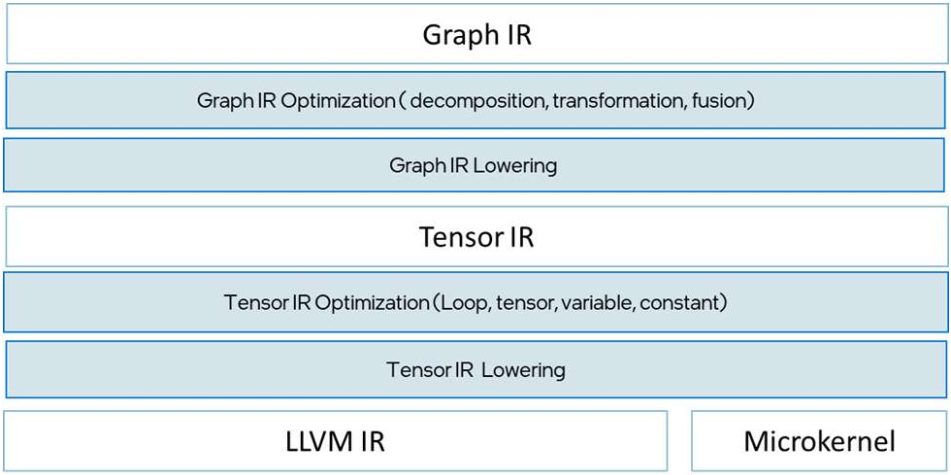
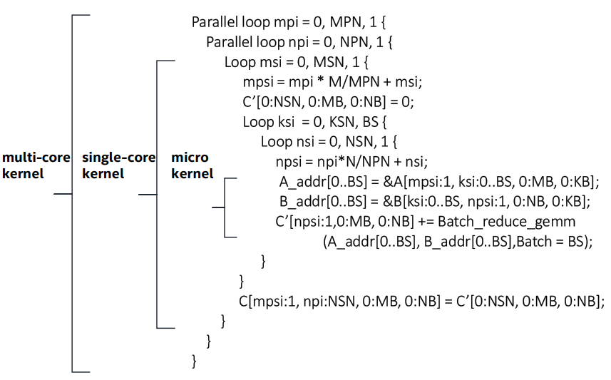
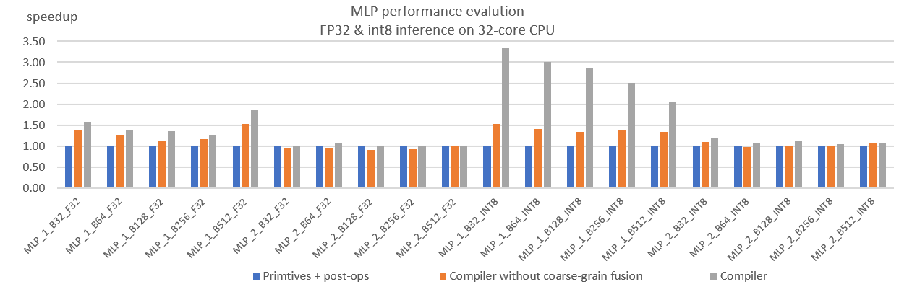
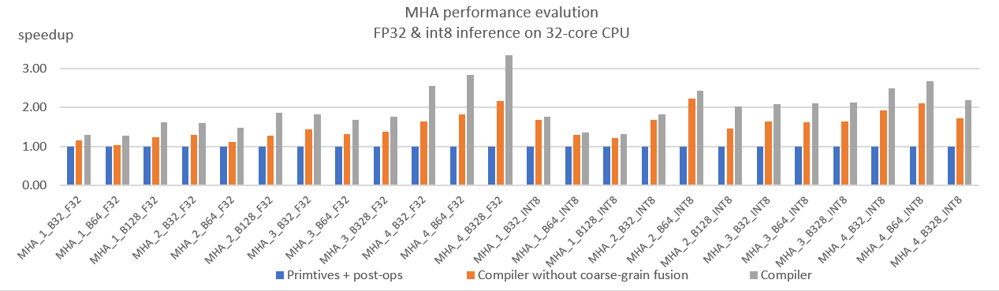

# Graph compiler backend for oneDNN Graph

## Background and Motivation

Graph Compiler is a compiler based solution that automates the code generation
for compute-intensive DNN operations like matrix multiplication and achieves
the same level of computing efficiency as primitives library implementation.
Based on that, it further explores more advanced optimization for a subgraph
with multiple compute-intensive DNN operations, such as optimizing the whole
Multilayer Perception (MLP) network construct containing multiple matrix
multiplication operations.

Graph Compiler applied domain-specific expert knowledge that was distilled from
the expert-tuned kernel development process to an automated compilation process
and achieved performance in parity. It combines compiler and kernel library
techniques and focuses on domain-specific optimization problems. With
expert-tuned microkernels and two levels of compiler IR, Graph Compiler
addresses domain-specific optimization challenges, such as generating efficient
code for the compute-intensive kernels of static tensor shapes with blocked
memory layout, constant weight optimization, aggressive fusion, and memory
buffer reuse. Experimental results show that oneDNN Graph Compiler delivers
significant performance gains over primitive-based optimization for
performance-critical DNN computation graph patterns on CPU.

## Introduction

Graph Compiler has two levels of intermediate representations: Graph IR, and
Tensor IR. The input DNN computation graph is internally represented as
Graph IR. The Graph IR optimization module performs a number of transformations
that optimize and group the computation graph as a sequence of fused operations.
Graph IR is further lowered to Tensor IR. The Tensor IR doesn’t preserve DNN
operation semantics and is close to the C program semantics. The data structure
it operates on is multidimensional arrays, representing tensor buffers in
physical memory. Tensor IR is then further lowered to LLVM IR and intrinsic
calls to Microkernels.

### Graph IR

Graph IR uses graph, logical tensor, and OP to describe a computation graph.
A graph contains a set of OPs and logical tensors. Each OP represents an
operation in a computation graph. A logical tensor represents the tensor’s
metadata, like the element’s data type, shape, and memory layout. OP has kind,
category, attributes, and logical tensors for inputs and outputs.

Graph IR optimization module first decomposes complex OPs into basic DNN OPs.
The complex DNN OPs are OPs with complex semantics which could be composed of
simple fundamental operations like addition and multiplication. They are
introduced by DL frameworks to support high-level DNN OP semantics for ease of
programming, such as batchnorm, quantize, gelu, and many activation operations.
The basic DNN OPs are categorized to be either Tunable OP or Fusible OP.
Tunable OPs describe DNN operations that use tunable parameters to instantiate
a pre-defined template to generate the best-performing code. The example
includes compute-intensive operations like matmul. Fusible OP refers to
operations that can be fused to Tunable OPs, such as element-wise operations,
broadcast, reduction, and data movement operations.

### Tensor IR

Just like the C program, Tensor IR supports function, statement, expression,
and intrinsic functions. The Tensor IR module, lowered from a Graph IR graph,
contains multiple functions, each of which represents a lowered Fused OP.
The Tensor IR module has an entry function that contains a sequence of calls to
other functions lowered from Fused OPs. A Tensor IR function contains multiple
statements build on expressions, which operate on constants, variables, and
tensors. Constants and variables represent individual data elements, used to
represent scalar data like loop index, tensor shape, address and offset to
tensor buffer. Tensors represent multi-dimension arrays backed by a data buffer.
The intrinsic function is used to represent a microkernel, which is carefully
hand-tuned and fulfills a subtask of a DNN OP with data in the fastest cache on
a single CPU core.

## Microkernel-Based Template for Tunable OP

Graph Compiler took an approach inherited from the performance library
development, which first creates the code templates for a given Tunable OP and
then instantiates it with parameters decided by a heuristic. The parameters are
decided based on the input data tensor shape and hardware sizes of the
microarchitecture.

The template shown above is for a matmul op that does matrix multiplication
over A[M, K] and B[K, N] and produces C[M, N].  The template is applied to a
common deep learning use case where the computation uses multiple cores, and
the size of input and output tensor fits within the cache system. The outer
parallel loops divide the kernel into multiple subtasks for multi-cores. Each
subtask is assigned to one single core, named single-core kernel, which is
epresented by the inner loops which call a microkernel in the innermost loop
body.

The microkernel and the single-core kernel operate on a tensor slice that
represents a subset of tensor elements. For example, the original tensor is
represented as A[0:M, 0:N], where the subscription represents starting offset
and size for each dimension. The tensor slice is represented as A[0:MB, 0:NB],
where MB and NB refer to the tile size of the tensor slice along m and n
imensions. A submatrix is a special case of a 2-dimension tensor slice. In the
template above, the microkernel produces a small submatrix C[0:MB, 0:NB], and
the single-core kernel outputs a larger submatrix C[0:MSN, 0:NSN].

## Fusion types
Graph Compiler supports two types of fusion: fine-grain fusion fuses one Tunable
OP with multiple adjacent Fusible OPs to a Fused OP, and coarse-grain fusion
fuses multiple Fused OPs.

### Fine-grain fusion.
The fine-grain fusion is supported by the template of
Tunable OP. The template contains placeholders, as known as anchors, at the
beginning and the end of each loop level for the input and output tensors. The
Graph IR fusion optimization decides whether it is profitable to fuse a Fusible
OP to a Tunable OP and which anchor point is assigned to the Fusible OP. The
Fused OP lowering pass retrieves anchors for Fusible OPs and directly inserted
its corresponding Tensor IR at the anchor.

The fusion optimization uses a heuristic to decide which anchor to choose.
The heuristic evaluates the cost of a single-cost kernel between all possible
anchors and the option of not fusion, and then it chooses the one with the
lowest estimated cost. Many choices are straightforward so there is no need
for over-tuning.

### Coarse-Grain Fusion
The coarse-grain fusion optimization further merges fused ops. The larger scope
of the DNN graph opens many possibilities. Multiple Fused ops could be lowered
to one parallel loop, in order to improve data locality or better exploit the
parallelism. When the heuristic chooses the parameters for each Tunable op,
it tries to choose the outermost loop blocking factor best aligned with core
numbers, so each instantiated fused op has the same blocking factors as its
neighbor. When the coarse-grain fusion optimization decides to merge two fused
ops, it marks the two nested loops in Tensor IR as “mergeable” during the
lowering process. Then Tensor IR merges two nested loops mechanically as guided
by the Graph IR optimizations.

## Codegen

Graph Compiler supports 3 different codegen for different purpose:

- C codegen
  - Can be used to generate offline C kernel
  - Can be used for debugging purpose as the generated code is more friendly and
    readable to developers.
- LLVM codegen
  - Provide best performance so far.
  - Depends on LLVM project.
- Builtin codegen
  - Implemented with xbyak technology inside, no extra dependency.
  - Supports AVX512 for now, will extend to AVX2.

## Fusion Patterns

For now, Graph compiler provides three major patterns:

- The Multilayer Perceptron (MLP) workload contains multiple matmul ops
  intermixed with activation ops like ReLU.
- The Multi-Head Attention (MHA) subgraph, which is the key element to
  Transformer based deep learning models like Bert for natural language
  processing.
- The convolution blocks subgraph, which contains 2-6 convolution layers
  with activation, normalization and residual_add.

Each pattern provides below capabilites:
- Cover both inference and training.
- Cover fp32/bf16/int8 in inference and fp32/bf16 in training.
- Cover AVX-512 and upper ISAs inlcuding AMX.

## Performance

We selected MLP inference and MHA inference as target workloads to evaluate
the performance.

## User Visible Options

Below table contains the cmake option introduced by graph compiler:

|CMake Option|Supported values (defaults in bold)|Description|
|----| ----  | ----|
|ONEDNN_EXPERIMENTAL_GRAPH_COMPILER_BACKEND|ON, **OFF**|Enables building graph compiler backend|
|ONEDNN_EXPERIMENTAL_GRAPH_COMPILER_CPU_JIT|**llvm;builtin**;C|Select the CPU codegen and JIT to build|
|ONEDNN_EXPERIMENTAL_GRAPH_COMPILER_CPU_LLVM_CONFIG|**AUTO**, {llvm-config EXECUTABLE}|Required when llvm codegen is selected. Defines the method for detecting/configuring LLVM|

The environment variables introduced by graph compiler:

Environment variables | Supported values (defaults in bold) | Description
-- | -- | --
ONEDNN_EXPERIMENTAL_GRAPH_COMPILER_CPU_JIT | **llvm**, builtin, c | Specify the CPU codegen and JIT.
ONEDNN_EXPERIMENTAL_GRAPH_COMPILER_OPT_LEVEL | 0,1,2,**3** | Optimization level for both graph compiler and codegen.
ONEDNN_EXPERIMENTAL_GRAPH_COMPILER_KERNEL_TRACE | {**0**,1},{stderr,filename.json} | Generates kernel execution trace in given filename with chrome tracing format.
ONEDNN_EXPERIMENTAL_GRAPH_COMPILER_PRINT_PASS_RESULT | **0**, 1 | Print the output IR of each graph and tensor IR passes.
ONEDNN_EXPERIMENTAL_GRAPH_COMPILER_VERBOSE | **0**, 1, 2 | Print error or warning message during compilation.
ONEDNN_EXPERIMENTAL_GRAPH_COMPILER_DUMP_GENCODE | {path_to_dump} | Dump the genereated kernel in C
ONEDNN_EXPERIMENTAL_GRAPH_COMPILER_C_INCLUDE | {path_to_c_codegen_header} | Specify the C codegen header for JIT compliation.

## Additional dependecies

LLVM is the only external dependency introduced by graph compiler. This
dependecy is also optional. it will take effect only if LLVM codegen is selected
during build.

## OneDNN Graph API change

graph compiler doesn't require any OneDNN Graph front-end API change. The
existing back-end API has fully met the needs of this new backend.
Thus **NO** API change for both front-end and back-end.

## Current Limitations and Future Work

Currently graph compiler supports CPU only and doesn't support GPU. Since graph
IR and tensor IR is designed to support both CPU and GPU. we can extend current
implementation by adding GPU codegen and backend related optimization passes to
provide GPU support in future.

On CPU side, graph compiler doesn't support AVX2 and SSE for now. It's not a
design limitation, may extend to cover those in future.

Graph compiler will takes longer kernel complation time than primitive side.
There're several ways to improve this:
- If AOT compilation is allowed, C kernel can be generated offline and load it
  during execution.
- Dynamic shape support can help to reduce the kernel compilation times.
- If above method can't apply, consider to disable compiler backend and use DNNL
  backend only.
