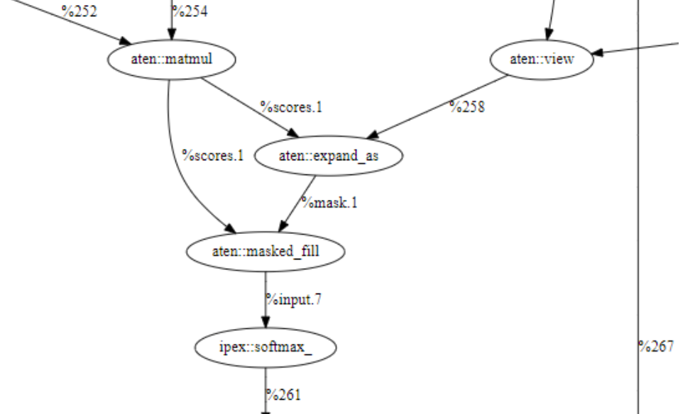
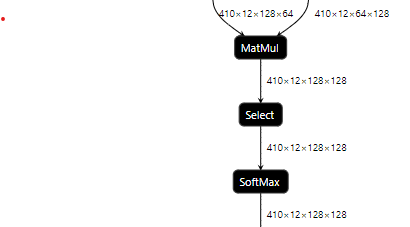

# Proposal for supporting Boolean data type and new `select` operation in Graph API

## Motivation

According to the [proposal](https://github.com/oneapi-src/onednn/pull/1529),
graph compiler backend will be added to the implementation of graph component.  

Currently, boolean data type and `Select` operation are only used in fusion
patterns of graph compiler backend. By supporting Boolean data type,
more operations can be fused into a bigger partition for better performance.

This proposal is to support Boolean data type and add a new operation `select`
in oneDNN Graph API to support graph compiler distilBert model optimization.
(Boolean operations means operations with at least one inputs or outputs tensor
whose data type is Boolean. Similarly hereinafter.）

Currently, this RFC is mainly for graph compiler backend, and need to be merged
with the [RFC](https://github.com/oneapi-src/onednn/pull/1529) of adding graph compiler backend into graph component in the same release version.

## support Boolean data type in oneDNN

### Boolean data type in mainstream frameworks

Tensorflow uses [bool(DT_BOOL)](https://www.tensorflow.org/api_docs/python/tf/dtypes)
for Boolean data type.

```cpp
MATCH_TYPE_AND_ENUM(float, DT_FLOAT);
MATCH_TYPE_AND_ENUM(bool, DT_BOOL);
MATCH_TYPE_AND_ENUM(qint8, DT_QINT8);
    ......
// Template specialization for both DataTypeToEnum and EnumToDataType.
#define MATCH_TYPE_AND_ENUM(TYPE, ENUM)                 \
  template <>                                           \
  struct DataTypeToEnum<TYPE> {                         \
    static DataType v() { return ENUM; }                \
    static DataType ref() { return MakeRefType(ENUM); } \
    static constexpr DataType value = ENUM;             \
  };                                                    \
  template <>                                           \
  struct IsValidDataType<TYPE> {                        \
    static constexpr bool value = true;                 \
  };                                                    \
  template <>                                           \
  struct EnumToDataType<ENUM> {                         \
    typedef TYPE Type;                                  \
  }
```

By this Template function [MATCH_TYPE_AND_ENUM(bool, DT_BOOL)](https://github.com/tensorflow/tensorflow/blob/27f423691bdff4c149924374d05c4683caa11827/tensorflow/core/framework/types.h#L393),
C++ bool can be convert to Enum DT_BOOL, vice versa.
That is to say, in Tensorflow, DT_BOOL is actually C++ bool.

Pytorch uses [torch.bool](https://pytorch.org/docs/stable/tensors.html) for
Boolean data type, which is stored in C++ class TypeMeta. TypeMeta is a thin
class that allows us to store the type of a container such as a blob, or the
data type of a tensor, with a unique run-time id. TypeMeta can be created by
enum Class ScalarType.

```cpp
  inline TypeMeta& operator=(ScalarType scalar_type) noexcept {
    index_ = static_cast<uint16_t>(scalar_type);
    return *this;
  }
```

enum Class ScalarType defined as following:

```cpp
enum class ScalarType : int8_t {
#define DEFINE_ENUM(_1, n) n,
  AT_FORALL_SCALAR_TYPES_WITH_COMPLEX_AND_QINTS(DEFINE_ENUM)
#undef DEFINE_ENUM
      Undefined,
  NumOptions
};
// C++ bool is defined as enum Bool in ScalarType
#define AT_FORALL_SCALAR_TYPES_WITH_COMPLEX_AND_QINTS(_) \
    ......
  _(float, Float) /* 6 */                                \
  _(double, Double) /* 7 */                              \
    ......
  _(bool, Bool) /* 11 */                                 \
    ......
// enum Bool can be convert to C++ bool
#define SPECIALIZE_ScalarTypeToCPPType(cpp_type, scalar_type)                \
  template <>                                                                \
  struct ScalarTypeToCPPType<c10::ScalarType::scalar_type> {                 \
    using type = cpp_type;                                                   \
                                                                             \
    /* This is a workaround for the CUDA bug which prevents */               \
    /* ::detail::ScalarTypeToCType<T>::type being used directly due to */    \
    /* ambiguous reference which can't to be resolved. For some reason it */ \
    /* cant pick between at::detail and at::cuda::detail. */                 \
    /* For repro example, please see: */                                     \
    /* https://gist.github.com/izdeby/952ae7cf256ddb740a73776d39a7e7ba */    \
    /* TODO: remove once the bug is fixed. */                                \
    static type t;                                                           \
  };
AT_FORALL_SCALAR_TYPES_WITH_COMPLEX_AND_QINTS(SPECIALIZE_ScalarTypeToCPPType)
```

From the [macro](https://github.com/pytorch/pytorch/blob/50c60c770e361a5fe37c34ba60408d3836e01e45/c10/core/ScalarType.h#L40),
we can find C++ bool is defined as Enum Bool and Bool can be converted to
C++ bool.

Same as Tensorflow, torch.bool is actually C++ bool as well.

### Proposal

To better bridge the data type gap between oneDNN Graph and frameworks and make
integration smoother and more efficient, standard C++ `bool` is introduced for
oneDNN Graph. Size of standard C++ `bool` is implementation specific. Different
platforms may have different sizes. But `bool` size is fixed at compilation
time. By this information, backends can decide whether/how to support depending
on its capabilities. `bool` is capable of holding one of the two values: true or
false. Encoding and decoding rules in oneDNN Graph follow C++ standard rules:

1. Other types to `bool` [rule](https://en.cppreference.com/w/cpp/language/implicit_conversion#Boolean_conversions):
   The value zero and the null pointer and the null pointer-to-member values
   become false. All other values become true.
2. `bool` to integral types [rule](https://en.cppreference.com/w/cpp/language/implicit_conversion#Integral_promotion):
   the type `bool` can be converted to `int` with the value `false` becoming ​0
   and `true` becoming 1.

To support this feature, oneDNN doc, oneDNN API，oneDNN Graph API and frameworks
bridge should be updated:

1. oneDNN doc

Add `boolean` as supported data types in doc/programming model/data_types.md 
   |  Data Type   | Description
   |  ----  | ----
   | f32   | [IEEE single precision floating-point](https://en.wikipedia.org/wiki/Single-precision_floating-point_format#IEEE_754_single-precision_binary_floating-point_format:_binary32)
   | bf16  | [non-IEEE 16-bit floating-point](https://software.intel.com/content/www/us/en/develop/download/bfloat16-hardware-numerics-definition.html)
   | f16  | [IEEE half precision floating-point](https://en.wikipedia.org/wiki/Half-precision_floating-point_format#IEEE_754_half-precision_binary_floating-point_format:_binary16)
   | s8/u8  | signed/unsigned 8-bit integer
   | f64    | [IEEE double precision floating-point](https://en.wikipedia.org/wiki/Double-precision_floating-point_format#IEEE_754_double-precision_binary_floating-point_format:_binary64)
   | boolean  | C++ bool, size is language implementation defined

2. oneDNN API

Add dnnl_boolean data type in oneDNN API.

   ``` cpp
   /// Data type specification
   typedef enum {
       /// Undefined data type, used for empty memory descriptors.
       dnnl_data_type_undef = 0,
       /// 16-bit/half-precision floating point.
       dnnl_f16 = 1,
       /// non-standard 16-bit (bfloat16 w/ 7 bit mantissa) floating point.
       dnnl_bf16 = 2,
       /// 32-bit/single-precision floating point.
       dnnl_f32 = 3,
       /// 32-bit signed integer.
       dnnl_s32 = 4,
       /// 8-bit signed integer.
       dnnl_s8 = 5,
       /// 8-bit unsigned integer.
       dnnl_u8 = 6,
       /// 64-bit/double-precision floating point.
       dnnl_f64 = 7,
       /// boolean data type. C++ implementation defined.
       dnnl_boolean = 8,
        
       /// Parameter to allow internal only data_types without undefined
       /// behavior. This parameter is chosen to be valid for so long as
       /// sizeof(int) >= 2.
       dnnl_data_type_max = 0x7fff,
   } dnnl_data_type_t;
   ```

3. oneDNN Graph

oneDNN Graph needs to add `boolean` in supported data types.

    ``` cpp
    /// Data Type
    enum class data_type {
        undef = dnnl_data_type_undef,
        /// 16-bit/half-precision floating point.
        f16 = dnnl_f16,
        /// non-standard 16-bit (bfloat16 w/ 7 bit mantissa) floating point.
        bf16 = dnnl_bf16,
        /// 32-bit/single-precision floating point.
        f32 = dnnl_f32,
        /// 32-bit signed integer.
        s32 = dnnl_s32,
        /// 8-bit signed integer.
        s8 = dnnl_s8,
        /// 8-bit unsigned integer.
        u8 = dnnl_u8,
        /// boolean data type. C++ implementation defined.
        boolean = dnnl_boolean,
    };
    ```

4. Frameworks

Frameworks map `bool` to oneDNN Graph `data_type::boolean` for C++ and
   `dnnl_boolean` for C.

## Add `Select` operation in oneDNN Graph operation set

### Introduction

`Select` operation is used in DistillBert and LLM. To better optimize their
performance, `Select` is suggested to be fused in pattern for Graph Compiler. So
`Select` operation is introduced as one of oneDNN Graph supported operations.

### Formulas

The `Select` operation is a conditional operation, which returns a tensor filled
with the elements from the second or the third inputs, depending on the
condition (the first input) value.
> dst[i] = cond[i] ? then[i] : else[i]

### Operations

#### Proposed Attributes

Only one attribute for `select`operation: auto_broadcast.
Attribute Name | Description | Value Type |Supported Values | Required or Optional
-- | -- | --| --|--
auto_broadcast | Specifies rules used for auto-broadcasting of src tensors. |string |`none`, `numpy` (default)  | Optional

#### Proposed Inputs and Outputs

There will be 3 input tensors and 1 output tensor for the proposed Select
operation.

##### Inputs

| Index | Argument Name | Required or Optional |
| ----- | ------------- | -------------------- |
| 0     | `cond`        | Required             |
| 1     | `then`        | Required             |
| 2     | `else`        | Required             |

@note Shapes of `cond`, `then` and `else` should match and no auto-broadcasting
is allowed if auto_broadcast attributes is none. If auto_broadcast attributes is
numpy, `then` and `else` can be broadcasted to each other, `cond` will be
one-way broadcasted to the resulting shape of broadcasted `then` and `else`.

##### Outputs

| Index | Argument Name | Required or Optional |
| ----- | ------------- | -------------------- |
| 0     | `dst`         | Required             |

#### Proposed Shape Infer function

If `auto_broadcast` attribute is not `none`, select operation takes a two-step
broadcast before performing selection:

- step 1: input tensors `then` and `else` are broadcasted to each other if their
  shapes are different
- step 2: then the `cond` tensor will be one-way broadcasted to the resulting
  shape of broadcasted `then` and `else`. To be more specific, we align the two
  shapes to the right and compare them from right to left. Each dimension
  should be either a common length or the dimension of `cond` should be 1.
  for example:
  - cond={4, 5}, output_shape={2, 3, 4, 5} => result = {2, 3, 4, 5}
  - cond={3, 1, 5}, output_shape={2, 3, 4, 5} => result = {2, 3, 4, 5}
  - cond={3,5}, output_shape={2, 3, 4, 5} => result = invalid_shape

Otherwise, if `auto_broadcast` attribute is set `none`, all input tensors should
have the same shape.

### API changes

One new operation kind values will be added to `dnnl_graph_op_kind_t` and
`class op::kind::`.

```c
// dnnl_graph_types.h
typedef enum {
    // ...
    dnnl_graph_op_select,
    dnnl_graph_op_last_symbol,
} dnnl_graph_op_kind_t;
// dnnl_graph.hpp
// class op
enum class kind {
    // ...
    Select = dnnl_graph_op_select,
};
```

### Backend changes

Currently only oneDNN Graph compiler backend will handle `Select` operation and
related fusions.

### Documentation changes

`boolean` data type should be added to Corresponding operation documents should
be added to `doc/graph/operations/`.

### Example

`masked_fill` is used in Pytorch DistillBert model 
and IPEX bridge will map it to `Select` operation for graph compiler as
following graph shows. 

Please note that this graph was generated by Netron, which only contains edges
from operations. The other two inputs of `Select` operation are values, so we
can find only one input of `Select` operationin in this graph.
