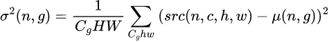
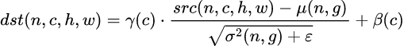

Proposal for Instance Normalization
===================================

## 0. Summary (TLDR)

Instance normalization is a another way to normalize data that solves some of
batch normalization issues. Instance normalization is used in 3D U-Net and Stable
Diffusion. This RFC proposes to add a Group normalization primitive which is a
generalization of Instance normalization to cover both 3D U-Net and Stable Diffusion
models.


## 1. Introduction

Instance normalization was introduced as a replacement of Batch normalization in
real-time image generation workloads for both inference and training[[#1]][1].

- Batch normalization:
  - Mean:

    
  - Variance:

    
  - Normalization:

    

- Instance normalization:
  - Mean:

    
  - Variance:

    
  - Normalization:

    

The only difference between these 2 normalization algorithms is that Instance
normalization compute separate Mean and Variance values for each batch.

There is another normalization called Group normalization[[#2]][2]. This
normalization is a generalization of Instance normalization that splits channels
onto groups:
  - Mean:

    
  - Variance:

    
  - Normalization:

    

**Notes**:
- Channels dimension must be divisible by groups.
- Group normalization is equal to Instance normalization when `groups = channels`.

### 1.1. Frameworks support

#### OpenVino

OpenVino doesn't support Instance normalization as part of OpSet but it has a
transformation[[#3]][3] that converts a PyTorch InstanceNormalization into an OpenVino
BatchNormalization. This transformation adds a few extra nodes to the graph to make
this conversion possible.

#### TensorFlow

TensorFlow supports Instance normalization as part of TensorFlow SIG Addons (tensorflow_addons)[[#4]][4].
This is a repository of community contributions that implements new functionality
not available in core TensorFlow[[#5]][5].

Also TensorFlow supports Group normalization[[#6]][6].

#### PyTorch

PyTorch supports Instance normalization [[#7]][7].

Also PyTorch supports Group normalization[[#8]][8].

### 1.2. Models

Instance normalization is used in:
- TensorFlow-based 3D U-Net[[#9]][9]. According to the projections Instance normalization takes up to 25% of model time on inference in case of int8 or up to 10% in case of f32 which is significant.
- U-Net-based Stable Diffusion [[#10]][10]. This model also uses Group normalization.

## 2. Optimizing Instance normalization using oneDNN

There are a few ways to optimize Instance normalization using oneDNN

### 2.1. Batch normalization

### 2.1.1 A loop over a Batch normalization primitive

Instance normalization can be supported via a sequence of Batch normalization
primitives where each of them normalizes a single instance:
```
src = array(n, c, h, w)
dst = array(n, c, h, w)
gama = array(c)
beta = array(c)

# Emulation of Instance normalization
for i in range(1, n):
     src_i = src.offset(i, 0, 0, 0)
     dst_i = dst.offset(i, 0, 0, 0)
     dst_i = batch_norm(src_i, gama, beta)
```

Pros:
 - No changes to oneDNN.

Cons:
 - In case of small feature size there is a potential performance penalty because
 Batch normalization primitive does not utilize batch dimension to split work
 across cores.

### 2.1.2 a Batch normalization primitive with joined batch and feature dimensions

Another way to support Instance normalization using batch normalization is to
join batch and feature dimensions similar to OpenVino approach:
```
src = array(n, c, h, w)
dst = array(n, c, h, w)
gama = array(c)
beta = array(c)

# Emulation of Instance normalization
src_new = src.reshape(1, n * c, h, w)
dst_new = dst.reshape(1, n * c, h, w)
gamma_new = gamma.broadcast(n, c)
beta_new = beta.broadcast(n, c)
dst_new = batch_norm(src_new, gama_new, beta_new)
```

Pros:
 - No changes to oneDNN.

Cons:
 - A potential performance penalty because gama and beta should be broadcasted
 on forward pass and reduced on backward pass.
 - Data should be reordered into `nchw` since in `nhwc` `n` and `c` can't be collapsed.

### 2.2. Layer normalization

Layer normalization is another type of normalization used in machine translation
workloads. It computes normalization across features dimension which is the last dimension
in a tensor with dimensions `[t, n, c]`. Instance normalization can be performed
using layer normalization if the original tensor `[n, c, h, w]` is reshaped to `[n, c, hw]`.
However gamma and beta can't be used as part of Layer normalization, because
otherwise they will be applied across `hw` and not `c`:
```
src = array(n, c, h, w)
dst = array(n, c, h, w)
gama = array(c)
beta = array(c)

# Emulation of Instance normalization
src_new = src.reshape(n, c, h*w)
dst_new = dst.reshape(n, c, h*w)
gamma_new = gamma.reshape(1, c, 1)
beta_new = beta.broadcast(1, c, 1)
dst_new = gama * layer_norm(src_new) + beta
```

Pros:
 - No changes to oneDNN.

Cons:
 - A performance penalty due to an additional pass over memory to apply gamma
 and beta parameters.

### 2.3. A Dedicated primitive

#### 2.3.1. Instance normalization

A dedicated primitive would ease integration of oneDNN into frameworks that
support Instance normalization.

API:
```c
// include/oneapi/dnnl/dnnl.h

dnnl_status_t DNNL_API dnnl_instance_normalization_forward_primitive_desc_create(
        dnnl_primitive_desc_t *primitive_desc, dnnl_engine_t engine,
        dnnl_prop_kind_t prop_kind, const_dnnl_memory_desc_t src_desc,
        const_dnnl_memory_desc_t dst_desc, float epsilon, unsigned flags,
        const_dnnl_primitive_attr_t attr);

dnnl_status_t DNNL_API dnnl_instance_normalization_backward_primitive_desc_create(
        dnnl_primitive_desc_t *primitive_desc, dnnl_engine_t engine,
        dnnl_prop_kind_t prop_kind, const_dnnl_memory_desc_t diff_src_desc,
        const_dnnl_memory_desc_t diff_dst_desc,
        const_dnnl_memory_desc_t src_desc, float epsilon, unsigned flags,
        const_dnnl_primitive_desc_t hint_fwd_pd,
        const_dnnl_primitive_attr_t attr);
```

Pros:
 - Straight-forward integration.

Cons:
 - Application of Instance normalization is very limited.


#### 2.3.2. Group normalization

Instance normalization is a special case of a Group normalization where number
of groups is equal to number of channels. Group normalization was introduced as
an attempt to solve Batch normalization requirement for sufficiently large batch
size on training[[#2]][2].

```
src = array(n, c, h, w)
dst = array(n, c, h, w)
gama = array(c)
beta = array(c)

# Emulation of Instance normalization
dst = group_norm(src, gamma, beta, n_groups=c)
```

API:
```c
// include/oneapi/dnnl/dnnl.h

dnnl_status_t DNNL_API dnnl_group_normalization_forward_primitive_desc_create(
        dnnl_primitive_desc_t *primitive_desc, dnnl_engine_t engine,
        dnnl_prop_kind_t prop_kind, const_dnnl_memory_desc_t src_desc,
        const_dnnl_memory_desc_t dst_desc, int groups, float epsilon,
        unsigned flags, const_dnnl_primitive_attr_t attr);

dnnl_status_t DNNL_API dnnl_group_normalization_backward_primitive_desc_create(
        dnnl_primitive_desc_t *primitive_desc, dnnl_engine_t engine,
        dnnl_prop_kind_t prop_kind, const_dnnl_memory_desc_t diff_src_desc,
        const_dnnl_memory_desc_t diff_dst_desc,
        const_dnnl_memory_desc_t src_desc, int groups, float epsilon,
        unsigned flags, const_dnnl_primitive_desc_t hint_fwd_pd,
        const_dnnl_primitive_attr_t attr);
```

Pros:
 - Straight-forward integration.

Cons:
 - The parameter `groups` makes algorithm very flexible which makes scope of
 optimizations and validation wide. As a result we might end up with a sub-optimal
 implementation for all configurations except for `n_groups=1` and `n_groups=c`.


### 3. Experiments

A loop over a Batch normalization is the only way that is flexible enough to
support both `nchw` and `nhwc` tags and scale and shift parameters. The next
experiment estimates how much can we gain if we add a dedicated Instance
normalization primitive comparing to a loop over a Batch normalization.

Here is an example of Instance normalization implemented using the following approaches:
1. Reshape `[n, c, h, w] -> [n, c, h*w]`+ Layer normalization;
2. A loop over Batch normalization primitive created with batch size equal to 1;
3. Reshape `[n, c, h, w] -> [1, n*c, h, w]` + Batch normalization.

<details>
  <summary>Source code</summary>
https://github.com/igorsafo/oneDNN/blob/b9e08b84ad03d837a7def82dab1816577f7fb18e/rfcs/20230315-instance-normalization/instance_normalization.cpp#L1-L288
</details>

We use this example to benchmark different approaches on cases from 3D U-Net:
| Shape                  | lnorm    | bnorm: loop | bnorm: collapsed dims | best of 3 vs bnorm: loop |
| ---------------------- | -------- | ----------- | --------------------- | ------------------------ |
| [6, 32, 160, 224, 224] | 0.277857 | 0.292688    | 0.292637              | 1.053376377              |
| [6, 256, 20, 28, 28]   | 0.002201 | 0.004927    | 0.004552              | 2.238527942              |
| [6, 320, 10, 14, 14]   | 0.000051 | 0.000777    | 0.000686              | 15.23529412              |
| [6, 128, 6, 7, 7]      | 0.000012 | 0.000133    | 0.000053              | 11.08333333              |


The performance is collected on a 28 core Intel(R) Xeon(R) Platinum 8280 CPU using the following command:
```sh
$ numactl --physcpubind=0-27 -l ./build/examples/primitives-instance-normalization-cpp
```

A loop over Batch normalization is slower than a single call to either layer or
batch normalization. One of important differences is Instance normalization has
`batch * channel` of independent normalizations that can be split across cores
but a loop over a batch normalization only utilizes parallelism across `channel`
dimension which is limited. When number of cores increases the difference
becomes bigger.


### 4. Proposal

The recommendation is to introduce a Group normalization primitive because:
- it will cover Instance normalization needs for 3D U-Net:
  - ease of integration
  - additional performance
- it will cover Stable diffusion:
  - Instance normalization in the U-Net part
  - Group normalization in the Attention part


## References

1. [Instance Normalization: The Missing Ingredient for Fast Stylization][1]
2. [Group normalization][2]
3. [OpenVino PyTorch frontend Instance normalization][3]
4. [TensorFlow Instance normalization][4]
5. [TensorFlow Addons][5]
6. [TensorFlow Group normalization][6]
7. [PyTorch Instance normalization][7]
8. [PyTorch Group normalization][8]
9. [IntelAI models: 3D U-Net][9]
10. [The Annotated Diffusion Model][10]

[1]: https://arxiv.org/pdf/1607.08022v3.pdf
[2]: https://arxiv.org/pdf/1803.08494.pdf
[3]: https://github.com/openvinotoolkit/openvino/blob/c09b2ff8b10aa344eedb28ce24ed9a6eeef5e9fb/src/frontends/pytorch/src/op/instance_norm.cpp#L48
[4]: https://www.tensorflow.org/addons/api_docs/python/tfa/layers/InstanceNormalization
[5]: https://www.tensorflow.org/addons
[6]: https://www.tensorflow.org/api_docs/python/tf/keras/layers/GroupNormalization
[7]: https://pytorch.org/docs/stable/generated/torch.nn.InstanceNorm2d.html
[8]: https://pytorch.org/docs/stable/generated/torch.nn.GroupNorm.html
[9]: https://github.com/IntelAI/models/blob/ff7d9c7041590a78fbc8885fddc0d74d5c2564dd/models/image_segmentation/tensorflow/3d_unet/inference/fp32/unet3d/training.py#L45
[10]: https://huggingface.co/blog/annotated-diffusion
---

EOD
