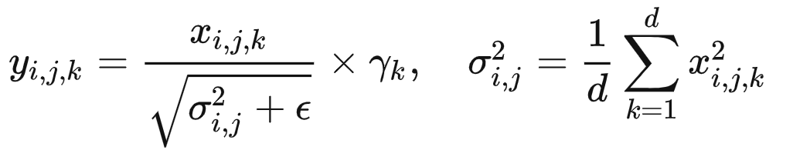
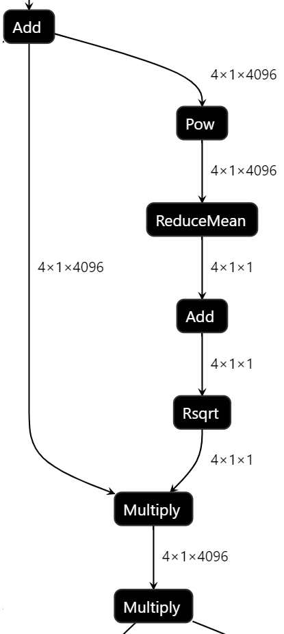

# Support Pow and Rsqrt in Graph API

## Background

### Motivation

With the development of LLM, workloads like LLaMa and GPT-J have become quite
popular in the open-source community, which requires oneDNN to provide
corresponding support and optimization.

`Pow` and `Rsqrt` are used in the Pytorch version of LLaMa and GPT-J. The
framework team is requesting oneDNN Graph API to support the two operations and
the graph compiler backend to fuse and optimize them.

### Investigation

`Pow` and `Rsqrt` are used to construct RMSNorm, which is a variant of L2
normalization. RMSNorm plays an significant role in MLP pattern. The formula is
as follows:

The MLP pattern in LLaMa mainly consists of two RMSNorm and one horizontally
merged matmul. The RMSNorm part is as shown in the following image:

Adding these two operations can help graph compiler to further fuse more
operations in the model, leading to the speedup. In addition, with the new ops,
graph compiler can take multiple matmuls into single partition to improve
performance.

The POC of graph compiler included `Pow` and `Rsqrt` has delivered 12% speedup
for int8-bf16 LLaMa end-2-end model.

#### operations used in Frameworks and toolkit

##### Pow

$$dst = {src ^ {exponent}}$$

| Pow       | TensorFlow | PyTorch   | ONNX     | OpenVINO       | oneDNN(eltwise_pow)   |
|-----------|------------|-----------|----------|----------------|-----------------------|
| input     | src        | src       | src      | src            | src                   |
| input     | exponent   | exponent  | exponent | exponent       |                       |
| attribute |            |           |          |                | exponent              |
| attribute |            |           |          |                | alpha                 |
| attribute |            |           |          | auto_broadcast |                       |
| output    | dst        | dst       | dst      | dst            | dst                   |

Most of them take `Pow` as a binary element-wise operation, while oneDNN uses it
as an unary element-wise operation.

Numpy broadcasting rule is supported for `Pow` in these frameworks and toolkit.
And in Openvivo, when attribute `auto_broadcast` is `none`, shapes of `src` and
`exponent` must be same.

The src and dst tensors should have the same data type and support floating
point data type (`f32`, `bf16` and `f16`). The exponent tensors can support
floating point data type (`f32`, `f16` and `f16`) as well. Attribute is a
single-value `f32` input.

Dst shape equals to broadcasted shape of inputs.

##### Rsqrt

`Rsqrt` op computes the reciprocal of the square-root of each element of
`input`. The src and dst tensors should have the same data type and support
floating point data type(`f32`, `bf16` and `f16`).

`Rsqrt` does the following computation with src:

$$ dst_{i} = \frac{1}{\sqrt{src_{i}}} $$

| Rsqrt     | Tensforflow | Pytorch | ONNX* | OpenVINO* | oneDNN* |
|-----------|-------------|---------|-------|-----------|---------|
| input     | src         | src     |       |           |         |
| attribute |             |         |       |           |         |
| attribute |             |         |       |           |         |
| output    | dst         | dst     |       |           |         |

*：ONNX, OpenVINO and oneDNN does not support Rsqrt directly, but in ONNX and
OpenVINO Rsqrt can be supported by Pow(src, -1/2) and in oneDNN it is supported
by Pow(src) with attribute -1/2.

## Proposal

To support the request from framework, we need to add new operations to graph
API, with 5 options provided as follows:

### Option 1: Add Unary Element-wise Pow only

Add eltwise `Pow` that takes a single input tensor src, with exponent as an
single-value attribute.
`Rsqrt` reuses `Pow` with exponent attribute -1/2.

| Pow       | Argument Name    | Required or Optional       | Data Type     |
|-----------|------------------|----------------------------|---------------|
| input     | `src`            | Required                   | f32,f16,bf16* |
| attribute | `exponent`       | Required                   | f32           |
| output    | `dst`            | Required                   | f32,f16,bf16* |

*: input and output must have the same data type.

Pros.

1. compatible with oneDNN
2. add one `Pow` for the functionality of two ops: `Pow` and `Rsqrt`(Pow with
   attribute -1/2)

Cons.

1. not compatible with most frameworks and toolkit which have two input tensors:
   one is `src` and the other is `exponent`
2. can not support runtime `exponent`, which is the output of the previous
   layer. (not sure whether runtime `exponent` is a typical usage in current
   models)

### Option 2: Pow with optional input exponent and attributes

`Pow` can take a second input tensor `exponent` as optional and attribute
`exponent` is optional as well. It accepts two configurations: eltwise Pow with
attribute `exponent` and binary Pow without attribute `exponent`.
`Rsqrt` reuses `Pow` with exponent attribute -1/2.

| Pow       | Argument Name    | Required or Optional        | Data Type     |
|-----------|------------------|-----------------------------|---------------|
| input     | `src`            | Required                    | f32,f16,bf16* |
| input     | `exponent`       | optional*                   | f32,f16,bf16  |
| attribute | `auto_broadcast` | optional, default: 'numpy'  | string        |
| attribute | `exponent`       | optional*                   | f32           |
| output    | `dst`            | Required                    | f32,f16,bf16* |

*: In terms of the `exponent` for the second input tensor and attribute, one and
   only one of them should be set. `auto_broadcast` works only when `exponent`
   is set as the second input tensor.

*: input and output must have the same data type.

Pros.

1. can resolve the cons in option 1.
2. add one `Pow` for two: `Pow` and `Rsqrt`(`Pow` with attribute `exponent`
   -1/2)

Cons.

1. both input and attribute have `exponent` input, making it confusing
2. extra efforts required for the backend to check the inputs.

To clear up any confusion: `Pow` can be split into `staticPow`( with exponent as
attribute) and `dynamicPow`(with exponent as input tensor)

### Option 3: Binary Element-wise Pow

`Pow` takes two input tensors `src` and `exponent`.
`Rsqrt` reuses `Pow` by making -1/2 as the second input tensor.

| Pow       | Argument Name    | Required or Optional       | Data Type     |
|-----------|------------------|----------------------------|---------------|
| input     | `src`            | Required                   | f32,f16,bf16* |
| input     | `exponent`       | optional                   | f32,f16,bf16  |
| attribute | `auto_broadcast` | optional, default: 'numpy' | string        |
| output    | `dst`            | Required                   | f32,f16,bf16* |

*: input and output must have the same data type.

Pros.

1. compatible with mainstream frameworks.
2. can add `Pow` only for covering the fuctionality of `Pow` and `Rsqrt`

Cons.

1. framework bridge needs to make -1/2 as the second input tensor for `Rsqrt`.
2. lose the constant information and optimization for rsqrt operation during
   transforming.

### Option 4: Add Both Binary Element-wise Pow and Rsqrt

This option will add two operation in Graph API.
`Pow` takes two input tensors `src` and `exponent`.
`Rsqrt` is added as an eltwise operation.

| Pow       | Argument Name    | Required or Optional       | Data Type     |
|-----------|------------------|----------------------------|---------------|
| input     | `src`            | Required                   | f32,f16,bf16* |
| input     | `exponent`       | optional                   | f32,f16,bf16  |
| attribute | `auto_broadcast` | optional, default: 'numpy' | string        |
| output    | `dst`            | Required                   | f32,f16,bf16* |

*: input and output must have the same data type.

| Rsqrt  | Argument Name | Required or Optional | Data Type     |
|--------|---------------|----------------------|---------------|
| input  | `src`         | Required             | f32,f16,bf16* |
| output | `dst`         | Required             | f32,f16,bf16* |

*: input and output must have the same data type.

Pros.

1. clearly mapping semantics of `Pow` and `Rsqrt` for frameworks.

Cons.

1. need to add two new operations: `Pow` and `Rsqrt`
2. `Pow` cannot be optimized with oneDNN primitive.

### Option 5: Add Binary Element-wise Pow and Use Reciprocal and Sqrt as Rsqrt

The option will add only one operation `Pow` and use `Reciprocal` and `Sqrt` to
cover the funcionality of `Rsqrt`.
`Pow` takes two input tensors `src` and `exponent`.
`Rsqrt` reuse `Reciprocal` and `Sqrt`: Rsqrt(src) = Reciprocal(Sqrt(src)).
`Reciprocal` and `Sqrt` are already supported in oneDNN Graph API.

| Pow       | Argument Name    | Required or Optional       | Data Type     |
|-----------|------------------|----------------------------|---------------|
| input     | `src`            | Required                   | f32,f16,bf16* |
| input     | `exponent`       | optional                   | f32,f16,bf16  |
| attribute | `auto_broadcast` | optional, default: 'numpy' | string        |
| output    | `dst`            | Required                   | f32,f16,bf16* |

Pros.

1. `Pow` is compatible with mainstream frameworks.
2. `Rsqrt` reuse current op set. Will keep the op set small.

Cons.

1. framework bridge will need to split `Rsqrt` to two oneDNN Graph operations.
2. `Pow` cannot be optimized with oneDNN primitive.

## Conclusion
In the technical meeting on ww17.2, option 1 is chosed as current solution:
unary eltwise Pow with attribute, Rsqrt reused Pow with attribute -1/2

1. Easy for framework to integrate
2. Can leverage oneDNN primitive
3. Don’t have runtime exponent Pow in current models

For runtime exponent, need revisit this proposal in the future. Maybe add a new
operation dynamicPow.
### API changes

New operation(s) will be added in Graph API.

### Backend changes

Graph Compiler backend will fuse new added operation(s) into MLP pattern for LLM
and do optimization to improve model performance as requested.

### Documentation changes

Corresponding operation documents should be added to `doc/graph/operations/`.

## References

1. https://pytorch.org/docs/stable/generated/torch.pow.html#torch.pow
2. https://www.tensorflow.org/api_docs/cc/class/tensorflow/ops/pow
3. https://docs.openvino.ai/latest/openvino_docs_ops_arithmetic_Power_1.html
4. https://github.com/onnx/onnx/blob/main/docs/Operators.md#pow
5. https://oneapi-src.github.io/oneDNN/dev_guide_eltwise.html
6. https://pytorch.org/docs/stable/generated/torch.rsqrt.html
7. https://www.tensorflow.org/api_docs/python/tf/math/rsqrt

