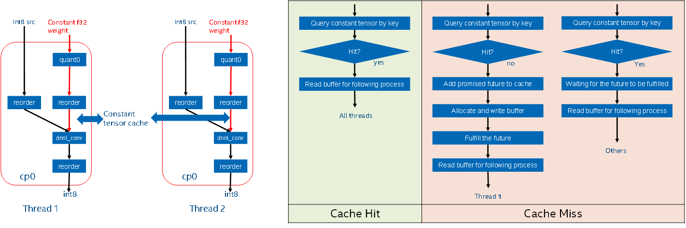

# Constant Tensor Cache Capacity Control in Graph API

## Introduction
Currently we have a constant tensor cache feature in DNNL backend, which is used
to cache those processed constant tensors (like reordered constant weights,
folded constant scales, ...) to reduce redundant computation and improve
performance. The following figure shows a basic design of this existing constant
tensor cache: we will cache the internal processed constant tensor to the cache
in the first iteration, and reuse it in next iterations. In concurrent execution
scenarios, the same compiled partition running in different threads will share
the same cached tensor, and we had a promise-future mechanism to allow only one
thread to initiate the computation of constant tensor, and other threads to wait
until the computation completes.



We have exposed two APIs to enable/disable the constant tensor cache and return
the enabling status:

```cpp
void set_constant_tensor_cache(int flag);
int get_constant_tensor_cache();
```

The existing constant tensor cache feature is enabled by default with an
unlimited capacity on both CPU and GPU. In some memory limited scenarios, users
may only want to cache a part of constant tensors to improve performance, but
don't want the cached capacity to grow infinitely and consume too much memory.
In this document, we propose to introduce a constant tensor cache capacity
control API to address above requests.

## Related works

### TensorRT

Users can control the max workspace size used inside TensorRT through the
`nvinfer1::IBuilderConfig::setMemoryPoolLimit` and
`nvinfer1::IBuilderConfig::getMemoryPoolLimit` APIs. If the workspace size is
not big enough, TensorRT will show warning message to suggest users to increase
the workspace size. If OOM occurs, users could also reduce workspace memory
consumption through this API. And users are suggested to set the workspace size
as big as possible to achieve best performance. The default workspace size is
set to device global memory size from v8.4 release.

## Proposal

### Dedicated cache for different engine kind
In oneDNN Graph programming model, different graph can have different engine
kind and simultaneously run on different engine, like cpu or gpu. Different kind
of engine usually has different memory limitation. 

So, we propose to use dedicated cache for different engine kind, and let users
set different capacity for different engine kind separately.

For multiple devices scenarios, like multi-GPU, whether to use dedicated cache
for each device is still an open question, we will discuss it in later sections.

### Unified cache for all backends
We propose to implement an unified constant tensor cache in the oneDNN Graph
interface layer. Each backend should use this interface to cache their all
constant tensors into the unified cache. And the oneDNN Graph API users could
control the capacity of the unified cache, no need to be aware of any backend
specific things. This proposal is based on the following considerations:

- In memory limited scenarios, we usually want to control the total memory
  footprint, instead of the memory footprint of specific backend.
- By the design of oneDNN Graph API, the API users don't need to be aware about
  which backend is using. We don't like to break this design currently.
- Backend selection is dynamic in mixed backend scenarios. Users can't
  explicitly know which backend will run and how many partition will a backend
  claims until graph partition stage done. So, it's hard to decide how many
  memory a backend should use.

### Capacity setting/getting frontend API
Based on above considerations, we proposed to add the following two C++ API and
corresponding C API to control the capacity of constant tensor cache:

```cpp
void set_constant_tensor_cache_capacity(dnnl::engine::kind eng_kind, int64_t capacity);
int64_t get_constant_tensor_cache_capacity(dnnl::engine::kind eng_kind);
```

To limit the capacity for a specific engine kind users must call the setter API.
The unit of set capacity API is megabytes (MB). When cached tensors total size
reaches the capacity, new tensors won't be cached. To query current capacity for
a specific engine kind user must call the getter API.

The default capacity is kept to be infinite on both CPU and GPU to keep the
library default behavior backward compatible.

In addition to programmable API there is an environment variable named
`ONEDNN_GRAPH_CONSTANT_TENSOR_CACHE_CAPACITY` to control the capacity. It
accepts values in form `engine_kind:size`. or
`engine_kind1:size1;engine_kind2:size2`. Example:

```shell
# set cpu/gpu constant tensor cache capacity to 10 GB and 2 GB separately
export ONEDNN_GRAPH_CONSTANT_TENSOR_CACHE_CAPACITY=cpu:10240;gpu:2048 
```

These two functional APIs could be called multiple times at runtime. When the
capacity is set to any number for the first time, or decreasing the amount, the
corresponding constant tensor cache will be completely flushed. Increasing
amount doesn't flush the cache. So users should note that re-setting capacity
frequently may hurt the performance. Setting capacity to 0 means to clear all
cached tensors and disable constant tensor cache feature.

When the capacity is explicitly set to a limited number, then once the limit is
reached, no new tensors will be cached.

The environment variable API should be set only once before the application
start, then library will read the variable and cache it inside to reduce string
parsing overhead. Re-setting environment variable at runtime will not take
effect. Functional APIs have higher priority than environment variable API. If
users call the functional APIs, it will overwrite the capacity value.

With the new capacity control APIs, we can disable a constant tensor cache by
setting its capacity to zero, and enable it by setting its capacity to non-zero.
Users are suggested to use the new capacity control APIs. But for backward
compatibility, the old enabling/disabling APIs will still be kept for a while.
Calling the enabling/disabling APIs is equivalent to setting the cache capacity
to default/zero value for all engine kinds.


### Unified cache class design and backend API
The key and value design of unified constant tensor cache:

- Cache key: The unified cache key can be composed of two parts: backend
  specific key and backend id. The backend specific key can be defined in each
  backends, to achieve more flexibility. The backend id is used to avoid
  repeated keys in different backends.
- Cache value: The unified cache value can be a base buffer class like following,
  and each backend can subclass it.

```cpp
class constant_buffer_t {
public:
    using malloc_func_t = void *(*)(size_t, const dnnl::engine &,
            const graph::allocator_t *);
    using free_func_t = void (*)(
            void *, const dnnl::engine &, const graph::allocator_t *);

    // Backends should provide these malloc and free function handles
    constant_buffer_t(size_t size, const dnnl::engine &eng,
            const graph::allocator_t *alc, malloc_func_t malloc_func,
            free_func_t free_func)
        : size_(size)
        , eng_(eng)
        , alc_(alc)
        , malloc_func_(malloc_func)
        , free_func_(free_func) {
        data_ = malloc_func_(size, eng, alc);
        const_cast<allocator_t *>(alc)->retain();
    }

    virtual ~constant_buffer_t() {
        free_func_(data_, eng_, alc_);
        const_cast<allocator_t *>(alc_)->release();
    };

    // Disable assignment and copy
    constant_buffer_t(const constant_buffer_t &) = delete;
    constant_buffer_t(constant_buffer_t &&) = delete;
    constant_buffer_t &operator=(const constant_buffer_t &) = delete;
    constant_buffer_t &operator=(constant_buffer_t &&) = delete;

    template <typename T>
    T *data() const {
        return static_cast<T *>(data_);
    }

    size_t size() const { return size_; }

protected:
    void *data_;
    size_t size_;
    const dnnl::engine eng_;
    const graph::allocator_t *alc_;

private:
    malloc_func_t malloc_func_;
    free_func_t free_func_;
};
```

The constant tensor cache class may looks like the following.

```cpp
class unified_constant_tensor_cache_t {
public:
    using key_t = size_t;
    using cached_t = std::shared_ptr<constant_buffer_t>;
    using value_t = std::shared_future<cached_t>;
    using promise_t = std::promise<cached_t>;

    unified_constant_tensor_cache_t();
    ~unified_constant_tensor_cache_t();

    status_t set_capacity(size_t capacity);
    size_t get_capacity();

    size_t get_size() const;

    /// @backend_id:
    /// @backend_specific_key:
    /// @size: The size the constant tensor
    /// @value: A promised future constant tensor.
    /// @return A valid future of cache hit, and an invalid one if cache miss.
    value_t get_or_add(size_t backend_id, size_t backend_specific_key,
            size_t size, const value_t &value);

    void remove_if_exist(size_t backend_id, size_t backend_specific_key);
};

template<typename engine_kind>
unified_constant_tensor_cache_t &get_unified_constant_tensor_cache_t();
```

The `set_capacity` and `get_capacity`are the
implementations of the frontend capacity control APIs.

The `set_capacity` must not be used by backends. The `get_capacity` can be used
by backends to query information. Besides, the following interfaces are also
provided to backends as a part of backend API:

- `get_or_add`: this API is used to query a constant tensor from the cache. When
  using this API, backend should pass in an empty `value` argument. If cache
  hit, the returned `value_t` will be valid, and the passed empty `value` will
  be ignored. If cache miss, the returned `value_t` will be invalid and the
  behavior for empty `value` is different depending on whether the cache is full
  or not. We will elaborate the cache miss situation later.
- `remove_if_exist`: this API is used to remove a tensor from the cache. If the
  removed tensor is currently being used, backend should hold it and make sure
  it's alive.
- `get_size`: this API is used to query the total size of all cached tensors.

The `get_or_add` API behaviors when cache miss:

If cache is not full, the empty `value` will be added to cache as a promise, and
then the backend compute the constant tensor and set it to the empty `value` to
fulfill the promise. In concurrent execution, if multiple threads query cache
with same key, only one thread will cache miss and do the computation, other
threads will cache hit and wait the promise to be fulfilled. This behavior is
exactly same as the existing constant cache behaviors in DNNL backend.

If cache is full, the empty `value` won't be added to cache and backend still
need to compute the constant tensor.

After a cached tensor is queried out by a backend, this tensor is co-owned by
both unified cache and backend. Backend can hold the queried tensor handle
temporarily. If the tensor is evicted from the unified cache during compiled
partition execution, backend could still use the queried handle in current
execution, but should release the tensor when the execution finished.

To support concurrent execution, all interfaces in the cache class should be
thread safe. It's guaranteed by library implementation.

The cache class will be instantiated for each engine kind and the instances will
have global lifecycle and will be destroyed when the library unloaded.

## Open Questions

There are some open questions that not included in the above proposals, we want
to discuss them here:

### Cache management policy control
Cache management policy is used to define the cache behaviors when the cache
size reaches the capacity.

We mentioned a simple policy above: not cache the new coming tensors and not
evict the cached tensors. We can called this policy as `NO_EVICT` simply.
However, this policy may be not optimal sometimes. For example, generating
different constant tensor may have different cost (like consumed time, memory,
...), users may prioritize evicting those low cost constant tensors and caching
those high cost ones.

Based on above considerations, we have two options:
- option 1: provide different policy in API and extend the above capacity
  control API to allow users to set/get cache management policy. The API users
  could try different policies for different scenarios and select the best one.
  - Pros: Simpler for library, we only need to define those policy and no need
    to make choice. Users have more flexibility to chose the best policy.
  - Cons: Harder for users, they need to make choice and try different policies.

```cpp
typedef enum  {
    NO_EVICT,
    COST,
    ... // Others
} policy_t;

void set_constant_tensor_cache_capacity(dnnl::engine::kind eng_kind, size_t size, policy_t policy);
void get_constant_tensor_cache_capacity(dnnl::engine::kind eng_kind, size_t* size, policy_t * policy);
```

The environment variable value could be improved to `engine_kind:size:policy` as below:

```shell
export ONEDNN_GRAPH_CONSTANT_TENSOR_CACHE_CAPACITY=cpu:10240:NO_EVICT;gpu:2048:NO_EVICT
```

- option 2: implement different policy inside library, and library  will chose a
  proper policy by itself.
  - Pros: Simpler for users, they don't need to try and make choice.
  - Cons: Harder for library, we need to make choice, and less flexibility for users.

Currently, option 2 is preferred since it makes user easy. If users want to
explicitly control the policy, we can expose the policy in API then.

### Cache performance optimization
With the above unified constant tensor cache definition, the `get_or_add` API is
suggested to be called every time the backend want to use the constant tensor in
cache like the following:

```cpp
// Execution start
promise_t c_promise;
// Query the tensor from cache
value_t cached_value
        = cache.get_or_add(bkd_id, spec_key, size, c_promise.get_future());
bool is_from_cache = cached_value.valid();
if (is_from_cache) {
    // 1. Get out the cached memory
    cached_t c_buffer = cached_value.get();
    // 2. Use the c_buffer
} else {
    // 1. Allocate new memory
    cached_t c_buffer = std::make_shared<dnnl_constant_buffer_t>(
            size, p_engine_, g_alloc_);
    // 2. Compute the value of c_buffer
    // 3. Fulfill the promise
    c_promise.set_value(c_buffer);
}
// ...
// Execution end
```

Calling `get_or_add` in every execution may introduce overhead (such as hash
table lookup, threads synchronization, ...). We need to reduce that overhead if
it becomes model level performance bottleneck. Some options can be considered:

- option 1: Further optimize the current `get_or_add` api implementation, like
  using multi-level cache, more lightweight threads synchronization, ... To
  reduce the function calling overhead.
  - Pros: The interface is keep as simple as possible, and all backend could
    have unified usage pattern.
  - Cons: Performance improvement may be limited, since we need to keep the
    interface general.
- option 2: Extend the interfaces to allowing different programming model and
  give backend more flexibilities to optimize cache performance by themselves.
  - Pros: More flexible for each backend, more optimization opportunities and
    performance improvement may be more significant.
  - Cons: The interface becomes more complex, and the cache usage pattern in
    different backend may be diverse, the backend API needs more time to
    converge.

We usually think it's more critical to optimize the overhead when cache hit.

A recommendation is to add a `callback/notification` mechanism in unified cache,
so that backend user can further hold the queried constant tensor handle by
itself. When the tensor is still cached in unified cache, backend could directly
access the handle efficiently without querying the unified cache every time.
When the tensor is evicted from the unified cache, the callback should be called
from unified cache side to tell backend the tensor is evicted, and backend will
stop using the tensor. This propose could be treated as a specific case of above
option 2.

Currently, option 2 is preferred by backend users since it's more flexible.

Backend API and integration optimization should not break the frontend API,
unless there are new requests from framework users.

### Multiple devices
For multiple devices scenarios, users can still use the `void
set_constant_tensor_cache_capacity(dnnl::engine::kind eng_kind, size_t
capacity)` API to set capacity. But the specified capacity here is the
budget for each device instead of a total budget for all devices. And the
library will maintain dedicated cache for each device and manage them
separately.

The above proposal is based on a consideration: only limiting total budget for
all devices may lead to a situation that one device has been OOM since cached
too much constant tensor but the whole cache size still does not reach the
capacity.

If users want to set different capacity for different device, we need to let
users specify which device to be set through API.

oneDNN Graph API allows users to use multiple devices in two ways:
- create engine with a device `index`.
- create engine with a `sycl::device`.

So, the following frontend capacity control APIs can be added to specify constant
tensor cache capacity for each device:

```cpp
void set_constant_tensor_cache_capacity(dnnl::engine::kind eng_kind, int index, size_t size);
void get_constant_tensor_cache_capacity(dnnl::engine::kind eng_kind, int index, size_t* size);

// The sycl interop API
void sycl_interop::set_constant_tensor_cache_capacity(const sycl::device & dev, size_t size);
void sycl_interop::get_constant_tensor_cache_capacity(const sycl::device & dev, size_t* size);
```

The weight sharing rules in multiple devices scenarios

In some special cases, like dynamic shape, multiple different compiled
partitions may share same weight. Based on the different combination of device
and context used by each compiled partition, we have some general rules:
- same device, same context: the compiled partitions that use both same device
  and context are allowed to share same cached weight.
- same device, different context: sycl programming api doesn't allow access
  memory cross different context. So the compiled partitions that use different
  context are not allowed to share same cached weight, even they are using same
  device.
- different device, same context: based on above discussions, constant tensor
  cache is device specific, so the compiled partitions that use different device
  will lookup different cache and will not hit same cached weight. This makes
  sense, because accessing memory cross device is usually slower than accessing
  local memory, so it's not preferred.
- different device, different context: not sharing weight at all.

Based on above analysis, weight sharing cross compiled partitions will only
happens when those compiled partitions are using same device and same context.

Supporting multiple devices usage remains an open topics. Any suggestions or
ideas are welcome and we can discuss it in more details once real requests
emerged. Currently, to make the API simple, we prefer to still use the `void
set_constant_tensor_cache_capacity(dnnl::engine::kind eng_kind, size_t
capacity)` API to set same capacity for all devices of same engine kind. We can
extend the API in future once the requirement pops up.

## References

- https://developer.nvidia.com/blog/speed-up-inference-tensorrt/
- https://docs.nvidia.com/deeplearning/tensorrt/release-notes/index.html#rel-8-4-1
- https://docs.nvidia.com/deeplearning/tensorrt/api/c_api/classnvinfer1_1_1_i_builder_config.html

End.
