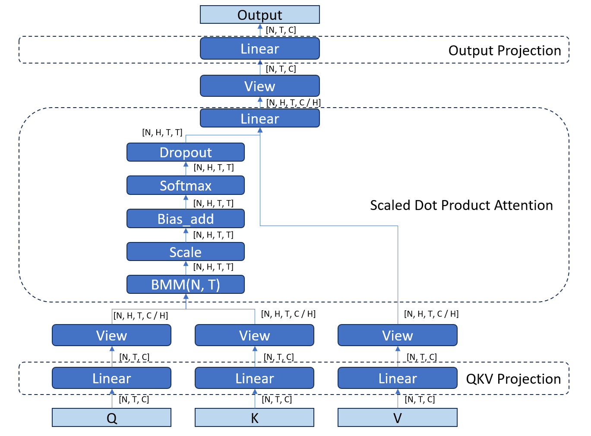

# Language Model Multi-Head Attention optimization

### Motivation

Multi-head Attention proposed as part Transformer model [[#1]][1] is a fundamental operation
used in all recently introduced models called Large Language Models (LLMs). The attention operation
computes importance of different tokens in input sentence and adjust their influence on the output tokens [[#2]][2].
As this operation is used in multiple models and takes a significant amount of the overall
model execution time it makes sense to optimize this operation.

#### Introduction into Attention

The original attention algorithm is defined as the following:

Attention is not a single algorithm, but a class of algorithms with similar architecture.
It evolves rapidly and newest models employ new flavors of attention.
Here is the list of Attention flavors:
- Multi-Head Attention (MHA). The original MHA introduced as part Transformer model [[#1]][1].
- Multi-Query Attention (MQA) [[#3]][3]. A version of MHA where number of heads is equal to 1 in K and V.
  This optimization significantly reduces amount of device memory required for KV cache.
- Group-Query Attention (GQA) [[#4]][4]. A generalization of MQA with number of KV heads equal to G instead of 1.
  This allows to balance between memory savings and model quality. 

It is important to note that different models might implement Attention slightly different comparing to
each other.

The attention consists of 3 stages:
- QKV Projection
- Attention
- Output projection

Here is the diagram:

#### Optimizations

##### FlashAttention

The FlashAttention [[#5]][5] focuses on reducing amount of memory accesses between device and global memory. Another benefit is
by keeping data in local device memory the FlashAttention reduces amount of required global memory. In addition the
FlashAttention algorithm splits data across cores in a way that each core works on independent chunk of data that is stored
either on registers or in local memory minimizing cross-core communication overhead.

##### KV cache

In generative LLM models each new token is generated based on a previous context. Each iteration the attention is
recalculated for all tokens in the context. An optimization [[#6]][6] is to cache K and V from the previous iteration into a KV cache
and increase it each iteration with a new token. This avoids recomputing K & V for all previous tokens in the context.
This is done at the beginning of each Attention layer.

#### Framework support

##### TensorFlow
- Keras:
  - MultiHeadAttention[[#7]][7]. Keras supports a high-level API `MultiHeadAttention`. This operation is based on multiple TensorFlow core operations. 
- Core:
  - Core TensorFlow does not expose a single opeation for MHA, but it can be built using smaller ops like Einsum, softmax, etc.

##### PyTorch
- Core:
  - scaled_dot_product_attention[[#8]][8]. PyTorch provides API `scaled_dot_product_attention`` (SDPA) that implements only Attention part of MHA. This provides both
    opportunities for attention optimizations and flexibility for utilizing other optimizations like KV cache and Rotary Positional
    Embeddings (RoPE) outside of the SDPA. This API utilizes FlashAttention implementations for both CPU and GPU devices. SDPA API is in Beta state.
  - MultiHeadAttention [[#9]][9]. In addition to SDPA PyTorch provides API `MultiHeadAttention``. This API utilizes SDPA as an implementation.
  - TorchScript. Both MHA and SDPA can be built from smaller ops as part of a TorchScript graph.
- Intel Extensions for Pytorch (IPEX) GPU:
  - IPEX implements SDPA operation using FlashAttention algorithm but lacks Dropout support. The implementation is based on XeTLA[[#10]][10].

##### OpenVino
OpenVino does not provide a standalone operation but has an ability to fuse a graph that is equal to SDPA [[#11]][11] [[#12]][12].

##### oneDNN
- Graph API
  - DNNL backend supports SDPA pattern using oneDNN primitives [[#13]][13].
  - Graph Compiler backend supports multiple variations of SDPA [[#14]][14].

### Proposal

#### MHA/MQA/GQA vs SDPA

Due to multiple model-specific optimizations happening prior to SDPA (KV cache, RoPE[[#15]][15]) implementing SDPA sub-graph is more flexible in long term.

#### Do we need a primitive?

According to the feedback from the framework teams there is no need in a standalone API for ScaledDotProduct because there is Graph API that supports MHA sub-patterns.

From the library perspective a standalone primitive API is less flexible comparing to a Graph of simple operations. The Graph Compiler team had to introduce multiple patterns to support SDPA in different models because the models implement SDPA slightly different. If a standalone primitive is implemented this means additional burden on API maintenance. (How does PyTorch SDPA API handle this issue?)

#### API implications

There are no API implication on primitive side if no primitive API is introduced. The SDPA pattern is already supported in Graph API by both DNNL and Graph Compiler backends.

> [!IMPORTANT]
> However, Graph API will need to support OpenCL runtime in order to provide MHA optimization to OpenVino which is based on OpenCL.

### References

1. [Attention Is All You Need][1]
2. [The Illustrated Transformer][2]
3. [Fast Transformer Decoding: One Write-Head is All You Need][3]
4. [GQA: Training Generalized Multi-Query Transformer Models from Multi-Head Checkpoints][4]
5. [FlashAttention: Fast and Memory-Efficient Exact Attention with IO-Awareness][5]
6. [Speeding up the GPT - KV cache][6]
7. [tf.keras.layers.MultiHeadAttention][7]
8. [torch.nn.functional.SCALED_DOT_PRODUCT_ATTENTION][8]
9. [torch.nn.MultiheadAttention][9]
10. [Intel Extensions For Pytorch: SDPA][10]
11. [OpenVino MHA implementation][11]
12. [OpenVino MHA sub-graph Optimization][12]
13. [oneDNN DNNL backend sdp patterns][13]
14. [oneDNN Graph Compiler backend sdp patterns][14]
15. [llama2.c RoPE Attention][15]

[1]: https://arxiv.org/pdf/1706.03762.pdf
[2]: https://jalammar.github.io/illustrated-transformer/
[3]: https://arxiv.org/pdf/1911.02150.pdf
[4]: https://arxiv.org/pdf/2305.13245.pdf
[5]: https://arxiv.org/pdf/2205.14135.pdf
[6]: https://www.dipkumar.dev/becoming-the-unbeatable/posts/gpt-kvcache/
[7]: https://www.tensorflow.org/api_docs/python/tf/keras/layers/MultiHeadAttention
[8]: https://pytorch.org/docs/stable/generated/torch.nn.functional.scaled_dot_product_attention.html
[9]: https://pytorch.org/docs/stable/generated/torch.nn.MultiheadAttention.html
[10]: https://github.com/intel/intel-extension-for-pytorch/tree/dev/LLM/csrc/gpu/xetla/kernels/SDP
[11]: https://github.com/openvinotoolkit/openvino/blob/bcf58344cc8f86159e27f86b05ecced068e86896/src/plugins/intel_cpu/src/nodes/mha.cpp
[12]: https://blog.openvino.ai/blog-posts/openvino-tm-model-transformation-mha-subgraph-optimization
[13]: https://github.com/oneapi-src/oneDNN/blob/master/src/graph/backend/dnnl/patterns/sdp.cpp
[14]: https://github.com/oneapi-src/oneDNN/blob/master/src/graph/backend/graph_compiler/patterns/mha_pattern.hpp
[15]: https://github.com/karpathy/llama2.c/blob/d9862069e7ef665fe6309e3c17398ded2f121bf5/model.py#L135

---
EOD
