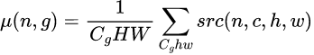
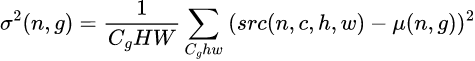
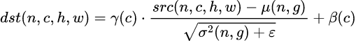
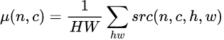
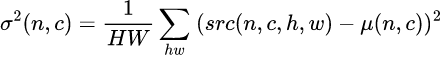
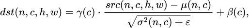

# Support Group Normalization in Graph API
=====================================================================

## Motivation

Group Normalization and Instance Normalization play pivotal roles in enhancing
the stability and speed of training for deep learning models. GroupNorm
strategically divides channels into groups, proving particularly effective when
dealing with small batch sizes. Conversely, InstanceNorm operates by normalizing
each channel independently.These two operations (GroupNorm and InstanceNorm)
enjoy widespread usage within deep learning models and are well-supported by
major frameworks.

This RFC proposes adding the GroupNormalization OP to the oneDNN Graph API. This
addition enables mapping GroupNorm to the oneDNN Graph, allowing fusion with
other operations for enhanced backend optimizations. This enhancement aims to
boost performance for both 3D U-Net and Stable Diffusion models within the Intel
Landing Zoo.

## operations used in Frameworks and toolkit

### Group Normalization
  - Mean:

    
  - Variance:

    
  - Normalization:

    

| Framework | TensorFlow                                                      | Pytorch             | openVINO                    | ONNX                        | DNNL                                  |
| --------- | --------------------------------------------------------------- | ------------------- | --------------------------- | --------------------------- | ------------------------------------- |
| op        | GroupNormalization (keras)[[#1]][1]                             | group_norm[[#2]][2] | GroupNormalization[[#3]][3] | GroupNormalization[[#4]][4] |  group_normalization_forward[[#5]][5] |
| input     | input                                                           | input               | data                        | X                           | src                                   |
| input     | mask                                                            | weight(optional)    | scale                       | scale                       | gamma(optional)                       |
| input     | gamma_initializer,gamma_regularizer,gamma_constraint(optional ) | bias(optional)      | bias                        | bias                        | beta(optional)                        |
| input     | beta_initializer,beta_regularizer,beta_constraint(optional)     |                     |                             |                             | mean(optional)                        |
| input     |                                                                 |                     |                             |                             | variance(optional)                    |
| attribute | groups                                                          | num_groups          | num_groups                  | num_groups                  | groups                                |
| attribute | epsilon                                                         | eps                 | epsilon                     | epsilon                     | epsilon                               |
| attribute | axis                                                            |                     |                             |                             | dnnl_use_scaleshift                   |
| attribute | centre                                                          |                     |                             |                             | dnnl_use_global_stats                 |
| attribute | scale                                                           |                     |                             |                             |                                       |
| output    | output                                                          | output              | output                      | output                      | output                                |

Most of the frameworks takes GroupNorm as a single OP, except TensorFlow which
takes it as a keras layer. In this layer, GroupNorm is composed by many small
operations[[#6]][6].

### Instance Normalization
  - Mean:

    
  - Variance:

    
  - Normalization:

    

| Framework | TF | Pytorch                | openVINO | ONNX                           |
| --------- | -- | ---------------------- | -------- | ------------------------------ |
| op        | NA | instance_norm[[#7]][7] | NA       | InstanceNormalization[[#8]][8] |
| input     |    | input                  |          | X                              |
| input     |    | weight(optional)       |          | scale                          |
| input     |    | bias(optional)         |          | bias                           |
| input     |    | running_mean(optional) |          |                                |
| input     |    | running_var(optional)  |          |                                |
| attribute |    | use_input_stats        |          | epsilon                        |
| attribute |    | eps                    |          |                                |
| attribute |    | momentum               |          |                                |
| output    |    | output                 |          | output                         |
| output    |    | running_mean(optional) |          |                                |
| output    |    | running_var(optional)  |          |                                |

TensorFlow keras supports InstanceNorm by reuse GroupNorm[[#9]][9] with
groups = channel_num. OpenVINO decomposes Pytorch InstanceNorm[[#10]][10] and
ONNX InstanceNorm[[#11]][11] with its own operations.

## Proposal for GroupNorm forward

### Option 1: Add GroupNorm for GroupNorm.

| GroupNorm          | oneDNN Graph API   |
| ------------------ | ------------------ |
| input              | src                |
| input              | gamma(optional)    |
| input              | beta(optional)     |
| attribute          | num_groups         |
| attribute          | data_format        |
| attribute          | use_affine         |
| attribute          | keep_stats         |
| attribute          | epsilon            |
| output             | output             |
| output             | mean(optional)     |
| output             | variance(optional) |

This option is to add GroupNorm for framework GroupNorm. It has 1 or 3 inputs,
src are required, gamma and beta are optional inputs which are indicated by
attribute use_affine. If use_affine is true, gamma and beta are required; if
use_affine is false, gamma and beta are not required. When use_affine is false,
gamma and beta are provided, these two inputs will be ignored.

It has 3 outputs, output is required, mean and variance are optional outputs
which are indicated by attribute keep_stats. If keep_stats is true, mean and
variance are required; if keep_stats is false, mean and variance are not
required. When keep_stats is false, mean and variance are provided, these two
outputs will be ignored.

Attribute num_groups is used to indicate the number of groups in GroupNorm, and
data_format is used to indicate the data format is NCX or NXC(default) of the
input tensor. Attribute epsilon (1e-5 by default) is used to specify the epsilon
value in the normalization formula.

This option will not extend GroupNorm to support InstanceNorm. InstanceNorm may
be added on demand.

Pros:

1. Clear semantics for one-to-one mapping, easily integrated for frameworks

Cons:

1. Need to maintain two operations(after InstanceNorm added), possibly doubling
required patterns in oneDNN Graph.

### Option 2: Add one operation `GroupNormalization` to cover both GroupNorm and InstanceNorm.

| GroupNormalization | oneDNN Graph API   |
| ------------------ | ------------------ |
| input              | input              |
| input              | gamma(optional)    |
| input              | beta(optional)     |
| input              | mean(optional)     |
| input              | variance(optional) |
| attribute          | num_groups         |
| attribute          | data_format        |
| attribute          | use_affine         |
| attribute          | keep_stats         |
| attribute          | epsilon            |
| attribute          | momentum           |
| attribute          | use_input_stats    |
| output             | output             |
| output             | mean(optional)     |
| output             | variance(optional) |

InstanceNorm can be mapped to GroupNorm by setting num_groups to the number of
channels. It is straightforward to map InstanceNorm to GroupNorm.

Extra parameters are added to cover both GroupNorm and InstanceNorm. Attribute
use_input_stats is used to indicate whether to use input mean and variance. When
use_input_stats is true, mean and variance are required; when use_input_stats is
false, mean and variance are not required. When use_input_stats is false, mean
and variance are provided, these two inputs will be ignored. Attribute momentum
is used to specify the momentum value for the running mean and variance. 

Pros:

1. Compatible with primitive.
2. Aiding in maintaining a concise operation set.

Cons:

1. Not very intuitive to map InstanceNorm to `GroupNormalization`.
2. Complex parameter settings for GroupNorm and InstanceNorm in one operation.
3. Inconvenient for frameworks to set GroupNum at compile stage for
InstanceNorm.

### Option 3: support GroupNorm and InstanceNorm by pattern composed by other operations.

In Tensorflow Keras, GroupNorm[[#12]][12] is composed by reshape, batchnorm,
weighted_moments and some other operations.

In Pytorch Dynamo, GroupNorm[[#13]][13] is decomposed to reshape, var_mean, add,
mul, rsqrt and some other operators.

This option is to reuse current operations in oneDNN Graph API to compose
GroupNorm.

Pros:

1. Easily integrated for some frameworks using composed GroupNorm and
InstanceNorm. 
2. Good for maintaining a concise operation set.

Cons:

1. Some frameworks need to decompose single operations into small operations in
the graph.
2. Different frameworks may have different patterns. Patterns may change
frequently even within the same framework. Hard for oneDNN Graph to cover and
maintain all patterns.
3. Some decomposed operations are needed for oneDNN Graph API to support, such
as var_mean.

## Conclusion

Decision is to choose Option 1, reasoning as follows:
1. GroupNorm and InstanceNorm are two different ops and have different arguments
in PyTorch.
2. Define a unified GroupNorm op Graph API requires PyTorch to handle the
differences when mapping its InstanceNorm to Graph API. No way to pass the group
number at the op creation stage.
3. Currently, PyTorch does not have any request for InstanceNorm. It makes the
requirements of support InstanceNorm not clear at this moment. But the request
for GroupNorm is urgent.

## Proposal for GroupNorm backward

Considering the forward operation option 1 was chosen, the backward operation
will cover GroupNorm backward only.

GroupNorm backward operation is to compute the gradients of the input, gamma and
beta with respect to the output gradients. 

We investigate the backward operation of GroupNorm in some frameworks and
libraries, summarize the inputs, outputs and attributes of the backward
operation in the following table:

| Framework | Tensorflow |Pytorch                    | DNNL                         | oneDNN Graph API               |
|-----------|------------|---------------------------|------------------------------|--------------------------------|
| op        | NA         |native_group_norm_backward | group_normalization_backward | GroupNormalizationBackward     |
| input     |            |grad_out                   | src                          | src                            |
| input     |            |input                      | diff_dst                     | diff_dst                       |
| input     |            |mean                       | mean                         | mean                           |
| input     |            |rstd                       | variance                     | variance                       |
| input     |            |weight (optional)          | gamma(optional)              | gamma(optional)                |
| input     |            |N, C, HxW                  | beta(optional)               |                                |
| attribute |            |num_groups                 | groups                       | num_groups                     |
| attribute |            |                           | epision                      | data_format                    |
| attribute |            |                           | dnnl_use_scaleshift          | use_affine                     |
| attribute |            |output mask                | dnnl_use_global_stats        | epsilon                        |
| output    |            |grad_input(optional)       | diff_src                     | diff_src                       |
| output    |            |grad_weight(optional)      | diff_gamma(optional)         | diff_gamma(optional)           |
| output    |            |grad_bias(optional)        | diff_beta(optional)          | diff_beta(optional)            |

Usually, GroupNorm backward operation has 4 required inputs, src, diff_dst, mean
and variance, 1 or 2 optional inputs, gamma and beta. It has 1 or 3 outputs,
diff_src is required, diff_gamma and diff_beta are optional outputs indicated by
attribute use_affine. So we may have GroupNorm as follows:

| Framework | oneDNN Graph API      |
|-----------|-----------------------|
| op        | GroupNormBackward     |
| input     | src                   |
| input     | diff_dst              |
| input     | mean                  |
| input     | variance              |
| input     | gamma(optional)       |
| attribute | num_groups            |
| attribute | data_format           |
| attribute | use_affine            |
| attribute | epsilon               |
| output    | diff_src              |
| output    | diff_gamma(optional)  |
| output    | diff_beta(optional)   |

## References
1. [TensorFlow Keras Group Normalization layer][1]
2. [Pytorch Group Normalization operation][2]
3. [OpenVINO Group Normalization operation][3]
4. [ONNX Group Normalization operation][4]
5. [oneDNN Group Normalization primitive][5]
6. [TensorFlow Keras Group Normalization Implementation][6]
7. [Pytorch Instance Normalization operation][7]
8. [ONNX Instance Normalization operation][8]
9. [Keras Group Normalization layer][9]
10. [OpenVINO decompose Pytorch Instance Normalization][10]
11. [OpenVINO decompose ONNX Instance Normalization][11]
12. [TensorFlow Group Normalization layer decompose][12]
13. [Pytorch Dynamo Group Normalization layer decompose][13]

[1]: https://www.tensorflow.org/api_docs/python/tf/keras/layers/GroupNormalization
[2]: https://pytorch.org/docs/stable/generated/torch.nn.GroupNorm.html#torch.nn.GroupNorm
[3]: https://docs.openvino.ai/nightly/openvino_docs_ops_normalization_GroupNormalization_12.html
[4]: https://onnx.ai/onnx/operators/onnx__GroupNormalization.html
[5]: https://oneapi-src.github.io/oneDNN/dev_guide_group_normalization.html
[6]: https://github.com/keras-team/keras/blob/master/keras/layers/normalization/group_normalization.py#L148C1-L153C65
[7]: https://github.com/pytorch/pytorch/blob/c77a4a409654dbc0ac4a528c37873b0acb1be32d/aten/src/ATen/native/native_functions.yaml#L3089
[8]: https://onnx.ai/onnx/operators/onnx__InstanceNormalization.html
[9]: https://keras.io/api/layers/normalization_layers/group_normalization/
[10]: https://github.com/openvinotoolkit/openvino/blob/5bab612eccd6f48f03cb3d29895a0c740e5d1c2e/src/frontends/pytorch/src/op/instance_norm.cpp#L30
[11]: https://github.com/openvinotoolkit/openvino/blob/97381e0b63129befd2ef9ef219db39e2c294413b/src/frontends/onnx/frontend/src/op/instance_norm.cpp#L29
[12]: https://github.com/keras-team/keras/blob/v2.14.0/keras/layers/normalization/group_normalization.py#L31-L269
[13]: https://github.com/pytorch/pytorch/blob/2f3beb715c608a060934c237de402faa40ea211f/torch/_refs/__init__.py#L3029