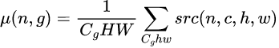
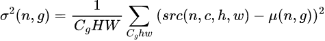
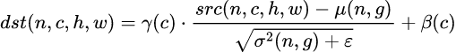
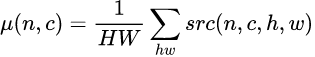
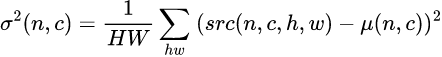
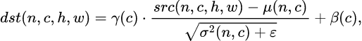

# Support Group Normalization and Instance Normalization in Graph API
=====================================================================

## Motivation

Group Normalization (GN) and Instance Normalization (IN) play pivotal roles in
enhancing the stability and speed of training for deep learning models. GN
strategically divides channels into groups, proving particularly effective when
dealing with small batch sizes. Conversely, IN operates by normalizing each
channel independently.

These two operations (GN and IN) enjoy widespread usage within deep learning
models and are well-supported by major frameworks. Furthermore, they can benefit
from boosted performance optimized by DNNL.

This RFC proposes adding the GroupNormalization OP to the oneDNN Graph API,
encompassing both GN and IN functionalities. This addition enables mapping GN
and IN from frameworks to the oneDNN Graph, allowing fusion with other
operations for enhanced backend optimizations. This enhancement aims to boost
performance for both 3D U-Net and Stable Diffusion models within the Intel
Landing Zoo.

## operations used in Frameworks and toolkit

### Group Normalization
  - Mean:

    
  - Variance:

    
  - Normalization:

    

| Framework | TensorFlow                                                      | Pytorch             | openVINO                    | ONNX                        | DNNL                                  |
| --------- | --------------------------------------------------------------- | ------------------- | --------------------------- | --------------------------- | ------------------------------------- |
| op        | GroupNormalization (keras)[[#1]][1]                             | group_norm[[#2]][2] | GroupNormalization[[#3]][3] | GroupNormalization[[#4]][4] |  group_normalization_forward[[#5]][5] |
| input     | input                                                           | input               | data                        | X                           | src                                   |
| input     | mask                                                            | weight(optional)    | scale                       | scale                       | gamma(optional)                       |
| input     | gamma_initializer,gamma_regularizer,gamma_constraint(optional ) | bias(optional)      | bias                        | bias                        | beta(optional)                        |
| input     | beta_initializer,beta_regularizer,beta_constraint(optional)     |                     |                             |                             | mean(optional)                        |
| input     |                                                                 |                     |                             |                             | variance(optional)                    |
| attribute | groups                                                          | num_groups          | num_groups                  | num_groups                  | groups                                |
| attribute | epsilon                                                         | eps                 | epsilon                     | epsilon                     | epsilon                               |
| attribute | axis                                                            |                     |                             |                             | dnnl_use_scaleshift                   |
| attribute | centre                                                          |                     |                             |                             | dnnl_use_global_stats                 |
| attribute | scale                                                           |                     |                             |                             |                                       |
| output    | output                                                          | output              | output                      | output                      | output                                |

Most of the frameworks takes GN as a single OP, except TensorFlow which takes it
as a keras layer. In this layer, GN is composed by many small operations[[#6]][6].

### Instance Normalization
  - Mean:

    
  - Variance:

    
  - Normalization:

    

| Framework | TF | Pytorch                | openVINO | ONNX                           |
| --------- | -- | ---------------------- | -------- | ------------------------------ |
| op        | NA | instance_norm[[#7]][7] | NA       | InstanceNormalization[[#8]][8] |
| input     |    | input                  |          | X                              |
| input     |    | weight(optional)       |          | scale                          |
| input     |    | bias(optional)         |          | bias                           |
| input     |    | running_mean(optional) |          |                                |
| input     |    | running_var(optional)  |          |                                |
| attribute |    | use_input_stats        |          | epsilon                        |
| attribute |    | eps                    |          |                                |
| attribute |    | momentum               |          |                                |
| output    |    | output                 |          | output                         |
| output    |    | running_mean(optional) |          |                                |
| output    |    | running_var(optional)  |          |                                |

TensorFlow keras supports IN by reuse GN[[#9]][9] with groups = channel_num.
openVINO decomposes Pytorch IN[[#10]][10] and ONNX IN[[#11]][11] with its own
operations.

## Proposal

### Option 1: support GN and IN by pattern composed by other operations.
In Tensorflow Keras, GN[[#12]][12] is composed by reshape, batchnorm,
weighted_moments
and some other operations.
In Pytorch Dynamo, GN[[#13]][13] is decomposed to reshape, var_mean, add, mul,
rsqrt and some other operators.

Pros:

1. Easily integrated for some frameworks using composed GN and IN. 
2. Good for maintaining a small operation set and reduces the maintenance
difficulty.

Cons:

1. Some frameworks need to decompose single operations into small operations in
the graph.
2. Different frameworks may have different patterns. Patterns may change
frequently even within the same framework.
3. New operations are needed for oneDNN Graph API to support operations used in
the graph, such as var_mean.

### Option 2: Add one operation `GroupNormalization` for both GN and IN.

| GroupNormalization | oneDNN Graph API   |
| ------------------ | ------------------ |
| input              | input              |
| input              | gamma(optional)    |
| input              | beta(optional)     |
| input              | mean(optional)     |
| input              | variance(optional) |
| attribute          | num_groups         |
| attribute          | data_format        |
| attribute          | epsilon            |
| attribute          | momentum           |
| attribute          | use_input_stats    |
| output             | output             |
| output             | mean(optional)     |
| output             | variance(optional) |

| GroupNormalizationBackward | oneDNN Graph API           |
| -------------------------- | -------------------------- |
| op                         | GroupNormalizationBackward |
| input                      | src                        |
| input                      | diff_dst                   |
| input                      | mean                       |
| input                      | variance                   |
| input                      | gamma(optional)            |
| input                      |                            |
| attribute                  | num_groups                 |
| attribute                  | data_format                |
| attribute                  | epsilon                    |
| attribute                  |                            |
| output                     | diff_src                   |
| output                     | diff_gamma(optional)       |
| output                     | diff_beta(optional)        |

Pros:

1. Compatible with oneDNN.
2. Support GN and IN by one operation, aiding in maintaining a small operation
set.

Cons:

1. Not very intuitive to map IN to `GroupNormalization`.

### Option 3: Add GroupNormalization for GN and InstanceNormalization for IN.

Pros:

1. Clear semantics for one-to-one mapping, easily integrated for frameworks

Cons:

1. Need to maintain two operations, increasing complexity.

## Conclusion

Prefer Option 2:
1. GN is identical to IN when the number of groups is equal to number of
channels
2. Some frameworks only have GN such as [Tensorflow Keras](https://keras.io/api/layers/normalization_layers/)
3. Easily map IN to GN.
4. Maintain a small operation set

## References
1. [TensorFlow Keras Group Normalization layer][1]
2. [Pytorch Group Normalization operation][2]
3. [OpenVINO Group Normalization operation][3]
4. [ONNX Group Normalization operation][4]
5. [oneDNN Group Normalization primitive][5]
6. [TensorFlow Keras Group Normalization Implementation][6]
7. [Pytorch Instance Normalization operation][7]
8. [ONNX Instance Normalization operation][8]
9. [Keras Group Normalization layer][9]
10. [OpenVINO decompose Pytorch Instance Normalization][10]
11. [OpenVINO decompose ONNX Instance Normalization][11]
12. [TensorFlow Group Normalization layer decompose][12]
13. [Pytorch Dynamo Group Normalization layer decompose][13]

[1]: https://www.tensorflow.org/api_docs/python/tf/keras/layers/GroupNormalization
[2]: https://pytorch.org/docs/stable/generated/torch.nn.GroupNorm.html#torch.nn.GroupNorm
[3]: https://docs.openvino.ai/nightly/openvino_docs_ops_normalization_GroupNormalization_12.html
[4]: https://onnx.ai/onnx/operators/onnx__GroupNormalization.html
[5]: https://oneapi-src.github.io/oneDNN/dev_guide_group_normalization.html
[6]: https://github.com/keras-team/keras/blob/master/keras/layers/normalization/group_normalization.py#L148C1-L153C65
[7]: https://github.com/pytorch/pytorch/blob/c77a4a409654dbc0ac4a528c37873b0acb1be32d/aten/src/ATen/native/native_functions.yaml#L3089
[8]: https://onnx.ai/onnx/operators/onnx__InstanceNormalization.html
[9]: https://keras.io/api/layers/normalization_layers/group_normalization/
[10]: https://github.com/openvinotoolkit/openvino/blob/5bab612eccd6f48f03cb3d29895a0c740e5d1c2e/src/frontends/pytorch/src/op/instance_norm.cpp#L30
[11]: https://github.com/openvinotoolkit/openvino/blob/97381e0b63129befd2ef9ef219db39e2c294413b/src/frontends/onnx/frontend/src/op/instance_norm.cpp#L29
[12]: https://github.com/keras-team/keras/blob/v2.14.0/keras/layers/normalization/group_normalization.py#L31-L269
[13]: https://github.com/pytorch/pytorch/blob/2f3beb715c608a060934c237de402faa40ea211f/torch/_refs/__init__.py#L3029