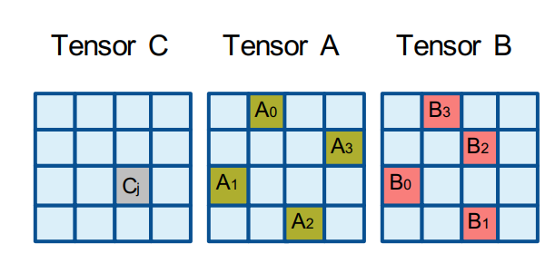

# Overview

In order to implement DNN operations, it is generally useful to rely
on a set of highly optimized basic building blocks that are then
composed together. Such a set is defined and discussed in [reference,
reference], and is currently used in oneDNN CPU backend to implement
Matmul, Convolution, Inner product and RNN primitives.  In particular,
the main operation batch-reduce GEneral Matrix Multiply operation (aka
brgemm), is a very flexible operation that can be used in a variety of
DNN operators. It is defined as folllow:


```math
D = \beta C + \alpha \sum_i A_i \cdot B_i + bias
```

with 
- $A_i$ a set of matrices of dimension $MxK$
- $B_i$ a set of matrices of dimension $KxN$ 
- D and C matrices of dimension $MxN$
- bias a vector of dimension $N$.

This proposal discusses exposing these sequential, basic building
blocks externally for end-users to conveniently be able to write their
own optimized custom primitives/routines. These can be used in their
own applications and/or contributed back behind the oneDNN graph API.

As a starter, we will expose only simple transforms and brgemm
routines.

# Memory descriptors, memory objects and/or pointers ?

In general, we need to express memory shapes and memory objects, and
for this block level API, we will have are three considerations:
- allowing arbitrary strides between blocks (A,B in particular) for
  maximum flexibility,
- Support for metadata (e.g. zero-point handling) and
  hardware-specific layouts,
- runtime overheads.

## Arbitrary strides between A and B blocks

To make the API flexible, we want to allow arbitrary strides between A
and B blocks. This is unfortunately not possible if we encapsulate all
A blocks (resp B blocks) of a brgemm operation in a dnnl::memory
object, since this will force a fixed stride between each block.

Another option would be to take an array of dnnl::memory objects, each
containing a single block of A/B. This would require the user to call
`dnnl::memory::set_data_handle()` on each of these objects before
brgemm call. It would incur some unnecessary overhead, but should
not be anything substantial.

However, one might wonder why use memory descriptors at all and not
just take pointers directly as input to brgemm::execute
call. Internally we support multiple flavors:
- array of pointers: here the user will have to do pointer arithmetic
  before passing those pointers to brgemm::execute call.
- base pointer + arrray of offsets: here the pointer arithmetic will
  be handled internally behind brgemm::execute call.
- base pointer + fixed stride: this flavor has limited application and
  is typically used for matmul implementation. Given its limited
  applicability, it seems unnecessary to expose it.
  
To make the public brgemm API simpler, we propose to expose only the array
of pointers flavor.

For the brgemm API specifically, an array of equal sizes for A and B
blocks are passed.  To guarentee these are of equal size, and simplify
pointer arithmetic logic inside generated kernels, we will take an
array of pairs of pointers.

## Support for hardware-specific layouts

To speedup computation for low accuracy datatype, various hardware
require the data to be packed in a certain way:
- grouped by 32-bit chunks along K dimension (e.g. Intel VNNI/AMX, ARM
  SVE BFDOT). This typically stems from the larger output datatype for
  these instructions (int32 or float).
- grouped by 64-bit chunks along K (e.g. ARM *MMLA extensions). This
  stems from the registers actually holding 2d matrices.

Exposing these packed layouts is necessary to benefit from HW
acceleration. This packing can happen in one of two places:
- at execution time upon calls to brgemm::execute.
- ahead of execution time (pre-packing) when one of the matrix is
  constant.

### How to express HW specific layouts

There are two main ways oneDNN can expose those layouts:
- through layout tags. This has the advantage of being very simple,
  but comes with two limitations:
    - These tags can contain only information about data layout, not
      extra metadata (e.g. zero-point related)
	- it does not scale well when the number of layouts increases.
- through memory descriptors. This can be more tedious to use as it is
  an opaque structure that needs to be queried for
  information. However, it is very flexible as it allows to express
  non trivial layout descritions, and can be extended with extra
  information/meta-data.


Layout tags here will have to be different than what is used for the
oneDNN primitive API, as they would mostly map to part of the
innerblock component of existing memory::desc objects.

The recommendation here would be to go with layout tags only if no
handling of metadata and extra information is expected from oneDNN
block level APIs.


| Option             | Pros                                                            | Cons                                                   |
| layout tags        | - simple to use                                                 | - contains only innerblock shape and order information |
|                    |                                                                 | - no metadata (e.g. zero-point related compensation)   |
| memory descriptors | - relies on existing mechanism exposed for oneDNN primitive API | - potential overheads                                  |
|                    | - can contain informations other than shapes/strides            | - extra code on user side to create these objects      |
|                    |   (e.g. compensation information)                               |                                                        |


### Query mecanism for layout

Another question is how to inform user about which layout to use for a
given brgemm problem.  Similar to oneDNN primitive API, we will expose
methods to query what is the best layout.  Once again, two options are
possible:
- the user create a brgemm object, and they query which layout should
  be used,
- we expose a static function that the user can use independantly of
  the brgemm object.

The first option is optimal in the sense that the dispatched
implementation has all the knowledge necessary to make the layout
determination. However, it requires the user to pass a brgemm object
or a layout tag around when the data pre-packing logic is separate to
the operator implementation.

The second option could be simpler only if the information necesary to
make layout determination is readily available and does not require to
pass extra information around (otherwise it would be equivalent to
pass layout tag / brgemm object around).  Current internal
implementation of layout selection depends on highest available ISA,
input datatype, fp_math mode and accumulation datatype.

In general, we would recommend to tie the layout query to a brgemm
object for two reasons:
- from oneDNN implementation perspective, we can extend the
  information used to select best layout
- in practice, when data is pre-packed, blocking information (so brgemm
  object creation parameters) have to be known in order to layout data
  in an optimal way.

In order to make the case where brgemm objects are recreated for the
sole purpose of packing data, brgemm obect creation will be split in
two steps (brgemm_desc and brgemm classes) to avoid jitting overheads.


### Other considerations

The recommendation as a starting point is to make query mandatory: no
layout forcing on user side. This simplifies the configurations
supported by brgemm. Given that we have no support internally for
transa/tranb, those will not be exposed as well. We will also support
only row major representation, and not expose a knob to select
row/column major.

Given the small number of layouts, we will expose a layout tag enum
(next section will address the lack of need for metadata handling by
oneDNN brgemm).

# Low precision handling.

The API will be limited to support downconversion/upconversion before
computation in a similar way that
[dnnl::fpmath_mode](https://oneapi-src.github.io/oneDNN/dev_guide_attributes_fpmath_mode.html#)
provides.

If a user wants to implement quantized computation with zero-point,
they will have to precompute compensation term and pass it to brgemm
computation as bias.

The main drivers behind this choice are:
- flexibility on the user side, as any custom quantization scheme can
  be handled. It removes the dependency on oneDNN wrt when/how any
  compensation term should be computed.
- consistency on the user side. Whether they implement a custom
  quantization scheme or a standard one, the programming model is the
  same.
- supporting metadata on oneDNN sides would force using higher level
  abstraction that can impact performance. Also, there is little to no
  performance gain to expect from this level of fusion.

# Hardware specific discussions

## ISA selection

Here two options: 
- the user can specify for which ISA the kernel can be generated,
- oneDNN does it transparently under the hood to generate best kernel
  for current platform.

Note that current oneDNN implementation just takes ISA as a maximum
ISA.  To simplify the programming model, isa selection will not appear
in block level APIs. However, `dnnl::set_max_cpu_isa` will still be
effective, and can be used by the user to control the maximum isa
level used by block level APIs.


## Handling of architectural state 

Matrix accelerators typically require to set an architectural state
(e.g. Intel AMX or ARM SME).

A few elements about those architectural states:
- there is a per-core setting, which is typically costly in terms of
  cycle count.
- this state is block size dependent, so executing two brgemm kernels
  with different shapre require an expensive reconfiguration between
  each.
- when matrix accelerator is armed, the max frequency for the core is
  altered, so performance of sequential/vector code can be impacted.
- there are some OS syscall to do in order to enable expanded stack
  space.


There are two options here:
- expose two APIs, `brgemm::setup_hw_context()` and
  `brgemm::release_hw_context()`. Those can be scheduled/hoisted as
  the user see fit, but the setup function will have to be called
  before the brgemm::execute call for each given brgemm object. The
  release call can happen anytime the user see fit.
- expose only `brgemm::release_hw_context()`, and hide context
  setting. Those setting calls would have to be hidden under existing
  functionalities (e.g. brgemm::execute). This slightly simplifies the
  programming model, though it removes some flexibility on the user
  side to hoist those setting calls (e.g. to do them only once per
  thread for whole process lifetime).
- don't expose those functionalities. This is very risky since this
  can impact the performance of the overall application by lowering
  the frequency for pieces of code that don't rely on those matrix
  accelerators.

The recommendation is to go with the first option, with explicit set
and release functions, that the user can hoist as they see fit.

With respect to OS syscall, we recommend to make it transparent to
user, by making those upon first created brgemm object that would need
to use the matrix acceleration engine. This will ensure this call
happens before any call to hardware instruction requiring it.

# Handling of attributes

First, here is the list of attributes we plan on exposing:
- fp_math mode, in order for user to control input conversions semantics;
- scales/zero-point in order to support upconversion before computation.
- post-ops, in order to allow fusion of elementwise and binary
  operations.

Internally, other attributes are available to improve performance, but
given how they rely on implicit knowledge of brgemm implementation
internals, it is preferable to not expose those as of now.

We also have internal attributes to control prefetch hints, prefetch
distances and non-temporal stores. However those are not yet fully
supported by current brgemm kernel implementation so there is no plan
to expose those for now.

API wise, block level attributes can be exposed in two ways:
- relying on existing oneDNN primitive attribute. This allows to
  simplify documentation and usability by aligning semantics between
  primitive and block level APIs. However, there is a set of
  attributes that are specific to primitive API, and we might expose a
  set of attributes specific to the block-level API (e.g. prefetching
  strategy).
- relying on dedicated attributes for block-level API. This allows a
  clear separation of attributes between block level and primitive
  level APIs, and allows to expose only supported attributes for block
  level API.


To make a first version of the API publicly available faster,
we will start by relying on existing dnnl::primitive_attr objects.

In the future, we will consider exposing a dedicated attribute for
block-level API, to make API cleaner. Internally, we can rely on the
same abstraction for primitive and block-level attributes to simplify
passing attributes from primitive API calls to internal block level
API calls. Like for primitive level API, those would be opaque, and
attributes would be set/get using dedicated setters and getters.


# Managing jitting overheads and caching support

To implement a single matrix multiplication operation, the block-level
API user will typically need to rely on multiple kernels.
In particular:
- tail handling on M, N and both M/N can require dedicated kernels if
  M/N are not multiples of the block-size chosen by the user,
- when blocking on K dimension, extra kernels are required to handle
  first K-block (beta=0), intermediate K-blocks (beta=1) and last
  K-block (beta=1, D matrix set, and post-ops specified).
- when full matrices dimension change frequently. This will lead to
  changing leading dimension at the brgemm level, requiring new
  kernels.

On top of that, if the block-level kernels are generated independantly
for each layer of a neural network, the same kernels might be
generated multiple times.

Some API design decisions could impact potential reusability of kernels.
In particular:
- passing alpha/beta at runtime instead of creation time.
- support two execute functions (with and without post-op and final
  data conversion) for the same brgemm object.
- support runtime leading dimensions.

The proposal here is to stick with what is already tried and used
internally. If during the experimental stage of the API, users request
these functionalities, we will revisit the API and add the necessary
support in the internal implementation. So alpha/beta will be creation
time parameters, and kernels with and without post-ops will be handled
with separate objects.  For runtime leading dimension, the internal
API supports it but this will not be exposed for now. We can either
change the API when we introduce the feature, or add a placeholder
parameter if we are confident this feature will gain traction soon.

Also, note that currently, no kernel-level cache exists for block
level functionalities, but there are plans to add it. In the meantime,
here are a few ways to mitigate the lack of kernel-level cache:
- hoist block-level kernel generation for it to happen once at the
  beggining of the application
- to handle tails/K-blocking, if generating multiple kernels is too
  costly, one can copy A/B blocks to a temporary buffer for
  tails/first K-block, and rely on a single block-level kernel.


# Transforms and transpose

Transormation rountines, for example to pack data in a certain layout,
are typically hard to implement without using intrinsics or assembly.
To facilitate packing, we will expose an out-of-place transform
functionality.

# All-in-all

```c++

// namespace name to be defined, leaving it general enough for additional block level APIs
namespace dnnl {
namespace block { 

enum packing_tag {
packed_32;
packed_64;
plain;
transposed;
}

struct brgemm {
    struct desc {
        // Vanilla version of brgemm with no post-op or destination conversion.
        desc(dim_t M, dim_t N, dim_t K,
                data_type dtA, dim_t ldA,
		        data_type dtB, dim_t ldB, 
		        data_type dtC, dim_t ldC,
                float alpha, float beta);

        // Advanced version with postop and datatype conversion when D type
		// is different than C type.
        desc(dim_t M, dim_t N, dim_t K,
                data_type dtA, dim_t ldA,
		        data_type dtB, dim_t ldB, 
		        data_type dtC, dim_t ldC,
		        data_type dtD, dim_t ldD,
                float alpha, float beta, 
		        const brgemm_attr &attr);

        // Queries for expected layouts and temporary memory
        packing_tag get_A_tag() const;
        packing_tag get_B_tag() const;
        size_t get_scratchpad_size() const;
    }

    brgemm_t(const brgemm_desc_t &bd); 
	
    // HW context handling.
    // This currently mimics AMX (need to clarify for SME): 
	// - Release is static
	// - No release necessary between different calls to set_hw_context
	void set_hw_context() const;
	static void release_hw_context() const;

    // Execution function for the vanilla brgemm variant.
    // we take pointers to A and B as a vector of pairs, guarentees they are the same size
	// The batch size is the size of the vector.
    // pointers are void*, datatypes are specified in constructor
	// Computes C = \beta C + \alpha \sum_i A_i \cdot B_i
    void execute(const std::vector<std::pair<void *, void *>> &A_B,
        void *C, void *scratch = nullptr);

    // Execution function for the advanced brgemm variant
	// Here the C matrix is just an input to accumulation
    // final result after postop/conversion will be in D
	// Computes D = \beta C + \alpha \sum_i A_i \cdot B_i + bias
    void execute(const std::vector<std::pair<void *, void *>> A_B, 
        const void *C, void *D, void *scratch = nullptr,
        void **post_ops_args = nullptr);
}

struct transform_t {
    struct desc {
	    desc(dim_t M, dim_t N, data_type dt, 
		        packing_tag tag_src, dim_t ld_src, 
				packing_tag tag_dst, dim_t ld_dst);
	}
	transform_t(const desc &td);
	execute(void *dst, const void *src);
}

} // namespace block
} // namespace dnnl
```

# References


[High-Performance Deep Learning via a Single Building Block](https://arxiv.org/abs/1906.06440)

[Tensor Processing Primitives: A Programming Abstraction for Efficiency and Portability in Deep Learning & HPC Workloads](https://arxiv.org/abs/2104.05755)

[ARM BFDOT instruction](https://developer.arm.com/documentation/ddi0602/2021-06/SVE-Instructions/BFDOT--vectors---BFloat16-floating-point-dot-product-)

[ARM SME instruction](https://community.arm.com/arm-community-blogs/b/architectures-and-processors-blog/posts/scalable-matrix-extension-armv9-a-architecture)

[Intel optimization guide](https://www.intel.com/content/www/us/en/content-details/671488/intel-64-and-ia-32-architectures-optimization-reference-manual-volume-1.html)


