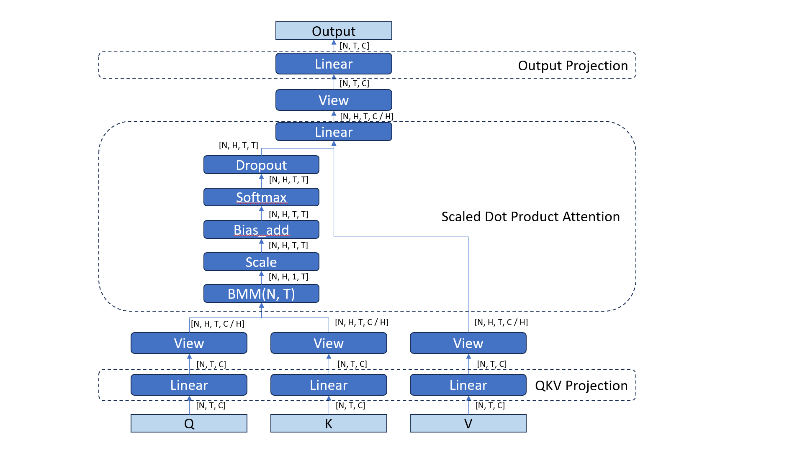
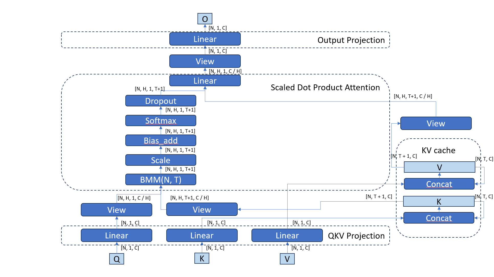
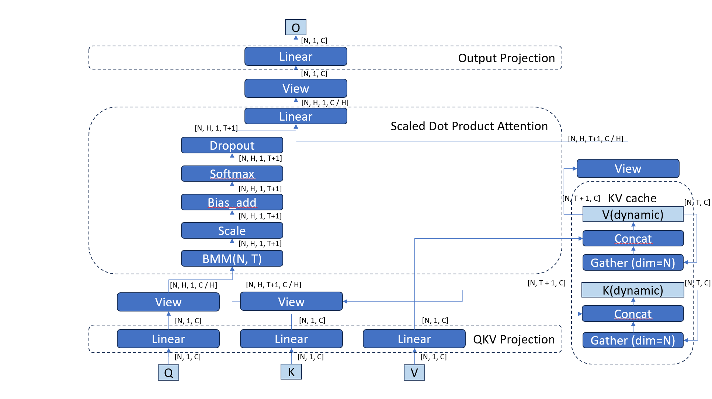
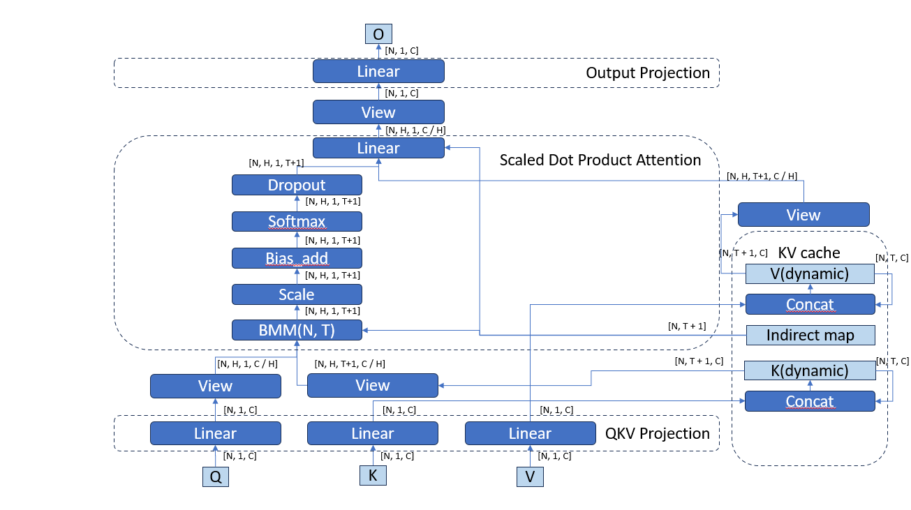

# Introduction

## KV cache

LLMs are auto-regressive models -- each iteration they predict the next token based
on previous tokens (also called context). The new token is added to the context
and the model predicts the next token. This process repeats until a stop
condition is met (for example, max length is exceeded or `<EOS>` symbol is predicted).
As explained in [[#1]][1] the Multi-Head Attention is the core operation
that is responsible for the influence of the context on the output token.

Here is the diagram:

In generative LLM models each new token is generated based on a previous context.
Each iteration the attention is recalculated for all tokens in the context.
An optimization [[#2]][2] [[#7]][7] [[#8]][8] is to cache `K` and `V` from the previous iteration into
a KV cache and increase it each iteration with a new token. This avoids
recomputing K and V for all previous tokens in the context. This is done at the
beginning of each Attention layer.

With KV cache forward pass of an LLM model process only a single token at a time
which significantly reduces amount of computations for long context cases. The
downside of this optimization is KV cache grows with sequence length (this is
partially mitigated by Multi-Query Attention (MQA) [[#3]][3] and Group-Query Attention (GQA) [[#4]][4]).

Here is the diagram:

## Beam search

The beam search is an algorithm that selects multiple candidate tokens for a position
in a given sequence [[#5]][5]. The number of candidates is a hyper-parameter of
a model called `beam_width`. At every iteration of a sentence generation a model
keeps `beam_width` best sub-sequences, it is possible that some of sub-sequences
get dropped because other sub-sequences produce multiple candidates with higher
probability for a combination `sub-sequence` + `new_token`.

## KV cache with beam search support

With the beam search there are `beam_width` sequences processed in parallel by
an LLM model. The `beam_width` can be viewed as a batch dimension except for the
cases when on of sub-sequences gets dropped and should be replaced by another
one.

For example:
| beam_idx | Iteration N - T1 | Iteration N   | Iteration N + T2         |
| -------- | ---------------- | ------------- | ------------------------ |
| 0        | **A**            | A **picture** | A picture of **clouds**  |
| 1        | **A**            | A **window**  | **A picture of pillows** |

In case of KV cache `K` and `V` should be updated for the `beam_1` (copied from `beam_0`).
One of optimizations is to not rewrite K and V each time but at each iteration to gather
the tokens for a given `beam_idx` and pass it as `K` and `V`. This requires KV
cache to keep a history of `beam_idx` of the previous sub-sequence for each
iteration and beam.

Here is the diagram:

## Indirect KV cache

A further optimization eliminates operation `gather` by providing a beam history
(or beam table) for `K` and `V` along with `K` and `V` data into the Self-attention
so it can attend to the correct tokens for each beam without an overhead on a
`gather` operation. The beam table is of size `[BEAM_SIZE, SEQ_LENGTH]` (or `[N, T]`).
The `SEQ_LENGTH` is the **reduction dimension** (or `K` dimension) for the Matmul
operation and it is important for optimizations.

Here is the diagram:

# Proposal

## Primitive API vs Graph API

The indirect KV cache interacts with SDPA operation. As a result a strategy for
optimizations should be aligned to make them compatible. As per the previous RFC [[#1]][1]
the API to provide optimizations for SDPA is Graph-level API, so this RFC proposes
to optimize indirect KV cache using Graph-level API as well.

## Beam table vs indirect cache

The main considerations:
- Stateful vs stateless. Adding support for KV cache will make oneDNN graph
  partition stateful since KV cache will require storing KV values,
  indirection beam table. Another issue is that this state should grow on each
  execution (or model inference token generation).
- Custom vs regular ops. The KV cache can be defined as a graph of simple regular
  operations [[#6]][6]. However, if the decision is to avoid stateful property of
  the KV cache and if it is not possible to do with KV cache then
  oneDNN could extend SDPA graph pattern only with the indirect beam table
  custom op. A user (for example, OpenVino) will pass the beam table memory and
  oneDNN will use it to compute SDPA correctly.

## API

*TBA*

## Open questions

- CPU support. Since OpenVino CPU plugin does not use oneDNN Graph API but
  utilizes brgemm API we might need to add an indirection support into this API.

### References

1. [oneDNN RFCs: Language Model Multi-Head Attention optimization][1]
2. [Speeding up the GPT - KV cache][6]
3. [Fast Transformer Decoding: One Write-Head is All You Need][3]
4. [GQA: Training Generalized Multi-Query Transformer Models from Multi-Head Checkpoints][4]
5. [What is Beam Search? Explaining The Beam Search Algorithm][5]
6. [OpenVino: Pass: Stateful SDPA fusion][6]
7. [Mastering LLM Techniques: Inference Optimization][7]
8. [LLM Inference Series: 3. KV caching explained][8]
9. [OpenVino: Pattern Patcher: KV cache fusion][9]

[1]: https://github.com/igorsafo/oneDNN/tree/igorsafo/rfcs/mha-optimization/rfcs/20231026-attention-optimization
[2]: https://www.dipkumar.dev/becoming-the-unbeatable/posts/gpt-kvcache/
[3]: https://arxiv.org/pdf/1911.02150.pdf
[4]: https://arxiv.org/pdf/2305.13245.pdf
[5]: https://www.width.ai/post/what-is-beam-search
[6]: https://github.com/openvinotoolkit/openvino/blob/8c9c6016c125ed81366cfc2408d70bf91c02faf3/src/plugins/intel_cpu/src/transformations/cpu_opset/common/pass/stateful_sdpa_fusion.cpp#L29
[7]: https://developer.nvidia.com/blog/mastering-llm-techniques-inference-optimization
[8]: https://medium.com/@plienhar/llm-inference-series-3-kv-caching-unveiled-048152e461c8
[9]: https://github.com/openvinotoolkit/openvino/blob/7e28e888369b34f24083515cfc80bfe771d6fff0/src/plugins/intel_gpu/src/plugin/transformations/kv_cache_fusion.cpp#L38

---
EOD
