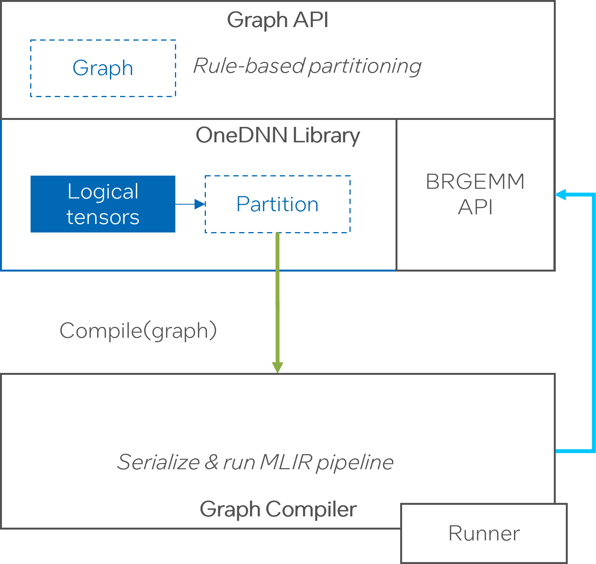

# Pluggable compiler backend (RFC)

## Introduction

This RFC covers the integration part for the new standalone MLIR-based 
version of the [Graph Compiler](202230110-graph-compiler). It focuses on the
general approach rather than specific details.

Here's a set of goals that we would like to achieve:
* Create a standalone MLIR-based compiler to benefit from the upstream and can
support multiple targets
* Provide an interface that is (a) transparent change for the user and 
(b) would be acceptable by frameworks' build systems
* Reuse the BRGEMM API from the library as a building block

## Proposal

The compiler has two integration points with the library: OneDNN backend and the micro-kernel API, that is, OneDNN depends on the compiler and the 
compiler depends on OneDNN (BRGEMM API). To resolve the dependency cycle 
and avoid binary bloating the following integration scheme is proposed.
The compiler takes OneDNN library as a dependency and links statically.
We make the symbols weak to only get the BRGEMM API as a part 
of the compiler. On the library side we create a new Graph API backend. It
would hold the partitioning logic and dynamically load the compiler. The
approach thus achieves:
1. There's no changes to the way OneDNN is integrated into frameworks.
2. MLIR dependency is not part of the PyTorch binary.



The compiler will be packaged into a python wheel (the compiler may have a
separate Python API but it is not used in the described scenario) and installed
along with PyTorch. An existing instance of OneDNN then will search and load the
compiler shared library.

The changes required are grouped by the component.

### OneDNN
Inside the library's new Graph API backend there will be an interface for
compilation and execution. Ideally we would like to make it part of the
public interface in the future but keep it private until it matures.
Partitioning logic is kept within the backend as it is for the graph
compiler v1. The backend will also contain a loader that would `dlopen` the
compiler shared library.

The backend serializes the sub-graph in a given partition to json (reusing
the mechanism for passing the graph to dnnbench) and calls Graph Compiler 
`compile` method. The compiler produces a runnable object along with
additional metadata, e.g. for packing.

Once the runnable object is created the library can convert real tensor 
arguments to auxilary tensor objects (these will contain shapes and a pointer
to support dynamic tensors) and pass them to the `execute` method of the runner.

Parallelism is controlled either by parameters passed through a platform 
`context` (e.g., number of threads limit for client) or implicitly (openmp).
The compiler will generate parallel code. We choose this option as opposed to
single-threaded code as it would be easier to extend the support for GPUs in
the future. The runner will also execute the code in parallel (currently 
proposed API below does not include the stream since we'll go for openmp first
but the vision is to have a similar abstract interface for parallel runtimes
in the future).

Since the compiler is a separate component now, an upstream pytorch version
with OneDNN linked in could load an incompatible version of the compiler.
This will be handled at the backend level. Upon loaind it would check the major
release version for API compatibility and make sure the content of the partition
can be consumed.

### Graph Compiler
The compiler pulls in OneDNN sources to build, statically links against the
library to contain a copy of BRGEMM, and implements the interface in the 
backend (the last one is until we have a public API).

The compilation interface accepts a graph json and an optional platform context (that feeds into HW info for the cost model). The json is deserialized into a
high-level MLIR dialect that is fed into the optimization pipeline. The 
resulting binary along with a preconfigured MLIR JIT runner is wrapped into
a runnable object an is returned back to OneDNN backend.

The compiler will extend MLIR with new dialects and passes. Some of them will
have to be specific to OneDNN (e.g., constant folding cannot be done on logical
tensors since there's no access to the values). This means that the version of
LLVM will be different from other frameworks' components (e.g., running inductor
with both Graph API and Triton). The compiler will hide the symbols at linking.

## C API
Here's a sketch of the C API the compiler would expose.

```c
#ifndef DNNL_GRAPH_COMPILER_H
#define DNNL_GRAPH_COMPILER_H
#define DNNL_DLL
#define DNNL_DLL_EXPORTS

#include <cinttypes>
#include <cstddef>
#include "dnnl_types.h"

/*
 * Public API for integration with third-party graph compilers.
 */

#ifdef __cplusplus
extern "C" {
#endif

struct dnnl_graph_compiler;
struct dnnl_graph_compiler_executable;

struct dnnl_graph_compiler_context {
    uint32_t num_threads;

    void *(*allocator)(size_t size);
    void (*deallocator)(void *ptr);
};

struct dnnl_graph_compiler_tensor {
    size_t id;
    uint8_t ndims;
    size_t *dims;
    void *data;
};

DNNL_API dnnl_status_t dnnl_graph_compiler_create(
        const struct dnnl_graph_compiler_context *ctx,
        const struct dnnl_graph_compiler **gc);

DNNL_API void dnnl_graph_compiler_destroy(const struct dnnl_graph_compiler *gc);

DNNL_API dnnl_status_t dnnl_graph_compiler_compile(
        const struct dnnl_graph_compiler *gc, const char *graph_json,
        const struct dnnl_graph_compiler_executable **exe);

DNNL_API void dnnl_graph_compiler_destroy_executable(
        const struct dnnl_graph_compiler *gc,
        const struct dnnl_graph_compiler_executable *exe);

DNNL_API dnnl_status_t dnnl_graph_compiler_execute(
        const struct dnnl_graph_compiler *gc,
        const struct dnnl_graph_compiler_executable *exe,
        dnnl_graph_compiler_tensor *inputs,
        dnnl_graph_compiler_tensor *outputs);

#ifdef __cplusplus
}
#endif
#endif // DNNL_GRAPH_COMPILER_H
```


## Usage example
```c++
#include <iostream>
#include "test_utils.hpp"
#include "dnnl_graph_compiler.h"

int main() {
    auto json = read_str_resource("mul_quantize.json");
    std::cout << json << std::endl;

    const struct dnnl_graph_compiler_context ctx = {.num_threads = 4};
    const struct dnnl_graph_compiler *gc;
    const struct dnnl_graph_compiler_executable *exe;

    if (dnnl_graph_compiler_create(&ctx, &gc) != dnnl_success) {
        throw std::runtime_error("Failed to create graph compiler!");
    }

    if (dnnl_graph_compiler_compile(gc, json.c_str(), &exe) != dnnl_success) {
        throw std::runtime_error("Failed to compile graph!");
    }

    // Initialize inputs and outputs
    dnnl_graph_compiler_tensor inputs[2];
    dnnl_graph_compiler_tensor outputs[1];
    uint8_t data_buf[160];
    size_t dims[1] = {10};
    inputs[0] = {.id = 0, .ndims = 1, .dims = dims, .data = data_buf};
    inputs[1] = {.id = 1, .ndims = 1, .dims = dims, .data = &data_buf[40]};
    outputs[0] = {.id = 2, .ndims = 1, .dims = dims, .data = &data_buf[80]};

    if (dnnl_graph_compiler_execute(gc, exe, inputs, outputs) != dnnl_success) {
        throw std::runtime_error("Execution failed!");
    }

    dnnl_graph_compiler_destroy_executable(gc, exe);
    dnnl_graph_compiler_destroy(gc);
    return 0;
}
```

## Open Questions

The compiler is expected to return additional information for the user such
as packing hints and the "inplace pair" optimization for buffer reusing.
Currently proposed approach is to put the metadata into the runnable object.

