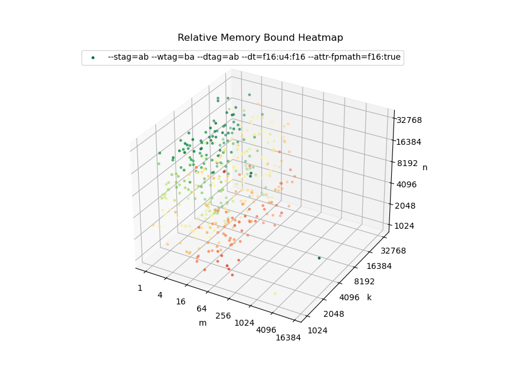
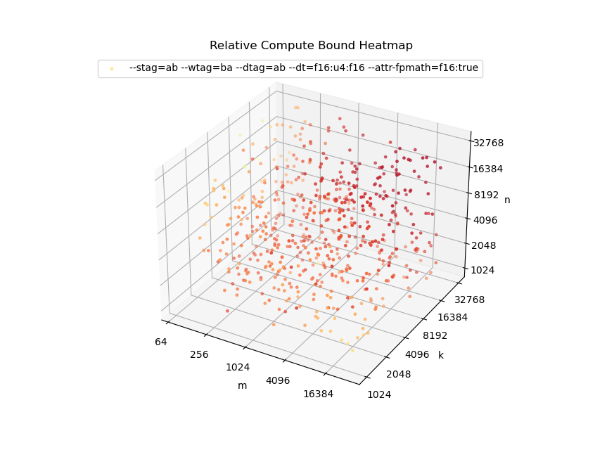
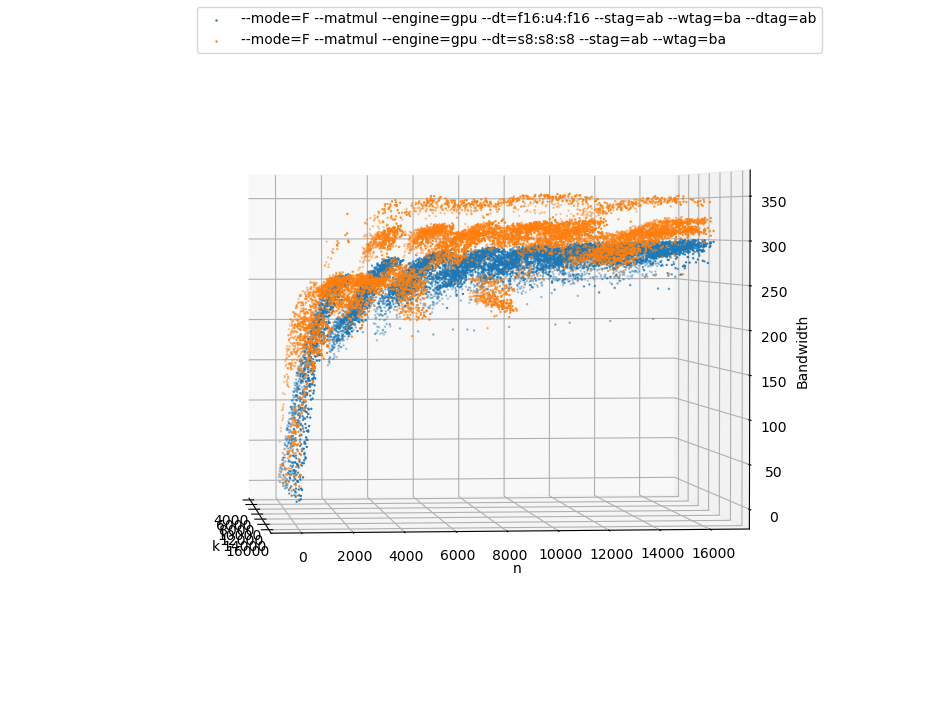

# Proposal for Psuedorandom Synthetic Benchmarks

## Overview
OneDNN is a performance focused library, so maintaining performance across a
wide range of problems is critical to development. To successfully provide
out-of-box performance, developers need to analyze sample problems, find
sub-optimal behaviors, and prioritize implementing solutions. In order to
effectively prioritize work, developers must assign an priority metric across
some sample of problems, so that they can implement optimization which have the
highest impact. The current practice largely revolves around collecting some
workload samples as Key Performance Indicators (KPIs) and analyzing those
workloads to find high impact optimizations.

In practice, collecting and analyzing KPIs does not appear to be sufficient. One
of the major issues is that the KPIs collected are often not representative. In
practice, data collection happens on specific workload instances and important
information on dimension variability is lost. When we attempted to address this
by collecting more workload instances, the result is enough data that
brute-force performance collection would be infeasible.

On top of this, primitive performance is semi-chaotic. Consider a recent example
encountered for int4 matmul operations on an iGPU that used the same GPU kernel.
In this case, a 1x8064x3072 GEMM operations achieves 95% efficieny, but the
similar GEMM 1x8192x3072 (the k shift chosen to keep data cacheline-aligned),
only achieves 80% efficiency. If we sample a collection of similar problems, a
trend emerges that 3 specific k sizes get significantly less performance. This
data can the help prioritize the impact of any fixes. For example, as this
problem is limited to a 1 dimensional subset of the problem space, we may choose
to focus work on optimizations with broader impact, or alternatively, we may
choose to spend development resource on k=8192 if we expect power of two sizes
to be common workloads.

Finally, there is no clear way to prioritize performance between separate
workloads. The more workloads that are sampled, the more likely we are to
encounter scenarios where developers are spending their time attempting to
balance performance requirements across multiple workloads. As such, we need
more statistically rigorous methods.

To help counteract the performance gaps related to the current process, oneDNN
developers are often receiving work requests of the form:

> The performance of workload A is unexpectedly worse than workload B. Please improve workload A.

In particular, the following are some common comparisons being performed:
* Same problem running on different oneDNN builds (aka, regression testing)
* Problems with different data types
* Problems with different data layout
* Problems with similar dimensions
* Same problem with different implementations (this comparison when narrowed to
  internal implementations is also very important for developers)

Currently, oneDNN testing practices only address regression testing, leaving a
testing gap relative to customer testing. To help resolve this, this RFC
proposes adding psuedorandom synthetic benchmarking to oneDNN and a set of
standard analysis that can be tested to pre-emptively resolve such issues.

## Why Psuedorandom Data
This PR proposes we use psuedorandom data for a few reasons. The most important
reason is that prioritization metrics applied to synthetic data are, in some
sense, meaningless. Because of this, specific workload A vs B comparisons cannot
be used to justify spending developer effort on optimizations. This story
changes when we can look at a large class of problems. In particular, when
developers can demonstrate a gap across a significant class of workloads, and
that class of workloads is related to some known workloads.

To consider a specific examples, recently, there has been a lot of work to
optimize int4 LLM workloads. For optimization purposes, this largely equates to
optimizing well-aligned GEMM operations. In particular for this workload, the
`m` dimension of the GEMM operation is variable and is generally proportional to
the prompt length for the first iteration, i.e. something like `m = 3k` where
`k` is the number of words in the prompt, and then `m = 1` for later tokens. On
the other hand, `n` and `k` only vary across LLM models and are relatively large.

If we take the restrictions from the first iteration and generate some synthetic
data on a Flex Series GPU, we can generated a performance relative efficiency
metric by calculating

```C++
sample_compute_efficiency = flops/max_sample_flops;
sample_memory_efficiency = bandwidth/max_sample_bandwidth
```

For demonstration purposes, we can visualize this efficiency with a 3D heatmap
and split the data by whether is mainly memory bound or compute bound.






After collecting data the above data, there are a few ways we intend to use it:

1. Build tests suites for tracking performance across supported platforms.

    * We may also consider appropriate generalizations. For example in this
      case, the use of transposed memory layout it largely an artifact that the
      initial XeTLA implementations provided better performance on that layout,
      so development has been focused on that layout.

2. Identify gaps and clarify requirements with users. For example in this case,
   most first token requests focus on compute bound workloads.
   * Does the lower efficiency drop associated with the memory bound scenario
   when 16 < m < 64 relevant? Should we be measuring cold cache behavior instead?

3. Generate visualizations/analysis developers can use to root cause issues

   * From the above heatmap, the fact that no compute bound cases maximize
     compute throughput or that the "easy" case of large `m`, `k`, and `n` has
     lower efficiency is concerning.
   * The memory bound outlier point may represent a useful point for identifying
     implementation issues.

4. Build developer tools for dispatch tuning.
   * The general process being adopted for reusable kernels is to manually
     generate a kernel database which contains a performance model used for
     picking the kernel to run.
     * This does not scale as it requires developer intervention to gain the
       benefit of new optimizations on a per platform,type, and data layout
       basis.
     * Metrics for replacing old strategies is often unclear as it is often unknown
       exactly why a strategy was chosen.
     * Many of the issues noted from the visualization above are likely just
       artifacts of the fact that a developer has not specifically analyzed that
       range of problem sizes and picked an optimized kernel.
   * This process can be replaced with tool that can automatically search for and
     generate an optimal set of kernels covering the workspace.
     * This requires significantly higher benchmarking throughput than
       is currently provided by benchdnn. By my estimate, this requires the
       ability to collect millions to hundreds of millions of performance data
       points in a reasonable time.


## How to Analyze
Since synthetic data performance is, in some sense, meaningless, the proposal is
to provide relative metrics for data analysis. The key proposed metrics are
intended to address common analysis developers are currently receiving. In
particular, these are

* Performance relative to other oneDNN builds
* Performance of data type A vs the equivalent f32 operations
* Performance of data layout configuration A vs the "ideal" layout
* Performance relative to a hardware independent efficiency proxy, such as
  was used in the int4 example above.

From this data, we can then use simple metrics to analyze the performance
distribution for a passing state. For example, with a regression test we could
require the mean performance to not regress and have some bound on tail
performance regressions. For many analysis, we will only need to benchmark a
limited number of workloads (around 1,000-10,000) to achieve enough statistical
significance. In addition, since performance on specific workloads is not
relevant, lower fidelity performance benchmarking can be used speed up testing.
As such, a statistically significant sample can be collected relatively quickly.
This throughput increase will be important to enable the automated tuning tools
use case from above.

## Collecting Relevant Data For Developers
One of the biggest issues for synthetic data is making sure it is relevant to
current development tasks. Most development work targets specific classes of
problems, and if sampling measures a lot of unchanged implementations, it will
be difficult to extract useful data from run to run noise (along with the
unchanged measurements just wasting time). To address this, we need some
methods to limit the search space close to the optimization space. To accomplish
this, this RFC proposes two methods be implemented:

* Developer supplied filters: Developer supplied filters are expected to fit
  into two categories, value sets or dimension restrictions. Value sets will
  just be lists of allowed values such as the data type configuration of
  `{s8:s8:s32,u8:u8:u32}`. Dimension restriction, on the other handle, will be
  composed of range and modulo restrictions, for example, `{m in [1,32]:
  m%4==0}`. In addition, as most of the development complexity arises around
  small dimensions sizes (and large problems take longer to benchmark), indices
  are expected to be sampled from a power law distribution.

* Automated Diffing: As one of the relevant metrics is a comparison between
  oneDNN builds, this tool needs a way to execute multiple oneDNN libraries. As
  a consequence, we can add a testing API for comparing implementations. When
  implementations match between oneDNN builds, we can often skip benchmarking.
  As oneDNN primitive creation and dispatching can be quite complicated, this is
  beneficial for developers as they cannot always predict the effect of an
  implementation change. In addition, if functionality validation is supported,
  this provides a much faster way to initially validate correctness by skipping
  unchanged implementations.

## Proposal
To address the above issue, this RFC propose creating tools to support a data
pipeline. For the purposes of this RFC, the pipeline is being split into two
stages, a data producer and some data consumers. Often data pipelines include a
data storage step via a database. While this would be useful, it is being
omitted from the current RFC to reduce the complexity.

### Data collection
Given the above discussion, this data collection utility is expected to have the
syntax:

```Bash
collectdnn --<primitive> --validate --report=<metric> --samples=<num> --<filter_cfg1>=<param1> --<filter_cfg2>=<param2> ...
```

As a psuedo-code summary for how this will be implemented,


```C++
Generator G(primtitive_kind, filter_cfg, enable_auto_diff);
Results R;
std::pair<Problem, Primitive> P;
parallel_for(Problem p : G) {
    P.emplace_back({p, create_primitive(p)});
}

for(auto p : P) {
    if (benchmark) r.emplace_back(benchmark(p, metric, ctx));
    if(validate) p.validate();
}

```

As this tool is intended to produce data from multiple oneDNN builds, this tool
should rely on benchdnn for data generation. To properly support data
collection, benchdnn will need two new features. The first feature is to enable
logging and skipping problems based off of a primitive ID. These IDs can then be
used for the automated diffing feature discussed above.

There are two main options for implementing primtive IDs
 * Option 1: Serialize relevant primitive data
 * Option 2: Hash relevant primitive data to generate a UUID

Given that we are looking at generating millions of primitives, and serialized
primitive data is likely to be in the 10's of kilobytes in size, Option 1
appears infeasible due to the data size. While using a hash allows for false
collisions, by choosing a large enough key, we are unlikely to hit an issue in
practice. To implement this, we would add the following internal interface for
use in benchdnn:

`extern "C" primitive_d_t DNNL_API dnnl_primitive_get_id(primitive_iface_t *p). `


To provide a maintainable and correct implementation, `dnnl_primitive_get_id` is
expected to provide a hash of the primitive JIT generated function binary and any
performance related function arguments. As getting the hash of runtime kernel
arguments will need to be invasive to each implementation, a special value
`hash_id_unsupported = 0` will also exist for unsupported implementations,
so that developer can focus on implementations under active development.

Finally, we will need to add a new hashing mode-modifier to enable logging of
primitive ID's, along with a new input `--skip-primitive-ids=<file>`. If we
implement a hashing mode denoted as `H`, automatic diffing can then be
implemented as:

``` Bash
    ./build1/tests/benchdnn/benchdnn --mode=H ... > skip_list
    ./build2/tests/benchdnn/benchdnn --skip-primitives=skip_list ...
```

A prototype implementation of the proposed `--mode=H` option for GPU primitives
is contained on the branch `rjoursle/diffdnn`.

The second modification that will be needed for benchdnn is a new low-fidelity
batched benchmarking mode. This mode will would only execute each workload once,
with the expectation that run-to-run variability is being handled by executing
multiple similar workloads. The benchmarking is expected to be performed as
follows on GPU, although some tweaks may be required to get performance stability

```C++
workload_batch = setup_workloads();
stream->warmup_device();
for(auto & workload: workload_batch) {
    if(!cold) warmup(workload.memory())
    stream->execute(workload)
}
stream.wait()
print_output(workload_batch); // For GPU, performance data will be queried from MDAPI like normal

```

### Data Analysis and Visualization
The requirements for data analysis are less well defined and expected to be
fleshed out over time by developers. The high level goal is to enable quick and
easy creation of performance reports relevant to pull requests and for analyzing
project performance. This PR proposes adding a few starter methods:

* Automated Diffing Regression Analysis - This tool will generate an S curve on
  implementations which have changed between oneDNN builds. This S curve can
  than be plotted and simple average/tail performance heuristics can be applied
  to determine if the test passed.

* Proxy Performance Analysis - This tool will generate an S curve for multiple
  problem kinds and plot them side by side. These S curve will be generated
  relative to some proxy metric such as base problem kind (like the
  problem with f32 data), performance on a different machine, or a proxy
  efficiency metric such as `flops / max_measured_flops` for compute bound
  workloads. This plot is largely designed to assess the overall health of
  supported configurations. Pass fail metrics can then be generated for
  different machine architectures based on average and expected behaviors for a
  given architecture.

* Scatter Plot or Heatmap Tool - This tool will provide an interactive plot of
  performance across a range of problems sizes. The intended usage is for
  developers to explore the problem space to help identify general problem
  trends and problematic scenarios.


As a demonstration for how this can work, a prototype scatter plot
implementation can be found at `rjoursle/scatter`. To use this prototype, build
oneDNN with GPU support and execute the following on a machine with an Intel
GPU.

```Bash
ssh <machine> "source <environment.sh>; python3 <dnnl_machine>/tests/synthdnn/collectdnn.py <dnnl_machine>/build/tests/benchdnn/benchdnn" | python3 <dnnl_local>/tests/synthdnn/plotdnn.py
```

This should create a locally interactive 3D plot (even during data collection)
of the memory throughput of `1xkxn` memory bound int4 and int8 GEMM workloads.
Once data collection is complete, there should be a plot like the following
collected on an Flex Series GPU:


