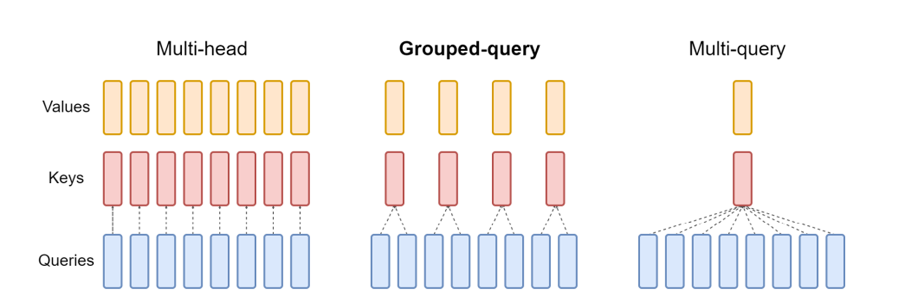
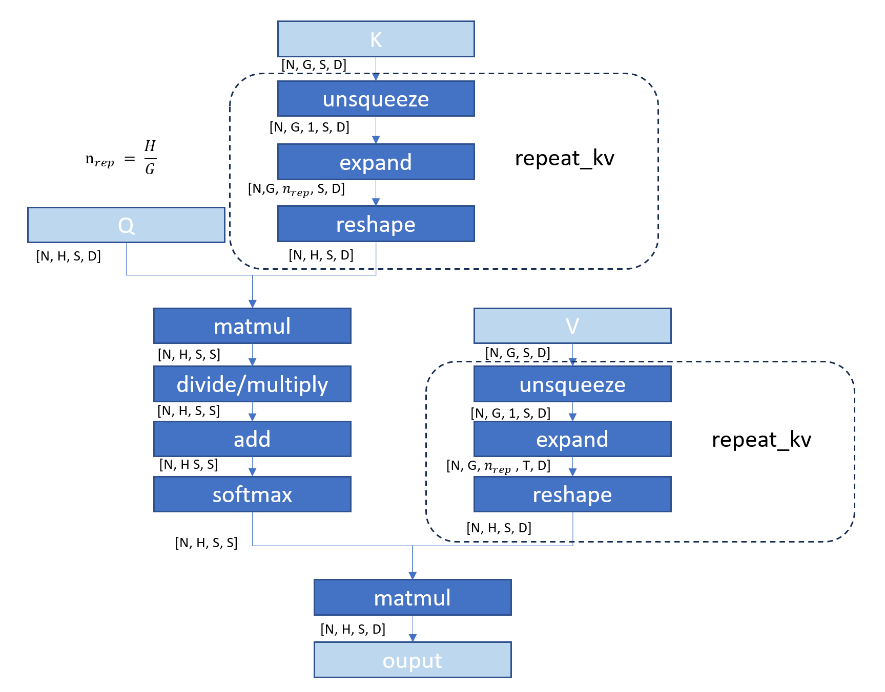
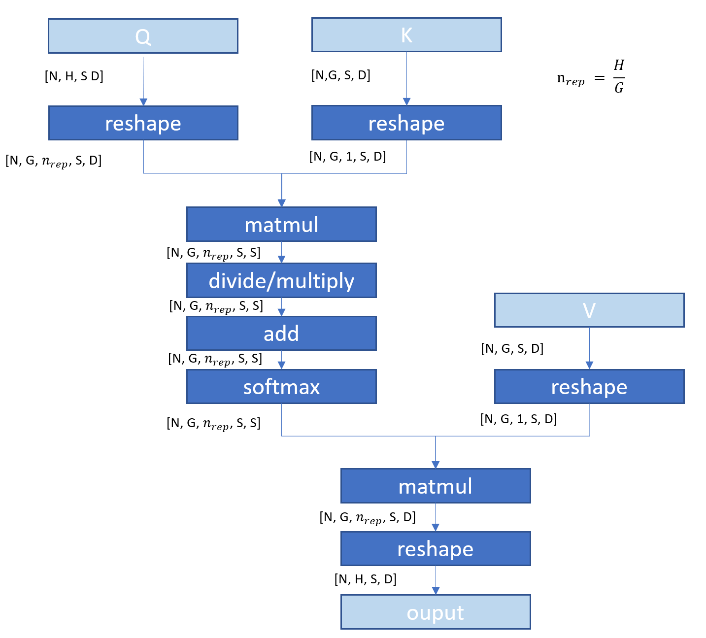

# Support Grouped-query Attention in Graph API

## Introduction & Motivation

In typical Multi-Head Attention (MHA), Query, Key, and Value tensors usually
have the same head number (eg., all Query, Key, and Value have shape (N, H, S,
D) where N is mini-batch size, S is sequence length, H is head number, and D is
head size). It becomes the performance bottleneck to load the Key and Value
tensors in each generation step especially when the sentence length becomes
longer.

To reduce the memory bandwidth of loading the Key and Value tensors, Multi-Query
Attention (MQA) is invented by reducing the head number of Key and Value to 1
which means multiple Queries will map the same single Key and Value (the shape
of Key and Value become (N, 1, S, D)).

However, MQA can lead to model quality degradation and training instability.
Grouped-Query Attention (GQA), an interpolation between typical MHA and MQA, is
proposed with single Key and Value head per subgroup of Query heads (the shape
of Key and Value become (N, G, S, D) where H > G and H % G = 0). GQA is widely
adopted in llama2-70B, llama3 family, llama3.1 family [[#1]][1], Mistral, and
StarCoder2 [[#2]][2].

The following figure is from the paper [[#3]][3] and shows the comparison of
MHA, MQA, and GQA.



oneDNN already supports Scaled Dot-Product Attention (SDPA) through Graph API
([document](https://oneapi-src.github.io/oneDNN/dev_guide_graph_sdpa.html#doxid-dev-guide-graph-sdpa)
and
[examples](https://github.com/oneapi-src/oneDNN/blob/main/examples/graph/sdpa.cpp)).
This proposal aims to extend the support from SDPA to cover GQA.

## GQA in PyTorch

Pytorch support GQA as a fused operations like SDPA in the recent PR [[#4]][4].
Before this PR, GQA is implemented in the following way in Huggingface
Transformers[[#5]][5]. 

1. Firstly, as the Query (in shape (N, H, S, D)) and Key/Value (in shape (N, G,
   S, D)) have different head number dimension and cannot perform dot-product
   directly, Key and Value tensors are repeated along the head number dimension.

  ```python
  def repeat_kv(hidden_states: torch.Tensor, n_rep: int) -> torch.Tensor:
      """
      This is the equivalent of torch.repeat_interleave(x, dim=1, repeats=n_rep). The hidden states go from (batch,num_key_value_heads, seqlen, head_dim) to (batch, num_attention_heads, seqlen, head_dim)
      """
      batch, num_key_value_heads, slen, head_dim = hidden_states.shape
      if n_rep == 1:
          return hidden_states
      hidden_states = hidden_states[:, :, None, :, :].expand(batch, num_key_value_heads, n_rep, slen, head_dim)
      return hidden_states.reshape(batch, num_key_value_heads * n_rep, slen, head_dim)
  ```

2. Then the repeated Key and Values can be passed to the typical SDPA block.

  ```python
  key_states = repeat_kv(key_states, self.num_key_value_groups)
  value_states = repeat_kv(value_states, self.num_key_value_groups)

  # typical SDPA block
  attn_weights = torch.matmul(query_states, key_states.transpose(2, 3)) / math.sqrt(self.head_dim)

  if attention_mask is not None:  # no matter the length, we just slice it
      causal_mask = attention_mask[:, :, :, : key_states.shape[-2]]
      attn_weights = attn_weights + causal_mask

  # upcast attention to fp32
  attn_weights = nn.functional.softmax(attn_weights, dim=-1, dtype=torch.float32).to(query_states.dtype)
  attn_weights = nn.functional.dropout(attn_weights, p=self.attention_dropout, training=self.training)
  attn_output = torch.matmul(attn_weights, value_states)
  ```

The overall workflow can be visualized as the following diagram:



## Proposals

oneDNN's MatMul operation is used to construct the dot-product operations in
SDPA. But the MatMul operation requires the two inputs should have the same
batch dimension or the batch dimensions can be simply broadcasted. MQA can be
implemented directly using typical SDPA and the broadcasting rule. But in GQA,
the head number of Key and Value is different from the head number of Query. We
propose two options to pre-process the Query, Key and Value tensors before
passing them into the MatMul operations.

### Option 1

Add new ops and patterns. We can pre-process the Key and Value tensors following
how they are pre-processed in the Huggingface Transformer code above. To achieve
that, below two new operations need to be supported by oneDNN graph operation set:

- Unsqueeze (see [sub-rfc document](./unsqueeze_and_expand.md))
- Expand (see [sub-rfc document](./unsqueeze_and_expand.md))

Then we would to support patterns like the above diagram.

Pros:

1. It makes the pattern graph to be consistent with the popular implementation
   in the community. Frameworks can still map the framework graph directly to
   oneDNN graph and get the fused partition.

Cons:

1. Need to add more operations to oneDNN graph operation set.
2. The implementation in the community may change. Even in the Huggingface code,
   another alternative implementation is explicitly mentioned (via
   `torch.repeat_interleave`). Once the implementation changes, the above pros
   will become invalid.

### Option 2 (recommended)

Add new patterns. We can reshape Query, Key and Values tensors from 4D to 5D and
leverage the broadcasting semantics of MatMul operation to perform the dot-products.
  
1. Reshape Query from 4D shape (N, H, S, D) to 5D shape (N, G, H / G, S, D).
2. Reshape Key from 4D shape (N, G, S, D) to 5D shape (N, G, 1, S, D).
3. Performance 5D matmul between (N, G, H / G, S, D) and (N, G, 1, S, D). The
   third dimension will be broadcasted from 1 to `H / G` automatically per the
   broadcasting rule of MatMul operation.
4. Similar reshape and broadcasting can also be applied to the dot-product of
   Value.

Here is the diagram:


Pros:

1. No change to API.
2. The pattern looks simpler than the pattern in option 1.

Cons:

1. The pattern is less intuitive from GQA definition.
2. The pattern cannot be used to optimize a framework graph directly. Frameworks
   will have to implement GQA fusion by themselves and leverage this option to
   optimized the fused GQA.

### Option 3

We can extend the MatMul broadcasting rules to support group broadcast.
Currently, MatMul operation supports below broadcasting rules.

For single 2D matrix multiplication:

| Matrix A | Matrix B | Matrix C = A x B |
| --       | --       | --               |
| M x K    | K x N    | M x N            |

For batched matrix multiplications:

| Matrix A   | Matrix B   | Matrix C = A x B |
| --         | --         | --               |
| B x M x K  | B x K x N  | B x M x N        |
| B x M x K  | 1 x K x N  | B x M x N        |
| 1 x M x K  | B x K x N  | B x M x N        |

This can be extended to multiple batch dimensions matrix multiplications:

| Matrix A              | Matrix B              | Matrix C = A x B      |
| --                    | --                    | --                    |
| B1 x 1 x B3 x M x K   | B1 x B2 x 1 x K x N   | B1 x B2 x B3 x M x N  |

This RFC proposes to further extend it to support group broadcast:

| Matrix A              | Matrix B                | Matrix C = A x B      |
| --                    | --                      | --                    |
| B1 x 1 x B3 x M x K   | 1 x B2 x (B3/c) x K x N | B1 x B2 x B3 x M x N  |

where, c is a factor of B3.

This rule looks uncommon and is not supported by the typical broadcasting rules
(see broadcasting in
[ONNX](https://github.com/onnx/onnx/blob/main/docs/Broadcasting.md) and
[NumPy](https://numpy.org/doc/stable/user/basics.broadcasting.html#general-broadcasting-rules).),
but actually it's added to the MatMul operation of cuDNN in order to support
GQA. [[#6]][6]

Pros.

1. We will have the most unified and simple pattern for SDPA, GQA, and MQA.
2. The same support methodology with cuDNN API.

Cons.

1. It complicates the semantics of MatMul operation. Previously incompatible
   batch dimension will be treated as an error. But now we need to further check
   if they can be properly group broadcasted. Even cuDNN explicitly document
   that the new broadcasting rule is only supported by the fused attention.
2. Same as option 2, still the pattern cannot be used to optimize a framework
   graph directly. Frameworks will have to implement GQA fusion by themselves
   and leverage this option to optimized the fused GQA.
3. We rely on oneDNN matmul primitive kernels for reference implementation and
   testing in benchdnn which do not support the new broadcasting rule. Extending
   the broadcast semantics on graph side will also request additional effort for
   reference implementation and testing. 

## Summary
We would recommend to go with option 2, as it don't need to change the API and
minimal changes to the library. It is simple enough for understanding. For the
cons, it is releted to the integration in the framework. Actually framework have
to implement GQA fusion by themselves for both option2 and option3, also option
1 when the implementation in the community changes.

## References

1. [https://github.com/meta-llama/llama-models][1]
2. [https://huggingface.co/models][2]
3. [GQA: Training Generalized Multi-Query Transformer Models from Multi-Head
   Checkpoints][3]
4. [https://github.com/pytorch/pytorch/pull/132689][4]
5. [https://github.com/huggingface/transformers/blob/2782aadae2b0b0c313eac3ee70f84f0335577635/src/transformers/models/llama/modeling_llama.py#L203C1-L212C85][5]
6. [https://docs.nvidia.com/deeplearning/cudnn/latest/api/cudnn-graph-library.html#cudnn-backend-operation-matmul-descriptor][6]

[1]: https://github.com/meta-llama/llama-models
[2]: https://huggingface.co/models
[3]: https://arxiv.org/pdf/2305.13245
[4]: https://github.com/pytorch/pytorch/pull/132689
[5]:
    https://github.com/huggingface/transformers/blob/2782aadae2b0b0c313eac3ee70f84f0335577635/src/transformers/models/llama/modeling_llama.py#L203C1-L212C85 
[6]: https://docs.nvidia.com/deeplearning/cudnn/latest/api/cudnn-graph-library.html#cudnn-backend-operation-matmul-descriptor
