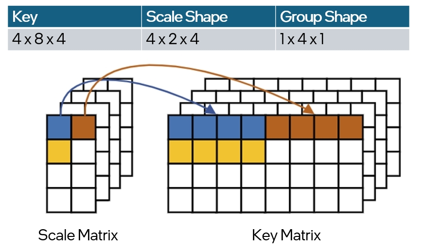
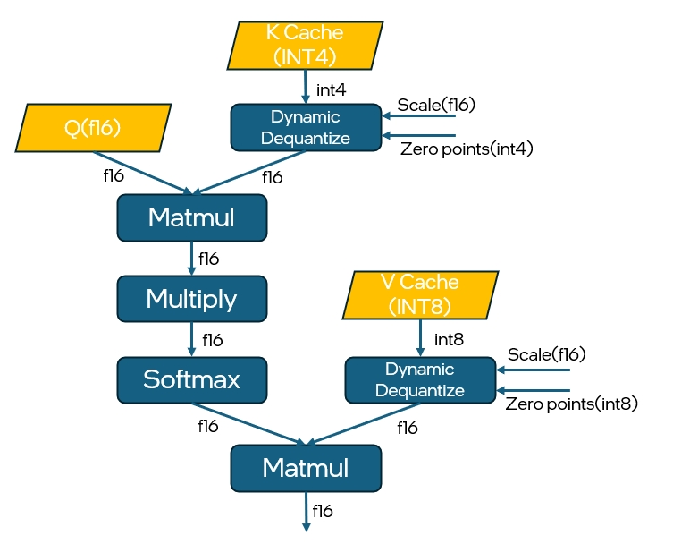

# Graph API: Support int4/int8 compression for K/V in fused SDPA

## Introduction

Int4 and int8 compression for Key and Value are exploited in fused SDPA to
reduce the memory footprint of generative inference of LLM, especially when KV
cache mechanism is adopted. In more details, Key and Value tensors will be
stored in lower integral data types such as int4 and int8 for less memory
consumption, and will be de-quantized to wider floating point data types such as
f16 and bf16 for computation. According to the investigation and user request,
it's also possible that Key tensor will be stored in int4 while Value tensor in
int8 as it's more sensitive to precision.

Currently, oneDNN Graph API already supports int8 data types and
per-tensor/channel int8 quantization, but does not support int4 data types. In
addition, due to the limited range of representation of int4 data types, grouped
scales and zero points are required for int4 quantization and dequantization,
which are not supported in oneDNN Graph either. With that, this document will
concentrate more on supporting int4 data types and its quantization in oneDNN
Graph in the following parts.

To be more specific, in this RFC we are going to discuss about supporting the
following features in oneDNN Graph API:

1. Support u4/s4 data types in Graph API.
2. Support int4 data types quantization and dequantization.
3. Extend the existing SDPA pattern with compressed K/V inputs.

## Proposals

### Proposal 1: Support u4/s4 data types

The proposal is to follow oneDNN primitive APIs design with adding int4 data
types enumerations in `dnnl_data_type_t` (defined in dnnl_common_types.h). The
new enumerations will work for both primitive and graph C APIs.

```cpp
/// Data type specification
typedef enum {
    /// Undefined data type, used for empty memory descriptors.
    dnnl_data_type_undef = 0,
    /// 16-bit/half-precision floating point.
    dnnl_f16 = 1,
    /// non-standard 16-bit (bfloat16 w/ 7 bit mantissa) floating point.
    dnnl_bf16 = 2,
    /// 32-bit/single-precision floating point.
    dnnl_f32 = 3,
    /// 32-bit signed integer.
    dnnl_s32 = 4,
    /// 8-bit signed integer.
    dnnl_s8 = 5,
    /// 8-bit unsigned integer.
    dnnl_u8 = 6,
    /// 64-bit/double-precision floating point.
    dnnl_f64 = 7,
    /// Boolean data type. Size is C++ implementation defined.
    dnnl_boolean = 8,
    /// [OFP8 standard 8-bit floating-point](https://www.opencompute.org/documents/ocp-8-bit-floating-point-specification-ofp8-revision-1-0-2023-06-20-pdf)
    /// with a 5-bit exponent and a 2-bit mantissa.
    dnnl_f8_e5m2 = 9,
    /// [OFP8 standard 8-bit floating-point](https://www.opencompute.org/documents/ocp-8-bit-floating-point-specification-ofp8-revision-1-0-2023-06-20-pdf)
    /// with a 4-bit exponent and a 3-bit mantissa.
    dnnl_f8_e4m3 = 10,
    /// 4-bit signed integer.
    dnnl_s4 = 11,
    /// 4-bit unsigned integer.
    dnnl_u4 = 12,

    /// Parameter to allow internal only data_types without undefined behavior.
    /// This parameter is chosen to be valid for so long as sizeof(int) >= 2.
    dnnl_data_type_max = 0x7fff,
} dnnl_data_type_t;
```

In Graph C++ API, the enum class `logical_tensor::data_type` (defined in
dnnl_graph.hpp) will be extended to support the int4 data types.

```c++
class logical_tensor {
    // ...
    /// Data Types
    enum class data_type {
        undef = dnnl_data_type_undef,
        /// 16-bit/half-precision floating point.
        f16 = dnnl_f16,
        /// non-standard 16-bit (bfloat16 w/ 7 bit mantissa) floating point.
        bf16 = dnnl_bf16,
        /// 32-bit/single-precision floating point.
        f32 = dnnl_f32,
        /// 32-bit signed integer.
        s32 = dnnl_s32,
        /// 8-bit signed integer.
        s8 = dnnl_s8,
        /// 8-bit unsigned integer.
        u8 = dnnl_u8,
        /// Boolean data type. Size is C++ implementation defined.
        boolean = dnnl_boolean,
        /// 8-bit floating point data type with E5M2. Added by this RFC.
        f8_e5m2 = dnnl_f8_e5m2,
        /// 8-bit floating point data type with E4M3. Added by this RFC.
        f8_e4m3 = dnnl_f8_e4m3,
        /// 4-bit signed integer.
        s4 = dnnl_s4,
        /// 4-bit unsigned integer.
        u4 = dnnl_u4,
    };
    // ...
};
```

The new data types can be used to create logical tensors and tensors in oneDNN
Graph API.

```c++
using namespace dnnl::graph;

// create a s4 logical tensor with unknown ndim and dims.
auto lt1 = logical_tensor(id, logical_tensor::data_type::s4);

// create a u4 logical tensor with dims = (16, 8).
const logical_tensor::dims shape = {16, 8}
auto lt2 = logical_tensor(id, logical_tensor::data_type::u4, shape);
```

### Proposal 2: Extend Quantize and Dequantize Operations

The recommended proposal is that oneDNN Graph API will support int4 data type
through graph fusion following the way that int8 is supported, instead of
directly adding int4 data types in computation operations.

Based on the request, int4 quantization happens in runtime (scales and zps are
stored as tensors on device). Graph API will support int4 quantization through
operations `DynamicDequantize` and `DynamicQuantize`. In the future, it's
possible that we will also extend the static version of `Quantize` and
`Dequantize` to support int4 quantization. For now, we will focus on
`DynamicDequantize` due to the request urgency and the feature use scenario.

According to the request from frameworks, for int4 quantization, grouped scales
and zero points are required for each hidden dimension to maintain the model
accuracy. See [int4 Quantize](https://docs.nvidia.com/deeplearning/tensorrt/operators/docs/Quantize.html?highlight=int4)
and
[Dequantize](https://docs.nvidia.com/deeplearning/tensorrt/operators/docs/Dequantize.html)
in TensorRT and
[QuantizeLinear](https://onnx.ai/onnx/operators/onnx__QuantizeLinear.html) in
ONNX.

Currently, `DynamicDequantize` in Graph API accept a required f32 1D tensor as
the scale factor, and an optional 1D tensor as the zero points( can be either
s8/u8/f32 ). What's more, two optional attributes are provided: `qtype` is used
to specify which quantization type is used, `per_tensor` or `per_channel`. And
`axis` specifies on which dimension `per_channel` quantization will be applied.
To support int4 data types, `DynamicDequantize` operation in oneDNN Graph opset
will be extended by supporting u4/s4 input, and scales and zero points with
groups. The library may raise an error if groups are not provided for a
`DynamicDequantize` op with u4/s4 input.

Besides the input or output data types, new attributes will be added for
DynamicDequantize:

1. Add `per_group` to the supported values of `qtype` attribute, and the default
   value will be unchanged.
2. The existing attribute `axis` will be ignored if `per_group` quantization is
   specified.
3. Add a new attribute `group_shape` to support `per_group` quantization
   type. The value of `group_shape` attribute is a vector of `s64` data. On the
   dimension where the group quantization is applied, the dimension indicates
   the number of elements that share the same scaling factor and zero points in
   each quantization group( which is `group_size` ).  And the other dimensions
   should be all `1`. The attribute is required when `per_group` quantization
   type is specified for `qtype`. If `per_group` quantization is not specified
   and `group_shape` attribute is given, it will be ignored. Basically, it
   requires the number of dimensions in `group_shape` attribute should
   coincides with that of the input shape, otherwise the graph library will
   report an `unimplemented` failure.
4. The `scale` and `zp` input will be extended to a `n`-dimensional tensor
   (`n` = dims(input)) for `per_group` quantization. The shape requirements for
   `scale` and `zp` are as follows:
   1. For `per_tensor` and `per_channel` quantization, the `scale` and `zp`
      inputs should be `1d` tensors.
   2. For `per_group` quantization:
      - On the dimension where the group quantization is applied, the dimension
      should equal to `src_dim / group_size`.
      - On other dimensions, the dimension should match the input.

For example, if the shape of Key tensor is `4x8x4`, and the group shape is
`1x4x1`, which means each scaling factor will be adopted for 4 times. One
possible scale would be:



The usage of the new attribute will be like:

```cpp
using namespace dnnl::graph;

const dim K = 10, N = 20;
const size_t nG = 2, G = N / nG;

dims src_dims = {K, N};
dims scale_dims = {K, nG};
dims group_shape = {1, G}

// In real case, users do not have to provide the concrete shapes of logical
// tensors until compilation stage. 
logical_tensor src_desc {0, data_type::u4, src_dims, layout_type::strided};
logical_tensor scale_desc {
        1, data_type::f32, scale_dims, layout_type::strided};
logical_tensor dst_desc {2, data_type::f32, src_dims, layout_type::strided};

op deq = op(0, op::kind::DynamicDequantize, {src_desc, scale_desc},
        {dst_desc}, "deq");
// Specify the quantization type as per_group quantization.
deq.set_attr<std::string>(op::attr::qtype, "per_group");
// Group size indicates the the size of each group.
deq.set_attr<int64_t>(op::attr::group_shape, group_shape);

// Create graph and add the op to the graph
graph g(dnnl::engine::kind::gpu);
g.add_op(deq);

// ...
```

#### Limitation

With the introduction of the new attribute `group_shape`, Graph API now
enables users to define group quantization across multiple dimensions. This
design aims to accommodate potential quantization types, such as per-token
quantization, where the group size is defined as H*D. However, these
quantization types are not yet supported by the current implementation. As for
grouped quantization, the backend currently facilitates quantization on one of
the last two dimensions, while all other inputs will be deemed invalid.

#### Alternative options

Similar to the discussion of int8 and fp8 data types, an alternative solution
may be supporting int4 data types directly in computation operations like MatMul
and Convolution. But it will bloat and complicate the opset and op schema of
oneDNN Graph. Hence it's not considered here.

In addition, to enhance clarity and reduce compilation overhead, oneDNN Graph
will support the direct quantization between int4 data types and bf16/f16.
This means that additional `Typecast` operations will no longer be necessary
between quantization processes and subsequent operations in bf16/f16 computation
graphs. Although it will complicate the fusion patterns to some extend, we can
address this by implementing more precise pattern definitions.

### Proposal 3: Extend SDPA pattern with compressed K/V

#### Pattern definition

With the reference to int4 GQA pattern in
[PyTorch](https://pytorch.org/blog/int4-decoding/), the proposed fusion pattern
for SDPA with compressed K/V in oneDNN Graph API is defined as:



As illustrated in the figure above, K cache and V cache are stored on user side
in int4 or int8 data types. `DynamicDequantize` is used to convert int4 data to
bf16. Two `MatMul`s are used to compute the matrix multiplication of Q and K, as
well as  score and V. oneDNN Graph will fuse the pattern into a single partition
with optimized CPU and GPU implementations.

To get rid of the ambiguity of the computation type of the MatMul ops in the
pattern and give users the control of leveraging higher precision data types to
keep the model accuracy, we propose to follow the design of floating point math
mode in primitive API. Once the math mode is specified, the backend will
automatically perform either implicit down-conversion to lower-precision
integral type values or up-conversion from int4/int8 to floating points, such as
f16, based on user input. For compressed SDPA, since the Key tensor will be in
integral types like int4 and `MatMul`s are expected to compute in f16/bf16,
users must explicitly set the math mode. Put it in another way, the API allows
users to control the computation type of the SDPA fusion. What's more, following
the design of floating point math mode also helps to maintain a consistent API
semantics between graph API and primitive API. 

Currently, oneDNN Graph API supports setting floating-point math mode during the
construction of graph object, which will affect the whole graph. 

As primitive API has supported a second argument for enforcing an integral
primitive to comply with the floating-point math mode, oneDNN Graph API need to
accommodate to the change. The new API will be like:

```cpp
/// @param mode Floating-point math mode.
/// @param apply_to_int Use of floating-point arithmetic for integer primitives.
void set_fpmath_mode(fpmath_mode mode,  bool apply_to_int = false);
```

Users can use the new API like:

```cpp
using namespace dnnl::graph;

graph g(kind);
g.set_fpmath_mode( math_mode, /*apply_to_int=*/true);

op foo(id, kind, "foo"); g.add_op(foo);
op bar(id, kind, "bar"); g.add_op(bar);
g.finalize();
partitions p = g.get_partitions();

// All the partitions from the same graph should share the same math mode
compiled_partition cp0 = p[0].compile(inputs, outputs, engine);
compiled_partition cp1 = p[1].compile(inputs, outputs, engine);
cp0.execute(…);
cp1.execute(…);
```

User can still set graph-level fpmath mode through graph constructor, and only
one method will be allowed for setting the graph-level fpmath mode. Otherwise,
the library will report an error.

#### Alternative option

Considering the fact that the framework users can create different graphs if
they require different floating point math mode, the current API capability is
enough for covering the user request. An alternative solution is to specify the
floating point math mode on partition. But it may require new APIs and may cause
confusion when the modes on graph and partition are incompatible. Hence it's not
considered here.
