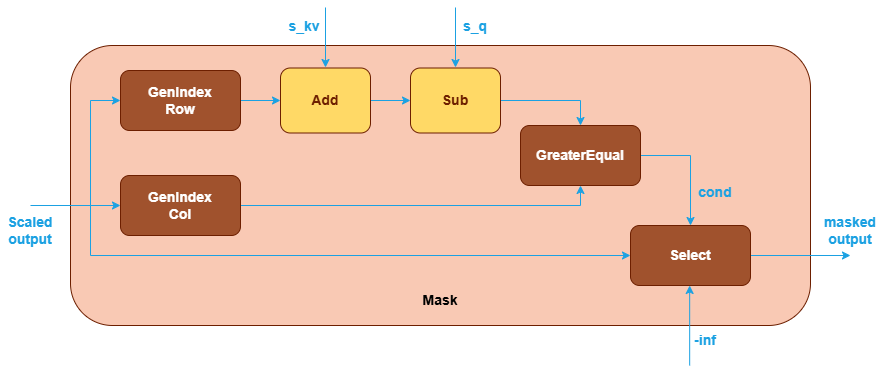

# Support Implicit Causal Mask in SDPA in Graph API

## Background

The causal mask is an essential component in Scaled Dot-Product Attention (SDPA),
particularly for autoregressive language models like GPT. Its primary purpose
is to prevent information leakage from future tokens during the training and
inference processes of language models. To achieve this, causal mask is typically
implemented as an upper triangular matrix with zeros on and below the main diagonal,
and negative infinity above it [1]. This configuration ensures that each token
can only attend to itself and the tokens that come before it in the sequence.


Deep learning frameworks and libraries (e.g. Pytorch, OpenVINO, cuDNN, etc.) support
causal mask in two primary ways:

1. Explicit causal mask: users can explicitly create a causal mask matrix for the
   computation of SDPA.
2. Implicit causal mask: users can ask the frameworks or libraries to generate a
   causal mask by setting a flag, e.g. `is_causal`.

Currently, oneDNN Graph supports explicit causal mask by `Add` or `Select`
operation in the SDPA patterns [2].


When `Add` operation is used to apply the causal mask, the input mask is usually
an upper triangular matrix with all the elements above the main diagonal filled
with negative infinity and zeroes elsewhere.


Alternately, when `Select` operation is used, the input mask is a boolean tensor
with true on and below the main diagonal, and false above it. A false element in
the mask forces the corresponding element of the scaled output to negative infinity
(-inf) in the masked output, while a true element leaves it unchanged.


In the follow sections, we will discuss the possibility of supporting implicit
causal mask in oneDNN Graph.

## Motivation

Compared to explicit causal mask, implicit causal mask offers several advantages
in terms of computation efficiency and memory efficency.

### Computation Efficiency

Implementing causal masking implicitly within the SDPA kernel allows for more
efficient computation. Kernels can be designed to skip unnecessary computations
for masked-out attention scores.

Consider the first matrix multiplication in the SDPA pattern, Given input
sequences $Q,K \in \mathbb{R}^{N \times d}$, where $N$ is the sequence length and
$d$ is the head size, we compute $S=QK^T \in \mathbb{R}^{N \times N}$. Without
optimization, the operation requires $2N^2 d$ FLOPs.

When implicit mask is incorporated:

1. Only the lower triangular part of $S$ needs to be computed.
2. This reduces the number of necessary computations to approximately $N^2d$ FLOPs.
3. The result is a 50% reduction in computational cost for this specific operation.

This optimization potentially leads to significant speedups, especially for
large-scale language models where attention operations are a significant bottleneck.
The impact is especially pronounced for longer sequence lengths, as the savings scale
quadratically with $N$.

### Memory Efficiency

Implicit causal masking eliminates the need to allocate and store a large mask tensor,
thereby reducing memory bandwidth usage and cache contention, both of which are critical
resources in GPU accelerators.

To illustrate the memory savings, let's still consider the matrix multiplication
of $Q$ and $K$ as an example.

- With explicit causal mask:
  - Memory load: $2N d + N^2$ (for $Q$, $K$ and the mask)
  - Memory write: $N^2$ (for the output)
- With implicit causal mask:
  - Memory load: $2Nd$
  - Memery write: $N^2$

The memory load savings of $N^2$ are particularly significant in large language models
where typically $N \gg d$. For example, in GPT-2, $N = 1024, d = 64$, memory load
savings: $\frac{N^2}{2Nd + N^2} \approx 47.1 \\%$.

This reduction becomes even more pronounced for longer sequences, as the memory
consumption scales quadratically with $N$. By avoiding the additional $N^2$ term
for the explicit mask, implicit causal masking offers substantial memory savings,
which is crucial when dealing with large-scale models and extended sequence lengths.

## Support in frameworks and libraries

### cuDNN

cuDNN Graph API supports various mask options for SDPA, including implicit causal
mask, implicit padding mask, implicit alibi mask, implicit sliding window mask, and
explicit arbitrary user-generated mask [3].

For implicit causal masks, two variants are available: top-left and bottom-right
aligned causal masks, which differs when the sequence length of query (s_q) and
key/value (s_kv) are not equal:

```cpp
# top-left aligned causal mask:
# s_q=5, s_kv=5             |    # s_q=2, s_kv=5             |    # s_q=5, s_kv=2
  0  -inf -inf -inf -inf    |      0  -inf -inf -inf -inf    |      0  -inf
  0    0  -inf -inf -inf    |      0    0  -inf -inf -inf    |      0    0
  0    0    0  -inf -inf    |                                |      0    0
  0    0    0    0  -inf    |                                |      0    0
  0    0    0    0    0     |                                |      0    0

# bottom-right aligned causal mask:
# s_q=5, s_kv=5             |    # s_q=2, s_kv=5             |    # s_q=5, s_kv=2
  0  -inf -inf -inf -inf    |      0    0    0    0  -inf    |      -inf  -inf
  0    0  -inf -inf -inf    |      0    0    0    0    0     |      -inf  -inf
  0    0    0  -inf -inf    |                                |      -inf  -inf
  0    0    0    0  -inf    |                                |        0   -inf
  0    0    0    0    0     |                                |        0    0
```

Users can set boolean flags (`use_causal_mask` for top-left alignment,
`use_causal_mask_bottom_right` for bottom-right alignment) on an SDPA node in the
cuDNN frontend API [4] to utilize these causal masks.
The graph construction inside the library differs for each alignment:

- Top-left causal mask: uses operations `GenIndex`, `GreaterEqual`, and `Select`.
- Bottom-right causal mask: requires additional `Add` and `Sub` operations to shift
  the mask.

### PyTorch

PyTorch supports both explicit and implicit causal masks in the aten operator
`scaled_dot_product_attention` [5]:

```cpp
Tensor scaled_dot_product_attention(
    const Tensor& query_,
    const Tensor& key,
    const Tensor& value,
    const std::optional<Tensor>& attn_mask_,
    double dropout_p,
    bool is_causal,
    std::optional<double> scale)
```

Users can provide an explicit mask through the `attn_mask_` parameter. The
`is_causal` parameter, when set to true, applies a top-left aligned implicit
causal mask by default. For bottom-right aligned causal masks, PyTorch offers
an additional interface [6]:

```python
from torch.nn.attention.bias import causal_lower_right

seqlen_q, seqlen_kv = 4, 12
attn_bias = causal_lower_right(seqlen_q, seqlen_kv)
out = F.scaled_dot_product_attention(q, k, v, attn_bias)
```

Existing models can incorporate causal masks in two main ways:

#### 1. Manual implementation of SDPA with small operations

Some models use small operations to generate SDPA functionality. For example,
in the BERT definition in torchbenchmark [7], the SDPA forward is defined as:

```python
scores = torch.matmul(query, key.transpose(-2, -1)) / math.sqrt(query.size(-1))
if mask is not None:
    min_mask = -1e9
    scores = scores.masked_fill(mask == 0, min_mask)
p_attn = F.softmax(scores, dim=-1)
return torch.matmul(p_attn, value), p_attn
```

These operations are passed to `torch.compile` and fused into the aten operator
of `scaled_dot_product_attention`. In this case, the mask is explicitly generated
in the user code, and the aten operator must accept it.

#### 2. Direct use of SDPA operator

Users can also employ the aten operator directly, using
`torch.nn.functional.scaled_dot_product_attention` [8], which is later lowered to
the aten operator for computation. This approach offers two options:

##### a. Explicit mask

For example, in gpt-fast [9]:

```python
y = F.scaled_dot_product_attention(q, k, v, attn_mask=mask, dropout_p=0.0)
```

This method is similar to the manual implementation approach, using an explicit mask.

##### b. Implicit mask

As seen in the nano_gpt implementation in torchbenchmark [10]:

```python
y = F.scaled_dot_product_attention(q, k, v, attn_mask=None, dropout_p=0.0, is_causal=True)
```

In this case, the aten operator utilizes different SDPA backends, each handling
the is_causal boolean flag differently, for example:

- cuDNN attention backend uses the cuDNN frontend API with this flag set.
- Flash attention backend's CPU implementation masks unnecessary GEMM output with
  negative infinity [11].

If integrating oneDNN Graph into the aten operation for this scenario, the
integration currently needs to generate a causal mask inside the aten operator, and
pass it to the library as an explicit mask.

### OpenVINO

Similar to PyTorch, OpenVINO supports both explicit and implicit causal mask in its
`ScaledDotProductAttention` operation [12]. Users can specify the `causal` flag in
the operation to apply an implicit causal mask.
The default behavior when `causal` is set to true is a top-left aligned causal mask.

## Proposals

This section discusses how to support implicit causal mask in oneDNN Graph.

### Option 0: No support for implicit causal mask

All the previously mentioned PyTorch scenarios can be achieved using the existing
explicit causal mask approach.

#### Summary

Pros:

- No API changes required.
- Maximum flexibility to support various mask types.
- Simple and consistent SDPA patterns.

Cons:

- loss of performance optimization opportunities that can be brought by implicit
  causal mask, i.e. computation efficiency, memory efficiency, as mentioned in the
  motivation section.
- Increased code complexity on the user side to create a causal mask for scenario
  2.b (implicit mask in direct SDPA usage).

### Option 1: Support implicit causal mask through a subgraph

This option involves implementing causal masks as subgraphs of basic operations.
Users construct these subgraphs and pass them to the library, and the library
will fuse the subgraphs into SDPA kernels based on backend capabilities.

#### Option 1.1: Top-left aligned causal mask

Users can construct the subgraph using the following structure:

1. The `GenIndex` operation generates indexes for rows and columns.
2. These indexes are then compared using the `GreaterEqual` operation.
3. When the column index exceeds the row index, it indicates future tokens. The
   `Select` operation then sets these future token positions to -inf.


This structure effectively implements the causal mask, ensuring that each position
can only attend to its previous positions and itself in the sequence.

#### Option 1.2: Bottom-right aligned causal mask

Users can construct the subgraph using the following structure:

1. The `GenIndex` operation generates indexes for rows and columns as before.
2. The condition for masking is changed (indicated by the yellow blocks in the
   following image), if the column index is less than the row index + s_kv -
   s_q, it indicates future tokens. This condition can be represented with
   `GreaterEqual`, `Add` and `Sub` operations.
3. The `Select` operation sets these future token positions to -inf.



With this proposal, the SDPA pattern will support above subgraph-based masks:


To support this proposal, oneDNN Graph will need to support `GenInex` and
`GreaterEqual` operations additionally.

#### GenIndex Op Support

`GenInex` operation generates an index tensor along a specified axis of a given
tensor. This operation is useful for creating index-based masks or for other purposes
where the position of elements within a specific dimension is needed.
The generated index tensor has the same shape as the input tensor, with values
corresponding to the indices along the specified axis.

##### Attributes

| Attribute Name | Description | Value Type | Supported Values | Required or Optional |
| :------------- | :---------- | :--------- | :--------------- | :------------------- |
| [axis] (@ref dnnl::graph::op::attr::axis) | Specifies the dimension along which index values are generated. | s64 | A s64 value in the range of [-r, r-1] where r = rank(src) | Required |

##### Inputs

| Index | Argument Name | Required or Optional |
| :---- | :------------ | :------------------- |
| 0     | `src`         | Required             |

##### Outputs

| Index | Argument Name | Required or Optional |
| :---- | :------------ | :------------------- |
| 0     | `dst`         | Required             |

##### Supported data types

`GenInex` operation supports the following data type combinations.

| src  | dst |
| :--- | :-- |
| f32  | s32 |
| f16  | s32 |
| bf16 | s32 |

#### GreaterEqual Op Support

`GreaterEqual` performs element-wise comparison with two given tensors applying
broadcast rules specified in the `auto_broadcast` attribute.

##### Attributes

| Attribute Name | Description | Value Type | Supported Values | Required or Optional |
| :------------- | :---------- | :--------- | :--------------- | :------------------- |
| [auto_broadcast](@ref dnnl::graph::op::attr::auto_broadcast) | Specifies rules used for auto-broadcasting of src tensors. | string     | `none`, `numpy` (default) | Optional             |

##### Inputs

| Index | Argument Name | Required or Optional |
| :---- | :------------ | :------------------- |
| 0     | `src_0`       | Required             |
| 1     | `src_1`       | Required             |

Both src shapes should match if `auto_broadcast` attributes is `none`. Otherwise
if `auto_broadcast` attributes is `numpy`, `src_0` and `src_1` can have different
shapes and auto-broadcasting is allowed.

##### Outputs

| Index | Argument Name | Required or Optional |
| :---- | :------------ | :------------------- |
| 0     | `dst`         | Required             |

##### Supported data types

GreaterEqual operation supports the following data type combinations.

| src_0 / src_1  | dst     |
| :------------- | :------ |
| f32            | boolean |
| f16            | boolean |
| bf16           | boolean |
| s32            | boolean |

#### Summary of Option 1

Pros:

- The newly added operations are general-purpose and can be used in other
  scenarios beyond causal masking.
- The subgraph approach provides flexibility to extend to other masking patterns
  by composing basic operations.
- This approach aligns with cuDNN backend API design, promoting consistency across
  different libraries and frameworks.

Cons:

- Adding multiple operations for masking increases the overall graph complexity.
- The library needs to add two new operations to support a single causal mask,
  which may be excessive.
- This approach may require additional logical operations (e.g., LessThan, And)
  to be added if other mask types are needed in the future.
- More user code is required to construct the causal mask subgraph, which adds
  complexity on the user side. This could potentially increase the learning curve
  and the likelihood of errors in implementation.
- Users need to construct different subgraphs for different mask types, which
  introduces complexity and potential for conditional logic in user code.

#### Option 2: Support implicit causal mask through a single op

Another option is to introduce a dedicated operation for mask usage.


#### Mask Op Support

`Mask` operation masks the input tensor based on attribute settings.

##### Attributes

| Attribute Name | Description | Value Type | Supported Values | Required or Optional |
| :------------- | :---------- | :--------- | :--------------- | :------------------- |
| [mask_type] (@ref dnnl::graph::op::attr::mask_type) | What type of mask to apply | string     | causal_mask (default), causal_mask_bottom_right | Required             |

##### Inputs

| Index | Argument Name | Required or Optional |
| :---- | :------------ | :------------------- |
| 0     | `src`         | Required             |

##### Outputs

| Index | Argument Name | Required or Optional |
| :---- | :------------ | :------------------- |
| 0     | `dst`         | Required             |

##### Supported data types

`Mask` operation supports the following data type combinations.

| src  | dst  |
| :--- | :--- |
| f32  | f32  |
| f16  | f16  |
| bf16 | bf16 |

With this proposal, the SDPA pattern will support above `Mask` op-based mask:


#### Summary of Option 2

Pros:

- Compared with Option 1, implementing causal mask through a single operation
  requires less user code.
- A single mask operation provides a cleaner, more focused API for handling
  different mask types, centralizing updates and bug fixes for easier management.
- A dedicated mask operation could be more intuitive for users, potentially
  reducing implementation errors.
- A specialized mask operation could potentially be optimized more effectively by
  the library, leading to better performance.
- Fewer operations mean less graph complexity and faster graph build times.

Cons:

- Users need to construct different subgraphs for different mask types, which
  introduces complexity and potential for conditional logic in user code.
- It is a higher-level and specialized operation, with a granularity that differs
  from other operations in oneDNN Graph API.
- When new mask types are needed, the `Mask` operation would require extension,
  although no new operations need to be added.
- Compared to Option 1, this approach offers less flexibility in generating masks.

## Conclusions

The decision is to adopt the subgraph approach and implement the top-left aligned
causal mask (option 1.1) in oneDNN release v3.7. For the bottom-right aligned
causal mask, we will revisit its design once the user requirements become more
concrete.

## References

1. Matrix representing causal mask, [https://arxiv.org/pdf/1910.10683](https://arxiv.org/pdf/1910.10683)
2. oneDNN Graph SDPA pattern, [https://oneapi-src.github.io/oneDNN/dev_guide_graph_sdpa.html](https://oneapi-src.github.io/oneDNN/dev_guide_graph_sdpa.html)
3. cuDNN Graph API support for causal mask, [https://docs.nvidia.com/deeplearning/cudnn/latest/developer/graph-api.html#fused-flash-attention-fprop](https://docs.nvidia.com/deeplearning/cudnn/latest/developer/graph-api.html#fused-flash-attention-fprop)
4. cuDNN Frontend API support for causal mask, [https://github.com/NVIDIA/cudnn-frontend/blob/936021bfed8c91dc416af1588b2c4eca631a9e45/docs/operations/Attention.md](https://github.com/NVIDIA/cudnn-frontend/blob/936021bfed8c91dc416af1588b2c4eca631a9e45/docs/operations/Attention.md)
5. PyTorch Aten SDPA operator implementation, [https://github.com/pytorch/pytorch/blob/6afcec0c582cb852fcf673ea3b6ce12e4b9da01d/aten/src/ATen/native/transformers/attention.cpp#L699](https://github.com/pytorch/pytorch/blob/6afcec0c582cb852fcf673ea3b6ce12e4b9da01d/aten/src/ATen/native/transformers/attention.cpp#L699)
6. PyTorch support for bottom-right causal mask, [https://pytorch.org/docs/2.6/generated/torch.nn.attention.bias.CausalBias.html#torch.nn.attention.bias.CausalBias](https://pytorch.org/docs/2.6/generated/torch.nn.attention.bias.CausalBias.html#torch.nn.attention.bias.CausalBias)
7. BERT implementation in PyTorch benchmarks, [https://github.com/pytorch/benchmark/blob/364420aeca07d9519840a5b6e771035e4dff9d72/torchbenchmark/models/BERT_pytorch/bert_pytorch/model/attention/single.py#L35](https://github.com/pytorch/benchmark/blob/364420aeca07d9519840a5b6e771035e4dff9d72/torchbenchmark/models/BERT_pytorch/bert_pytorch/model/attention/single.py#L35)
8. PyTorch SDPA function, [https://pytorch.org/docs/stable/generated/torch.nn.functional.scaled_dot_product_attention.html](https://pytorch.org/docs/stable/generated/torch.nn.functional.scaled_dot_product_attention.html)
9. gpt-fast, [https://github.com/pytorch-labs/gpt-fast/blob/32971d3129541c5bfb4f715abc33d1c5f408d204/model.py#L211](https://github.com/pytorch-labs/gpt-fast/blob/32971d3129541c5bfb4f715abc33d1c5f408d204/model.py#L211)
10. nano_gpt implementation in PyTorch benchmarks, [https://github.com/pytorch/benchmark/blob/364420aeca07d9519840a5b6e771035e4dff9d72/torchbenchmark/models/nanogpt/model.py#L103](https://github.com/pytorch/benchmark/blob/364420aeca07d9519840a5b6e771035e4dff9d72/torchbenchmark/models/nanogpt/model.py#L103)
11. PyTorch CPU flash attention implementation, [https://github.com/pytorch/pytorch/blob/6afcec0c582cb852fcf673ea3b6ce12e4b9da01d/aten/src/ATen/native/cpu/FlashAttentionKernel.cpp#L635-L643](https://github.com/pytorch/pytorch/blob/6afcec0c582cb852fcf673ea3b6ce12e4b9da01d/aten/src/ATen/native/cpu/FlashAttentionKernel.cpp#L635-L643)
12. OpenVINO SDPA operation, [https://docs.openvino.ai/2024/documentation/openvino-ir-format/operation-sets/operation-specs/sequence/scaled-dot-product-attention.html](https://docs.openvino.ai/2024/documentation/openvino-ir-format/operation-sets/operation-specs/sequence/scaled-dot-product-attention.html)
