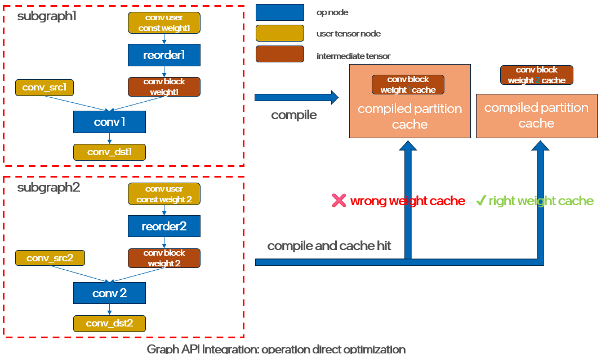
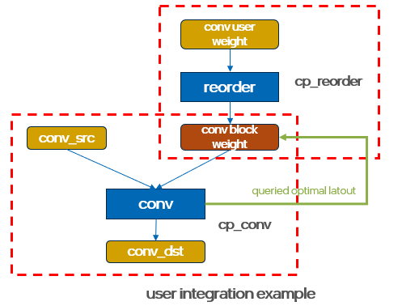
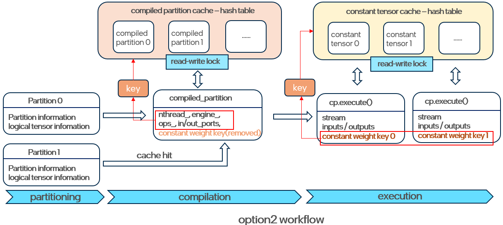

# Constant Block Weight Mechanism Graph API Design

## Introduction

For compute-intensive operations like convolution and matmul, oneDNN primitives
usually provide better performance for inputs with block layout. Users will need
to insert reorder to transform the plain input to the block layout queried from
library. oneDNN Graph API hide this logic inside of the library implementation
and user will get better performance without handling those reorder (plain to
block layout) explicitly. Especially for those constant weight, graph API also
supports constant tensor cache feature [[#1]][1] to cache those constant block
weight to avoid redundant reorders. 

Constant tensor cache is designed to be stored alongside the compiled partition
cache (kernel cache). This arrangement provides significant convenience, enabling
users to attain optimal performance without additional handling of reorders or 
the need to understand the specifics of the block layout. However, it may need
further enhancements for different Graph API usages and integration within 
frameworks. Currently, the constant cache functions effectively within legacy 
framework integrations namely whole model/graph integration, delivering 
substantial performance improvements, particularly for CPUs. Nevertheless, 
potential issues may arise when considering future direct integration solutions
for single operations.

In legacy integration, the entire model or graph is mapped to the Graph API, 
with each operation assigned a unique ID, ensuring that the compiled partition 
is also unique. In contrast, with the new direct integration approach for single
operation, the IDs of operations and logical tensors are fixed, which means that
different operations in the model may hit the same compiled partition cache.
However, since the same compiled partition could correspond to different constant
weights, the current design that binds the compiled partition cache and constant
tensor cache together may lead to correctness issues. The following diagram 
illustrates the workflow of operation direct optimization.



To mitigate these potential issues, the library need to devise a method to 
distinguish between different constant weight tensors that share the same 
compiled partition. This raises new considerations for our design of constant 
block weights: 
1. library needs to decide whether it is still necessary to adopt the block 
layout. 
2. If it does, the library must also determine whether the responsibility 
for inserting reorders should rest with the users or the library itself, and 
whether these reorders should be cached and how to distinguish those cache.

## Proposal
Based on the introduction above, we have identified that the key point is block
layout usage. Block layout introduces better performance, but also introduces
extra overhead like reorder and constant tensor cache if input weight is constant.
For the block layout, we need to find a balance between ease of use and 
performance benefits. We need to reconsider whether constant weight cache is 
needed and whether to provide much more flexibility for user to decide if insert
reorder explicitly and cache the block weight tensor if necessary.

### Option 1
Do not cache constant block weight tensors. The library will reorder plain inputs
to the optimal block layout based on kernel performance; however, this may not 
occur consistently and can vary across different hardware and kernels.

- To ensure backward compatibility while minimizing the potential performance 
impact of new changes, the legacy constant tensor cache feature and control 
API/environment variable will remain available for legacy model-level integration
on CPU. And those env var won't take effect on GPU devices and anymore.
- As with previous graph API restrictions, user weights are not allowed to set
any layout for input logical tensors. [[#3]][3]
- For the op direct optimization, user don't need to handle anything. Library will
handle the reorder based on the performance.

#### Performance impact
- For legacy CPU integration in PyTorch framework, the constant tensor cache
provide better performance since it eliminates redundant reorder computation.
The pattern level performance have good speedup with constant tensor cache enabled.
- For new integration solution namely operation direct optimization on GPU, the
performance impact may depends on the kernel implementation. If the performance
of the kernel with plain layout is comparable to that with block layout, the 
impact of the constant tensor cache on performance is minimal, as no additional
reorder is required.

#### Pros
1. No API change for graph library.
2. Easier on user integration side.

#### Cons
1. Performance impact. Depends on the specifc kernel implementation.

### Option 2
Remove the constant tensor cache from the compiled partition. The library provides
a query API for users to obtain the optimal layout for constant weights, insert
reorders, and automatically cache the reordered tensor if necessary. This is 
similar to primitive API. [[#2]][2] To be specifically:

- Relax the restrictions on the logical tensor layout for partition's constant
weight inputs. Users can set the layout of constant weight input logical tensor
as `any` when creating a graph and then do partitioning and compilation.
- After compilation, use the compiled partition's existing query API(
`query_logical_tensor`) to obtain the optimal layout, then explicitly construct
the reorder through the graph API.
- To ensure backward compatibility, for the exisiting integration that integrate
graph API as a pass for framework optimization, the constant weight cache inside
of graph library still be effective if user enable the constant tensor cache
with env var or constant cache API.

> Note: This relaxation of input layout restrictions mainly applies to constant
weight inputs, while activation and non-constant weight inputs remain unchanged.



```cpp
// prepare logical tensor
logical_tensor conv_src {
        0, impl::data_type::f32, {8, 32, 16, 16}, impl::layout_type::strided};
logical_tensor conv_user_weight {1, impl::data_type::f32, {32, 8, 1, 1},
        impl::layout_type::strided, property_type::constant};
logical_tensor conv_dst {
        3, impl::data_type::f32, {8, 32, 16, 16}, impl::layout_type::strided};

// ************************* Option1 Extra Handling ************************* //
// Users are allowed to set a constant weight input logical tensor with any
// layout and then query the optimal layout from the compiled partition.
logical_tensor conv_any_weight {2, impl::data_type::f32, {32, 8, 1, 1},
        impl::layout_type::any, property_type::constant};
op conv_op(0, op::kind::Convolution, {conv_src, conv_any_weight}, {conv_dst},
        "conv_op");
// ... set attributes

graph g(dnnl::engine::kind::cpu);
g.add_op(conv_op);
g.finalize();

auto partitions = g.get_partitions();
partition p = partitions[0];
compiled_partition cp
        = partition.compile({conv_src, conv_any_weight}, {conv_dst}, eng);

tensor src_ts(conv_src, eng, src_mem.data_ptr());
tensor weight_user_ts(conv_user_weight, eng, conv_wei_mem.data_ptr());
tensor weight_ts;
tensor dst_ts(conv_dst, eng, dst_mem.data_ptr());

// ************************* Option1 Extra Handling ************************* //
// Construct reorder with graph API if necessary. Given that the input for the 
// reorder operation is constant, users can cache the intermediate output if 
// needed to optimize performance.
size_t constant_weight_tid = 1;
logical_tensor queried_conv_weight
        = cp.query_logical_tensor(constant_weight_tid);
if (!conv_user_weight.is_equal(queried_conv_weight)) {
    op reorder_op(1, op::kind::Reorder, {conv_user_weight}, {queried_conv_weight},
            "reorder_op");
    partition p_reorder = partition(reorder_op);
    compiled_partition cp_reorder
            = p_reorder.compile({conv_user_weight}, {queried_conv_weight}, eng);
    weight_ts = tensor(queried_conv_weight, eng, conv_inter_wei_mem.data_ptr());
    cp_reorder.execute(strm, {weight_user_ts}, {weight_ts});
} else {
    weight_ts = tensor(conv_user_weight, eng, conv_wei_mem.data_ptr())
}

cp.execute(strm, {src_ts, weight_ts}, {dst_ts});
strm.wait();
```

#### Pros
1. The library does not require maintaining a constant weight cache, providing
users with greater flexibility to choose whether to use the optimal layout and 
whether to cache constant weights.
2. Follow the design philosophy of primitive API and keep the consistency between
graph API and primitive API.
3. Users has more chances to reduce the memory duplication between constant weight
tensor and constant block weight cache. 

#### Cons
1. To ensure backward compatibility, the library must support two methods of
handling constant weights, which adds to the complexity.
2. Users need to put in more effort to achieve optimal performance.


### Option 3
Provide a new execution API with extra key information for constant weight cache.
The constant weight cache is decoupled from the compiled partition. The library
will rely on the user to provide a key to distinguish between different constant
tensors.

- User need to pass a key when executing a compiled partition with different
constant weight input. 
- The legacy constant tensor cache control API still be effective for the cache
control.



#### API Implementation

The API is defined as follows:

```cpp
// C API
typedef struct {
    size_t key;
    // bool use_cache; // For future extension
} dnnl_graph_execute_options_t;

dnnl_status_t DNNL_API dnnl_graph_compiled_partition_execute_with_options(
        const_dnnl_graph_compiled_partition_t compiled_partition,
        dnnl_stream_t stream, 
        size_t num_inputs, 
        const dnnl_graph_tensor_t *inputs, 
        size_t num_outputs, 
        const dnnl_graph_tensor_t *outputs,
        const dnnl_graph_execute_options_t *options); // new param  

// C++ API
struct execute_options {
    size_t key;
    // bool use_cache; // For future extension
};
class compiled_partition : public compiled_partition_handle {
        void execute(stream &astream, const std::vector<tensor> &inputs,
                 const std::vector<tensor> &outputs,
                 const execute_options &options) const {
        dnnl_graph_execute_options_t exec_options;
        exec_options.key = options.key;
        // ...
        // ...
        error::wrap_c_api(
                dnnl_graph_compiled_partition_execute_with_options(get(), astream.get(),
                        c_inputs.size(), c_inputs.data(), c_outputs.size(),
                        c_outputs.data(), &exec_options),
                dnnl::err_message_list::execute_error("compiled_partition"));                 
}
}
```

#### Pros
1. Users' integration is simpler and almost same as legacy behavior, no need to
consider constant weight cache themselves.

#### Cons
1. The execution API adds new parameters that create complexity.
2. Users have no chance to reduce the memory duplication between constant weight
tensor and constant block weight cache.
2. The block layout is determined by the kernel and device. It is possible that
caching constant weight tensors is unnecessary, but the user may be unaware of
this, leading to potential redundancy issues.


### Option 4
Introduce `id` as a new member of `dnnl_graph_tensor` to uniquely identify each 
tensor object. Similar to option 3, this option also proposes decoupling the
constant weight cache from the compiled partition. Library will encode the tensor
id as part of the constant tensor cache key during execution and cache the
constant tensors.

- Users need to construct tensors object with a unique id if they need to enable
constant tensor cache during execution.
- Tensor object will use logical tensor id as default if no specific id is provided.
- Library will maintain a constant tensor cache memory pool for those constant
tensors. And the legacy cache control API and Env var will still be effective.

#### API and Interface Implementation

The API is defined as follows:
```cpp
// C API
/// Creates a tensor with logical tensor, engine, data handle and id.
///
/// @param id The unique id of tensor.
/// @returns #dnnl_success on success or a status describing the error
///     otherwise.
status_t DNNL_API dnnl_graph_tensor_create_with_id(tensor_t **tensor,
        const logical_tensor_t *logical_tensor, engine_t *eng, void *handle,
        size_t id) {
    if (utils::any_null(tensor, logical_tensor, eng))
        return status::invalid_arguments;

    *tensor = new tensor_t {*logical_tensor, eng, handle, id};
    if (*tensor == nullptr) return status::out_of_memory;
    if (handle == DNNL_MEMORY_ALLOCATE
            && (*tensor)->get_data_handle() == nullptr) {
        delete *tensor;
        *tensor = nullptr;
        return status::out_of_memory;
    }
    return status::success;
}

dnnl_status_t DNNL_API dnnl_graph_tensor_get_id(
        const tensor_t *tensor, size_t *id) {
    if (tensor == nullptr) return status::invalid_arguments;
    *id = tensor->get_id();
    return status::success;
}

// C++ API
class tensor : public tensor_handle {
public:
       tensor(const logical_tensor &lt, const engine &aengine, void *handle,
            size_t id) {
        dnnl_graph_tensor_t t = nullptr;
        error::wrap_c_api(dnnl_graph_tensor_create_with_id(
                                  &t, &(lt.data), aengine.get(), handle, id),
                dnnl::err_message_list::init_error(
                        "tensor object with the logical_tensor, "
                        "engine, and handle"));
        reset(t);
    }
    
    size_t get_id() const {
        size_t id;
        error::wrap_c_api(dnnl_graph_tensor_get_id(get(), &id),
                dnnl::err_message_list::set_failure("id to the tensor"));
        return id;
    }
}

// Interface
struct dnnl_graph_tensor {
public:
    dnnl_graph_tensor(const dnnl::impl::graph::logical_tensor_t &lt,
            const dnnl::impl::graph::engine_t *eng, void *handle,
            size_t id = std::numeric_limits<size_t>::max())
        : lt_(lt)
        , eng_(eng)
        , id_(id == std::numeric_limits<size_t>::max() ? lt.id : id) {
        if (handle == DNNL_MEMORY_ALLOCATE) {
            size_t num_bytes = logical_tensor_wrapper_t(lt).size();

            void *data = tensor_malloc(
                    num_bytes, eng, allocator_t::mem_type_t::temp);
            assertm(data, "Can't allocate memory for a tensor!");
            handle_.reset(data, [eng](void *p) { tensor_free(p, eng); });
        } else {
            handle_.reset(handle, dummy_destructor);
        }
    }

    size_t get_id() const { return id_; }
}

```
#### Pros
1. Less complexity to API compared to option 2 and option 3.
2. Adding ID to tensor is intuitive and straightforward for users.

#### Cons
1. Users need to make sure the unique id is set properly.
2. Users have no chance to reduce the memory duplication between constant weight
tensor and constant block weight cache.

## References

1. [https://oneapi-src.github.io/oneDNN/dev_guide_constant_tensor_cache.html][1]
2. [https://oneapi-src.github.io/oneDNN/page_memory_format_propagation_cpp.html#memory-format-propagation-function][2]
3. [https://oneapi-src.github.io/oneDNN/dev_guide_graph_basic_concepts.html#partition][3]

[1]: https://oneapi-src.github.io/oneDNN/dev_guide_constant_tensor_cache.html
[2]: https://oneapi-src.github.io/oneDNN/page_memory_format_propagation_cpp.html#memory-format-propagation-function
[3]: https://oneapi-src.github.io/oneDNN/dev_guide_graph_basic_concepts.html#partition