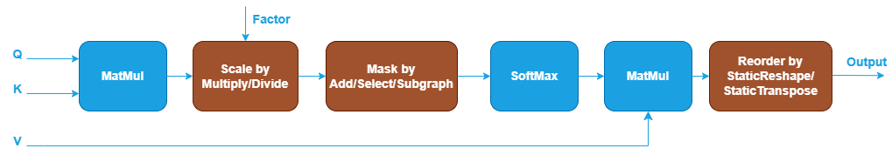
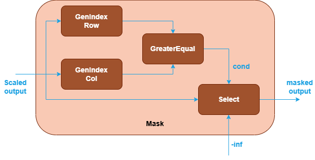
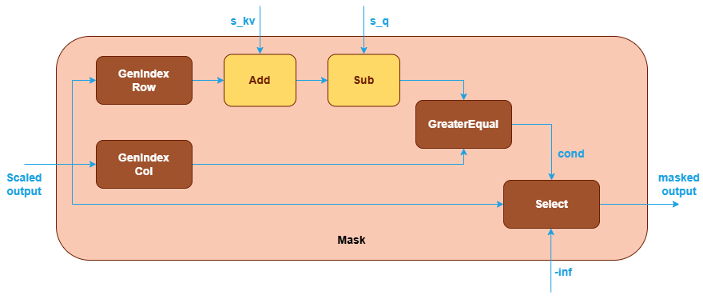
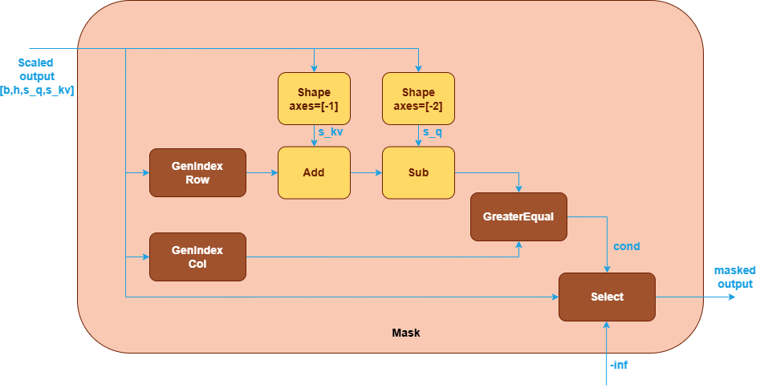

# Support Implicit Causal Mask in SDPA in Graph API

## Background

Scaled Dot-Product Attention (SDPA), introduced in [1], is the core operation in
Transformer blocks and serves as the backbone for numerous language and generative
models (e.g., BERT, Stable Diffusion, GPT, DeepSeek).

oneDNN supports SDPA and its optimization through Graph API by defining an SDPA
graph, partitioning the graph, and optimizing the underlying kernels. The
floating-point SDPA — supporting f32, bf16, or f16 — is defined as illustrated below.
The blue nodes are required when defining an SDPA pattern while the brown parts are
optional.



A key component of SDPA is the causal mask, which restricts the attention mechanism
appropriately. Currently, oneDNN Graph supports two types of causal masks:

1. Explicit causal mask: Users explicitly construct a causal mask matrix using
   operations such as `Add` and `Select`.

    

2. Implicit causal mask: oneDNN Graph supports top-left implicit causal mask
   generated using `GenIndex`, `GreaterEqual` and `Select` operations.

   

In addition to the top-left implicit causal mask, there exists another variant
known as the bottom-right implicit causal mask. The primary difference between these
two masks is how they handle the masking of future tokens, especially when the
lengths of the query sequence (s_q) and key/value sequence (s_kv) differ. Mathematically,
these masks can be represented as follows (where 0 indicates a position is kept, and
-inf indicates it is masked out):

```cpp
# top-left causal mask:
# s_q=5, s_kv=5             |    # s_q=2, s_kv=5             |    # s_q=5, s_kv=2
  0  -inf -inf -inf -inf    |      0  -inf -inf -inf -inf    |      0  -inf
  0    0  -inf -inf -inf    |      0    0  -inf -inf -inf    |      0    0
  0    0    0  -inf -inf    |                                |      0    0
  0    0    0    0  -inf    |                                |      0    0
  0    0    0    0    0     |                                |      0    0

# bottom-right causal mask:
# s_q=5, s_kv=5             |    # s_q=2, s_kv=5             |    # s_q=5, s_kv=2
  0  -inf -inf -inf -inf    |      0    0    0    0  -inf    |      -inf  -inf
  0    0  -inf -inf -inf    |      0    0    0    0    0     |      -inf  -inf
  0    0    0  -inf -inf    |                                |      -inf  -inf
  0    0    0    0  -inf    |                                |        0   -inf
  0    0    0    0    0     |                                |        0    0
```

Top-left causal mask: Applied from the top-left corner of the attention matrix,
this mask prevents each token from attending to subsequent tokens, effectively
masking "future" tokens. However, when the query sequence is shorter than the
key sequence, this approach may mask more of the key sequence than necessary.
For example, during autoregressive decoding in large language models (LLMs),
if a prompt consists of 3 tokens, at step 1 of decoding, the query sequence
length would be 1 (representing the 4th token in the sequence), while the
key/value input would have a length of 4. In such cases, the top-left mask might
unnecessarily restrict attention to relevant tokens.

Bottom-right causal mask: This mask adjusts the masking to the bottom-right
corner, allowing for more flexibility when the query and key/value sequences have
different lengths. It ensures that only the appropriate positions are masked,
potentially preserving more useful key tokens for each query. This approach can
be particularly beneficial in scenarios where the query sequence is shorter than
the key sequence, as it allows the model to utilize all available context.

With the growing popularity of the bottom-right causal mask, the following
sections will discuss how to support this masking strategy in
oneDNN Graph.

## Support in frameworks and libraries

### PyTorch

PyTorch supports both explicit and implicit causal masks via its
`torch.nn.functional.scaled_dot_product_attention` function [2].
Users can provide an explicit mask through the `attn_mask` parameter.
The `is_causal` parameter, when set to true, applies a top-left implicit causal
mask by default.

```python
def scaled_dot_product_attention(
      query, key, value,
      attn_mask=None,
      dropout_p=0.0,
      is_causal=False,
      scale=None,
      enable_gqa=False
    ) -> torch.Tensor:
```

For bottom-right causal mask, PyTorch extends the interface of
the `attn_mask` parameter. Users can create a `CausalBias` instance with
`CausalVariant.LOWER_RIGHT` [3], and pass it to `attn_mask` of the SDPA
function:

```python
from torch.nn.attention.bias import CausalBias
from torch.nn.attention.bias import CausalVariant

seqlen_q, seqlen_kv = 2, 5
attn_mask = CausalBias(CausalVariant.LOWER_RIGHT, seqlen_q, seqlen_kv)
out = F.scaled_dot_product_attention(q, k, v, attn_mask=attn_mask, is_causal=False)
```

Internally, the `CausalBias` class dispatches to flash attention or efficient
attention implementations if available; otherwise, it falls back to an explicit
mask [4].

### cuDNN

In cuDNN Graph API [6], both top-left and bottom-right implicit causal masks are
supported. For the top-left alignment, the graph construction utilizes operations
such as `GenIndex`, `GreaterEqual`, and `Select`. For the bottom-right alignment,
additional operations like `Add` and `Sub` are employed to adjust the mask accordingly.

### OpenVINO

OpenVINO’s `ScaledDotProductAttention` operation supports both explicit and implicit
causal masks [7]. Users can specify a `causal` flag to apply a top-left implicit
causal mask; however, bottom-right implicit causal mask are not currently supported.

## Proposals

The following proposals are based on a shared subgraph structure, with the main
difference being how s_kv and s_q are provided to the library.



### Option 1: Pass s_kv and s_q as Tensors

This option proposes to pass the sequence lengths (s_kv and s_q) as tensors,
analogous to how Q, K, and V are passed. These tensors should align with the
sequence length dimension, forming a valid bottom-right subgraph.

#### Pros

- The subgraph is similar to top-left implicit causal mask.
- No change to Graph API.
- No change to user interactions with the API.

#### Cons

- Users must create GPU tensors for scalar values, which brings
  additional overhead.

### Option 2: Pass s_kv and s_q as Scalar Logical Tensors

To address the concern of creating GPU tensors, this option proposes to pass
s_kv and s_q as scalar logical tensors.

This method draws inspiration from cuDNN Frontend's `Tensor_attributes` [8],
which supports constructors with scalar values.

```cpp
class Tensor_attributes {
   public:
    // There are two usecases of pass by value tensors:
    // 1. Fused scalar constants
    // 2. Scalar passed during execution
    // In approach 1, users provide a value to embed into the graph.
    // In approach 2, users set is_pass_by_value boolean and then pass a pointer
    // to scalar value with execute() API.
    // A closed set of types that are allowed to be passed by value.
    using pass_by_values_t = std::variant<int64_t, int32_t, half, float, nv_bfloat16>;
    std::optional<pass_by_values_t> pass_by_value = std::nullopt;
    bool is_pass_by_value                         = false;

    Tensor_attributes(int32_t const& scalar) {
        pass_by_value    = scalar;
        is_pass_by_value = true;
        dim = stride = {1};
        data_type    = DataType_t::INT32;
    }
    // ...
}
```

An example from cuDNN Frontend to use this constructor [9]:

```cpp
row_index_output = pointwise(row_index_output,
                            std::make_shared<Tensor_attributes>(static_cast<int32_t>(s_kv)),
                            Pointwise_attributes()
                                .set_name("row_idx_add_skv")
                                .set_mode(PointwiseMode_t::ADD)
                                .set_compute_data_type(DataType_t::INT32));
```

To support similar usage in oneDNN Graph, extend the `logical_tensor` API as follows:

```cpp
/// Constructs a logical tensor object with scalar value.
///
/// @param tid Logical tensor ID.
/// @param dtype Elements data type.
/// @param scalar Scalar value.
logical_tensor(size_t tid, data_type dtype, void *scalar) {
    dnnl_graph_logical_tensor_t val;
    error::wrap_c_api(dnnl_graph_logical_tensor_init_with_scalar(
                              &val, tid, convert_to_c(dtype), scalar),
            "could not create logical_tensor with scalar");
    data = val;
}
```

And update the `dnnl_graph_logical_tensor_t` structure to support saving of scalars.

```cpp
typedef struct {
    size_t id;
    int ndims;
    dnnl_dims_t dims;
    dnnl_data_type_t data_type;
    dnnl_graph_tensor_property_t property;
    dnnl_graph_layout_type_t layout_type;
    union {
        dnnl_dims_t strides;
        size_t layout_id;
    } layout;

    // New fields for scalar logical tensor support:
    bool pass_by_scalar;
    union {
        float f32_value;
        int32_t s32_value;
    } scalar;
} dnnl_graph_logical_tensor_t;
```

#### Pros

- No need to create GPU tensors for s_kv and s_q scalars,
  and other scalars like attn_scale, -inf.
- Consistent subgraph design with the top-left implicit causal mask.
- Align with cuDNN Graph's usage.

#### Cons

- Requires extending the Graph API to support scalar logical tensors
  (an ABI-breaking change that must wait for the oneDNN v4.0 release).

### Option 3: Pass s_kv and s_q by a New Shape Operation

Another option to avoid allocating dedicated GPU tensors is to introduce a
new Shape operation to extract s_kv and s_q from previous tensor's shape.
The `Shape` operation generates a 1D shape tensor along specified axes of an
input tensor. With this operation, s_kv and s_q can be extracted from the last
two axes of scaled output tensor's shape.



#### Shape Operation Specification

##### Attributes

| Attribute Name | Description | Value Type | Supported Values | Required or Optional |
| :------------- | :---------- | :--------- | :--------------- | :------------------- |
| [axes] (@ref dnnl::graph::op::attr::axes) | Specifies the axes for generating shape values. The list must be in incremental order, and each axis can appear no more than once.| s64 | A s64 list containing the element in the range of [-N, N-1], negative value means counting from the last axis | Required |

##### Inputs

| Index | Argument Name | Required or Optional |
| :---- | :------------ | :------------------- |
| 0     | `src`         | Required             |

##### Outputs

| Index | Argument Name | Required or Optional |
| :---- | :------------ | :------------------- |
| 0     | `dst`         | Required             |

##### Supported data types

`Shape` operation supports the following data type combinations.

| src  | dst |
| :--- | :-- |
| f32  | s32 |
| f16  | s32 |
| bf16 | s32 |

#### Pros

- No need to create GPU tensors for s_kv and s_q scalars.
- Enables graph compilation to derive s_kv and s_q dynamically.

#### Cons

- Requires adding a new Shape operation to the Graph API.
- Results in a slightly more complex graph (two additional Shape operations).
- Other scalars that are not shape-related (e.g., attn_scale, -inf) cannot be addressed by this solution.

## Conclusions

TBD

## References

1. Attention is all you need, [https://arxiv.org/abs/1706.03762v7](https://arxiv.org/abs/1706.03762v7)
2. PyTorch SDPA function, [https://pytorch.org/docs/stable/generated/torch.nn.functional.scaled_dot_product_attention.html](https://pytorch.org/docs/stable/generated/torch.nn.functional.scaled_dot_product_attention.html)
3. PyTorch support for bottom-right causal mask, [https://pytorch.org/docs/2.6/generated/torch.nn.attention.bias.CausalBias.html#torch.nn.attention.bias.CausalBias](https://pytorch.org/docs/2.6/generated/torch.nn.attention.bias.CausalBias.html#torch.nn.attention.bias.CausalBias)
4. PyTorch CausalBias dispatch logic, [https://github.com/pytorch/pytorch/blob/main/torch/nn/attention/bias.py#L221](https://github.com/pytorch/pytorch/blob/main/torch/nn/attention/bias.py#L221)
5. PyTorch Aten SDPA operator implementation, [https://github.com/pytorch/pytorch/blob/6afcec0c582cb852fcf673ea3b6ce12e4b9da01d/aten/src/ATen/native/transformers/attention.cpp#L699](https://github.com/pytorch/pytorch/blob/6afcec0c582cb852fcf673ea3b6ce12e4b9da01d/aten/src/ATen/native/transformers/attention.cpp#L699)
6. cuDNN Graph API support for causal mask, [https://docs.nvidia.com/deeplearning/cudnn/latest/developer/graph-api.html#fused-flash-attention-fprop](https://docs.nvidia.com/deeplearning/cudnn/latest/developer/graph-api.html#fused-flash-attention-fprop)
7. OpenVINO SDPA operation, [https://docs.openvino.ai/2024/documentation/openvino-ir-format/operation-sets/operation-specs/sequence/scaled-dot-product-attention.html](https://docs.openvino.ai/2024/documentation/openvino-ir-format/operation-sets/operation-specs/sequence/scaled-dot-product-attention.html)
8. cuDNN Frontend Tensor_attributes class, [https://github.com/NVIDIA/cudnn-frontend/blob/main/include/cudnn_frontend/graph_properties.h#L23](https://github.com/NVIDIA/cudnn-frontend/blob/main/include/cudnn_frontend/graph_properties.h#L23)
9. cuDNN scalar Tensor_attributes, [https://github.com/NVIDIA/cudnn-frontend/blob/main/include/cudnn_frontend/node/sdpa_fp8.h#L365-L380](https://github.com/NVIDIA/cudnn-frontend/blob/main/include/cudnn_frontend/node/sdpa_fp8.h#L365-L380)
