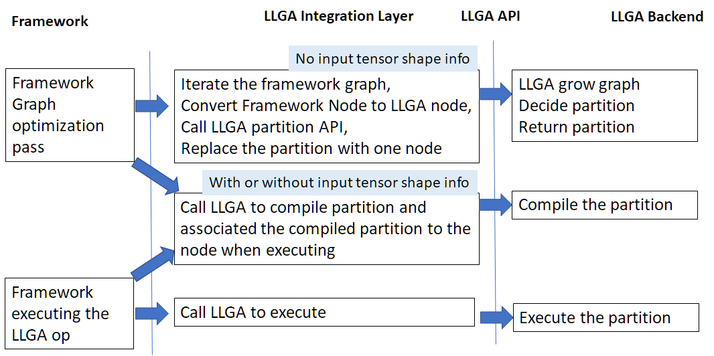

============
Architecture
============

To enable the LLGA in a DL framework, it contains three software LLGA components: LLGA integration layer, LLGA API, and LLGA backend.

----------------------
LLGA integration layer
----------------------

LLGA integration layer cooperates with LLGA backend to identify a subgraph as the optimization unit named as LLGA partition. It captures the essential DNN compute information from the framework graph and passes to LLGA backend through LLGA API.  It calls the LLGA backend to compile the LLGA partition and execute it with input tensor shapes and device resources specified by the framework.

For the device explicitly integrated to the framework, LLGA works as an acceleration library on top of the device integration. Most likely, the device needs to claim it supports a new “LLGA Function” op on top of current supported framework operations. The semantics of “LLGA Function” is determined by its associated  LLGA partition, and different “LLGA Function” op may have different numbers of input and output parameters.

LLGA integration layer could be extended to support a device not explicitly integrated to the framework. LLGA extension section describes how to handle it.

--------
LLGA API
--------

LLGA API contains partition API, compilation API, and execution API. The partition API allows framework to cooperate with LLGA backend to decide the scope of LLGA partition. The compilation API facilitates the compilation process, it may or may not bind with the input tensor shape. The execution API facilitates the execution of compiled LLGA partition with runtime information.

LLGA defines a set of DNN operations. The DNN operation semantics is target independent. It has an attribute notion to separate the constant from runtime parameters.  As LLGA aims to provide an accelerated execution path on top of framework operations, LLGA DNN operations are not intended to be complete.

LLGA partition API describes the data flow between the DNN operations, so that the LLGA backend can construct a data flow graph. How to pass control flow is not yet defined.

------------
LLGA backend
------------

LLGA backend realizes the LLGA APIs. From the LLGA OP and data flow passed from LLGA integration layer, it constructs the graph and determines the LLGA partitions. It then further compiles the LLGA partition and executes it.

Each LLGA backend may support a subset of LLGA DNN operations.

