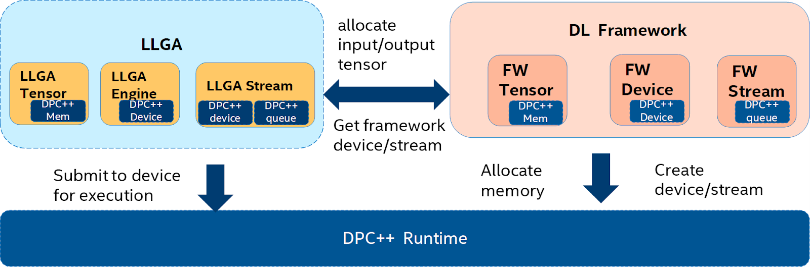

.. include:: replacements.inc.rst

=========================
Programming Model and API
=========================

--
OP
--

LLGA OP describes pure logical description of deep learning operators. It contains inputs, and outputs and attributes. The inputs and outputs tensors are logical tensors without concrete tensor data. At the graph partition time, it may not have dimension and shape information until the graph execution time.

LLGA OP is created when the corresponding framework op is visited, once the information is extracted and converted to LLGA OP, it is then passed over to LLGA backend.

The integration shall follow below rules to convert framework OP to LLGA OP:

1. Convert to LLGA OP if it’s supported in LLGA OP set. Some tweak may be necessary like a convolution with bias in framework shall be splitted to a LLGA convolution and LLGA add.
2. For the OP that is not in LLGA OP set, if the integration wants to pass it to the backend, a Wildcard OP can be used.
3. There’s also special options like custom OP and contraction OP, refer to the related section.

The integration layer manages the OP’s lifecycle, e.g., it frees LLGA OP after it is passed to backend. The LLGA backend should not assume that LLGA OP is alive after it receives a LLGA OP.

  **OP Kind**
    The OP kind specifies which computation is represented by the OP, such as conv2d and relu.
  **Inputs**
    Describes the list of input tensors. Its data type is logical tensor.
  **Outputs**
    Describes the list of output tensors. Its data type is logical tensor.
  **Attribute**
    The attributes contain constant information known to the operation at the time of operation creation, like the stride and padding information in conv OP. Some frameworks may define these attributes as input tensors (with constant value), the integration shall translate input to attributes based on op definition.
  **ID**
    Each OP has a unique id to identify itself.

.. doxygenclass:: llga::api::op
   :project: oneDNN Graph Library
   :members:

-----
Graph
-----

Graph serves as the context for the LLGA backend to grow graphs and generate partitions. A graph is created with an engine, and |graph_select| API binds the OP to a graph. When the construction of a graph is completed, the |graph_filter_partitions| API shall be used to generate a list of partitions. If the framework processes two subgraphs simultaneously, it needs to create two separate LLGA graph so that they won’t conflict with each other.

If a framework OP is not in LLGA op set, integration has 2 options:

1. Do not pass this OP to the backend.
2. Pass this OP to the backend with a Wildcard OP.

It’s not mandatory that all OPs binded by |graph_select| must be in a partition, the backend can decide an OP is not supported and doesn’t include it in any partition.

.. doxygenclass:: llga::api::graph
   :project: oneDNN Graph Library
   :members:

--------------
Logical Tensor
--------------

Logical tensor represents the input and output of DNN operations. Together with LLGA OP, LLGA logical tensors are used to support passing the framework graph information during graph partition.  During the partition compilation, logical tensor is used to specify the partition input and output. It contains element data type, number of dimensions, size and stride for each dimension (shape), the date layout, and the total size of data. The dimension and shape information may be incomplete at the graph partitioning time. Usually these information are complete at the partition compilation time. The LLGA integration layer shall set the shape information in logical_tensor if it can get shape information from the framework.

There are two types of data layout: Public, or "ANY". Public data layout refers to the layout used by the framework. During the graph partition stage, all the logical tensor is created with the information from the framework graph, so the layout is public data layout. For example, for 2D conv the dimension order is either “NHWC” or “NCHW”. During the partition compilation stage, the logical tensor may be assigned with "ANY" data layout, so that the LLGA backend has the freedom to choose whatever data layout works the best.

For the framework which is able to represent platform dependent tensor, there is a common optimization pass to avoid converting between the private data layout and public upon entry and exit of the compiled partition. The tensor stays in a private layout between two compiled partitions. This is enabled to set the logical tensor layout to "ANY" layout, so the partition compilation understands the freedom and generates optimized code version. This works for the activation tensors which are passed between compiled partitions.

Besides the activation tensors, which have a limited life cycle within one iteration, there are persistent weight tensors. Weight tensors may not be presented as an output of OP in the Framework graph. But the integration layer typically has a way to prepack the weight tensor before the execution or at the first iteration of the execution. As long as the integration layer makes sure the input weight tensor is prepared in private layout, it can also set the weight tensor's layout as "ANY".

.. doxygenclass:: llga::api::logical_tensor
   :project: oneDNN Graph Library
   :members:

------
Tensor
------

LLGA Tensor binds memory buffers to a logical tensor. Correspondingly, there are two types of tensors: public layout tensor and opaque tensor. Public layout tensor refers to the tensor with public data layout, and the opaque tensor doesn’t describe the layout, instead it contains a handle to LLGA backend’s private tensor representation. The opaque tensor allows the tensor data to remain in a private data layout between two LLGA partitions, so there is no need for the tensor data to convert back and forth. The handle points to platform dependent tensor implementation and doesn't tell the specific data layout and location. Not every framework integration can accept opaque tensor design, for those which don't,  framework integration needs to make sure the LLGA backend always input and output the public layout tensor.

LLGA Tensor is used as the input and output of the compiled partition during execution. For the compiled partition outputs "ANY" data layout, the LLGA backend returns the tensor with a handle to the backend specific tensor. For the compiled partition inputs "ANY" data layout, the LLGA backend expects an opaque tensor and receives the backend specific tensor through the handle.

.. doxygenclass:: llga::api::tensor
   :project: oneDNN Graph Library
   :members:

LLGA integration layer is responsible for managing the tensor’s lifecycle, e.g. free the resource allocated, when it is not used any more. The LLGA compiled partition execution may allocate a new tensor with various life cycle scope, which may need framework’s help to free the tensor at the end of the life cycle, refer the APIs in allocator.

------
Policy
------

The policy allows frameworks to control the size of partitioning.

.. doxygenenum:: llga_partition_policy
   :project: oneDNN Graph Library

.. note::
  Discussion: The other potential policy is to pass the max OP number contained within a partition.

---------
Partition
---------

LLGA partition represents a collection of LLGA OPS identified by LLGA backend as the basic unit for compilation and execution. It contains a list of LLGA OPS, input and output values.

LLGA integration layer converts the framework op and uses partition API to LLGA backend, which builds its own graph and decides the partition. The LLGA backend manages the lifecycle of LLGA partition. It creates an LLGA partition and should keep it alive before it is compiled to be  compiled_partition.

.. doxygenclass:: llga::api::partition
   :project: oneDNN Graph Library
   :members:

------------------
Compiled Partition
------------------

LLGA compiled partition represents the compiled object that LLGA backend built for future execution. It has a similar structure as a partition . Other than a list of LLGA OPs, it contains a handle to the internal representation of compiled object.

.. doxygenclass:: llga::api::compiled_partition
   :project: oneDNN Graph Library
   :members:

------------
Device Model
------------

Device model refers to a set of device interface through which the device resource can be managed. For example, you can create a device, device context, stream, and allocate memory. Most device vendor provides their device interface. For example, The oneAPI Level Zero (Level Zero) provides low-level direct-to-metal interfaces for devices in a oneAPI platform, and DPC++ runtime provides a high level interface for device management.  Some Framework abstract their own device interface, so that it can optimize the deep learning program for different devices.

LLGA doesn't define device model. As the LLGA is part of vendor provided library, LLGA can use the vendor's device interface directly to access device resource. However, as framework is managing the device resources, directly accessing device resource may oversubscribe the resource if both framework and LLGA assume they are exclusive owner of the device. LLGA defines Engine, Stream, and allocator call back API so that LLGA uses framework managed device resources. These API is a wrapper on top of vendor provided handles associated with device resources.  The LLGA backend needs a “device” representing a HW device containing compute and memory resources, a “stream” that schedules computation and memory accesses, and a set of allocator API to allocate memory.  LLGA supports both DPC++ device and non-DPC++ device.  Below is an example on how the DPC++ handles are wrapped first by framework since framework need to access the device, and how LLGA interacts with framework by converting Framework wrapper to LLGA wrapper on top of DPC++ handles.

------
Engine
------

Engine represents hardware resources including the processing units and memory reserved to support the computation dispatched to the Engine.  It typically contains a device id, device name, and device handle.  Since the engine serves as the context for LLGA backend to store persistent information, like the compiled partition and its associated persistent memory cache created on the device, the device id ensures that there is a unique  engine being created for each device.  From the device name, the engine knows how to generate code for the target device and what kind of device object to be expected.  The device handle passed from framework allows LLGA backend to work on the device specified by framework.

LLGA engine supports two scenarios of how a device is integrated into the framework:

1. framework manages the device with its device model and owns its handle;
2. LLGA backend manages the device and owns its handle.

For the former case, framework creates the device handle and passes it to the LLGA backend via LLGA engine which is actually a wrapper on the handle. The latter case is suitable for the situation in which the HW device vendor does not integrate the device into the framework device model, and the user uses LLGA directly to interact with the underlying device. In this case, the framework creates the device handle via the LLGA engine by only passing “device_id” without associating with a "device handle".

The device name consists of two parts: device type and runtime. For example, the engine_name “LLGA_GPU_DPCPP” indicates the target device is a GPU and the device handle can be casted to a pointer to sycl::device. "LLGA_CPU" indicates the target is CPU.

"LLGA_XPU_DPCPP" means that device runtime is DPC++ but the device are a combination of CPU and GPU device. If the engine_kind is “LLGA_ACCLERATOR”,  the device handle is opaque to the framework and only interpretable by the LLGA backend.

.. doxygenclass:: llga::api::engine
   :project: oneDNN Graph Library
   :members:

------
Stream
------

Stream is the logical abstraction for processing units. It is created on top of LLGA engine and typically contains an opencl queue. One LLGA engine may have multiple streams. The compiled partition is submitted to stream for execution.

.. doxygenclass:: llga::thread_pool
   :project: oneDNN Graph Library
   :members:

.. doxygenclass:: llga::api::stream_attr
   :project: oneDNN Graph Library
   :members:

.. doxygenclass:: llga::api::stream
   :project: oneDNN Graph Library
   :members:

-------------
Partition API
-------------

The partition API is used to select subgraph candidate nodes and filter out final partitions. The |graph_select| is used to add an OP and its edges to a graph. The |graph_filter_partitions| decides how to partition the subgraph from selected OP candidates and edges. The backend shall not assume the calling sequence of |graph_select|.

If a Framework OP is not in LLGA OP set, a Wildcard OP can be used by integration layer to pass the info to the backend. The integration layer can also choose not to call |graph_select| for this OP.

After partitions are generated by backend through |graph_filter_partitions|, the integration layer shall modify the framework graph based on nodes in partition, which means replacing all corresponding nodes in the framework graph to a single node.

The backend shall guarantee there’s no cyclic dependency between all the nodes obtained from the integration layer and generated partitions.

If the integration layer doesn’t pass all nodes to the backend, it shall guarantee there’s no cyclic dependency between partitions from the backend and these unselected nodes.

See |graph| for details.

**Framework Integration Pseudo Code**

.. code::

   All_partitions = {}
   for each node “s” in framework graph with topology order
     s’ = create_llga_op(s)
     If (s’ creation failed) || (s already visited) || (Select(s’) failed) then continue;
     G = new vector [] with initial (s,s’) OP pair
     while G changed
       for all unvisited OP “n” in G with DFS order
         for each input node “i” of n
           i’ = create_llga_op(i)
           if (select_input(i’, i_o_ind, n’, n_i_ind)) add (i, i’) to G
         for each output node “o” of n
           i’ = create_llga_op(i)
           if (select_output(o’, o_i_ind, n, n_o_ind)) add (o,o’) to G
     mark (n, n’) visited
     G = remove_cyclic_dependency(G)
     All_partitions = filter(G)
   for each partition P in All_partitions
     Create a new node P_NODE for P
     for each LLGA OP op’ inside P,
       If op’ input and output is in the P’s input/output list
   Find op from the OP pair (op, op’)
   Modify the framework graph to connect op’s input/output to the new node

.. note::
  Discussion: The select API doesn’t construct the LLGA graph, instead it passes the LLGA op and edge to help the LLGA backend to contruct the graph. The select API fits a graph with dataflow relationship. When the graph becomes big and it may contain control flow graph, we will need to extend the select API to pass the control flow information.

---------------
Compilation API
---------------

Conceptually the compilation API is the same as the DNNL primitive building, where DNNL’s primitive building API compiles one op, LLGA compilation API compiles a graph partition. The compiled object includes a handle to the compiled object and input/output placeholders.

The Compilation API compiles the partition with or without the tensor shape information, depending on the LLGA’s backend capability. Some backend may want to build a partition without shape information so that it won't cause a significant delay when an unknown shape is fed after the model is deployed.

The integration can pass input/output data type by data type in logical_tensor of inputs/outputs, the backend shall check data type from logical_tensor.

The integration constructs inputs/outputs list based on the order in the modified framework graph. The backend shall follow this order to get inputs and return outputs.

The integration shall set the layout of each input/output logical_tensor.

LLGA compilation API returns an indication for compilation failure.

See |partition_compile| for details.

-------------
Execution API
-------------

Framework passes the parameter tensors and compiled partition to Execution API for execution. The Execution API binds the tensor buffers with the input/output placeholders, submit it to device runtime for execution. Framework manages tensor allocation and execution submission. Framework may want to submit compiled partitions to different device execution abstraction to exploit the parallelism.

If the integration places a tensor with data buffer pointer in outputs, the backend shall use this buffer allocated by integration.

See |stream_submit| for details.

-----------------------
Allocator call back API
-----------------------

The compiled partitions may allocate memory during the execution, like scratchpad and workspace in the DNNL primitives. The allocated memory may have a different lifetime span, so some memory allocated is only used within the compiled partition execution, some may live until the end of the iteration, and some may persist across iterations. For framework which would like to manage the device memory, LLGA backend can call back the framework memory manager through allocator call back API, so that it can manage all the device memory. These three APIs are:

1. |base_allocator_allocate_persistent| for persistent buffer which can be freed explicitly with |base_allocator_deallocate_persistent| or framework will free all persistent buffers on its exit;
2. |base_allocator_allocate_output| for buffer live during one iteration, typically used by allocating output tensor buffer;
3. |base_allocator_allocate_temp| for scratch pad live only within op.

The allocator call back is to get access to device memory. It shall be used at runtime to allocate tensor, buffer, and scratchpad. Host memory can be allocated by backend itself like graph, node, and edges.

.. doxygenclass:: llga::base_allocator
   :project: oneDNN Graph Library
   :members:

-------------------
Profiling API - TBD
-------------------

User knows the performance breakdown associated with operation within the sub-graph

-------------------
Debugging API - TBD
-------------------

A more advanced API might involve specifying the partition policy for different OP id through OP id lists, for the OPs in the lists backend shall not fuse them. This supports users (framework developers)  to perform binary search to debug a potential issue in the compiled partition.

Another issue is the location after compilation, add a location string to llga OP, e.g. line number and location of source code. Backend can decide how to use it, the most common case is to report error origin.

User knows the error information associated with operation within the sub-graph.
