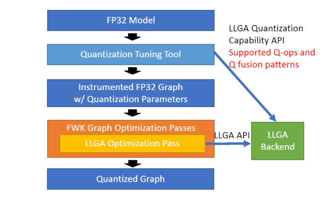

=======================================================
Quantization Capability API for Low-precision Inference
=======================================================

Low-precision inference is a way of reducing computational cost and memory footprint for model inference with quantization. Quantization here means the conversion from fp32 data representation to integer math (e.g. int8 uniform affine quantization with scale and zero point) or lower-bit floating point (e.g. bfloat16, fp16) representation.

Quantization might come with inference accuracy loss and has to balance inference efficiency and accuracy loss, i.e. the lower-bit quantization is used, the more efficient model inference runs but worse accuracy you would get. So an optimization process is required, usually executed with a tool, to search for the optimal quantization recipes to use for each Op of the model to get the best performance under acceptable accuracy loss. The recipes would contain precisions (e.g. 4-bit, 8-bit or 16-bit), schemes (e.g. static vs. dynamic), number representation (e.g. fixed point vs. affine vs. floating point) and granularity (e.g. per-tensor vs. per-channel scale) etc. Quantization recipes depend on the capability of the backend, e.g. LLGA backend, since whether a backend supports a quantized kernel or a quantized fused pattern would impact both performance and accuracy the recipes can provide. Without honoring these quantization capabilities, the tool would take longer to find the optimal recipes or even not able to find a good recipes. Therefore, LLGA provides the API to report the quantization capability of the backend.

The quantization flow involving LLGA quantization API is shown in the figure below (TODO: add figure id). A quantization tuning tool converts the FP32 model into an FP32 graph with instrumented quantization information. The tool invokes the LLGA quantization capability API to know what quantized Ops and fusion patterns are supported by the LLGA backend. According to the capability information, the tool knows how to convert the FP32 model into the instrumented graph properly. The conversion would involve framework graph transformation and training or inference flow to gather the right quantization parameters and quantization-aware model parameters. The instrumented FP32 graph then goes through the graph optimization passes which would convert the FP32 graph into the quantized one.

Note that the quantization capability API reports all the capabilities the backend “may” have and doesn’t have to be accurate since it just brings the hints to the tool to search wisely. For example, if the backend has multiple algorithms, each of which supports some quantized ops and fusion patterns, the backend can report a superset of all the capabilities from these algorithms.

The API allows the backend to specify the capability at various granularities. Capabilities can be applied globally or to a set of tensors/ops/patterns or to a specific tensor/op/pattern. Finer-grained capabilities override coarser-grained ones.

.. literalinclude:: code_snippets/quantization.cpp
    :language: cpp
